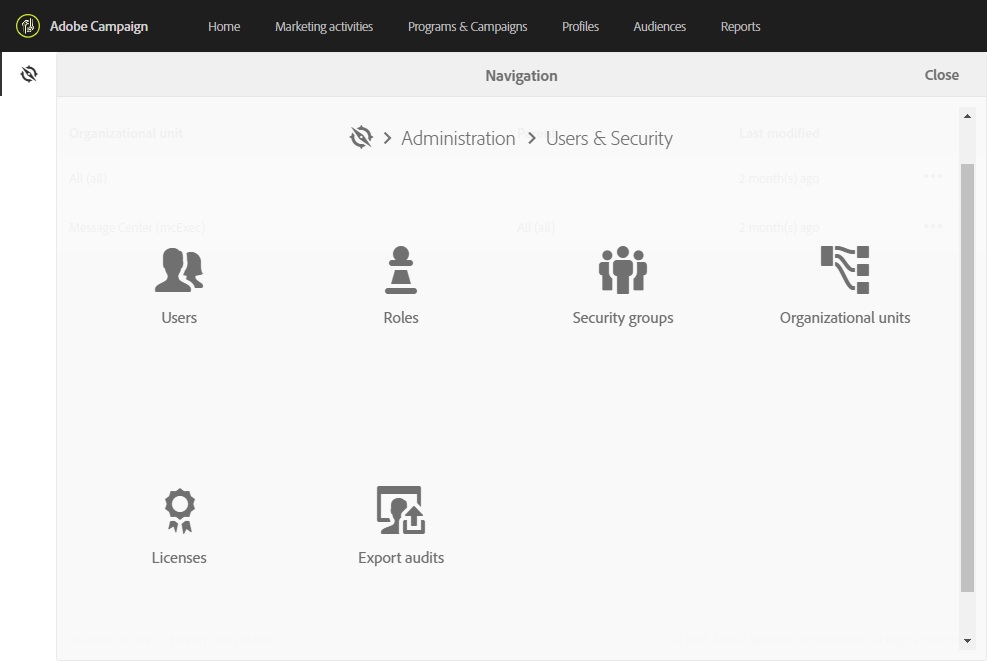

# 액세스 관리 기본 정보{#about-access-management}

Adobe Campaign을 사용하면 다른 사용자에게 할당된 권한을 정의하고 관리할 수 있습니다. 권한은 인터페이스에서 특정 기능 또는 개체에 대한 액세스를 승인하거나 거부하는 일련의 권한 및 제한 사항입니다. 이러한 권한은 두 가지 개념을 기반으로 합니다.

* **조직 단위**:이렇게 하면 플랫폼의 여러 개체(이메일, 워크플로우, 템플릿, 사용자, 프로필 등)에 대한 권한 계층을 정의할 수 있습니다. 조직 단위 [섹션을](../../administration/using/organizational-units.md) 참조하십시오.
* **역할**:사용자 및 사용자 그룹에 할당된 권한을 정의할 수 있는 단일 권한 집합. 역할 [목록](../../administration/using/list-of-roles.md) 섹션을 참조하십시오.

   조직의 구성 단위와 결합되어 역할을 통해 사용자는 인터페이스에 대한 필터링된 뷰를 볼 수 있고 다른 기능에 대한 액세스를 정의할 수 있습니다. 자세한 내용은 인증 [테이블을](https://docs.campaign.adobe.com/doc/standard/en/Technotes/AdobeCampaign-ACSRights.pdf)참조하십시오.

>[!IMPORTANT]
>
>지리적 단위 기능은 더 이상 사용되지 않습니다. 자세한 내용은 이 [페이지를](https://helpx.adobe.com/campaign/kb/acs-deprecated-and-removed-features.html)참조하십시오.

역할, 그룹 및 조직 단위는 플랫폼의 기능 관리자가 **[!UICONTROL Administration > Users & Security]**메뉴 아래에 있는 관리할 수 있습니다.

사용자는 관리 콘솔에서 관리됩니다(그룹 및 사용자 [관리](../../administration/using/managing-groups-and-users.md) 섹션 또는 관리 [콘솔 문서](https://helpx.adobe.com/enterprise/managing/user-guide.html)참조).

>[!IMPORTANT]
>
>관리 권한이 있는 사용자만 사용자 관리에 액세스할 수 있습니다.

**관련 항목**

* [조직 단위](../../administration/using/organizational-units.md)
* [역할 목록](../../administration/using/list-of-roles.md)
* [그룹 및 사용자 관리](../../administration/using/managing-groups-and-users.md)

