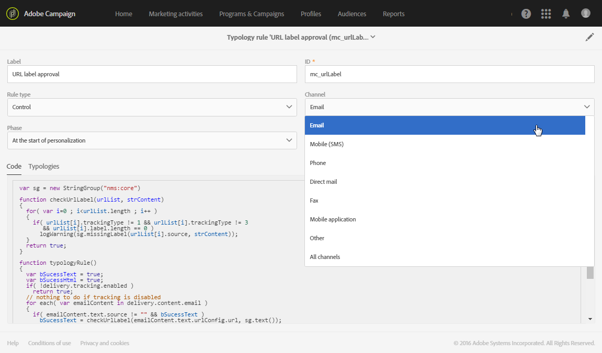
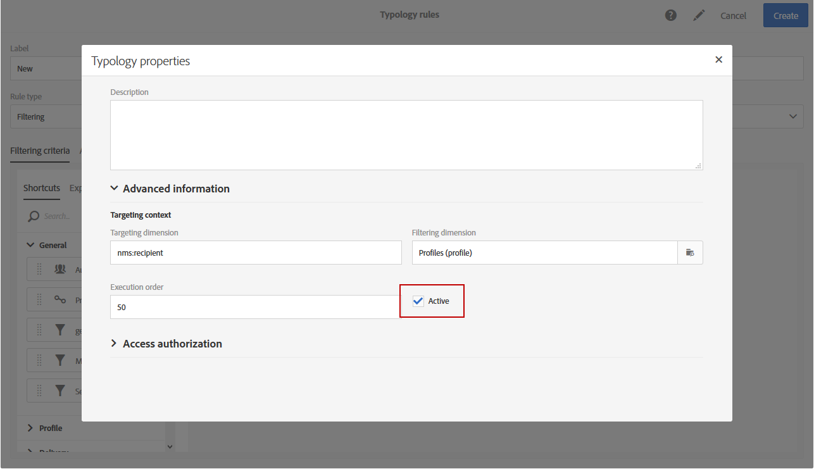

# 유형화 규칙 기본 정보{#about-typology-rules}

유형은 메시지 분석 단계 동안 실행되는 규칙 집합으로서, 대상, 컨텐트 및 다음 요소의 구성을 확인할 수 있습니다.제목, URL, 이미지, 구독 취소 링크, 증명 크기 등

Adobe Campaign에서 각 메시지에는 유형 분석에 대한 링크가 포함되어 있습니다. 이 링크는 배달 템플릿 속성의 고급 매개 변수에 정의됩니다(자세한 내용은 준비 [섹션을 참조하십시오](../../administration/using/configuring-email-channel.md#preparation) ).

>[!NOTE]
>
>각 메시지에는 단일 유형만 지정할 수 있습니다.

각 유형에 대해, **[!UICONTROL Typology rules]** 섹션에는 이 유형의 규칙 세트가 나열됩니다.

## 유형 관리 {#managing-typologies}

응용 프로그램에는 기본적으로 몇 가지 유형이 있습니다. 필요에 따라 고유한 유형을 만들거나 기존 유형을 수정할 수 있습니다.

1. &gt; **[!UICONTROL List of typologies]** &gt; **[!UICONTROL Administration]** &gt; **[!UICONTROL Channels]** &gt; **[!UICONTROL Typologies]** 메뉴에서 에 액세스합니다.
1. 유형과 속성을 수정하거나 새 유형을 만들려면 유형을 선택합니다.

   

1. 유형 유형을 정의합니다. 유형 유형은 표준 또는 필터링 유형 중 하나일 수 있습니다.
1. 단추를 사용하여 필요한 유형 규칙을 추가하거나 사용하지 않을 유형을 **[!UICONTROL Add an element]** 제거합니다.

   지정된 유형에 대해 규칙이 적용되는 순서를 수정할 수 있습니다. 이렇게 하려면 요소를 이동하여 화면에 표시되는 순서를 수정합니다. 그런 다음 실행 순서에 해당하는 번호가 자동으로 다시 계산됩니다. 규칙 응용 프로그램 모드는 Typical 규칙 [실행 순서](#typology-rules-execution-order) 섹션에 표시됩니다.

   이 화면에 표시되는 규칙은 읽기 전용 모드에서 액세스할 수 있습니다.

유형 분석을 사용할 준비가 되었습니다. 메시지 속성 또는 메시지 템플릿 속성에서 선택할 수 있습니다.

>[!NOTE]
>
>이 **[!UICONTROL IP affinity]** 필드를 사용하면 구성에 따라 친화성을 관리할 수 있습니다. 인스턴스의 구성 파일에서 정의됩니다. 해당 기능을 사용하려면 관리자에게 문의하십시오.

## 유형 규칙 {#typology-rules}

유형 규칙은 메시지 준비 중에 적용되는 비즈니스 규칙입니다. 메시지가 유효한지, 품질 기준을 충족하는지 확인하는 데 사용됩니다. 또한 타겟 대상의 각 구성원이 메시지를 받을 수 있는지 여부를 확인합니다.

분류 규칙은 **[!UICONTROL Administration]** &gt; **[!UICONTROL Channels]** &gt; **[!UICONTROL Typologies]** &gt; **[!UICONTROL Typology rules]** 메뉴에서 사용할 수 있습니다.

두 가지 유형의 규칙이 있습니다.

* **필터링** 규칙:격리된 프로필 또는 특정 수의 이메일을 이미 보낸 프로필과 같이 쿼리에 정의된 기준에 따라 메시지 대상의 한 부분을 제외할 수 있습니다. 규칙 [필터링을](../../administration/using/filtering-rules.md)참조하십시오.
* **피로** 규칙:프로필 당 최대 메시지 수를 정의하여 과도한 구매를 방지할 수 있습니다. 피로 [규칙을](../../administration/using/fatigue-rules.md)참조하십시오.
* **제어** 규칙:문자 표시, SMS 메시지 크기, 주소 형식 등 메시지를 보내기 전에 메시지의 유효성 및 품질을 확인할 수 있습니다. 제어 [규칙을](../../administration/using/control-rules.md)참조하십시오.

유형 규칙을 하나의 채널에만 또는 모든 채널에 적용할 수 있습니다.

유형 **[!UICONTROL Properties]** 규칙 유형에서 실행 순서를 설정할 수 있습니다. 여러 규칙을 적용해야 하는 경우 각 규칙의 실행 순서에 따라 먼저 처리할 규칙이 결정됩니다. 이에 대한 자세한 내용은 Typical [규칙 실행 순서](#typology-rules-execution-order) 섹션을 참조하십시오.

규칙이 관련된 메시지를 분석할 때 규칙을 적용하지 않으려는 **[!UICONTROL Properties]** 경우 유형 규칙을 통해 비활성화할 수 있습니다.

범주에서 타깃팅할 데이터에 **[!UICONTROL Targeting context]** 따라 타깃팅 차원 **및** 필터링 차원을 **** 선택할 수 있습니다.

기본적으로 필터링은 에서 수행됩니다 **[!UICONTROL Profiles]**. 예를 들어, 규칙이 모바일 응용 프로그램을 대상으로 하는 경우, 규칙을 **[!UICONTROL Filtering dimension]** 로 변경할 수 **[!UICONTROL Subscriptions to an application]**&#x200B;있습니다.

## 유형 규칙 실행 순서 {#typology-rules-execution-order}

유형 규칙은 타깃팅, 분석 및 메시지 개인화 단계 동안 지정된 순서로 실행됩니다.

표준 작업 모드에서는 규칙이 다음 시퀀스에 적용됩니다.

1. 타깃팅 시작 시 적용되는 경우 규칙을 제어합니다.
1. 필터링 규칙:

   * 주소 자격에 대한 기본 응용 프로그램 규칙:정의된 주소/확인되지 않은 주소/차단된 주소/격리된 주소/주소 품질
   * 사용자가 정의한 필터링 규칙.

1. 규칙이 타깃팅 끝에 적용되는 경우 규칙을 제어합니다.
1. 규칙이 개인화를 시작할 때 적용되는 경우 규칙을 제어할 수 있습니다.
1. 규칙이 개인화 종료 시 적용되는 경우 규칙을 제어할 수 있습니다.

그러나 각 유형에서 동일한 유형의 규칙의 실행 순서를 조정할 수 있습니다. 실제로 동일한 메시지 처리 단계 동안 여러 규칙이 실행될 때 규칙이 적용되는 순서를 선택할 수 있습니다.

예를 들어 실행 순서가 20에 위치하는 필터링 규칙은 실행 순서가 30에 위치하는 필터링 규칙 이전에 실행됩니다.
