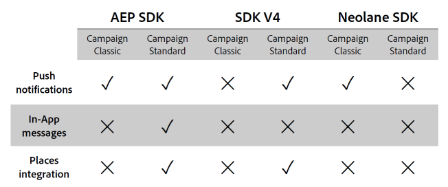

# Experience Platform SDK 통합 FAQ {#aep-faq}

Experience Platform SDK 애플리케이션을 사용하여 푸시 알림 및 인앱 메시지를 전송하려면 Adobe Experience Platform SDK에서 모바일 애플리케이션을 설정하고 Adobe Campaign에서 구성해야 합니다.

아래 섹션에는 이 동기화에 대한 일반적인 질문이 나와 있습니다.

푸시 또는 인앱에 대한 자세한 내용은 다음 FAQ 를 참조하십시오.

* [푸시 알림 FAQ](../../channels/using/about-push-notifications.md#push-faq)
* [인앱 FAQ](../../channels/using/in-app-faq.md)
* [Adobe Experience Platform 동기화의 태그 FAQ](../../administration/using/syncwithlaunch-faq.md)

## 시작하기 전에 유용한 리소스 {#resource-mobile-property}

Adobe Experience Platform SDK 및 Campaign Standard 통합에 대한 자세한 내용은 아래 리소스를 참조하십시오.

* Launch/Mobile [개요 비디오](https://www.adobe.com/experience-platform/launch.html#acpl-mobile-video)
* Launch/Mobile [Tips &amp; Tricks 안내서](https://www.adobe.com/content/dam/dx/us/en/products/experience-platform/launch-tag-manager/pdfs/adobe-cloud-platform-launch-tips-and-tricks-sheet.pdf)

## Adobe Campaign Standard과 Adobe Campaign Classic 모두에서 Adobe Experience Platform SDK 통합을 사용할 수 있습니까? {#aep-validity}

예, [!DNL Adobe Experience Platform SDK] Adobe Campaign Standard과 Adobe Campaign Classic 모두에서 통합을 사용할 수 있습니다. 해당 **[!UICONTROL Extension]** 사용 [!DNL Data Collection UI] 통합을 사용하도록 설정합니다.

자세한 정보는 이 [페이지](https://aep-sdks.gitbook.io/docs/using-mobile-extensions/adobe-campaign-standard)를 참조하십시오.

## Adobe Experience Platform SDK 통합은 Adobe Campaign에서 어떤 기능을 용이하게 합니까? {#aep-capabilities}

이러한 기능에 대한 자세한 내용은 아래 표를 참조하십시오.

>[!NOTE]
>
>[!DNL Places] 통합에는 위치 이벤트를 인앱 메시지(푸시 알림의 경우 N/A)의 트리거로 포함하여 프로필을 보강합니다 [!DNL Places] 데이터 및 로컬 알림 지원. 다음을 참조하십시오 [페이지](../../channels/using/preparing-and-sending-an-in-app-message.md) 추가 정보.  [!DNL Places] 제한된 통합에는 프로필을 보강하는 기능이 포함되어 있습니다 [!DNL Places] 데이터.

## Adobe Campaign Standard에서 Adobe Experience Platform SDK 통합을 통해 원활하게 수행할 수 있는 사용 사례는 무엇입니까? {#aep-use-cases}

지원되는 사용 사례는 다음과 같습니다.

* 획득 **[!UICONTROL Mobile Profile]** in Campaign (에서 ECID로 식별됨) **[!UICONTROL Administration]** > **[!UICONTROL Channels]** > **[!UICONTROL Mobile app (AEP SDK)]** > **[!UICONTROL Mobile Application subscribers]** tab)
* 품질 개선 **[!UICONTROL Mobile Profile]** Adobe Campaign에서 다음을 수행합니다. **[!UICONTROL Custom resource Extension]** appSubscriberRcp 테이블)
* 푸시 메시지 전송을 위한 푸시 토큰 획득(푸시 메시지를 수신하려면 사용자 옵트인 필요)
* 푸시 및 인앱 메시지 보내기
* 푸시 및 인앱 메시지와의 사용자의 상호 작용을 추적하고 이에 대한 보고서를 제공합니다

## Campaign에서 모바일 프로필을 획득하려면 어떻게 해야 합니까? {#mobile-profile-campaign}

이렇게 하려면 아래 절차를 따르십시오.

1. 구성 **[!UICONTROL Mobile property]** in [!DNL Launch].
1. Adobe Campaign Standard 확장을 설치합니다. Adobe Campaign Standard 확장 프로그램에는 **[!UICONTROL Mobile Core]**, **[!UICONTROL Profile]** 및 **[!UICONTROL Lifecycle]** 기본적으로 설치되는 확장 [!DNL Launch].
   * 사용자는 의 세션 시간 초과를 구성해야 합니다. **[!UICONTROL Mobile Core]** 라이프사이클 이벤트의 빈도에 영향을 주는 확장입니다.
   * 확장이 구성되면 사용자는 iOS용 Cocoapods 및 Android용 Gradle을 사용하여 모바일 앱에 적절한 종속성을 추가해야 합니다. 다음 지침을 따르십시오 [여기](https://aep-sdks.gitbook.io/docs/using-mobile-extensions/adobe-campaign-standard).
   * 항상 최신 버전의 라이브러리를 사용합니다.
   * 모바일 앱에서 등록 **[!UICONTROL Campaign]**, **[!UICONTROL UserProfile]**, **[!UICONTROL Identity]**, **[!UICONTROL Lifecycle]** 및 **[!UICONTROL Signal]** 확장. 다음 지침을 따르십시오 [여기](https://aep-sdks.gitbook.io/docs/using-mobile-extensions/adobe-campaign-standard#register-the-campaign-standard-extension-with-mobile-core).
   * 확장이 등록되면 ACPCore를 시작합니다. Android의 경우 setApplication onCreate() 를 사용해야 합니다. Launch에서 모바일 속성에 대한 모바일 설치 지침에 제공된 정확한 지침을 따르십시오.
   * 다음 SDK API도 필요합니다. 설명된 대로 라이프사이클 시작 및 일시 중지 API를 구현합니다 [여기](https://aep-sdks.gitbook.io/docs/using-mobile-extensions/mobile-core/lifecycle/lifecycle-extension-in-android) Android 및 iOS용 여기에서 사용할 수 있습니다.
1. 구성 **[!UICONTROL Mobile Property]** Adobe Campaign Standard. 다음 절차를 따르십시오 [여기](../../administration/using/configuring-a-mobile-application.md#channel-specific-config).

## Campaign에서 모바일 프로필을 보강하기 위해 어떻게 해야 합니까? {#enrich-mobile-profile}

CollectPII 포스트백을 구성해야 합니다(다음 참조) [페이지](../../administration/using/configuring-rules-launch.md#pii-postback)) 및 SDK에서 CollectPII API를 구현합니다(참조) [페이지](https://aep-sdks.gitbook.io/docs/using-mobile-extensions/mobile-core/mobile-core-api-reference#collect-pii)).

## CollectPII 호출이 얼마나 자주 실행되어야 합니까? {#collect-pii}

CollectPII 호출의 목적은 Campaign에서 모바일 프로필을 보강하는 것입니다. 고객이 사용 사례 및 비즈니스 요구 사항에 따라 프로필에 추가하려는 새로운 의미 있는 정보가 있을 때마다 실행해야 합니다.

## 여러 트리거 이벤트에 대한 응답으로 CollectPII 호출을 실행할 수 있습니까? {#collect-pii-calls}

예. 비즈니스 요구 사항에 따라 앱에서 사용자 로깅에 대한 응답으로 CollectPII 호출을 실행하거나 지오펜스를 입력하는 특정 항목 또는 라이프사이클 이벤트 또는 사용자를 구매할 수 있습니다. 요약하면 사용자의 프로필 데이터 보강에 사용할 정보를 생성하는 앱과 사용자의 상호 작용입니다.

## 모든 모바일 이벤트에 대한 응답으로 CollectPII 호출을 실행할 수 있습니까? {#collect-pii-events}

CollectPII 호출의 빈도 및 디자인은 비즈니스 요구 사항에 의해 조정되어야 하며 DB에 추가 로드를 생성할 때 맹목적으로 실행되어서는 안 됩니다.

### Campaign 또는 Launch에서 Adobe Experience Platform 앱에 액세스하려고 할 때 속성을 사용할 수 없는 오류가 발생하는 경우가 있습니다. {#aep-error}

알려진 문제이며 토큰 만료로 인해 발생합니다. 로그아웃한 후 로그인하십시오.

## Adobe Experience Platform SDK(이전의 SDK V5)에 대해 자세히 알 수 있는 유용한 리소스 권장 사항은 무엇입니까?{#resource-aep}

아래 리소스를 확인하십시오.

* Experience Platform SDK [설명서](https://aep-sdks.gitbook.io/docs/)
* Launch 및 Experience Platform SDK 시작하기 [설명서](https://aep-sdks.gitbook.io/docs/getting-started/create-a-mobile-property)
* Experience Platform SDK로 업그레이드 [설명서](https://aep-sdks.gitbook.io/docs/resources/upgrading-to-aep)
* Github Experience Platform SDK [설명서](https://github.com/Adobe-Marketing-Cloud/acp-sdks/)

## 푸시 알림 전달을 만드는 동안 &quot;게재에 대한 쓰기 액세스 권한이 없습니다&quot;라는 오류가 발생했습니다. {#write-access-error}

다음을 확인해야 합니다.

* 모바일 앱은 푸시 게재를 만들고 전송해야 하는 사용자의 조직 단위에 매핑되어야 합니다. 하위 조직 구성 단위 사용자는 상위 조직 단위에 매핑된 앱을 사용하여 푸시 게재를 만들 수 없습니다.

* 푸시 게재를 만드는 캠페인 또는 프로그램은 푸시 게재를 만들고 전송해야 하는 사용자의 조직 단위에 매핑되어야 합니다. 하위 조직 구성 단위의 사용자는 상위 조직 단위에 매핑된 캠페인이나 프로그램에서 푸시 전달을 만들 수 없습니다.
