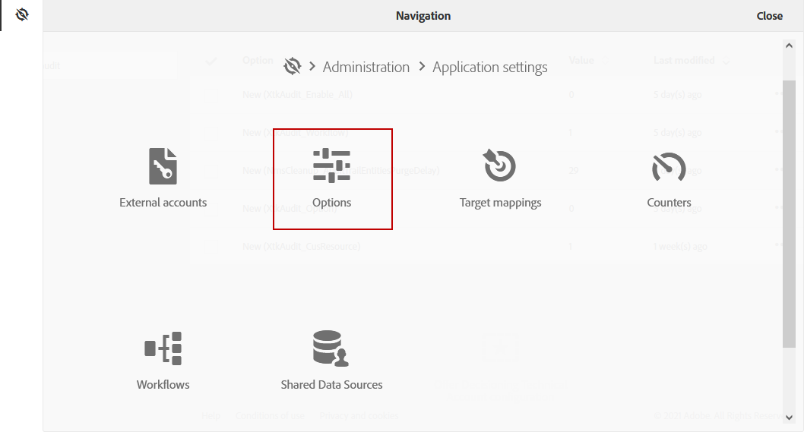
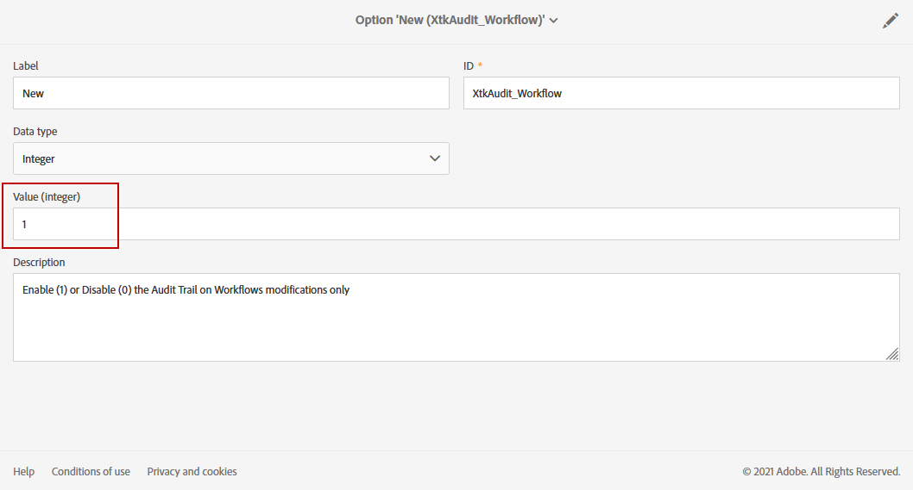

# 감사 추적 {#audit}

**[!UICONTROL Audit trail]** 을 사용하면 인스턴스 내에서 수행된 변경 내용의 전체 기록에 액세스할 수 있습니다.

**[!UICONTROL Audit trail]** 은(는) Adobe Campaign Standard 인스턴스 내에서 발생하는 작업 및 이벤트의 포괄적인 목록을 실시간으로 캡처합니다. 여기에는 다음과 같은 질문에 답변할 수 있도록 데이터 기록에 액세스하는 셀프서비스 방법이 포함되어 있습니다. 워크플로우, 사용자 지정 리소스 및 옵션, 마지막으로 업데이트한 사람 또는 인스턴스에서 사용자가 수행한 작업이 어떻게 되었습니까?

**[!UICONTROL Audit trail]** 다음 세 가지 구성 요소로 구성됩니다.

* **사용자 정의 리소스 감사 추적**: 활동을 확인하고 사용자 지정 리소스에 대해 마지막으로 수정한 내용을 확인합니다.

   **[!UICONTROL Custom resources]**&#x200B;에 대한 자세한 내용은 이 [page](../../developing/using/key-steps-to-add-a-resource.md)를 참조하십시오.

* **워크플로우 감사 추적**: 워크플로우에 대한 활동 및 마지막으로 수정한 내용을 확인하고, 다음과 같은 워크플로우의 상태를 확인합니다.

   * 생성됨
   * 수정됨
   * 삭제됨
   * 워크플로우 시작
   * 워크플로우 일시 중지
   * 워크플로우 중지
   * 워크플로우 다시 시작
   * 워크플로우 정리
   * 워크플로우 시뮬레이션
   * 워크플로우 절전 모드 해제
   * 워크플로우 즉시 중지
   * 동일한 사용자로 워크플로우 다시 시작
   * 워크플로 다시 시작 알 수 없는 명령

   **[!UICONTROL Workflows]**&#x200B;에 대한 자세한 내용은 이 [page](../../automating/using/get-started-workflows.md)를 참조하십시오.

* **옵션 감사 추적**: 활동을 확인하고 옵션에 대한 마지막 수정 작업을 확인합니다.

   **[!UICONTROL Options]**&#x200B;에 대한 자세한 내용은 이 [page](../../administration/using/about-campaign-standard-settings.md)를 참조하십시오.

기본적으로 보존 기간은 30일입니다.

## 감사 추적 액세스 {#audit-access}

인스턴스의 감사 추적에 액세스하려면

1. Adobe Campaign Standard의 고급 메뉴에서 **[!UICONTROL Administration]** > **[!UICONTROL Audit trail]** 을 선택합니다.

   

1. 엔티티 목록이 있는 **[!UICONTROL Audit trail]** 창이 열립니다. Adobe Campaign Standard은 워크플로우, 옵션 및 사용자 지정 리소스에 대한 만들기, 편집 및 삭제 작업을 감사합니다.

   **[!UICONTROL Search]** 메뉴에서 엔터티를 필터링할 수 있습니다.

   * **[!UICONTROL Start date]**
   * **[!UICONTROL End date]**
   * **[!UICONTROL Type]**: 모두, 워크플로우, 사용자 지정 리소스 및 옵션 사이의 엔티티 유형입니다.
   * **[!UICONTROL Entity name]**: 워크플로우, 옵션 또는 사용자 지정 리소스의 ID

   

1. 마지막 수정 사항에 대해 자세히 알아보려면 엔티티 중 하나를 선택합니다.

1. 감사 엔티티 창에서는 선택한 엔티티에 대한 다음과 같은 자세한 정보를 제공합니다.

   * **[!UICONTROL Entity]**: 워크플로우, 옵션 또는 사용자 지정 리소스의 ID입니다.
   * **[!UICONTROL Action]**: 이 엔터티에 대해 마지막으로 수행된 작업입니다.
   * **[!UICONTROL Changed by]**: 이 엔터티를 마지막으로 수정한 마지막 사용자의 사용자 이름입니다.
   * **[!UICONTROL Changed date]**: 이 엔터티에 대해 수행된 마지막 작업의 날짜입니다.
   * **[!UICONTROL Content]**: 엔티티에서 정확히 변경된 내용에 대한 자세한 정보를 제공하는 코드 블록입니다.

   이 예제에서는 이 인스턴스의 비즈니스 관리자가 워크플로우 WKF110을 8월 26일에 시작했음을 확인할 수 있습니다.

   

## 감사 추적 활성화/비활성화 {#enable-disable-audit}

특정 활동에 대해 감사 추적을 쉽게 활성화하거나 비활성화할 수 있습니다.

방법은 다음과 같습니다.

1. Adobe Campaign Standard의 고급 메뉴에서 **[!UICONTROL Administration]** > **[!UICONTROL Application settings]** > **[!UICONTROL Options]**&#x200B;를 선택합니다.

   

1. 비활성화할 엔티티에 따라 다음 옵션 중 하나를 선택합니다.

   * **[!UICONTROL XtkAudit_Workflows]** 워크플로우에 대한 감사 추적을 관리하는 옵션입니다.
   * **[!UICONTROL XtkAudit_Option]** 옵션에 대한 감사 추적을 관리하는 옵션.
   * **[!UICONTROL XtkAudit_CusResource]** 사용자 지정 리소스에 대한 감사 추적을 관리하는 옵션.
   * **[!UICONTROL XtkAudit_Enable_All]** 모든 엔티티에 대한 감사 추적을 관리하는 옵션.

      >[!NOTE]
      >
      >**[!UICONTROL XtkAudit_Enable_All]** 옵션이 0으로 설정된 경우 다른 개별 옵션 값에 관계없이 **[!UICONTROL Audit trail]** 기능이 완전히 비활성화됩니다.
   

1. **[!UICONTROL Options]** 페이지에서 **[!UICONTROL Audit trail]** 를 비활성화하려면 **[!UICONTROL Value (integer)]** 을 0으로 설정하거나 1을 설정하여 활성화합니다.

   

1. **[!UICONTROL Save]**&#x200B;를 클릭합니다.