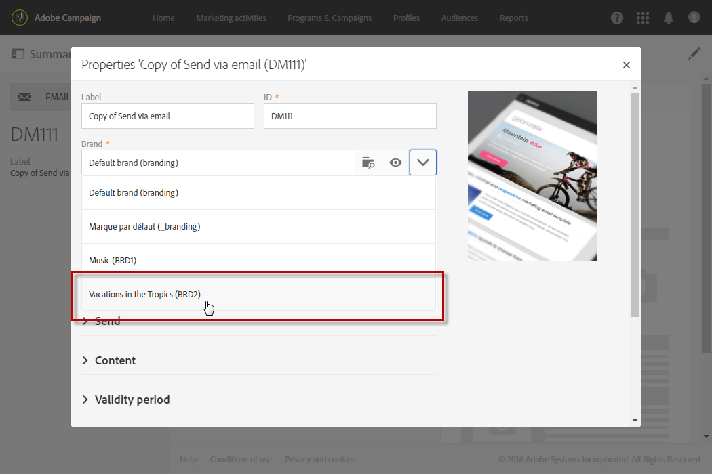

# 브랜딩{#branding}

## 브랜드 아이덴티티 정보 {#about-brand-identity}

모든 회사에는 브랜드 시각적인 기술 가이드라인이 있습니다. Adobe Campaign을 사용하면 로고에서 이메일 보낸 사람, URL 또는 도메인과 같은 기술 측면까지 일관된 브랜드를 고객에게 제공하기 위해 일련의 사양을 정의할 수 있습니다.

기술 관리자는 한 개 또는 여러 브랜드를 정의하여 브랜드의 ID에 영향을 주는 매개 변수를 중앙에서 입력할 수 있습니다. 여기에는 브랜드 로고, 랜딩 페이지의 액세스 URL의 도메인 또는 메시지 추적 설정이 포함됩니다. Adobe Campaign을 사용하면 이러한 브랜드를 만들어 메시지 또는 랜딩 페이지에 연결할 수 있습니다. 이 구성은 템플릿에서 관리됩니다.

## 브랜드 구성 및 사용 {#configuring-and-using-brands}

브랜드 구성 및 사용의 주요 원칙은 다음과 같습니다.

1. 브랜드 만들기 및 구성 - 이 작업은 특정 권한이 필요하며 Adobe Campaign 기술 관리자가 수행합니다.
1. 이 브랜드에 대해 하나 또는 여러 개의 배달 및 랜딩 페이지 템플릿을 만듭니다. 템플릿 [만들기](../../start/using/marketing-activity-templates.md) 섹션을 참조하십시오.
1. 이 템플릿을 기반으로 메시지와 랜딩 페이지를 만듭니다. 이메일 [만들기](../../channels/using/creating-an-email.md) 및 랜딩 페이지  만들기 섹션을 참조하십시오.

>[!CAUTION]
>
>최종 사용자가 브랜드를 만들거나 수정할 수 없습니다.이러한 작업은 Adobe Campaign 기술 관리자가 수행해야 합니다. 요청 시 Adobe 고객 지원 센터에 문의하십시오. 트랜잭션 메시지 컨텍스트에서는 다중 브랜딩을 사용할 수 없습니다. 자세한 내용은 트랜잭션 메시지 [및 브랜딩을](../../channels/using/about-transactional-messaging.md#permissions-and-branding)참조하십시오.

브랜드는 **[!UICONTROL Administration > Instance settings > Brand configuration]**메뉴에서 찾을 수 있습니다.

기본적으로 새로 만든 브랜드는 관리자가 해당 권한을 가진 사용자만 볼 수 있습니다.

브랜드는 **다음** 특성에 의해 정의됩니다.

* 브랜드를 **정의하고**&#x200B;개인화하는 ID입니다. 이 섹션에는 다음 필드가 포함되어 있습니다.

   

   * **인터페이스에 표시되는** 레이블
   * **브랜드 이름**
   * **브랜드의 웹 사이트** URL **및 웹 사이트 레이블**
   * **브랜드 로고**

* **[!UICONTROL Header parameters of sent emails]**캠페인 수신자가 보게 될 내용을 개인화합니다. 이 섹션에는 다음 필드가 포함되어 있습니다.

   

   * **브랜드 이메일 주소가 있는 보낸 사람** (이메일 주소)입니다.
   * **브랜드 이름으로 보낸 사람(이름)** .
   * **고객이 답글을 달 수 있는 이메일 주소로 회신(이메일 주소)** .
   * **(이름)** 브랜드 이름으로 회신합니다.
   * **오류(이메일 주소)** - 오류가 발생한 경우 사용할 이메일 주소입니다.
   >[!CAUTION]
   >
   >이메일의 헤더 매개 변수를 업데이트한 후 보낸 사람의 이름과 이메일 주소가 템플릿에서 만든 이메일에서 변경되지 않은 경우 템플릿의 고급 설정을 확인하십시오.

* **인터넷에** 노출된 서버는 추적에 사용되지만 랜딩 페이지 액세스에 사용되는 서버를 정의합니다. 이 섹션에는 다음 필드가 포함되어 있습니다.

   

   * **사용자가 만든 다른 랜딩 페이지를 호스팅 및 액세스하는 데 사용되는 응용 프로그램 서버의** 외부 URL입니다.
   * **배달 중 추적된 URL로 사용되는 추적 서버의** 외부 URL입니다.
   * **게재에서 기본 미러 페이지로 사용되는 미러 페이지 서버의** 외부 URL입니다.

* **[!UICONTROL Tracking URL configuration (Web Analytics)]**에 대한 URL 추적 구성을 정의합니다.

   Adobe Analytics 또는 Google Analytics와 같은 웹 분석 도구와 같은 외부 시스템에서 링크를 추적할 수 있도록 하는 추가 매개 변수가 여기에 정의되어 있습니다.

   

## 이메일에 브랜드 할당 {#assigning-a-brand-to-an-email}

### 브랜드와 템플릿 연결 {#linking-a-brand-to-a-template}

브랜드에 대해 정의된 매개 변수를 사용하려면 게재 템플릿이나 랜딩 페이지 템플릿에 연결해야 합니다. 이렇게 하려면 템플릿을 만들거나 편집해야 합니다.

>[!NOTE]
>
>템플릿 만들기에 대한 자세한 내용은 템플릿 [만들기](../../start/using/marketing-activity-templates.md) 섹션을 참조하십시오.

템플릿이 만들어지면 브랜드에 연결할 수 있습니다. 이렇게 하려면:

1. 템플릿 속성에 액세스하려면 **[!UICONTROL Edit properties]**단추를 클릭합니다.

   

1. 드롭다운 목록을 사용하여 템플릿에 연결할 브랜드를 선택합니다.

   >[!NOTE]
   >
   >기본적으로 **[!UICONTROL Default brand (branding)]**이 선택됩니다.

   

   선택한 브랜드가 구성되는 방식을 보려면 **[!UICONTROL Navigate to the detail of the element selected]**아이콘을 클릭합니다.

   

1. 선택을 확인하고 템플릿을 저장합니다.

템플릿이 브랜드에 연결되어 있습니다. 이메일 편집기에서 기본 발신자의 **이메일**&#x200B;주소, 기본 발신자 이름 **또는 로고와 같은**&#x200B;요소는 **구성된 브랜드** 데이터를사용합니다.

### 브랜딩 사용 사례 {#branding-use-case}

이 예에서는 새로운 여행 관련 브랜드를 만들어 이메일에 사용합니다.

#### 새 브랜드 구성 {#configure-a-new-brand}

>[!CAUTION]
>
>브랜드 구성은 특정 권한 및 기술 설정이 필요하므로 Adobe에서만 관리됩니다.

1. Adobe Campaign 관리자가 브랜드를 만듭니다 **[!UICONTROL Administration > Instance settings > Brand configuration]**. 그는 고급**&#x200B;메뉴에서 열대지방의 휴가&#x200B;**요소를 추가하고 브랜드에 대한**[!UICONTROL ID]** 정보를 구성합니다 **[!UICONTROL Header parameters of sent emails]**.

   

1. 그런 다음 관리자는 랜딩 페이지를 **사용한 다음** 추적 URL을 사용할 수 있도록 인터넷에 노출된 서버의 URL을 구성합니다.

   이 예에서 사용된 웹 **분석** 도구는 Google **Analytics입니다**. 관리자는 다음과 같이 추적 URL을 구성합니다.

   

브랜드가 올바르게 만들어지고 구성됩니다. 이제 마케팅 팀에서 사용할 수 있습니다.

#### 새 브랜드 구현 {#implement-a-new-brand}

배달 관리자는 새 브랜드를 사용할 배달 템플릿을 만들어야 합니다. 이를 위해서는 아래 단계를 따르십시오.

1. 고급 메뉴에서 기본 제공 템플릿을 **[!UICONTROL Resources > Templates > Delivery templates]**복제하여 새 배달 템플릿을 구성합니다.

   

1. 이 템플릿을 열대 **지역의 휴가 브랜드에 연결하려면** 템플릿 속성을 편집하고 드롭다운 목록에서 브랜드를 선택합니다.

   

1. 브랜드 ID를 반영하도록 이 이메일 템플릿을 구성합니다.
1. 템플릿이 완료되면 저장할 수 있습니다.

   

   이제 게재 템플릿을 사용하여 대상에 보낼 이메일을 만들 수 있습니다.

#### 전달에 새로운 브랜드 사용 {#use-the-new-brand-in-a-delivery}

브랜드에 연결된 이메일을 만들려면 아래 단계를 따르십시오.

1. 메뉴에서 **[!UICONTROL Create]**단추를 클릭합니다**[!UICONTROL Marketing activities]** .

   

1. 활동을 **[!UICONTROL Email]**선택한 다음 새 브랜드에 연결된 템플릿을 선택합니다.

   

1. 이메일이 이미 구성되어 있습니다. 테스트 프로필을 사용하여 테스트하기 전에 정보를 확인한 다음 사용자에게 전송할 수 있습니다.

   

