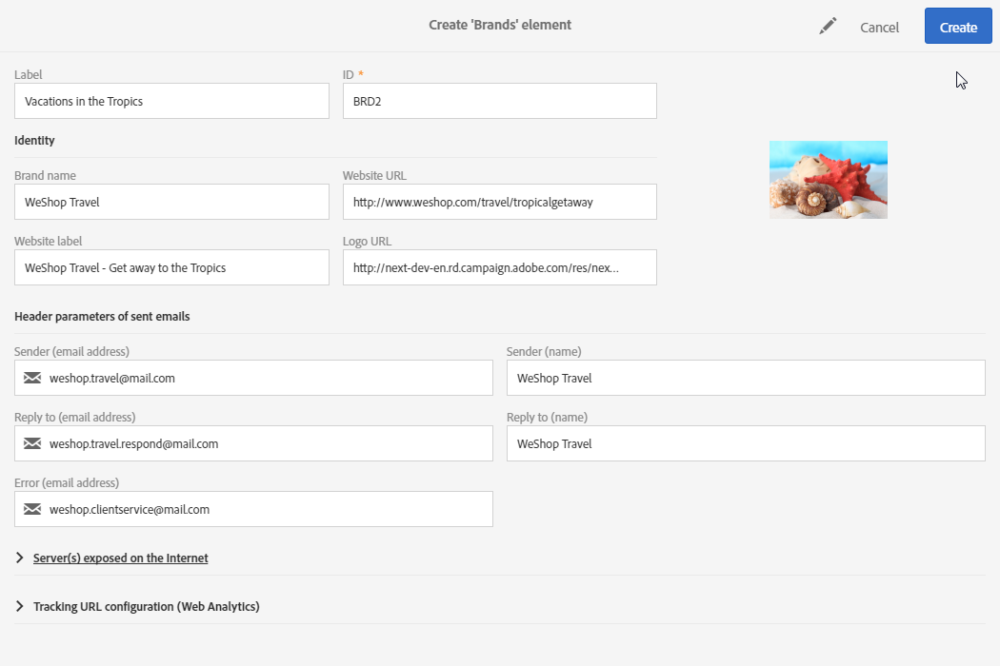

# 브랜딩{#branding}

## 브랜드 이미지 기본 정보 {#about-brand-identity}

모든 회사에는 브랜드 시각적 및 기술적 지침이 있습니다. Adobe Campaign을 사용하면 로고에서부터 이메일 발신자, URL 또는 도메인과 같은 기술적 측면까지 일관된 브랜드를 고객에게 제시하기 위해 일련의 사양을 정의할 수 있습니다.

기술 관리자는 하나 또는 여러 브랜드를 정의하여 브랜드 이미지에 영향을 주는 매개 변수를 중앙에서 입력할 수 있습니다. 여기에는 브랜드 로고, 랜딩 페이지의 액세스 URL의 도메인 또는 메시지 추적 설정이 포함됩니다. Adobe Campaign을 사용하면 이러한 브랜드를 만들어 메시지 또는 랜딩 페이지에 연결할 수 있습니다. 이 구성은 템플릿에서 관리됩니다.

## 브랜드 구성 및 사용 {#configuring-and-using-brands}

브랜드 구성 및 사용의 주요 원칙은 다음과 같습니다.

1. 브랜드 만들기 및 구성 - 이 작업은 특정 권한이 필요하며 Adobe Campaign 기술 관리자가 수행합니다.
1. 이 브랜드에 대해 하나 또는 여러 개의 게재 및 랜딩 페이지 템플릿을 만듭니다. [템플릿 만들기](../../start/using/marketing-activity-templates.md) 섹션을 참조하십시오.
1. 이 템플릿을 기반으로 메시지 및 랜딩 페이지를 만듭니다. [이메일 만들기](../../channels/using/creating-an-email.md) 및 [랜딩 페이지 만들기](../../channels/using/designing-a-landing-page.md) 섹션을 참조하십시오.

>[!IMPORTANT]
>
>최종 사용자가 브랜드를 만들거나 수정할 수 없습니다. 이러한 작업은 Adobe Campaign 기술 관리자가 수행해야 합니다. 요청이 있으면 Adobe 고객 지원 센터에 문의하십시오.
>
>트랜잭션 메시지 컨텍스트에서는 다중 브랜딩을 사용할 수 없습니다. 자세한 내용은 [트랜잭션 메시지 및 브랜딩](../../channels/using/transactional-messaging-limitations.md#permissions-and-branding)을 참조하십시오.

브랜드는 **[!UICONTROL Administration > Instance settings > Brand configuration]** 메뉴에서 찾을 수 있습니다.

기본적으로 새로 생성된 브랜드는 관리자가 해당 권한을 부여한 사용자만 볼 수 있습니다.

**브랜드**&#x200B;는 다음과 같은 특성에 의해 정의됩니다.

* 브랜드를 정의하고 개인화하는 **이미지**&#x200B;입니다. 이 섹션에는 다음 필드가 포함되어 있습니다.

   

   * 인터페이스에 표시되는 **레이블**
   * **브랜드 이름**
   * 브랜드의 **웹 사이트 URL** 및 **웹 사이트 레이블**
   * **브랜드 로고**

* **[!UICONTROL Header parameters of sent emails]**&#x200B;는 캠페인 수신자가 보게 되는 내용을 개인화합니다. 이 섹션에는 다음 필드가 포함되어 있습니다.

   

   * 브랜드 이메일 주소가 있는 **발신자(이메일 주소)**.
   * 브랜드 이름이 있는 **발신자(이름)**.
   * 고객이 회신할 수 있는 이메일 주소가 있는 **회신 대상(이메일 주소)**.
   * 브랜드 이름이 있는 **회신 대상(이름)**.
   * 오류가 발생한 경우 사용할 이메일 주소가 있는 **오류(이메일 주소)**.

   >[!IMPORTANT]
   >
   >이메일의 헤더 매개 변수를 업데이트한 후 템플릿에서 만든 이메일에서 발신자의 이름 및 이메일 주소가 변경되지 않은 경우, 템플릿의 고급 설정을 확인하십시오.

* **인터넷에 노출된 서버**&#x200B;는 추적에 사용되는 서버뿐만 아니라 랜딩 페이지 액세스에 사용되는 서버도 정의합니다. 이 섹션에는 다음 필드가 포함되어 있습니다.

   

   * 사용자가 만드는 다른 랜딩 페이지를 호스팅 및 액세스하는 데 사용되는 **애플리케이션 서버의 외부 URL**.
   * 게재 중 추적된 URL로 사용되는 **추적 서버의 외부 URL**.
   * 게재에서 기본 미러 페이지로 사용되는 **미러 페이지 서버의 외부 URL**.

   >[!NOTE]
   >
   >Campaign 사용자 인터페이스에 랜딩 페이지 미리 보기 및 미러 페이지 렌더링을 표시하려면 애플리케이션 서버 및 미러 페이지 서버 URL의 보안이 안전해야 합니다. 이 경우, 이러한 URL을 설정할 때 http://가 아닌 https://를 사용하십시오.

* **[!UICONTROL Tracking URL configuration (Web Analytics)]**&#x200B;은 브랜드에 대한 URL 추적 구성을 정의합니다.

   Adobe Analytics 또는 Google Analytics와 같은 웹 분석 도구 등 외부 시스템에서 링크를 추적할 수 있도록 하는 추가 매개 변수가 여기에 정의되어 있습니다.

   

## 이메일에 브랜드 할당 {#assigning-a-brand-to-an-email}

### 템플릿에 브랜드 연결 {#linking-a-brand-to-a-template}

브랜드에 대해 정의된 매개 변수를 사용하려면 게재 템플릿 또는 랜딩 페이지 템플릿에 연결해야 합니다. 이렇게 하려면 템플릿을 만들거나 편집해야 합니다.

>[!NOTE]
>
>템플릿 만들기에 대한 자세한 내용은 [템플릿 만들기](../../start/using/marketing-activity-templates.md) 섹션을 참조하십시오.

일단 템플릿이 생성되면 브랜드에 연결할 수 있습니다. 방법은 다음과 같습니다.

1. 템플릿 속성에 액세스하기 위해 **[!UICONTROL Edit properties]** 버튼을 클릭합니다.

   

1. 드롭다운 목록을 사용하여 템플릿에 연결할 브랜드를 선택합니다.

   >[!NOTE]
   >
   >기본적으로 **[!UICONTROL Default brand (branding)]**&#x200B;이(가) 선택되어 있습니다.

   

   선택한 브랜드의 구성 방식을 보려면 **[!UICONTROL Navigate to the detail of the element selected]** 아이콘을 클릭합니다.

   

1. 선택을 확인하고 템플릿을 저장합니다.

템플릿이 브랜드에 연결되어 있습니다. 이메일 편집기에서 **기본 발신자의 이메일 주소**, **기본 발신자 이름**&#x200B;또는 **로고**&#x200B;와 같은 요소는 구성된 브랜드 데이터를 사용합니다.

### 브랜딩 사용 사례 {#branding-use-case}

이 예제에서는 새로운 여행 관련 브랜드를 만들어 이메일에 사용합니다.

#### 새 브랜드 구성 {#configure-a-new-brand}

>[!IMPORTANT]
>
>브랜드 구성은 특정 권한 및 기술 설정이 필요하므로 Adobe에서만 관리합니다.

1. Adobe Campaign 관리자는 **[!UICONTROL Administration > Instance settings > Brand configuration]**&#x200B;에서 브랜드를 만듭니다. 고급 메뉴에서 **Vacations in the Tropics** 요소를 추가하고 브랜드의 **[!UICONTROL ID]** 및 **[!UICONTROL Header parameters of sent emails]**&#x200B;을(를) 구성합니다.

   

1. 그런 다음 관리자는 랜딩 페이지를 사용할 수 있도록 **인터넷에 노출된 서버**&#x200B;의 URL을 구성한 다음 추적 URL을 구성합니다.

   이 예제에서 사용된 **웹 분석** 도구는 **Google Analytics**&#x200B;입니다. 관리자는 다음과 같이 추적 URL을 구성합니다.

   

브랜드가 올바르게 생성 및 구성되었습니다. 이제 마케팅 팀에서 사용할 수 있습니다.

#### 새 브랜드 구현 {#implement-a-new-brand}

게재 관리자는 새 브랜드를 사용하기 위해 게재 템플릿을 만들어야 합니다. 이를 실현하려면 아래 단계를 수행하십시오.

1. 고급 메뉴 **[!UICONTROL Resources > Templates > Delivery templates]**&#x200B;에서 기본 제공 템플릿을 복제하여 새 게재 템플릿을 구성합니다.

   

1. 이 템플릿을 **Vacations in the Tropics** 브랜드에 연결하려면 템플릿 속성을 편집하고 드롭다운 목록에서 브랜드를 선택합니다.

   

1. 브랜드 이미지를 반영하도록 이 이메일 템플릿을 구성합니다.
1. 템플릿이 완성되면 저장할 수 있습니다.

   

   이제 게재 템플릿을 사용하여 대상자에게 전송할 이메일을 만들 수 있습니다.

#### 게재에서 새 브랜드 사용 {#use-the-new-brand-in-a-delivery}

브랜드에 연결된 이메일을 만들려면 아래 단계를 수행하십시오.

1. **[!UICONTROL Marketing activities]** 메뉴에서 **[!UICONTROL Create]** 버튼을 클릭합니다.

   

1. **[!UICONTROL Email]** 활동을 선택한 다음 새 브랜드에 연결된 템플릿을 선택합니다.

   

1. 이메일이 이미 구성되어 있습니다. 테스트 프로필을 사용하여 테스트하기 전에 정보를 확인한 다음 대상자에게 전송할 수 있습니다.

   

