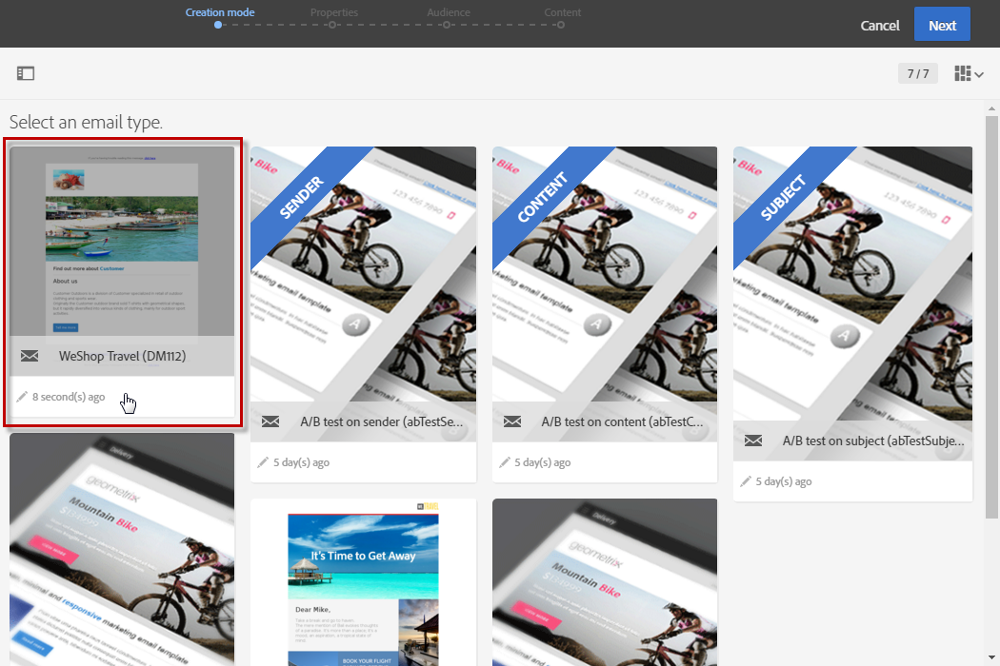

# Branding{#branding}

## About brand identity {#about-brand-identity}

모든 기업에는 브랜드 비주얼 및 기술 가이드라인이 있습니다. Adobe Campaign를 사용하면 로고, 기술 측면, 이메일 발신자, URL 등 일관된 브랜드를 고객에게 제공하기 위해 일련의 사양을 정의할 수 있습니다.

기술 관리자는 한 개 또는 여러 브랜드를 정의하여 브랜드 ID에 영향을 주는 매개 변수를 중앙에서 입력할 수 있습니다. 여기에는 브랜드 로고, 랜딩 페이지의 액세스 URL 도메인 또는 메시지 추적 설정이 포함됩니다. Adobe Campaign를 사용하면 이러한 브랜드를 만들고 메시지 또는 랜딩 페이지에 연결할 수 있습니다. 이 구성은 템플릿에서 관리됩니다.

## Configuring and using brands {#configuring-and-using-brands}

브랜드를 구성하고 사용하는 기본 원칙은 다음과 같습니다.

1. 브랜드 만들기 및 구성 - 이 작업을 수행하려면 특정 권한이 필요하며 Adobe Campaign 기술 관리자가 수행합니다.
1. 이 브랜드에 대한 하나 또는 여러 개의 전달 및 랜딩 페이지 템플릿을 만듭니다. Refer to the [Creating a template](../../start/using/about-templates.md) section.
1. 이 템플릿을 기반으로 메시지와 랜딩 페이지를 만듭니다. Refer to the [Creating an email](../../channels/using/creating-an-email.md) and [Creating a landing page](../../channels/using/designing-a-landing-page.md) sections.

>[!CAUTION]
>
>최종 사용자는 브랜드를 만들거나 수정할 수 없습니다. 이러한 작업은 Adobe Campaign 기술 관리자가 수행해야 합니다. 요청에 대해서는 Adobe 고객 지원 센터에 문의하십시오. 다중 브랜딩은 트랜잭션 메시지 컨텍스트에서 사용할 수 없습니다. For more on this, see [Transactional messages and branding](../../channels/using/about-transactional-messaging.md#permissions-and-branding).

Brands can be found in the **[!UICONTROL Administration > Instance settings > Brand configuration]** menu.

기본적으로 새로 만든 브랜드는 관리자가 해당 권한을 부여한 사용자만 볼 수 있습니다.

**브랜드는** 다음 특성에 의해 정의됩니다.

* An **Identity**, which defines and personalizes your brand. 이 섹션에는 다음 필드가 포함됩니다.

   

   * **인터페이스에 표시되는 레이블**
   * **브랜드 이름**
   * **웹 사이트 URL** 및 **브랜드의 웹 사이트 레이블**
   * **브랜드 로고**

* **[!UICONTROL Header parameters of sent emails]** 캠페인 수신자가 보게 될 항목을 개인화합니다. 이 섹션에는 다음 필드가 포함됩니다.

   

   * **브랜드의 이메일** 주소로 보낸 사람 (이메일 주소)
   * **브랜드 이름의** 발신자 (이름).
   * **답글 달기 (이메일 주소)** - 고객이 응답할 수 있는 이메일 주소를 사용합니다.
   * **브랜드 이름을** 사용하여 (이름) 에 답글을 답니다.
   * **오류 시 사용할 이메일 주소를** 포함하는 오류 (이메일 주소) 입니다.
   >[!CAUTION]
   >
   >이메일의 헤더 매개 변수를 업데이트한 후, 템플릿에서 만든 이메일에서 발신자의 이름과 이메일 주소가 변경되지 않았으면 템플릿의 고급 설정을 확인하십시오.

* **인터넷에 노출된 서버는 추적에 사용되는 서버를** 정의하지만 랜딩 페이지 액세스에도 사용됩니다. 이 섹션에는 다음 필드가 포함됩니다.

   

   * **사용자가 만드는 다른 랜딩 페이지를 호스팅하고 액세스하는 데** 사용되는 응용 프로그램 서버의 외부 URL 입니다.
   * **게재 중에 추적된 URL로** 사용되는 추적 서버의 외부 URL 입니다.
   * **배달에서 기본 미러 페이지로** 사용되는 미러 페이지 서버의 외부 URL 입니다.

* **[!UICONTROL Tracking URL configuration (Web Analytics)]**- 브랜드에 대한 URL 추적 구성을 정의합니다.

   Adobe Analytics 나 Google Analytics와 같은 웹 분석 도구와 같은 외부 시스템에서 링크를 추적할 수 있도록 허용하는 추가 매개 변수가 여기에 정의되어 있습니다.

   

## Assigning a brand to an email {#assigning-a-brand-to-an-email}

### Linking a brand to a template {#linking-a-brand-to-a-template}

브랜드에 대해 정의된 매개 변수를 사용하려면 배달 템플릿 또는 랜딩 페이지 템플릿에 연결되어 있어야 합니다. 이렇게 하려면 템플릿을 만들거나 편집해야 합니다.

>[!NOTE]
>
>For more information about creating a template, refer to the [Creating a template](../../start/using/about-templates.md) section.

템플릿이 만들어지면 브랜드에 연결할 수 있습니다. 이렇게 하려면:

1. Click the **[!UICONTROL Edit properties]** button to access the template properties.

   

1. 드롭다운 목록을 사용하여 템플릿에 연결할 브랜드를 선택합니다.

   >[!NOTE]
   >
   >By default, the **[!UICONTROL Default brand (branding)]** is selected.

   

   To view how the brand selected is configured, click the **[!UICONTROL Navigate to the detail of the element selected]** icon.

   

1. 선택 사항을 확인하고 템플릿을 저장합니다.

템플릿이 브랜드에 연결되어 있습니다. In the email editor, the elements such as the **Email address of default sender**, the **Default sender name**, or the **Logo** will use the configured brand data.

### Branding use case {#branding-use-case}

이 예에서는 여행 관련 브랜드를 새로 만들어 이메일에서 사용할 예정입니다.

#### Configure a new brand {#configure-a-new-brand}

>[!CAUTION]
>
>브랜드 구성은 특정 권한 및 기술 설정이 필요한 경우에만 Adobe에서 관리합니다.

1. The Adobe Campaign administrator creates the brand in **[!UICONTROL Administration > Instance settings > Brand configuration]**. He adds the **Vacations in the Tropics** element from the advanced menu and configures the **[!UICONTROL ID]** and the **[!UICONTROL Header parameters of sent emails]** of the brand.

   

1. The administrator then configures the URL of the **Server(s) exposed on the Internet** so that landing pages can be used, then the tracking URLs.

   In this example, the **Web Analytics** tool used is **Google Analytics**. 관리자는 추적 URL를 다음과 같이 구성합니다.

   

브랜드가 올바르게 만들어지고 구성됩니다. 이제 마케팅 팀에서 사용할 수 있습니다.

#### Implement a new brand {#implement-a-new-brand}

전달 관리자는 새 브랜드를 사용하기 위한 배달 템플릿 작성을 담당하고 있습니다. 이를 수행하려면 아래 단계를 따르십시오.

1. In the advanced menu **[!UICONTROL Resources > Templates > Delivery templates]**, duplicate a built-in template to configure a new delivery template.

   

1. To link this template to the **Vacations in the Tropics** brand, edit the template properties and select the brand from the drop-down list.

   

1. 브랜드 ID를 반영하도록 이 이메일 템플릿을 구성합니다.
1. 템플릿이 완료되면 저장할 수 있습니다.

   

   이제 게재 템플릿을 사용하여 대상자에게 보낼 이메일을 만들 수 있습니다.

#### Use the new brand in a delivery {#use-the-new-brand-in-a-delivery}

브랜드에 연결된 이메일을 만들려면 아래 단계를 따르십시오.

1. Click the **[!UICONTROL Create]** button from the **[!UICONTROL Marketing activities]** menu.

   

1. **[!UICONTROL Email]** 활동을 선택한 다음 새 브랜드에 연결된 템플릿을 선택합니다.

   

1. 이메일이 이미 구성되어 있습니다. 테스트 프로필을 사용하여 테스트한 다음 고객에게 전송하기 전에 정보를 확인할 수 있습니다.

   

