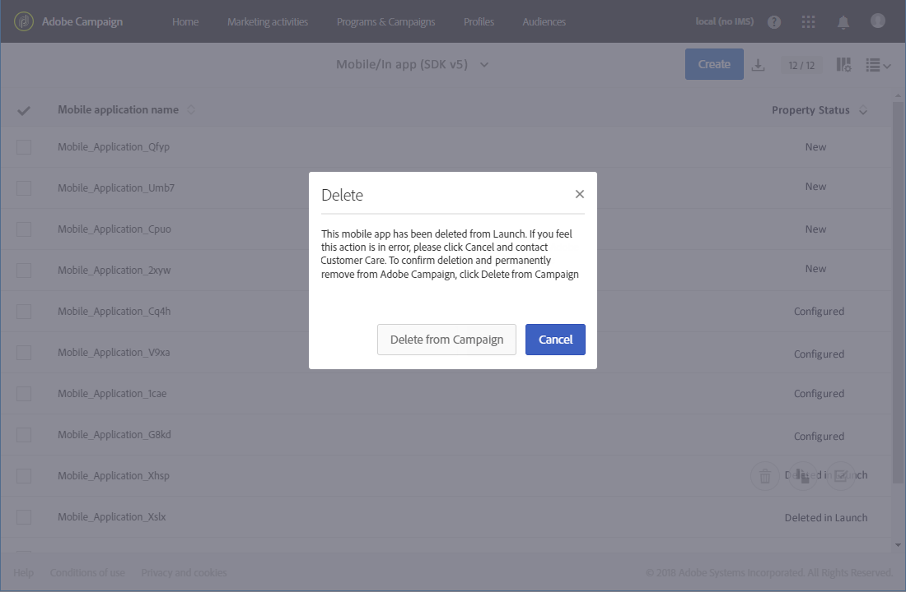

# 모바일 애플리케이션 구성{#configuring-a-mobile-application}

## Adobe Experience Platform SDK를 사용한 모바일 애플리케이션 구성 {#using-adobe-experience-platform-sdk}

>[!IMPORTANT]
>
>푸시 알림 및 인앱 구현은 전문가 사용자가 수행해야 합니다. 도움이 필요한 경우 Adobe 계정 담당자 또는 Professional 서비스 파트너에게 문의하십시오.

Experience Platform SDK 응용 프로그램과 함께 푸시 알림 및 인앱 메시지를 전송하려면 Adobe Experience Platform Experience Platform Experience Platform Launch에 모바일 응용 프로그램을 설정하고 Adobe Campaign에 구성해야 합니다.

더 이상 사용되지 않는 기능 Mobile 버전 4 SDK에 대한 자세한 내용은 이 [페이지를 참조하십시오](https://helpx.adobe.com/campaign/kb/configuring-app-sdkv4-deprecated.html).

모바일 응용 프로그램이 설정되면 수집된 PII 데이터를 검색하여 데이터베이스에서 프로파일을 만들거나 업데이트할 수 있습니다. 자세한 내용은 다음 섹션을 참조하십시오. [모바일 애플리케이션 데이터를 기반으로 프로파일 정보를 생성하고 업데이트합니다](../../channels/using/updating-profile-with-mobile-app-data.md).

Adobe Experience Platform SDK를 사용하여 Adobe Campaign Standard에서 지원되는 다양한 모바일 사용 사례에 대한 자세한 내용은 이 [페이지를 참조하십시오](https://helpx.adobe.com/campaign/kb/configure-launch-rules-acs-use-cases.html).

구성을 완료하려면 다음 단계를 완료하십시오.

1. Adobe Campaign에서 다음 항목에 액세스할 수 있는지 확인합니다.
   * **[!UICONTROL Push notification]**
   * **[!UICONTROL In-App message]**
   * **[!UICONTROL Adobe Places]**

   그렇지 않은 경우 계정 팀에 문의하십시오.

1. Adobe Campaign Standard 및 Experience Platform Launch에서 필요한 권한이 있는지 확인합니다.
   * Adobe Campaign Standard에서 IMS 사용자가 표준 사용자 및 관리자 제품 프로필에 포함되어 있는지 확인합니다. 이 단계에서는 사용자가 Adobe Campaign Standard에 로그인하고 Experience Platform SDK 모바일 앱 페이지로 이동한 다음 Experience Platform Launch에서 만든 모바일 앱 속성을 볼 수 있습니다.

   * Experience Platform Launch에서 IMS 사용자가 Experience Platform Launch 제품 프로필에 포함되어 있는지 확인합니다.
이 단계에서는 사용자가 Experience Platform Launch에 로그인하여 속성을 만들고 볼 수 있습니다. Experience Platform Launch의 제품 프로필에 대한 자세한 내용은 제품 프로필 만들기를 참조하십시오. 제품 프로필에는 회사 또는 속성에 설정된 권한이 없어야 하지만 사용자는 계속 로그인할 수 있어야 합니다.

   확장 설치, 앱 게시, 환경 구성 등과 같은 추가 작업을 완료하려면 제품 프로필에서 권한을 설정해야 합니다.

1. Experience Platform Launch에서 A를 만듭니다 **[!UICONTROL Mobile property]**. 자세한 내용은 [모바일 속성 설정을 참조하십시오](https://aep-sdks.gitbook.io/docs/getting-started/create-a-mobile-property).

1. Experience Platform Launch에서 **[!UICONTROL Extensions]** 탭을 클릭하고 이동 **[!UICONTROL Catalog]**&#x200B;후 확장자를 **[!UICONTROL Adobe Campaign Standard]** 검색합니다. 자세한 내용은 [Adobe Campaign Standard을 참조하십시오](https://aep-sdks.gitbook.io/docs/using-mobile-extensions/adobe-campaign-standard).

1. Campaign Standard에서 위치 사용 사례를 지원하려면 익스텐션과 **[!UICONTROL Places]** 익스텐션을 **[!UICONTROL Places Monitor]** 설치합니다.
   * Experience Platform Launch에 **[!UICONTROL Places]** 익스텐션을 설치합니다. 이 [페이지를 참조하십시오](https://docs.adobe.com/content/help/en/places/using/places-ext-aep-sdks/places-extension/places-extension.html).
   * Experience Platform Launch에 **[!UICONTROL Places Monitor]** 익스텐션을 설치합니다. 이 [페이지 참조](https://docs.adobe.com/content/help/en/places/using/places-ext-aep-sdks/places-monitor-extension/using-places-monitor-extension.html)

1. Adobe Campaign Standard에서 Experience Platform Launch에서 만든 모바일 속성을 구성합니다. Adobe Campaign [에서 Adobe Experience Platform 실행 응용 프로그램 설정을 참조하십시오](../../administration/using/configuring-a-mobile-application.md#set-up-campaign).

1. 모바일 애플리케이션 설정에 채널별 구성을 추가합니다.
자세한 내용은 Adobe Campaign의 [채널별 애플리케이션 구성을 참조하십시오](../../administration/using/configuring-a-mobile-application.md#channel-specific-config).

1. 필요한 경우 Experience Platform Launch 속성을 삭제할 수 있습니다.
자세한 내용은 Experience Platform Launch 응용 프로그램 [삭제를 참조하십시오](../../administration/using/configuring-a-mobile-application.md#delete-app).

## Launch 기술 워크플로우에서 모바일 앱 AEPSDK 동기화 {#aepsdk-workflow}

>[!IMPORTANT]
>
>이 기능은 릴리스 20.3을 기준으로 Adobe Campaign의 베타 기능입니다. Adobe Campaign 인스턴스에서 **[!UICONTROL sync Mobile app AEPSDK from Launch]** 기술 워크플로우를 활성화하려면 Adobe 고객 지원 센터(직접 또는 Adobe 담당자를 통해)에 티켓을 제출해야 합니다.

Experience Platform Launch에서 모바일 속성을 만들고 구성한 후 **[!UICONTROL Sync Mobile app AEPSDK from Launch]** 기술 워크플로우는 Adobe Campaign Standard에 가져온 Adobe Launch 모바일 속성을 동기화합니다.

기본적으로 기술 워크플로우는 15분마다 시작됩니다. 필요한 경우 수동으로 다시 시작할 수 있습니다.

1. Adobe Campaign Standard의 고급 메뉴에서 **[!UICONTROL Administration]** > **[!UICONTROL Application Settings]** > **[!UICONTROL Workflows]**&#x200B;을 선택합니다.
1. 워크플로우를 **[!UICONTROL Sync Mobile app AEPSDK from Launch (syncWithLaunch)]** 엽니다.

   

1. 활동을 **[!UICONTROL Scheduler]** 클릭합니다.

1. 선택합니다 **[!UICONTROL Immediate execution]**.

   

이제 워크플로우가 다시 시작되고 Adobe Campaign Standard에 가져온 Adobe Launch 모바일 속성을 동기화합니다.

## Adobe Campaign에서 Adobe Experience Platform 실행 응용 프로그램 설정 {#set-up-campaign}

Campaign에서 Experience Platform Launch 모바일 속성을 사용하려면 Adobe Campaign에서 이 속성을 구성해야 합니다. Adobe Campaign에서 IMS 사용자가 표준 사용자 및 관리자 제품 프로필에 포함되어 있는지 확인합니다.

Launch의 모바일 앱 AEPSDK 동기화 기술 워크플로우 기능 플래그가 활성화된 사용자의 경우 기술 워크플로우가 실행되어 Launch 모바일 속성을 Adobe Campaign에 동기화해야 합니다. 그런 다음 Adobe Campaign에서 구성할 수 있습니다.

Launch 기술 워크플로우 기능 플래그의 모바일 앱 AEPSDK 동기화에 대한 자세한 내용은 이 [섹션을 참조하십시오](../../administration/using/configuring-a-mobile-application.md#aepsdk-workflow).

>[!NOTE]
>
>기본적으로 조직 구성 단위가 ALL로 설정된 관리자는 모바일 애플리케이션을 편집할 수 있습니다.

1. 고급 메뉴에서 **[!UICONTROL Administration]** > **[!UICONTROL Channels]** > **[!UICONTROL Mobile app (AEP SDK)]**&#x200B;를 선택합니다.

   

1. Experience Platform Launch에서 만든 모바일 응용 프로그램을 선택합니다.
그래야 **[!UICONTROL Property Status]** 합니다 **[!UICONTROL Ready to configure]**.

   >[!NOTE]
   >
   >기본적으로 Campaign Standard은 Adobe Launch에서 만든 모바일 응용 프로그램 목록을 검색하기 위해 NmsServer_URL 옵션에 정의된 값을 사용하여 일치하는 속성을 찾습니다.
경우에 따라 모바일 응용 프로그램에 대한 캠페인 종점이 NmsServer_URL에 정의된 종단점과 다를 수 있습니다. 이 경우 Launch_URL_Campaign 옵션에서 끝점을 정의합니다. Campaign은 이 옵션의 값을 사용하여 Adobe Launch에서 일치하는 속성을 찾습니다.

   

1. 이 모바일 응용 프로그램에 대한 액세스를 특정 조직 단위로 제한하려면 **[!UICONTROL Access Authorization]** 섹션 아래에 있는 모바일 응용 프로그램의 조직 단위를 변경할 수 있습니다. 자세한 내용은 이 페이지를 참조하십시오.

   여기에서 관리자는 드롭다운에서 하위 조직 단위를 선택하여 할당할 수 있습니다.

   

1. 캠페인과 Experience Platform Launch 간에 연결하려면 을 클릭합니다 **[!UICONTROL Save]**.

1. 모바일 앱의 상태가 에서 (으)로 변경되었는지 **[!UICONTROL Ready to Configure]** 확인합니다 **[!UICONTROL Configured]**.

   Experience Platform Launch 캠페인 확장 기능이 성공적으로 설정된 것으로 표시되면 Campaign에서 속성이 성공적으로 설정되었는지 확인할 수도 있습니다.

   

1. 이 구성을 적용하려면 변경 사항을 Experience Platform Launch에 게시해야 합니다.

   자세한 내용은 구성 [게시를 참조하십시오](https://aep-sdks.gitbook.io/docs/getting-started/create-a-mobile-property#publish-configuration).

## Adobe Campaign의 채널별 애플리케이션 구성 {#channel-specific-config}

이제 모바일 응용 프로그램이 푸시 알림 또는 인앱 전달을 위해 Campaign에서 사용할 준비가 되었습니다. 이제 인앱 메시지를 트리거하거나 푸시 인증서를 업로드하는 이벤트를 만들기 위해 필요한 경우 추가로 구성할 수 있습니다.

1. 고급 메뉴에서 **[!UICONTROL Administration]** > **[!UICONTROL Channels]** > **[!UICONTROL Mobile app (AEP SDK)]**&#x200B;를 선택합니다.

1. Experience Platform Launch에서 만들고 구성한 모바일 응용 프로그램을 선택합니다.

1. 이 **[!UICONTROL Mobile application properties]** 탭에서 인앱 메시지에 대해 모바일 애플리케이션에서 사용할 수 있는 이벤트를 추가할 수 있습니다.

1. 이벤트를 구성하려면 을 클릭합니다 **[!UICONTROL Create Element]**.

   

1. 이름과 설명을 입력합니다.

   

1. **[!UICONTROL Add]**&#x200B;을 클릭합니다.

   이제 인앱 메시지를 만들 때 트리거 탭에서 이벤트를 사용할 수 있습니다. 자세한 내용은 인앱 메시지 [준비 및 전송을 참조하십시오](../../channels/using/preparing-and-sending-an-in-app-message.md).

1. 모바일 애플리케이션 대시보드의 **[!UICONTROL Device-specific settings]** 섹션에서 각 장치에 대해 iOS용 인증서 및 Android용 서버 키를 비롯한 애플리케이션 세부 정보를 제공합니다.

   인증서가 업로드되면 업로드에 성공했다는 메시지가 표시되고 인증서 만료일이 표시됩니다.

   >[!NOTE]
   >
   >Adobe Campaign Standard에서 인증서를 추가한 후에는 하나의 APNS 플랫폼(프로덕션 또는 샌드박스)만 MCPNS 앱에 추가할 수 있으므로 설정을 다시 변경할 수 없게 됩니다.

   

1. 구독자 목록 및 이러한 구독자에 대한 기타 정보(예: 사용자가 알림 수신 허용 여부)를 보려면 이 **[!UICONTROL Mobile application subscribers]** 탭을 클릭하십시오.

## Adobe Experience Platform 실행 응용 프로그램 삭제 {#delete-app}

Experience Platform Launch 응용 프로그램을 삭제할 수 없습니다.

>[!CAUTION]
>
>Experience Platform Launch 응용 프로그램을 삭제할 수 없습니다.

Experience Platform Launch 응용 프로그램을 삭제하려면 모바일 속성 [삭제의 단계를 완료하십시오](https://aep-sdks.gitbook.io/docs/using-mobile-extensions/adobe-campaign-standard#deleting-mobile-properties-in-experience-platform-launch).

애플리케이션이 삭제된 후 Adobe Campaign에서 애플리케이션의 속성 상태가 론치에서 삭제됨으로 올바르게 업데이트되었는지 확인합니다.

Adobe Campaign에서 애플리케이션을 클릭하면 캠페인에서 삭제를 클릭하여 Adobe Campaign에서 이 애플리케이션을 완전히 제거하도록 선택할 수 있습니다.

