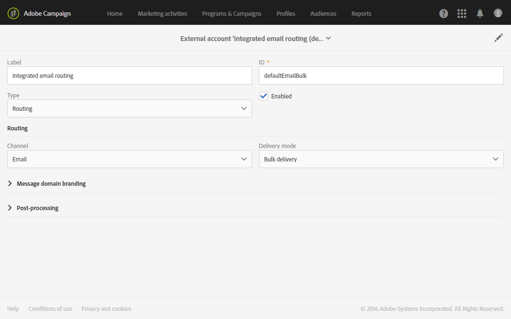
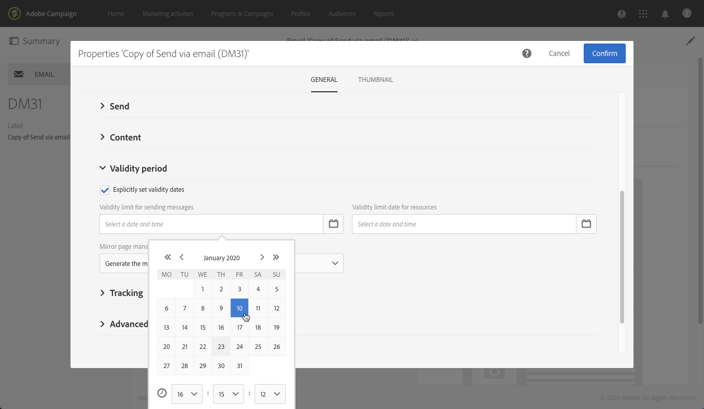

# 이메일 채널 구성{#configuring-email-channel}

## 이메일 채널 매개 변수 {#email-channel-parameters}

이메일 구성 화면에서는 이메일 채널에 대한 매개 변수를 정의할 수 있습니다.

* **보낸 이메일의 헤더 매개 변수**

   이 섹션에서는 발신자 주소와 오류 주소를 **[!UICONTROL masks]** 지정할 수 있습니다. 필요한 경우 이러한 마스크는 쉼표로 구분할 수 있습니다. 이 구성은 선택 사항입니다. 이러한 필드를 입력하면 메시지 준비 단계 동안 Adobe Campaign은 입력한 주소가 유효한지 확인합니다. 이 운영 모드에서는 배달 문제를 유발할 수 있는 주소가 사용되지 않습니다. 배달 서버에 배달 주소를 구성해야 합니다.

* **전달 가능성**

   이 ID는 지원에 의해 제공됩니다. 전달 가능한 보고서가 제대로 작동하려면 필요합니다.

* **전달 매개 변수**

   Adobe Campaign은 시작 날짜에 시작되는 메시지를 전송합니다. 이 **[!UICONTROL Message delivery duration]** 필드를 사용하면 메시지를 보낼 기간을 지정할 수 있습니다.

   이 **[!UICONTROL Online resources validity duration]** 필드는 업로드된 리소스에 대해 주로 미러 페이지 및 이미지에 사용됩니다. 이 페이지의 리소스는 제한된 시간 동안 유효합니다(디스크 공간을 절약하려면).

* **재시도**

   일시적으로 배달되지 않은 메시지는 자동으로 다시 시도됩니다. 이 섹션은 전송을 시작한 다음 날 수행해야 하는 재시도 횟수(**재시도**&#x200B;횟수)와 재시도 사이의 최소 지연(**재시도 기간**)을 나타냅니다.

   기본적으로 5회 재시도 횟수는 최소 1시간의 간격과 함께 하루 24시간 동안 분산됩니다. 일별 1회 재시도는 그 후 **[!UICONTROL Delivery parameters]** 섹션에 정의된 배달 마감일까지 프로그래밍됩니다.

* **이메일 격리 매개 변수**

   실패 시 오류 카운터를 증가시키기 전에 응용 프로그램이 대기하는 시간을 정의하는 값을 **[!UICONTROL Time between two significant errors]** 필드에 입력합니다. 기본값:1일 동안 **&quot;1d&quot;**.

   값이 **[!UICONTROL Maximum number of errors before quarantine]** 도달하면 이메일 주소가 격리됩니다. 기본값: **&quot;5&quot;**:6번째 오류 시 주소가 격리됩니다. 즉, 연락처는 후속 배달에서 자동으로 제외됩니다.

**관련 항목**:

[스팸 차단 관리 이해](../../sending/using/understanding-quarantine-management.md)

## 이메일 라우팅 계정 {#email-routing-accounts}

외부 계정은 기본적으로 **[!UICONTROL Integrated email routing]** 제공됩니다. 여기에는 응용 프로그램에서 이메일을 보낼 수 있는 기술 매개 변수가 포함되어 있습니다.

계정 유형은 항상 로 **[!UICONTROL Routing]**&#x200B;설정되어야 하며, 채널 **[!UICONTROL Email]** 및 배달 모드는 로 **[!UICONTROL Bulk delivery]**&#x200B;설정되어야 합니다.

**관련 항목**:

[외부 계정](../../administration/using/external-accounts.md)

## 이메일 처리 규칙 {#email-processing-rules}

관리자는 **[!UICONTROL Email processing rules]** 메뉴를 통해 **[!UICONTROL Administration > Channels > Email]** 액세스할 수 있습니다.

이러한 규칙에는 원격 서버에서 반환할 수 있는 문자 문자열 목록이 포함되어 있어 오류를 평가할 수 있습니다(**하드**, 소프트 **또는 무시됨******).

기본 규칙은 다음과 같습니다.

### 바운스 메일 {#bounce-mails}

동기 배달 실패 오류 메시지의 경우, 향상된 MTA는 바운스 유형 및 자격을 결정하고 해당 정보를 Campaign으로 다시 전송합니다. Adobe Campaign 향상된 MTA에 대한 자세한 내용은 이 [문서를](https://helpx.adobe.com/campaign/kb/campaign-enhanced-mta.html)참조하십시오.

비동기 바운스는 여전히 **[!UICONTROL Bounce mails]** 규칙을 통해 Campaign inMail 프로세스에서 자격을 갖습니다.

>[!IMPORTANT]
>
>향상된 MTA로 업그레이드하면 캠페인 테이블의 바운스 자격 **[!UICONTROL Message qualification]** 조건은 더 이상 사용되지 않습니다. 바운스 메일 자격에 대한 자세한 내용은 이 [섹션을](../../sending/using/understanding-delivery-failures.md)참조하십시오.

<!--The user can create his own rules.

>[!IMPORTANT]
>
>When importing a package and when updating data via the **Update for deliverability** workflow, the user-created rules are overwritten.-->

### 이메일 도메인 관리 {#managing-email-domains}

<!--The Adobe Campaign messaging server applies rules specific to the domains, and then the rules for the general case represented by an asterisk in the list of rules.

The **SMTP parameters** act as filters applied for a blocking rule.

* You can choose whether or not to activate certain identification standards and encryption keys to check the domain name, such as **Sender ID**, **DomainKeys**, **DKIM**, and **S/MIME**.
* **SMTP relay**: lets you configure the IP address and the port of a relay server for a particular domain.-->

>[!IMPORTANT]
>
>향상된 MTA로 업그레이드하면 Adobe Campaign **[!UICONTROL Domain management]** 규칙이 더 이상 사용되지 않습니다.

**DKIM(DomainKeys Identified Mail)** 이메일 인증 서명은 모든 도메인의 모든 메시지에 대해 향상된 MTA를 통해 수행됩니다. 향상된 MTA 수준에서 **별도로**&#x200B;지정하지 않는 한 **발신자 ID**, **도메인** 키또는 S/MIME으로서명하지 않습니다.

Adobe Campaign 향상된 MTA에 대한 자세한 내용은 이 [문서를](https://helpx.adobe.com/campaign/kb/campaign-enhanced-mta.html)참조하십시오.

### MX 관리 {#mx-management}

<!--The MX management rules are used to regulate the flow of outgoing emails for a specific domain. They sample the bounce messages and block sending where appropriate.

The Adobe Campaign messaging server applies rules specific to the domains, and then the rules for the general case represented by an asterisk in the list of rules.

To configure MX management rules, simply set a threshold and select certain SMTP parameters. A **threshold** is a limit calculated as an error percentage beyond which all messages towards a specific domain are blocked.-->

>[!IMPORTANT]
>
>Enhanced MTA로 업그레이드하면 Adobe Campaign **[!UICONTROL MX management]** 전달 처리량 규칙이 더 이상 사용되지 않습니다.

Enhanced MTA는 고유한 MX 규칙을 사용하여 사용자의 이전 이메일 명성에 따라 도메인별로 처리량을 사용자 정의하고 이메일을 전송하는 도메인에서 오는 실시간 피드백을 제공합니다.

Adobe Campaign 향상된 MTA에 대한 자세한 내용은 이 [문서를](https://helpx.adobe.com/campaign/kb/campaign-enhanced-mta.html)참조하십시오.

<!--Each rule defines an address mask for the MX. Any MX whose name matches this mask is therefore eligible. The mask can contain "&#42;" and "?" generic characters.

For example, the following addresses:

* a.mx.yahoo.com 
* b.mx.yahoo.com 
* c.mx.yahoo.com

are compatible with the following masks:

* &#42;.yahoo.com
* ?.mx.yahoo.com

These rules are applied in sequence: the first rule whose MX mask is compatible with the targeted MX is applied.

The following parameters are available for each rule:

* **[!UICONTROL Range of IDs]**: this option lets you indicate the ranges of identifiers (publicId) for which the rule applies. You can specify:

    * A number: the rule will only apply to this publicId.
    * A range of numbers (number1-number2): the rule will apply to all publicIds between these two numbers.

  If the field is empty, the rule applies to all IDs.

* **[!UICONTROL Shared]**: this option indicates that the highest number of messages per hour and of connections applies to all MXs linked to this rule. 
* **[!UICONTROL Maximum number of connections]**: maximum number of simultaneous connections to an MX from a given address. 
* **Maximum number of messages**: maximum number of messages that can be sent by one connection. After this amount, the connection is closed and a new one is reopened. 
* **[!UICONTROL Messages per hour]**: maximum number of messages that can be sent in one hour for an MX via a given address.

>[!IMPORTANT]
>
>* The delivery server (MTA) must be restarted if the parameters have been changed. 
>* The modification or creation of management rules is for expert users only. -->

## 이메일 속성 목록 {#list-of-email-properties}

이 섹션에서는 이메일 또는 이메일 템플릿의 속성 화면에서 사용할 수 있는 매개 변수 목록을 자세히 설명합니다.

>[!NOTE]
>
>일부 매개 변수는 템플릿에서만 사용할 수 있습니다. 액세스할 수 있는 매개 변수는 사용 권한에 [따라 다릅니다](../../administration/using/users-management.md).

이메일 또는 이메일 템플릿의 속성을 편집하려면 **[!UICONTROL Edit properties]** 단추를 사용합니다.

### 일반 매개 변수 {#general-parameters}

이메일 매개 변수 화면의 맨 위에서 **[!UICONTROL Label]** 및 **[!UICONTROL ID]** 필드를 사용하여 이메일을 식별합니다. 이 정보는 인터페이스에 표시되지만 메시지 수신자는 볼 수 없습니다.

>[!IMPORTANT]
>
>ID는 고유해야 합니다.

이 **[!UICONTROL Brand]** 필드를 사용하면 게재에 연결된 브랜드를 선택할 수 있습니다. 브랜드 사용 및 구성에 대한 자세한 내용은 브랜딩 [섹션을 참조하십시오](../../administration/using/branding.md) .

이 **[!UICONTROL Campaign]** 필드를 사용하면 이메일에 연결된 캠페인을 입력할 수 있습니다.

해당 필드에 **[!UICONTROL Description]** 아이콘을 추가하고 목록의 이메일 축소판에 표시된 이미지를 편집할 수도 있습니다.

### 매개 변수 보내기 {#sending-parameters}

이 **[!UICONTROL Send]** 섹션은 이메일 템플릿에만 사용할 수 있습니다. 여기에는 다음 매개 변수가 포함되어 있습니다.

#### 재시도 매개 변수 {#retries-parameters}

일시적으로 배달되지 않은 메시지는 자동으로 다시 시도됩니다. 이 섹션은 전송을 시작한 다음 날 수행해야 하는 재시도 횟수와 재시도 사이의 최소 지연( **[!UICONTROL Max. number of retries]** **[!UICONTROL Retry period]** )을 나타냅니다.

기본적으로 5회 재시도 횟수는 최소 1시간의 간격과 함께 하루 24시간 동안 분산됩니다. 1일 1회 재시도는 그 후 및 배달 마감일까지 프로그래밍되며, 이것은 유효성 기간 매개 변수  섹션에 정의됩니다.

전체(Adobe 기술 관리자에게 문의) 또는 각 배달 또는 배달 템플릿의 재시도 횟수를 변경할 수 있습니다.

#### 이메일 형식 매개 변수 {#email-format-parameters}

보낼 이메일의 형식을 구성할 수 있습니다. 다음 세 가지 옵션을 사용할 수 있습니다.

* **수신자 환경 설정** 사용(기본 모드):메시지 형식은 수신자 프로필에 저장된 데이터에 따라 정의되며 기본적으로 이메일 형식 **** 필드(@emailFormat)에 저장됩니다. 수신자가 특정 형식으로 메시지를 수신하려는 경우 이 형식이 전송됩니다. 필드가 완료되지 않으면 다중 부분 대체 메시지가 전송됩니다(아래 참조).
* **받는 사람 메일 클라이언트가 가장 적합한 형식(다중 부분 대체)**&#x200B;선택:메시지에는 두 가지 형식이 포함되어 있습니다.텍스트 및 HTML을 참조하십시오. 수신에 따라 표시되는 형식은 받는 사람의 메일 소프트웨어(다중 부분 대체)의 구성에 따라 달라집니다.

   >[!IMPORTANT]
   >
   >이 옵션에는 메시지의 두 버전이 모두 포함됩니다. 따라서 메시지 크기가 더 크기 때문에 배달 처리량에 영향을 줍니다.

* **모든 메시지를 텍스트 형식으로**&#x200B;보내기:메시지는 텍스트 형식으로 전송됩니다. HTML 형식은 전송되지 않지만 수신자가 메시지의 링크를 클릭할 때만 미러 페이지에 사용됩니다.

#### SMTP 테스트 모드 {#smtp-test-mode}

이 **[!UICONTROL Enable SMTP test mode]** 옵션을 사용하면 메시지를 실제로 보내지 않고 SMTP 연결을 통해 이메일 전송을 테스트할 수 있습니다.
메시지는 SMTP 서버와의 연결이 완료될 때까지 처리되지만 전송되지 않습니다.

이 옵션은 이메일 및 이메일 템플릿에 사용할 수 있습니다.

이메일 템플릿에 대해 SMTP 테스트 모드 옵션을 활성화하면 이 템플릿에서 만든 모든 이메일 메시지에 이 옵션이 활성화됩니다.

>[!IMPORTANT]
>
>이메일에 대해 이 옵션을 활성화하면 메시지가 선택되지 않는 한 전송되지 않습니다.
>이메일 또는 이메일 템플릿 대시보드에 경고가 표시됩니다.

SMTP 구성에 대한 자세한 내용은 이메일 SMTP 매개 [변수](#list-of-email-smtp-parameters) 목록 섹션을 참조하십시오.

### 유효 기간 매개변수 {#validity-period-parameters}

이 **[!UICONTROL Validity period]** 섹션에는 다음 매개 변수가 포함되어 있습니다.

* **[!UICONTROL Explicitly set validity dates]**:이 상자를 선택하지 않으면 **[!UICONTROL Delivery duration]** 및 **[!UICONTROL Resource validity limit]** 필드에 기간을 입력해야 합니다. 특정 시간과 날짜를 정의하려면 이 상자를 선택합니다.

   

* **[!UICONTROL Delivery duration]**:Adobe Campaign은 시작 날짜에 시작되는 메시지를 전송합니다. 이 필드를 사용하면 메시지를 보낼 수 있는 기간을 지정할 수 있습니다.

   >[!IMPORTANT]
   >
   >향상된 MTA로 업그레이드하면 캠페인 게재의 **[!UICONTROL Delivery duration]** 매개 변수가 3.5일 이내로 설정된 경우에만 사용됩니다. 3.5일 이상의 값을 정의하면 고려되지 않습니다. 모든 영향은 Adobe Campaign 향상된 [MTA 문서에 자세히](https://helpx.adobe.com/campaign/kb/campaign-enhanced-mta.html) 설명되어 있습니다.

* **[!UICONTROL Resource validity duration]**:이 필드는 주로 미러 페이지 및 이미지에 대해 업로드된 리소스에 사용됩니다. 이 페이지의 리소스는 제한된 시간 동안 유효합니다(디스크 공간을 절약하려면).
* **[!UICONTROL Mirror page management]**:미러 페이지는 웹 브라우저를 통해 온라인으로 액세스할 수 있는 HTML 페이지입니다. 컨텐츠는 이메일 컨텐츠와 동일합니다. 기본적으로 링크가 메일 컨텐츠에 삽입된 경우 미러 페이지가 생성됩니다. 이 필드를 사용하면 이 페이지가 생성되는 방식을 수정할 수 있습니다.

   >[!IMPORTANT]
   >
   >미러 페이지를 만들려면 이메일에 HTML 컨텐츠를 정의해야 합니다.

   * **[!UICONTROL Generate the mirror page if a mirror link appears in the email content]** (기본 모드):링크가 메일 컨텐츠에 삽입되면 미러 페이지가 생성됩니다.
   * **미러 페이지를**&#x200B;강제로 생성합니다.미러 페이지에 대한 링크가 메시지에 삽입되지 않아도 미러 페이지가 생성됩니다.
   * **미러 페이지를**&#x200B;생성하지 마십시오.링크가 메시지에 포함되어 있더라도 미러 페이지가 생성되지 않습니다.
   * **메시지 ID만 사용하여 액세스 가능한 미러 페이지를 생성합니다**.이 옵션을 사용하면 개인화 정보가 있는 미러 페이지의 컨텐츠를 배달 로그 창에서 액세스할 수 있습니다.

>[!NOTE]
>
>이 **[!UICONTROL Delivery duration]** 매개 변수는 트랜잭션 메시지에 적용되지 않습니다. 트랜잭션 메시지에 대한 자세한 내용은 [이 섹션을](../../channels/using/about-transactional-messaging.md)참조하십시오.

### 추적 매개 변수 {#tracking-parameters}

이 **[!UICONTROL Tracking]** 섹션에는 다음 매개 변수가 포함되어 있습니다.

* **[!UICONTROL Activate tracking]**:메시지 URL 추적을 활성화/비활성화할 수 있습니다. 각 메시지 URL에 대한 추적을 관리하려면 이메일 디자이너 작업 표시줄의 **[!UICONTROL Links]** 아이콘을 사용합니다. 추적된 [URL 정보를 참조하십시오](../../designing/using/links.md#about-tracked-urls).
* **[!UICONTROL Tracking validity limit]**:url에서 추적이 활성화될 기간을 정의할 수 있습니다.
* **[!UICONTROL Substitution URL for expired URLs]**:추적이 만료되면 표시될 웹 페이지의 URL을 입력할 수 있습니다.

### 고급 매개 변수 {#advanced-parameters}

이 **[!UICONTROL Advanced parameters]** 섹션에는 여러 매개 변수가 포함되어 있습니다.

첫 번째 필드를 사용하면 이메일 메시지 헤더를 작성하는 데 필요한 정보를 입력할 수 있습니다. 여기에서 회신 주소 및 텍스트와 발신자 주소(&quot;보낸 사람:&quot; 필드 채우기)를 관리할 수 있습니다. 이러한 정보는 개인화할 수 있습니다.

변경할 필드의 오른쪽에 있는 단추를 클릭한 다음 개인화 필드, 콘텐츠 블록 또는 동적 텍스트를 추가합니다.

개인화 컨텐츠 삽입 및 사용은 이메일 컨텐츠 [개인화](../../designing/using/personalization.md) 문서에 자세히 설명되어 있습니다.

#### 타겟 컨텍스트 {#target-context}

타깃팅 컨텍스트를 사용하면 이메일 타깃팅(대상 정의 화면에서) 및 개인화에 사용할 테이블 세트를 정의할 수 있습니다(HTML 컨텐츠 편집기에서 개인화 필드 정의).

#### 라우팅 {#routing}

이 필드는 사용되는 라우팅 모드를 나타냅니다. 외부 계정을 참조합니다. 예를 들어, 특정 브랜딩 구성이 들어 있는 외부 계정을 사용하려는 경우 사용할 수 있습니다.

>[!NOTE]
>
>[관리] > [응용 프로그램 설정 **]** > [외부 계정 **]** 메뉴를 통해 외부 계정에 **액세스할** 수 있습니다.

#### 준비 {#preparation}

메시지 준비는 메시지 [승인](../../sending/using/preparing-the-send.md) 섹션에 자세히 설명되어 있습니다.

* **[!UICONTROL Typology]**:보내기 전에, 컨텐츠와 구성을 확인하려면 메시지를 준비해야 합니다. 준비 단계 동안 적용된 확인 규칙은 **유형에서 정의됩니다**. 예를 들어 이메일의 경우 준비 과정에는 제목, URL 및 이미지 등이 포함됩니다. 이 필드에 적용할 유형을 선택합니다.

   >[!NOTE]
   >
   >> **[!UICONTROL Administration]** > **[!UICONTROL Channels]** > **[!UICONTROL Typologies]** 메뉴를 통해 액세스할 수 있는 유형 분류는 유형 지정 [섹션에](../../administration/using/about-typology-rules.md) 표시됩니다.

* **[!UICONTROL Compute the label during delivery preparation]**:개인화 필드, 컨텐츠 블록 및 동적 텍스트를 사용하여 메시지 준비 단계 동안 이메일의 레이블 값을 계산할 수 있습니다.

   또한 워크플로우의 외부 신호 활동으로 선언된 이벤트 변수로 배달 레이블을 개인화할 수 있습니다. For more on this, refer to [this section](../../automating/using/calling-a-workflow-with-external-parameters.md).

* **[!UICONTROL Save SQL queries in the log]**:이 옵션을 사용하면 준비 단계 동안 저널에 SQL 쿼리 로그를 추가할 수 있습니다.

#### 증명 설정 {#proof-settings}

이 섹션에서는 입술 교정기의 제목 줄에 사용할 기본 접두사를 구성할 수 있습니다. For more in this, refer to [this section](../../sending/using/sending-proofs.md).

### 이메일 SMTP 매개 변수 목록 {#list-of-email-smtp-parameters}

이 **[!UICONTROL SMTP]** 섹션에는 다음 매개 변수가 포함되어 있습니다.

* **[!UICONTROL Character encoding]**:메시지 인코딩을 적용하려면 **[!UICONTROL Force encoding]** 상자를 선택한 다음 사용할 인코딩을 선택합니다.
* **[!UICONTROL Bounce mails]**:기본적으로 바운스 메일은 플랫폼의 오류 받은 편지함에서 수신됩니다( **[!UICONTROL Administration]** > **[!UICONTROL Channels]** > **[!UICONTROL Email]** > **[!UICONTROL Configuration]** 화면에 정의됨). 이메일의 특정 오류 주소를 정의하려면 **[!UICONTROL Error address]** 필드에 주소를 입력합니다.
* **[!UICONTROL Additional SMTP headers]**:이 옵션을 사용하면 메시지에 추가 SMTP 헤더를 추가할 수 있습니다. 필드에 입력한 스크립트는 **[!UICONTROL Headers]** name:value ****&#x200B;형식으로 행당 하나의 헤더를 참조해야 합니다. 필요한 경우 값이 자동으로 인코딩됩니다.

   >[!IMPORTANT]
   >
   >추가 SMTP 헤더 삽입을 위한 스크립트 추가는 고급 사용자를 위해 예약되어 있습니다. 이 스크립트의 구문은 다음 컨텐츠 유형의 요구 사항을 준수해야 합니다.사용하지 않은 공간, 빈 줄 등이 없습니다.

### 액세스 권한 부여 매개 변수 목록 {#list-of-access-authorization-parameters}

이 **[!UICONTROL Access authorization]** 섹션에는 다음 매개 변수가 포함되어 있습니다.

* 이 **[!UICONTROL Organizational unit]** 필드를 사용하면 특정 사용자에 대한 이 이메일에 대한 액세스를 제한할 수 있습니다. 지정한 장치 또는 상위 장치에 연결된 사용자는 이 이메일에 대한 읽기 및 쓰기 액세스 권한을 가집니다. 하위 장치에 연결된 사용자는 이 이메일에 대한 읽기 권한만 갖습니다.

   >[!NOTE]
   >
   >[관리] > [사용자 및 보안] **메뉴를 통해** 조직 단위를 구성할 **수** 있습니다.

* 이 **[!UICONTROL Created by]**&#x200B;필드, **[!UICONTROL Created]****[!UICONTROL Modified by]** 및 **[!UICONTROL Last modified]** 필드는 자동으로 완료됩니다.
