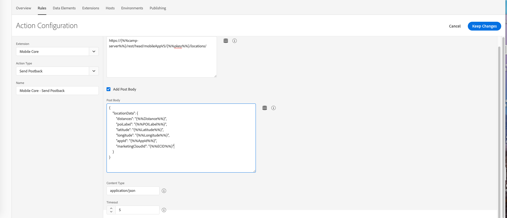

# Adobe Campaign Standard 사용 사례를 지원하기 위한 론치 규칙 구성 {#configuring-rules-launch}

즉, 데이터 요소 [!DNL Adobe Experience Platform Launch]와 규칙을 만들어 모바일 애플리케이션에서 모바일 애플리케이션으로 PII 및 기타 데이터를 전송해야 합니다 [!DNL Adobe Campaign Standard].

모든 구성 변경 사항을 적용하려면 이러한 변경 사항을 [!DNL Adobe Experience Platform Launch] 게시해야 합니다. 자세한 내용은 [게시를 참조하십시오](https://aep-sdks.gitbook.io/docs/getting-started/create-a-mobile-property#publish-the-configuration).

에서 규칙을 만들려면 [!DNL Experience Platform Launch]다음 단계를 수행하십시오.

1. [데이터 요소 만들기](../../administration/using/configuring-rules-launch.md#create-data-elements)
2. [지원할 사용 사례에 대한 규칙](../../administration/using/configuring-rules-launch.md#create-data-elements) 만들기:
   * [PII 포스트백](../../administration/using/configuring-rules-launch.md#pii-postback)
   * [인앱 추적 포스트백](../../administration/using/configuring-rules-launch.md#inapp-tracking-postback)
   * [푸시 알림 포스트백 추적](../../administration/using/configuring-rules-launch.md#push-tracking-postback)
   * [위치 포스트백](../../administration/using/configuring-rules-launch.md#location-postback)

## 데이터 요소 만들기 {#create-data-elements}

여기에서 만드는 것이 권장되는 데이터 요소입니다 [!DNL Experience Platform Launch].
필요에 따라 추가 데이터 요소를 만들 수 있습니다.

* **[!UICONTROL Experience Cloud ID]**
* **[!UICONTROL Pkey]**
* **[!UICONTROL Campaign server]**

이러한 데이터 요소를 만들려면

1. 모바일 애플리케이션 대시보드 [!DNL Experience Platform Launch]에서 **[!UICONTROL Data Elements]** 탭을 클릭합니다.

1. 데이터 **[!UICONTROL Experience Cloud ID]** 요소를 만들려면 을 클릭합니다 **[!UICONTROL Create New Data Element]**.

1. 예를 들어 **[!UICONTROL Name]** 필드에 mcid를 **입력합니다**.

1. 드롭다운 **[!UICONTROL Extension]** 에서 선택합니다 **[!UICONTROL Mobile Core]**. 그런 **[!UICONTROL Experience Cloud ID]** 다음 **[!UICONTROL Data element]** 유형 드롭다운으로 이동합니다.

   

1. 키 데이터 요소를 만들려면 을 클릭합니다 **[!UICONTROL Add data element]**.

1. 예를 들어 **[!UICONTROL Name]** 필드에 키를 **입력합니다**.

1. 드롭다운 **[!UICONTROL Extension]** 에서 선택합니다 **[!UICONTROL Adobe Campaign Standard]**. 그런 **[!UICONTROL pkey]** 다음 **[!UICONTROL Data element]** 유형 드롭다운으로 이동합니다.

1. 캠페인 서버 데이터 요소를 만들려면 을 클릭합니다 **[!UICONTROL Add data element]**.

1. 필드에 이름(예: **[!UICONTROL Name]** camp-server ****)을 입력합니다.

1. 드롭다운 **[!UICONTROL Extension]** 에서 선택합니다 **[!UICONTROL Adobe Campaign Standard]**. 그런 다음 **[!UICONTROL Campaign Server]** 유형 **[!UICONTROL Data element]** 드롭다운에 입력합니다.

## 규칙 만들기 {#creating-rules}

다음을 위한 규칙을 만들어야 합니다.

* [PII 포스트백](../../administration/using/configuring-rules-launch.md#pii-postback)
* [인앱 추적 포스트백](../../administration/using/configuring-rules-launch.md#inapp-tracking-postback)
* [푸시 알림 포스트백 추적](../../administration/using/configuring-rules-launch.md#push-tracking-postback)
* [위치 포스트백](../../administration/using/configuring-rules-launch.md#location-postback)

### PII 포스트백 {#pii-postback}

>[!NOTE]
>
>모바일 앱에서 Adobe Campaign으로 PII 정보를 전송하려면 SDK API를 구현해야 합니다. 자세한 내용은 CollectPII로 [이동합니다](https://aep-sdks.gitbook.io/docs/using-mobile-extensions/mobile-core/mobile-core-api-reference#collect-pii).

다음 위치에 PII 데이터 [!DNL Adobe Campaign Standard]를 보내려면 규칙을 만듭니다. [!DNL Experience Platform Launch]

1. 모바일 애플리케이션 대시보드 [!DNL Experience Platform Launch]에서 탭 **[!UICONTROL Rules]** **[!UICONTROL Create New Rule]**&#x200B;을 클릭한 다음

1. 이름(예: **Mobile Core - Collect PII)을 입력합니다**.

1. In the **[!UICONTROL Events]** section, click **[!UICONTROL Add]**.

1. 드롭다운 **[!UICONTROL Extension]** 에서 선택합니다 **[!UICONTROL Mobile Core]**. 그럼 **[!UICONTROL Collect PII]** , **[!UICONTROL Event type]** 드롭다운에

1. **[!UICONTROL Keep changes]**&#x200B;을(를) 클릭합니다.

1. In the **[!UICONTROL Actions]** section, click **[!UICONTROL Add]**.

1. 드롭다운 **[!UICONTROL Extension]** 에서 선택합니다 **[!UICONTROL Mobile Core]**. 그럼 **[!UICONTROL Send PII]** , **[!UICONTROL Action type]** 드롭다운에

1. 에서 **[!UICONTROL URL]**&#x200B;다음 URL을 입력합니다.

   ```
   https://{%%camp-server%%}/rest/head/mobileAppV5/{%%pkey%%}/subscriptions/{%%mcid%%}
   ```

1. 확인란을 **[!UICONTROL Add Post Body]** 선택합니다.

1. 에 **[!UICONTROL Post Body]**&#x200B;다음을 입력합니다.

   ```
   {
   "marketingCloudId":
   "{%%mcid%%}",
   "cusEmail":
   "",
   "cusFirstName":
   "",
   "cusLastName":
   "" }
   ```

   marketingCloudId를 사용하면 앱 가입자를 데이터베이스의 수신자와 조정할 수 있으며, 그 결과 필요합니다. 비즈니스 요구에 따라 다른 키-값 쌍을 지정할 수 있습니다. 위의 예에서, 앱에서 이메일, 이름 및 성이 전달됩니다.

   키(예: cusEmail, cusFirstName 및 cusLastName)는 Adobe Campaign Standard 인스턴스의 사용자 지정 리소스에 정의된 필드 ID와 일치해야 합니다. 값 변수(예: 이메일, firstName 및 LastName)는 앱 코드에서 AMS collectPII API를 호출하는 동안 모바일 앱에서 전송된 JSON 데이터의 키와 일치해야 합니다.

   또한 PII 포스트백 수집에 라이프사이클 데이터를 전달하거나 이벤트 트리거에 따라 다른 포스트백을 전달할 수도 있습니다. 다음은 라이프사이클 데이터 JSON의 예입니다.

       &quot;
     {
     
 marketingCloudId&quot;:&quot;{%%mcid%}&quot;,     &quot;cusDayslastlaunch&quot;: &quot;{%%DaysSinceLastUse%}&quot;,
 &quot;cusDay     Firstlaunch&quot;: &quot;{%%DaysSinceFirstUse%}&quot;,
     &quot;cusLaunches&quot;: &quot;{%%Launches%}&quot;
     }
     &quot;
   
   %mcid%%, 같은%%mcid%% 등의 데이터 요소를 이중 비율로 묶어야 [!DNL Experience Platform Launch] 하며, 앱의 컨텍스트 변수는 단일 백분율로 묶어야 합니다(예: %contextdata.email%).

1. 에서 **[!UICONTROL Content Type]** application/json **을 입력합니다**.

1. In **[!UICONTROL Timeout]**, select 0.

   

이제 사용자 데이터가 Campaign으로 전송되도록 구성됩니다.

### 인앱 추적 포스트백 {#inapp-tracking-postback}

사용자가 모바일 응용 프로그램에서 인앱 메시지와 상호 작용하는 방법 [!DNL Adobe Campaign Standard] 을 보고하기 위해 추적 데이터를 전송하려면 다음 규칙을 만드십시오 [!DNL Experience Platform Launch].

1. 모바일 애플리케이션 대시보드 [!DNL Experience Platform Launch]에서 **[!UICONTROL Rules]** 탭을 선택하고 을 클릭합니다 **[!UICONTROL Add Rule]**.

1. 이름(예: **Adobe Campaign - 인앱 클릭 추적)을 입력합니다**.

1. In the **[!UICONTROL Events]** section, click **[!UICONTROL Add]**.

1. 드롭다운 **[!UICONTROL Extension]** 에서 선택합니다 **[!UICONTROL Adobe Campaign Standard]**. 그럼 **[!UICONTROL In-App click tracking]** , **[!UICONTROL Event type]** 드롭다운에

1. **[!UICONTROL Keep changes]**&#x200B;을(를) 클릭합니다.

1. In the **[!UICONTROL Actions]** section, click **[!UICONTROL Add]**.

1. 드롭다운 **[!UICONTROL Extension]** 에서 선택합니다 **[!UICONTROL Mobile Core]**. 그럼 **[!UICONTROL Send postback]** , **[!UICONTROL Event type]** 드롭다운에

1. 에서 **[!UICONTROL URL]**&#x200B;다음 URL을 입력합니다.

   ```
   https://{%%camp-server%%}/r/?id=&mcid={%%mcid%%}
   ```

1. 확인란을 **[!UICONTROL Add post body]** 선택합니다.

1. 을 **[!UICONTROL Post Body]**&#x200B;입력하고 **{}를**&#x200B;입력합니다.

1. 에서 **[!UICONTROL Content Type]** application/json **을 입력합니다**.

1. In **[!UICONTROL Timeout]**, select 0.

   

### 푸시 알림 포스트백 추적 {#push-tracking-postback}

추적 데이터를 전송하여 푸시 알림 전달 [!DNL Adobe Campaign Standard][!DNL Experience Platform Launch]과 모바일 애플리케이션과의 사용자 상호 작용을 추적하는 데 도움이 되도록 하려면

푸시 추적에 대한 자세한 내용은 푸시 [추적을 참조하십시오](../../administration/using/push-tracking.md).

앱 작업을 추적하려면 trackAction API를 사용하십시오. 자세한 내용은 앱 작업 [추적을 참조하십시오](https://app.gitbook.com/@aep-sdks/s/docs/using-mobile-extensions/mobile-core/mobile-core-api-reference#track-app-actions).

1. 모바일 애플리케이션 대시보드 [!DNL Experience Platform Launch]에서 **[!UICONTROL Rules]** 탭을 클릭하고 을 클릭합니다 **[!UICONTROL Add Rule]**.

1. 이름(예: **Adobe Campaign - 푸시 클릭 추적)을 입력합니다**.

1. In the **[!UICONTROL Events]** section, click **[!UICONTROL Add]**.

1. 드롭다운 **[!UICONTROL Extension]** 에서 선택합니다 **[!UICONTROL Mobile Core]**. 그럼 **[!UICONTROL Track Action]** , **[!UICONTROL Event type]** 드롭다운에

1. 드롭다운 **[!UICONTROL Action]** 에서 **[!UICONTROL Action]**&#x200B;를 선택하고 **[!UICONTROL equals]**&#x200B;추적 **을 입력합니다**.

1. **[!UICONTROL Keep changes]**&#x200B;을(를) 클릭합니다. 그런 다음 **[!UICONTROL Actions]** 섹션에서 을 클릭합니다 **[!UICONTROL Add]**.

1. 드롭다운 **[!UICONTROL Extension]** 에서 선택합니다 **[!UICONTROL Mobile Core]**. 그럼 **[!UICONTROL Send postback]** , **[!UICONTROL Action type]** 드롭다운에

1. 에서 **[!UICONTROL URL]**&#x200B;다음 URL을 입력합니다.

   ```
   https://{%%camp-server%%}/r/?id=,,&mcId={%%mcid%%}
   ```

1. 확인란을 **[!UICONTROL Add post body]** 선택합니다.

1. 게시물 본문을 추가합니다(예: { }).

1. 에서 **[!UICONTROL Content Type]** application/json **을 입력합니다**.

1. In **[!UICONTROL Timeout]**, select 0.

### 위치 포스트백 {#location-postback}

1. 모바일 애플리케이션 대시보드 [!DNL Experience Platform Launch]에서 **[!UICONTROL Rules]** 탭을 클릭하고 을 클릭합니다 **[!UICONTROL Add Rule]**.

1. 이름(예: 위치 포스트백)을 **입력합니다**.

1. In the **[!UICONTROL Events]** section, click **[!UICONTROL Add]**.

1. POI 또는 POI 종료와 같은 이벤트를 만듭니다. 드롭다운 **[!UICONTROL Extension]** 에서 장소 - 베타 **를 선택합니다**. 그런 다음 **드롭다운에서 POI** 또는 **POI** 를 **[!UICONTROL Event type]** 시작합니다.

1. 이름(예: **장소 - 베타 - POI** 또는 **종료 POI)을 입력합니다**.

1. In the **[!UICONTROL Actions]** section, click **[!UICONTROL Add]**.

1. 드롭다운 **[!UICONTROL Extension]** 에서 선택합니다 **[!UICONTROL Mobile Core]**. 그럼 **[!UICONTROL Send postback]** 드롭다운 **[!UICONTROL Action type]** 에서

1. 이름(예: **Mobile Core - Send Location Postback)을 입력합니다**.

1. 에서 **[!UICONTROL URL]**&#x200B;다음 URL을 입력합니다.

   ```
   https://{%%camp-server%%}/rest/head/mobileAppV5/{%%pkey%%}/locations/
   ```

1. 확인란을 **[!UICONTROL Add post body]** 선택하고 게시물 본문을 추가합니다. 예:

   ```
   {
   "locationData": {
       "distances": "{%%Distance%%}",
       "poiLabel": "{%%POILabel%%}",
       "latitude": "{%%Latitude%%}",
       "longitude": "{%%Longitude%%}",
       "appId": "{%%AppId%%}",
       "marketingCloudId": "{%%ECID%%}"
   }
   }
   ```

   >[!NOTE]
   >
   >위의 예에서 오른쪽의 데이터 요소는 데이터 요소 [!DNL Experience Platform Launch] 만들기의 단계를 [활용하여 구성해야](../../administration/using/configuring-rules-launch.md#create-data-elements)합니다. 왼쪽의 데이터 요소는 에서 지원되며 [!DNL Adobe Campaign Standard] 구성이 필요하지 않습니다. 추가 데이터가 필요한 경우 사용자 지정 리소스 익스텐션을 구현해야 합니다 [!DNL Adobe Campaign Standard].

1. 에서 **[!UICONTROL Content Type]** application/json **을 입력합니다**.

1. In **[!UICONTROL Timeout]**, select 5.

   
