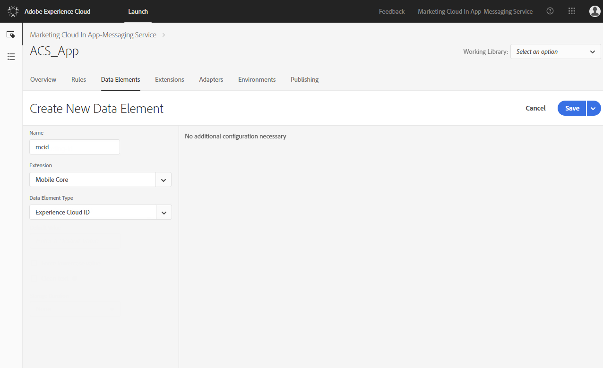

# Adobe Campaign Standard 사용 사례를 지원하기 위한 Launch 규칙 구성 {#configuring-rules-launch}

[!DNL Adobe Experience Platform Launch]에서는 모바일 애플리케이션에서 [!DNL Adobe Campaign Standard]로 PII 및 기타 데이터를 전송하기 위해 데이터 요소와 규칙을 만들어야 합니다.

[!DNL Adobe Experience Platform Launch]의 모든 구성 변경 사항을 적용하려면 이러한 변경 사항을 게시해야 합니다. 자세한 내용은 [게시](https://aep-sdks.gitbook.io/docs/getting-started/create-a-mobile-property#publish-the-configuration)를 참조하십시오.

[!DNL Experience Platform Launch]에서 규칙을 만들려면 다음 단계를 수행합니다.

1. [데이터 요소 만들기](../../administration/using/configuring-rules-launch.md#create-data-elements)
2. [지원하려는 ](../../administration/using/configuring-rules-launch.md#create-data-elements) 사용 사례에 대한 규칙 만들기:
   * [PII 포스트백](../../administration/using/configuring-rules-launch.md#pii-postback)
   * [인앱 추적 포스트백](../../administration/using/configuring-rules-launch.md#inapp-tracking-postback)
   * [푸시 알림 추적 포스트백](../../administration/using/configuring-rules-launch.md#push-tracking-postback)
   * [위치 포스트백](../../administration/using/configuring-rules-launch.md#location-postback)

## 데이터 요소 만들기 {#create-data-elements}

다음은 [!DNL Experience Platform Launch]에서 만드는 것이 권장되는 데이터 요소입니다.
필요에 따라 추가 데이터 요소를 만들 수 있습니다.

* **[!UICONTROL Experience Cloud ID]**
* **[!UICONTROL Pkey]**
* **[!UICONTROL Campaign server]**

다음 데이터 요소를 만들려면:

1. [!DNL Experience Platform Launch]의 모바일 애플리케이션 대시보드에서 **[!UICONTROL Data Elements]** 탭을 클릭합니다.

1. **[!UICONTROL Experience Cloud ID]** 데이터 요소를 만들려면 **[!UICONTROL Create New Data Element]** 을 클릭합니다.

1. 예를 들어 **[!UICONTROL Name]** 필드에 **mcid**&#x200B;를 입력합니다.

1. **[!UICONTROL Extension]** 드롭다운에서 **[!UICONTROL Mobile Core]** 을 선택합니다. 그런 다음 **[!UICONTROL Data element]** 드롭다운에서 **[!UICONTROL Experience Cloud ID]** 을 입력합니다.

   

1. 키 데이터 요소를 만들려면 **[!UICONTROL Add data element]** 을 클릭합니다.

1. 예를 들어 **[!UICONTROL Name]** 필드에 **pkey**&#x200B;를 입력합니다.

1. **[!UICONTROL Extension]** 드롭다운에서 **[!UICONTROL Adobe Campaign Standard]** 을 선택합니다. 그런 다음 **[!UICONTROL Data element]** 드롭다운에서 **[!UICONTROL pkey]** 을 입력합니다.

1. Campaign 서버 데이터 요소를 만들려면 **[!UICONTROL Add data element]** 을 클릭합니다.

1. **[!UICONTROL Name]** 필드에 이름을 입력합니다(예: **camp-server**).

1. **[!UICONTROL Extension]** 드롭다운에서 **[!UICONTROL Adobe Campaign Standard]** 을 선택합니다. 그런 다음 **[!UICONTROL Data element]** 드롭다운에서 **[!UICONTROL Campaign Server]** 을 입력합니다.

## 규칙 만들기 {#creating-rules}

다음에 대한 규칙을 만들어야 합니다.

* [PII 포스트백](../../administration/using/configuring-rules-launch.md#pii-postback)
* [인앱 추적 포스트백](../../administration/using/configuring-rules-launch.md#inapp-tracking-postback)
* [푸시 알림 추적 포스트백](../../administration/using/configuring-rules-launch.md#push-tracking-postback)
* [위치 포스트백](../../administration/using/configuring-rules-launch.md#location-postback)

### PII 포스트백 {#pii-postback}

>[!NOTE]
>
>모바일 앱에서 Adobe Campaign으로 PII 정보를 전송하려면 SDK API를 구현해야 합니다. 자세한 내용은 [CollectPII](https://aep-sdks.gitbook.io/docs/using-mobile-extensions/mobile-core/mobile-core-api-reference#collect-pii)로 이동하십시오.

PII 데이터를 [!DNL Adobe Campaign Standard]에 보내려면 [!DNL Experience Platform Launch]에서 규칙을 만듭니다.

1. [!DNL Experience Platform Launch]의 모바일 애플리케이션 대시보드에서 **[!UICONTROL Rules]** 탭을 클릭한 다음 **[!UICONTROL Create New Rule]** 를 클릭합니다.

1. 예를 들어 **Mobile Core - Collect PII** 이름을 입력합니다.

1. **[!UICONTROL Events]** 섹션에서 **[!UICONTROL Add]** 를 클릭합니다.

1. **[!UICONTROL Extension]** 드롭다운에서 **[!UICONTROL Mobile Core]** 을 선택합니다. 그런 다음 **[!UICONTROL Event type]** 드롭다운에서 **[!UICONTROL Collect PII]** 을 클릭합니다.

1. **[!UICONTROL Keep changes]**&#x200B;를 클릭합니다.

1. **[!UICONTROL Actions]** 섹션에서 **[!UICONTROL Add]** 를 클릭합니다.

1. **[!UICONTROL Extension]** 드롭다운에서 **[!UICONTROL Mobile Core]** 을 선택합니다. 그런 다음 **[!UICONTROL Action type]** 드롭다운에서 **[!UICONTROL Send PII]** 을 클릭합니다.

1. **[!UICONTROL URL]**&#x200B;에 다음 URL을 입력합니다.

   ```
   https://{%%camp-server%%}/rest/head/mobileAppV5/{%%pkey%%}/subscriptions/{%%mcid%%}
   ```

1. **[!UICONTROL Add Post Body]** 확인란을 선택합니다.

1. **[!UICONTROL Post Body]**&#x200B;에 다음을 입력합니다.

   ```
   {
   "marketingCloudId":
   "{%%mcid%%}",
   "cusEmail":
   "",
   "cusFirstName":
   "",
   "cusLastName":
   "" }
   ```

   marketingCloudId를 사용하면 앱 구독자를 데이터베이스의 수신자와 조정할 수 있으므로 필수입니다. 비즈니스 요구 사항에 따라 다른 키-값 쌍을 지정할 수 있습니다. 위의 예에서는 앱에서 이메일, 이름 및 성이 전달됩니다.

   키(예: cusEmail, cusFirstName 및 cusLastName)는 Adobe Campaign Standard 인스턴스의 사용자 지정 리소스에 정의된 필드 ID와 일치해야 합니다. 값 변수(예: 이메일, firstName 및 LastName)는 앱 코드에서 AMS collectPII API를 호출하는 동안 모바일 앱에서 전송된 JSON 데이터의 키와 일치해야 합니다.

   또한 이벤트 트리거에 따라 Collect PII 포스트백에 라이프사이클 데이터를 전달하거나 다른 포스트백을 전달할 수도 있습니다. 다음은 라이프사이클 데이터 JSON의 예입니다.

   ```
   {
   "marketingCloudId":"{%%mcid%%}",
   "cusDayslastlaunch": "{%%DaysSinceLastUse%%}", 
   "cusDaysfirstlaunch": "{%%DaysSinceFirstUse%%}", 
   "cusLaunches": "{%%Launches%%}"
   }
   ```

   [!DNL Experience Platform Launch]에 정의된 데이터 요소는 이중 비율로 묶어야 합니다(예: %%mcid%%%). 그리고 앱의 컨텍스트 변수는 ( 예: %contextdata.email%).

1. **[!UICONTROL Content Type]**&#x200B;에 **application/json**&#x200B;를 입력합니다.

1. **[!UICONTROL Timeout]**&#x200B;에서 0을 선택합니다.

   

이제 사용자 데이터가 Campaign으로 전송되도록 구성되었습니다.

### 인앱 추적 포스트백 {#inapp-tracking-postback}

>[!NOTE]
>
>Android ACPCore v1.4.0 이상/iOS ACPCore v2.3.0 이상을 사용하는 경우 추적 포스트백을 구성할 필요가 없습니다.

사용자가 모바일 애플리케이션에서 인앱 메시지와 상호 작용하는 방법을 보고하기 위해 추적 데이터를 [!DNL Adobe Campaign Standard]에 보내려면 [!DNL Experience Platform Launch]에서 다음 규칙을 만드십시오.

1. [!DNL Experience Platform Launch]의 모바일 애플리케이션 대시보드에서 **[!UICONTROL Rules]** 탭을 선택하고 **[!UICONTROL Add Rule]**&#x200B;를 클릭합니다.

1. 이름(예: **Adobe Campaign - 인앱 클릭 추적**)을 입력합니다.

1. **[!UICONTROL Events]** 섹션에서 **[!UICONTROL Add]** 를 클릭합니다.

1. **[!UICONTROL Extension]** 드롭다운에서 **[!UICONTROL Adobe Campaign Standard]** 을 선택합니다. 그런 다음 **[!UICONTROL Event type]** 드롭다운에서 **[!UICONTROL In-App click tracking]** 을 클릭합니다.

1. **[!UICONTROL Keep changes]**&#x200B;를 클릭합니다.

1. **[!UICONTROL Actions]** 섹션에서 **[!UICONTROL Add]** 를 클릭합니다.

1. **[!UICONTROL Extension]** 드롭다운에서 **[!UICONTROL Mobile Core]** 을 선택합니다. 그런 다음 **[!UICONTROL Event type]** 드롭다운에서 **[!UICONTROL Send postback]** 을 클릭합니다.

1. **[!UICONTROL URL]**&#x200B;에 다음 URL을 입력합니다.

   ```
   https://{%%camp-server%%}/r/?id=&mcid={%%mcid%%}
   ```

1. **[!UICONTROL Add post body]** 확인란을 선택합니다.

1. **[!UICONTROL Post Body]**&#x200B;에 **{}**&#x200B;를 입력합니다.

1. **[!UICONTROL Content Type]**&#x200B;에 **application/json**&#x200B;를 입력합니다.

1. **[!UICONTROL Timeout]**&#x200B;에서 0을 선택합니다.

   

### 푸시 알림 추적 포스트백 {#push-tracking-postback}

>[!NOTE]
>
>Android ACPCore v1.4.0 이상/iOS ACPCore v2.3.0 이상을 사용하는 경우 추적 포스트백을 구성할 필요가 없습니다.

추적 데이터를 모바일 애플리케이션과의 푸시 알림 게재와 사용자 상호 작용을 추적하는 데 도움이 되는 [!DNL Adobe Campaign Standard]에 보내려면 [!DNL Experience Platform Launch]에서 규칙을 만들어야 합니다.

푸시 추적에 대한 자세한 내용은 [푸시 추적](../../administration/using/push-tracking.md)을 참조하십시오.

앱 작업을 추적하려면 trackAction API를 사용합니다. 자세한 내용은 [앱 작업 추적](https://app.gitbook.com/@aep-sdks/s/docs/using-mobile-extensions/mobile-core/mobile-core-api-reference#track-app-actions)을 참조하십시오.

1. [!DNL Experience Platform Launch]의 모바일 애플리케이션 대시보드에서 **[!UICONTROL Rules]** 탭을 클릭하고 **[!UICONTROL Add Rule]**&#x200B;를 클릭합니다.

1. 이름(예: **Adobe Campaign - 푸시 클릭 추적**)을 입력합니다.

1. **[!UICONTROL Events]** 섹션에서 **[!UICONTROL Add]** 를 클릭합니다.

1. **[!UICONTROL Extension]** 드롭다운에서 **[!UICONTROL Mobile Core]** 을 선택합니다. 그런 다음 **[!UICONTROL Event type]** 드롭다운에서 **[!UICONTROL Track Action]** 을 클릭합니다.

1. **[!UICONTROL Action]** 드롭다운에서 **[!UICONTROL Action]** 을 선택하고 **[!UICONTROL equals]** 를 선택하고 **tracking**&#x200B;를 입력합니다.

1. **[!UICONTROL Keep changes]**&#x200B;을(를) 클릭합니다. 그런 다음 **[!UICONTROL Actions]** 섹션에서 **[!UICONTROL Add]** 를 클릭합니다.

1. **[!UICONTROL Extension]** 드롭다운에서 **[!UICONTROL Mobile Core]** 을 선택합니다. 그런 다음 **[!UICONTROL Action type]** 드롭다운에서 **[!UICONTROL Send postback]** 을 클릭합니다.

1. **[!UICONTROL URL]**&#x200B;에 다음 URL을 입력합니다.

   ```
   https://{%%camp-server%%}/r/?id=,,&mcId={%%mcid%%}
   ```

1. **[!UICONTROL Add post body]** 확인란을 선택합니다.

1. 게시물 본문을 추가합니다(예: { }).

1. **[!UICONTROL Content Type]**&#x200B;에 **application/json**&#x200B;를 입력합니다.

1. **[!UICONTROL Timeout]**&#x200B;에서 0을 선택합니다.

### 위치 포스트백 {#location-postback}

1. [!DNL Experience Platform Launch]의 모바일 애플리케이션 대시보드에서 **[!UICONTROL Rules]** 탭을 클릭하고 **[!UICONTROL Add Rule]**&#x200B;를 클릭합니다.

1. 이름(예: **위치 포스트백**)을 입력합니다.

1. **[!UICONTROL Events]** 섹션에서 **[!UICONTROL Add]** 를 클릭합니다.

1. 이벤트를 만듭니다(예: POI 또는 Exit POI 입력). **[!UICONTROL Extension]** 드롭다운에서 **위치 - 베타**&#x200B;를 선택합니다. 그런 다음 **[!UICONTROL Event type]** 드롭다운에서 **POI** 또는 **종료 POI**&#x200B;를 입력합니다.

1. 예를 들어, **위치 - 베타 - POI** 또는 **종료 POI**&#x200B;를 입력합니다.

1. **[!UICONTROL Actions]** 섹션에서 **[!UICONTROL Add]** 를 클릭합니다.

1. **[!UICONTROL Extension]** 드롭다운에서 **[!UICONTROL Mobile Core]** 을 선택합니다. 그런 다음 **[!UICONTROL Action type]** 드롭다운에서 **[!UICONTROL Send postback]** 을 클릭합니다.

1. 이름(예: **Mobile Core - Send Location Postback**)을 입력합니다.

1. **[!UICONTROL URL]**&#x200B;에 다음 URL을 입력합니다.

   ```
   https://{%%camp-server%%}/rest/head/mobileAppV5/{%%pkey%%}/locations/
   ```

1. **[!UICONTROL Add post body]** 확인란을 선택하고 게시물 본문을 추가합니다(예:

   ```
   {
   "locationData": {
       "distances": "{%%Distance%%}",
       "poiLabel": "{%%POILabel%%}",
       "latitude": "{%%Latitude%%}",
       "longitude": "{%%Longitude%%}",
       "appId": "{%%AppId%%}",
       "marketingCloudId": "{%%ECID%%}"
   }
   }
   ```

   >[!NOTE]
   >
   >위의 예에서 오른쪽의 데이터 요소는 [데이터 요소 만들기](../../administration/using/configuring-rules-launch.md#create-data-elements)의 단계를 활용하여 [!DNL Experience Platform Launch]에 구성해야 합니다. 왼쪽에 있는 데이터 요소는 [!DNL Adobe Campaign Standard]에서 지원되며 구성이 필요하지 않습니다. 추가 데이터가 필요한 경우 [!DNL Adobe Campaign Standard]에서 사용자 지정 리소스 확장을 수행해야 합니다.

1. **[!UICONTROL Content Type]**&#x200B;에 **application/json**&#x200B;를 입력합니다.

1. **[!UICONTROL Timeout]**&#x200B;에서 5를 선택합니다.

   
