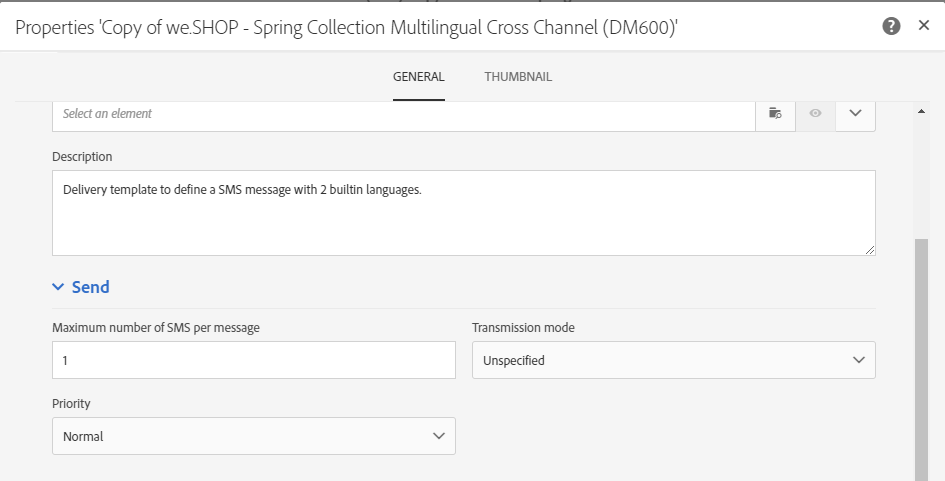

# SMS 채널 구성{#configuring-sms-channel}

SMS 메시지를 전송하려면 관리자가 **[!UICONTROL Administration]** > **[!UICONTROL Channels]** > **[!UICONTROL SMS]** > **[!UICONTROL SMS accounts]** 메뉴 아래에 하나 이상의 외부 계정을 구성해야 합니다.

외부 계정을 만들고 수정하는 단계는 [외부 계정](../../administration/using/external-accounts.md) 섹션에 자세히 설명되어 있습니다. 아래에 외부 계정에서 SMS 메시지를 보낼 때 사용할 수 있는 매개 변수가 나와 있습니다.

## SMS 라우팅 정의 {#defining-an-sms-routing}

외부 계정 **[!UICONTROL SMS routing via SMPP]**&#x200B;은(는) 기본적으로 제공되지만, 다른 계정을 추가하는 것이 유용할 수 있습니다.

SMPP 프로토콜을 사용하려면 새 외부 계정을 만들 수도 있습니다. SMS 프로토콜 및 설정에 대한 자세한 내용은 이 [기술 정보](https://helpx.adobe.com/kr/campaign/kb/sms-connector-protocol-and-settings.html)를 참조하십시오.

1. **[!UICONTROL Administration > Application settings > External accounts]**&#x200B;에서 새 외부 계정을 만듭니다.
1. 계정 유형은 **[!UICONTROL Routing]**, 채널은 **[!UICONTROL Mobile (SMS)]**, 게재 모드는 **[!UICONTROL Bulk delivery]**(으)로 정의합니다.

   

1. 연결 설정을 정의합니다.

   SMS 메시지 전송에만 적용되는 연결 설정을 입력하려면 SMS 서비스 공급자에게 문의하여 여러 외부 계정 필드를 완성하는 방법에 대한 설명을 요청하십시오.

   

   **[!UICONTROL Enable TLS over SMPP]** 옵션을 사용하면 SMPP 트래픽을 암호화할 수 있습니다.

   **[!UICONTROL Enable verbose SMPP traces in the log file]**&#x200B;을(를) 사용하면 모든 SMPP 트래픽을 로그 파일로 덤프할 수 있습니다. 커넥터의 문제를 해결하고 공급자가 보는 트래픽과 비교하려면 이 옵션을 활성화해야 합니다.

1. Adobe에 문의하여 선택한 공급자에 따라 **[!UICONTROL SMS-C implementation name]** 필드에 입력할 값을 제공받으십시오.
1. SMPP 채널 설정을 정의합니다. 자세한 내용은 [SMS 인코딩 및 포맷](#sms-encoding-and-formats) 섹션에서 확인할 수 있습니다.

   모든 수신 SMS를 inSMS 표에 저장하려면 **[!UICONTROL Store incoming MO in the database]**&#x200B;을(를) 활성화합니다. 수신 SMS를 검색하는 방법에 대한 자세한 내용은 이 [섹션](../../channels/using/managing-incoming-sms.md#storing-incoming-sms)을 참조하십시오.

   **[!UICONTROL Enable Real-time KPI updates during SR processing]** 옵션을 사용하면 게재를 보낸 후 **[!UICONTROL Delivered]** 또는 **[!UICONTROL Bounces + Errors]** KPI를 실시간으로 업데이트할 수 있습니다. 이 KPI는 **[!UICONTROL Deployment]** 창에서 찾을 수 있으며, 공급자로부터 받은 SR(상태 보고서)에서 직접 재계산됩니다.

   

1. **[!UICONTROL Throughput and timeouts]** 매개 변수를 정의합니다.

   아웃바운드 메시지의 최대 처리량(&quot;MT&quot;, 모바일 착신)을 초당 MT 단위로 지정할 수 있습니다. 해당 필드에 &quot;0&quot;을 입력하면 처리량이 무제한이 됩니다.

   지속 시간에 해당하는 모든 필드의 값은 초 단위로 입력해야 합니다.

1. 특정 인코딩 매핑을 정의해야 하는 경우 SMS-C 특정 매개 변수를 정의합니다. 자세한 내용은 [SMSC 세부 사항](#smsc-specifics) 섹션을 참조하십시오.

   SMPP 프로토콜을 준수하지 않고 SMS 공급자 서버(SMS-C)에 **[!UICONTROL +]** 접두사를 전송하려면 **[!UICONTROL Send full phone number (send characters other than digits)]** 옵션을 활성화합니다.

   그러나 특정 공급자가 **[!UICONTROL +]** 접두사 사용을 요청하는 경우 해당 공급자에게 확인하는 것이 좋습니다. 필요한 경우 공급자가 이 옵션을 활성화하라고 요청할 것입니다.

1. 필요한 경우 자동 답장을 정의하여 답장의 콘텐츠에 따라 작업을 트리거합니다. 자세한 정보는 [이 섹션](../../channels/using/managing-incoming-sms.md#managing-stop-sms)을 참조하십시오.
1. SMS 라우팅 외부 계정의 구성을 저장합니다.

이제 Adobe Campaign에서 새로운 라우팅을 사용하여 SMS 메시지를 보낼 수 있습니다.

## SMS 인코딩 및 포맷 {#sms-encoding-and-formats}

### SMS 인코딩, 길이 및 변환 {#sms-encoding--length-and-transliteration}

기본적으로 SMS의 글자 수는 GSM(이동통신 글로벌 시스템) 표준을 충족합니다.

GSM 인코딩을 사용하는 SMS 메시지는 SMS당 160자, 또는 여러 부분으로 나누어 전송되는 메시지의 경우 153자로 제한됩니다.

>[!NOTE]
>
>특정 문자(중괄호, 대괄호, 유로 심벌 등)는 두 글자로 계산합니다. 사용 가능한 GSM 문자 목록은 [문자 표 - GSM 표준](#table-of-characters---gsm-standard) 섹션에 나와 있습니다.

원하는 경우 해당 상자를 선택하여 문자 변환을 승인할 수 있습니다.

변환은 GSM 표준에서 고려하지 않는 SMS 문자를 다른 문자로 바꾸는 작업입니다.

* 변환이 **승인**&#x200B;되면 고려하지 않는 각 문자는 메시지를 보낼 때 GSM 문자로 바뀝니다. 예를 들어 &quot;ë&quot;라는 글자는 &quot;e&quot;로 대체됩니다. 따라서 메시지는 약간 변경되지만 글자 수 제한은 그대로 유지됩니다.
* 변환이 **승인되지 않는** 경우, 고려하지 않는 문자가 포함된 각 메시지를 이진 형식(유니코드)으로 보내어 모든 문자를 있는 그대로 보낼 수 있도록 합니다. 그러나 유니코드를 사용하는 SMS 메시지는 70자(또는 여러 부분으로 나누어 보내는 SMS의 경우 67자)로 제한됩니다. 최대 글자 수를 초과하면 메시지가 여러 개로 보내져 추가 비용이 발생할 수 있습니다.

>[!IMPORTANT]
>
>SMS 메시지의 콘텐츠에 개인화 필드를 삽입하면 GSM 인코딩에서 고려하지 않는 문자가 들어갈 수 있습니다. [SMS 메시지 개인화](../../channels/using/personalizing-sms-messages.md) 섹션에서 콘텐츠 예제를 제공합니다.

문자 변환은 기본적으로 비활성화되어 있습니다. SMS 메시지의 모든 문자를 그대로 유지하려는 경우, 예를 들어 제대로 된 이름이 바뀌지 않게 하려는 경우 이 옵션을 활성화하지 않는 것을 추천합니다.

그러나 SMS 메시지에 유니코드 메시지를 생성하는 문자가 많이 포함된 경우, 이 옵션을 활성화하여 메시지 전송 비용을 제한할 수 있습니다.

### 문자 표 - GSM 표준 {#table-of-characters---gsm-standard}

이 섹션에는 GSM 표준에서 고려하는 문자가 나옵니다. 아래에 언급된 문자 외에 메시지 본문에 삽입된 모든 문자는 전체 메시지를 이진 형식(유니코드)으로 전환하여 70자로 제한합니다. 자세한 내용은 [SMS 인코딩, 길이 및 변환](#sms-encoding--length-and-transliteration) 섹션을 참조하십시오.

**기본 문자**

<table> 
 <tbody> 
  <tr> 
   <td> @  </td> 
   <td>    </td> 
   <td> SP  </td> 
   <td> 0  </td> 
   <td> ¡  </td> 
   <td> P  </td> 
   <td> ¿  </td> 
   <td> P  </td> 
  </tr> 
  <tr> 
   <td> £  </td> 
   <td> _  </td> 
   <td> !  </td> 
   <td> 1  </td> 
   <td> A  </td> 
   <td> Q  </td> 
   <td> a  </td> 
   <td> q  </td> 
  </tr> 
  <tr> 
   <td> $  </td> 
   <td>    </td> 
   <td> "  </td> 
   <td> 2  </td> 
   <td> B  </td> 
   <td> R  </td> 
   <td> b  </td> 
   <td> r  </td> 
  </tr> 
  <tr> 
   <td> ¥  </td> 
   <td>    </td> 
   <td> #  </td> 
   <td> 3  </td> 
   <td> C  </td> 
   <td> S  </td> 
   <td> c  </td> 
   <td> s  </td> 
  </tr> 
  <tr> 
   <td> è  </td> 
   <td>    </td> 
   <td> ¤  </td> 
   <td> 4  </td> 
   <td> D  </td> 
   <td> T  </td> 
   <td> d  </td> 
   <td> t  </td> 
  </tr> 
  <tr> 
   <td> é  </td> 
   <td>    </td> 
   <td> %  </td> 
   <td> 5  </td> 
   <td> E  </td> 
   <td> U  </td> 
   <td> e  </td> 
   <td> u  </td> 
  </tr> 
  <tr> 
   <td> ù  </td> 
   <td>    </td> 
   <td> &amp;  </td> 
   <td> 6  </td> 
   <td> F  </td> 
   <td> V  </td> 
   <td> f  </td> 
   <td> v  </td> 
  </tr> 
  <tr> 
   <td> ì  </td> 
   <td>    </td> 
   <td> '  </td> 
   <td> 7  </td> 
   <td> G  </td> 
   <td> W  </td> 
   <td> g  </td> 
   <td> w  </td> 
  </tr> 
  <tr> 
   <td> ò  </td> 
   <td>    </td> 
   <td> (  </td> 
   <td> 8  </td> 
   <td> H  </td> 
   <td> X  </td> 
   <td> h  </td> 
   <td> x  </td> 
  </tr> 
  <tr> 
   <td> Ç  </td> 
   <td>    </td> 
   <td> )  </td> 
   <td> 9 </td> 
   <td> I  </td> 
   <td> Y  </td> 
   <td> i  </td> 
   <td> y  </td> 
  </tr> 
  <tr> 
   <td> LF  </td> 
   <td>    </td> 
   <td> *  </td> 
   <td> :  </td> 
   <td> J  </td> 
   <td> Z  </td> 
   <td> j  </td> 
   <td> z  </td> 
  </tr> 
  <tr> 
   <td> Ø  </td> 
   <td> ESC  </td> 
   <td> +  </td> 
   <td> ;  </td> 
   <td> K  </td> 
   <td> Ä  </td> 
   <td> k  </td> 
   <td> ä  </td> 
  </tr> 
  <tr> 
   <td> ø  </td> 
   <td> Æ  </td> 
   <td> ,  </td> 
   <td> &lt;  </td> 
   <td> L  </td> 
   <td> Ö  </td> 
   <td> l  </td> 
   <td> ö  </td> 
  </tr> 
  <tr> 
   <td> CR  </td> 
   <td> æ  </td> 
   <td> -  </td> 
   <td> = </td> 
   <td> M  </td> 
   <td> Ñ  </td> 
   <td> m  </td> 
   <td> ñ  </td> 
  </tr> 
  <tr> 
   <td> Å  </td> 
   <td> ß  </td> 
   <td> .  </td> 
   <td> &gt;  </td> 
   <td> N  </td> 
   <td> Ü  </td> 
   <td> n  </td> 
   <td> ü  </td> 
  </tr> 
  <tr> 
   <td> å  </td> 
   <td> É  </td> 
   <td> /  </td> 
   <td> ?  </td> 
   <td> O  </td> 
   <td> §  </td> 
   <td> o  </td> 
   <td> à  </td> 
  </tr> 
 </tbody> 
</table>

SP: 스페이스

ESC: 이스케이프

LF: 라인 피드

CR: 캐리지 리턴

**고급 문자(두 글자로 계산)**

^ { } [ ~ ] | €

### SMSC 세부 사항 {#smsc-specifics}

>[!NOTE]
>
>이 옵션을 사용하면 커넥터를 비표준 SMSC(즉, SMPP 3.4 사양을 정확하게 따르지 않는 것) 또는 특정 인코딩 요구 사항에 따라 작동하도록 조정할 수 있습니다. 이 옵션은 고급 사용자만 구성해야 합니다.

SMS 메시지를 보낼 때 Adobe Campaign에서는 하나 또는 여러 개의 텍스트 인코딩을 사용할 수 있습니다. 각 인코딩은 고유한 문자 세트를 가지며 SMS 메시지에 맞는 글자 수를 정합니다.

 Adobe Campaign은 **[!UICONTROL DATA_CODING]** 필드를 통해 인코딩이 사용되는 SMS-C와 통신할 수 있습니다.

>[!NOTE]
>
>**data_coding** 값과 실제로 사용되는 인코딩 간의 매핑은 표준화되어 있습니다. 그러나 특정 SMS-C에는 고유한 매핑이 있습니다. 이 경우 **Adobe Campaign** 관리자가 이 매핑을 선언해야 합니다. 자세한 내용은 공급자에게 문의하십시오.

**[!UICONTROL Define a specific mapping of encodings]** 기능을 통해 **data_codings**&#x200B;를 선언할 수 있으며, 필요한 경우 인코딩을 강제 적용할 수 있습니다. 이렇게 하려면 표에 단일 인코딩을 지정합니다.

**구성**

* **[!UICONTROL Define a specific mapping of encodings]** 기능을 선택하지 않으면 커넥터가 일반 동작을 수행합니다.

   * 이는 GSM 인코딩을 사용하여 **data_coding = 0** 값을 할당하려고 합니다.
   * GSM 인코딩이 실패할 경우 **UCS2** 인코딩을 사용하여 **data_coding = 8** 값을 할당합니다 .

   

* **[!UICONTROL Define a specific mapping of encodings]** 기능을 선택하면 사용할 인코딩과 연결된 **[!UICONTROL data_coding]** 필드 값을 정의할 수 있습니다. Adobe Campaign은 목록의 첫 번째 인코딩을 사용하려고 하지만, 첫 번째 인코딩이 불가능할 경우 다음을 수행합니다.

   선언의 순서가 중요합니다. 목록을 **비용** 오름차순으로 배치하는 것을 추천합니다. 이렇게 하면 각 SMS 메시지에 가능한 많은 문자를 입력할 수 있는 인코딩을 선호하도록 할 수 있습니다.

   사용하려는 인코딩만 선언해야 합니다. SMS-C에서 제공하는 인코딩 중 일부가 사용 목적에 부합하지 않는 경우, 목록에 선언하지 마십시오.

   

### MO에 자동 답장 보내기 {#automatic-reply-sent-to-the-mo}

Campaign을 통해 보낸 SMS 메시지에 프로필이 답장할 경우 수행할 작업과 자동으로 다시 보낼 메시지를 구성할 수 있습니다.

자세한 정보는 [이 섹션](../../channels/using/managing-incoming-sms.md)을 참조하십시오.

## SMS 속성 구성 {#configuring-sms-properties}

이 섹션에서는 SMS 게재 또는 SMS 템플릿의 속성 화면에 있는 SMS 고유 매개 변수 목록을 자세히 설명합니다.

SMS 메시지 보내기를 위한 특정 매개 변수는 **[!UICONTROL Send]** 및 **[!UICONTROL Advanced parameters]** 섹션에 다시 정리되어 있습니다.

섹션에서 **[!UICONTROL Advanced parameters]** 다음을 수행합니다.

* **[!UICONTROL From]** 옵션을 사용하면 문자열을 사용하여 SMS 메시지의 발신자명을 개인화할 수 있습니다. 발신자명이란 수신자의 휴대전화에서 SMS 메시지를 보낸 사람으로 표시되는 이름입니다.

   이 필드가 비어 있는 경우 외부 계정에서 제공하는 소스 번호가 표시됩니다. 소스 번호가 제공되지 않는 경우 짧은 코드가 사용됩니다. SMS 게재와 관련된 외부 계정은 [SMS 라우팅 정의 ](#defining-an-sms-routing) 섹션에 나와 있습니다.

   

   >[!IMPORTANT]
   >
   >해당 국가의 발신자 주소 수정에 대한 법률을 확인하십시오. 또한 SMS 서비스 공급자에게 문의하여 이 기능을 제공하는지 확인하십시오.

SMS 템플릿의 **[!UICONTROL Send]** 섹션에서 다음을 수행합니다.

* **[!UICONTROL Maximum number of SMS per message]** 옵션을 사용하면 메시지를 보내는 데 사용할 SMS 메시지 수를 정의할 수 있습니다. 이 수를 초과하면 메시지를 보내지 않습니다.

   >[!IMPORTANT]
   >
   >개인화 필드 또는 조건부 텍스트를 SMS 메시지 콘텐츠에 삽입한 경우, 메시지 길이 및 전송할 SMS 메시지 수가 수신자마다 달라질 수 있습니다. 자세한 내용은 [SMS 메시지 개인화](../../channels/using/personalizing-sms-messages.md) 섹션을 참조하십시오.

   

* **[!UICONTROL Transmission mode]** 필드에서는 SMS 메시지의 게재 방법을 결정할 수 있습니다.

   * **[!UICONTROL Saved on SIM card]**: 메시지가 수신자의 전화 SIM 카드에 저장됩니다.
   * **[!UICONTROL Saved on mobile]**: 메시지가 전화의 내부 메모리에 저장됩니다.
   * **[!UICONTROL Flash]**: 메시지가 수신자의 휴대전화에 알림으로 표시된 뒤 저장되지 않고 사라집니다.
