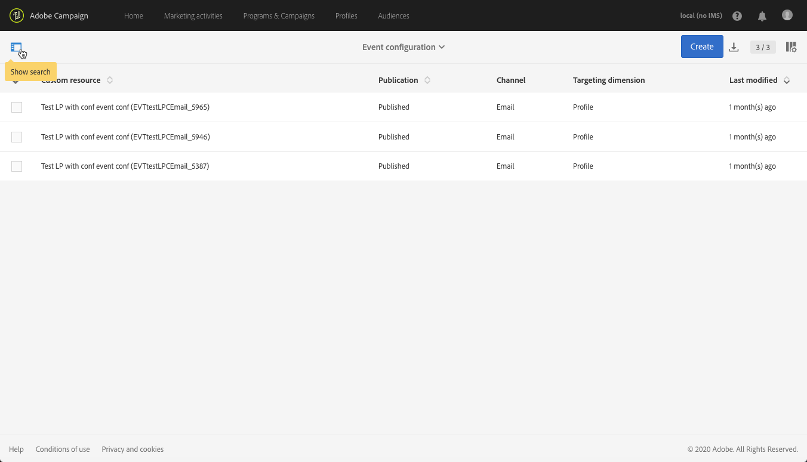

# 트랜잭션 메시지 구성{#configuring-transactional-messaging}

Adobe Campaign에서 트랜잭션 메시지를 보내려면 먼저 이벤트 데이터의 구조를 설명해야 합니다.

이벤트 구성은 [관리자가](../../administration/using/users-management.md#functional-administrators) 아래 단계에 따라 수행해야 합니다.

>[!NOTE]
>
>구성은 보내려는 트랜잭션 메시지 유형에 따라 다를 수 있습니다. 자세한 내용은 [트랜잭션 이벤트 관련 구성을 참조하십시오](#transactional-event-specific-configurations).

이벤트가 게시되면:

* 웹 사이트 개발자가 사용할 API가 배포되고 이제 트랜잭션 이벤트를 전송할 수 있습니다. 웹 [사이트에서 이벤트 트리거 통합을 참조하십시오](#integrating-the-triggering-of-the-event-in-a-website).

* 해당 트랜잭션 메시지가 자동으로 만들어집니다. 트랜잭션 [메시지 시작을 참조하십시오](../../channels/using/getting-started-with-transactional-msg.md).

## 이벤트 만들기 {#creating-an-event}

시작하려면 필요에 따라 이벤트를 만듭니다.

>[!IMPORTANT]
>
>역할 **[!UICONTROL Administration]** 을 소유하고 **[!UICONTROL All]** 조직 구성 단위  에 속하는 사용자만 이벤트 구성을 만들 수 있는 적절한 권한이 있습니다.

1. 왼쪽 상단 모서리에서 **[!UICONTROL Adobe Campaign]** 로고를 클릭한 다음 **[!UICONTROL Marketing plans]** > **[!UICONTROL Transactional messages]** > **[!UICONTROL Event configuration]**&#x200B;을(를) 선택합니다.
1. **[!UICONTROL Create]** 버튼을 클릭합니다.
1. 행사 **[!UICONTROL Label]** 에 **[!UICONTROL ID]** 와 응모. 이 **[!UICONTROL ID]** 필드는 필수 항목이며 접두사 &quot;EVT&quot;로 시작해야 합니다. 이 접두사를 사용하지 않으면 클릭하면 자동으로 추가됩니다 **[!UICONTROL Create]**.

   

   >[!IMPORTANT]
   >
   >ID는 EVT 접두사를 포함하여 64자를 초과할 수 없습니다.

1. 트랜잭션 메시지를 보내는 데 사용할 채널 **[!UICONTROL Email]**&#x200B;을 **[!UICONTROL Mobile (SMS)]** 선택하거나 **[!UICONTROL Mobile application]** (푸시 알림)

   >[!NOTE]
   >
   >각 이벤트 구성에 대해 채널은 하나씩만 사용할 수 있습니다. 이벤트를 만든 후에는 채널을 변경할 수 없습니다.

1. 원하는 이벤트 구성에 해당하는 타깃팅 차원을 선택하고 을 클릭합니다 **[!UICONTROL Create]**.

   이벤트 기반 트랜잭션 메시지는 이벤트 자체에 포함된 데이터와 프로필 기반 트랜잭션 메시지는 Adobe Campaign 데이터베이스에 포함된 데이터를 타깃팅합니다. 자세한 내용은 [트랜잭션 이벤트 관련 구성을 참조하십시오](#transactional-event-specific-configurations).

>[!NOTE]
>
>생성된 실시간 이벤트의 수는 플랫폼에 영향을 줄 수 있습니다. 최적의 성능을 얻으려면 더 이상 필요하지 않은 실시간 이벤트를 삭제해야 합니다. See [Deleting an event](#deleting-an-event).

## 이벤트 속성 정의 {#defining-the-event-attributes}

섹션에서 이벤트 컨텐츠에 통합될 속성을 **[!UICONTROL Fields]** 정의한 다음 트랜잭션 메시지를 개인화할 수 있습니다.

필드 추가 및 수정 단계는 [사용자 지정 리소스에 대한 단계와 동일합니다](../../developing/using/configuring-the-resource-s-data-structure.md#adding-fields-to-a-resource).

>[!NOTE]
>
>다국어 트랜잭션 메시지를 만들려면 ID를 사용하여 추가 이벤트 속성을 **[!UICONTROL AC_language]** 정의합니다. 이는 이벤트 트랜잭션 메시지에만 적용됩니다. 이벤트가 게시되면 다국어 트랜잭션 메시지의 내용을 편집하는 단계는 다국어 표준 이메일과 동일합니다. See [Creating a multilingual email](../../channels/using/creating-a-multilingual-email.md).

## 데이터 컬렉션 정의 {#defining-data-collections}

여러 속성을 포함하는 각 요소 자체를 이벤트 컨텐츠에 요소 모음을 추가할 수 있습니다.

이 컬렉션은 트랜잭션 이메일에서 [제품 목록을 사용하여 가격, 참조 번호, 수량 등과 같은 메시지 컨텐츠에 추가할](../../channels/using/event-transactional-messages.md#using-product-listings-in-a-transactional-message) 수 있습니다. 를 참조하십시오.

1. In the **[!UICONTROL Collections]** section, click the **[!UICONTROL Create element]** button.

   

1. 컬렉션에 레이블 및 ID를 추가합니다.
1. 목록의 각 제품에 대해 트랜잭션 메시지에 표시할 필드를 모두 추가합니다.

   이 예에서는 다음 필드를 추가했습니다.

   

1. 이 **[!UICONTROL Enrichment]** 탭에서는 컬렉션의 각 항목을 보완할 수 있습니다. 이렇게 하면 해당 제품 목록의 요소를 Adobe Campaign 데이터베이스 또는 사용자가 만든 다른 리소스의 정보로 개인화할 수 있습니다.

>[!NOTE]
>
>컬렉션 요소를 더욱 돋보이게 하는 단계는 이벤트  관리 섹션에 설명된 바와 같습니다. 이 행사를 원활하게 한다고 해서 컬렉션을 풍성하게 할 수는 없습니다.섹션의 컬렉션 자체에 농축물을 추가해야 **[!UICONTROL Collections]** 합니다.

이벤트 및 메시지가 게시되면 트랜잭션 메시지에 이 컬렉션을 사용할 수 있습니다.

다음은 API 미리 보기입니다.

**관련 항목:**

* [이벤트 미리 보기 및 게시](#previewing-and-publishing-the-event)
* [트랜잭션 메시지에서 제품 목록 사용](../../channels/using/event-transactional-messages.md#using-product-listings-in-a-transactional-message)

## 이벤트 강화 {#enriching-the-transactional-message-content}

메시지를 개인화하기 위해 Adobe Campaign 데이터베이스의 정보로 트랜잭션 메시지 컨텐츠를 강화할 수 있습니다. 예를 들어 각 수신자의 성 또는 CRM ID에서 주소 또는 생년월일 또는 프로필 테이블에 추가된 기타 사용자 정의 필드와 같은 데이터를 복구하여 수신자에게 전송되는 정보를 개인화할 수 있습니다.

확장된 정보를 사용하여 트랜잭션 메시지 컨텐츠를 강화할 수 있습니다 **[!UICONTROL Profile and services Ext API]**. 자세한 내용은 API [확장을 참조하십시오.확장 프로그램 게시](../../developing/using/step-2--publish-the-extension.md)

이러한 정보는 새로운 리소스에 저장될 수도 있습니다. 이러한 경우 리소스는 직접 또는 다른 표를 통해 **[!UICONTROL Profile]** 또는 **[!UICONTROL Service]** 리소스에 연결되어 있어야 합니다. 예를 들어, 아래 구성에서 리소스가 **[!UICONTROL Product]** 리소스에 연결된 경우 제품 카테고리 또는 ID와 같은 리소스의 정보로 트랜잭션 메시지 컨텐츠 **[!UICONTROL Product]** **[!UICONTROL Profile]** 를 보완할 수 있습니다.

리소스 만들기 및 게시에 대한 자세한 내용은 [이 페이지를 참조하십시오](../../developing/using/key-steps-to-add-a-resource.md).

1. In the **[!UICONTROL Enrichment]** section, click the **[!UICONTROL Create element]** button.

   

1. 메시지를 연결할 리소스를 선택합니다. 이 경우 리소스를 **[!UICONTROL Profile]** 선택합니다.

   

1. 이 **[!UICONTROL Create element]** 단추를 사용하여 선택한 리소스의 필드를 이전에 이벤트에 추가한 필드 중 하나로 연결합니다(이벤트 속성 [정의 참조](#defining-the-event-attributes)).

   

1. 이 예에서는, 리소스 **[!UICONTROL Last name]** 의 해당 필드와 **[!UICONTROL First name]** 필드를 **[!UICONTROL Profile]** 조정합니다.

   

   리소스를 사용하여 트랜잭션 메시지 내용을 **[!UICONTROL Service]** 보완할 수도 있습니다. For more on services, see this [section](../../audiences/using/creating-a-service.md).

1. 프로필 기반 이벤트를 만들거나 편집하는 경우 **[!UICONTROL Targeting enrichment]** 섹션에서 배달 실행 중에 메시지 대상으로 사용할 데이터 농축을 선택합니다.

   

   >[!NOTE]
   >
   >프로필 기반 이벤트에 대해 리소스를 기반으로 타깃팅 **[!UICONTROL Profile]** 향상을 선택해야 합니다.

이벤트와 메시지가 게시되면 이 링크를 통해 트랜잭션 메시지의 내용을 강화할 수 있습니다.

**관련 항목:**

* [이벤트 미리 보기 및 게시](#previewing-and-publishing-the-event).
* [트랜잭션 메시지 개인화](../../channels/using/event-transactional-messages.md#personalizing-a-transactional-message).

## Previewing and publishing the event {#previewing-and-publishing-the-event}

이벤트를 사용하기 전에 미리 보고 게시해야 합니다.

1. 웹 사이트 개발자가 게시하기 전에 사용할 REST API의 시뮬레이션을 보려면 이 **[!UICONTROL API preview]** 단추를 클릭합니다. 이벤트가 게시되면 제작 중인 API의 미리 보기도 가능합니다. 웹 [사이트에서 이벤트 트리거 통합을 참조하십시오](#integrating-the-triggering-of-the-event-in-a-website).

   

   >[!NOTE]
   >
   >REST API는 선택한 채널과 선택한 타깃팅 차원에 따라 다릅니다. 다양한 구성에 대한 자세한 내용은 [트랜잭션 이벤트 특정 구성을 참조하십시오](#transactional-event-specific-configurations).

1. 게시를 **[!UICONTROL Publish]** 시작하려면 클릭합니다.

   

   웹 사이트 개발자가 사용할 API가 배포되고 이제 트랜잭션 이벤트를 전송할 수 있습니다.

1. 해당 탭에서 발행물 로그를 볼 수 있습니다.

   

   >[!IMPORTANT]
   >
   >이벤트를 수정할 때마다 웹 사이트 개발자가 사용할 업데이트된 REST API를 생성하려면 **[!UICONTROL Publish]** 다시 클릭해야 합니다.

   이벤트가 게시되면 새 이벤트에 연결된 트랜잭션 메시지가 자동으로 만들어집니다.

1. 왼쪽 영역에 있는 링크를 통해 이 트랜잭션 메시지에 직접 액세스할 수 있습니다.

   

이벤트가 트랜잭션 메시지 전송을 트리거하려면 방금 만든 메시지를 수정하고 게시해야 합니다. [이벤트 트랜잭션 메시지](../../channels/using/event-transactional-messages.md)를 참조하십시오.

또한 이 트리거 이벤트를 웹 사이트에 통합해야 합니다. 웹 [사이트에서 이벤트 트리거 통합을 참조하십시오](#integrating-the-triggering-of-the-event-in-a-website).

Adobe Campaign이 이 이벤트 구성과 관련된 이벤트를 수신하기 시작하면, **[!UICONTROL Latest transactional events]** **[!UICONTROL History]** 섹션 아래의 링크를 통해 타사 서비스가 전송하고 Adobe Campaign이 처리하는 최신 이벤트에 액세스할 수 있습니다.

이벤트(JSON 형식)는 가장 최근 것부터 가장 오래된 것부터 가장 오래된 것까지 나열됩니다. 이 목록에서는 제어 및 디버깅 목적으로 컨텐츠나 이벤트 상태와 같은 데이터를 확인할 수 있습니다.

### 이벤트 게시 취소 {#unpublishing-an-event}

이 **[!UICONTROL Unpublish]** 단추를 사용하면 이전에 만든 이벤트에 해당하는 리소스를 REST API에서 삭제하는 이벤트 게시를 취소할 수 있습니다. 이제 웹 사이트를 통해 이벤트가 트리거되더라도 해당 메시지는 더 이상 전송되지 않고 데이터베이스에 저장되지 않습니다.

>[!NOTE]
>
>해당 트랜잭션 메시지를 이미 게시한 경우 트랜잭션 메시지 게시가 취소됩니다. See [Unpublishing a transactional message](../../channels/using/event-transactional-messages.md#unpublishing-a-transactional-message).

단추를 **[!UICONTROL Publish]** 클릭하여 새 REST API를 생성합니다.

### 트랜잭션 메시지 게시 프로세스 {#transactional-messaging-pub-process}

아래 차트는 트랜잭션 메시지 게시 프로세스를 보여줍니다.

트랜잭션 메시지 게시, 일시 중지 및 게시 취소에 대한 자세한 내용은 [이 섹션을 참조하십시오](../../channels/using/event-transactional-messages.md#publishing-a-transactional-message).

### 이벤트 삭제 {#deleting-an-event}

이벤트 게시가 취소되었거나 이벤트가 아직 게시되지 않았으면 이벤트 구성 목록에서 삭제할 수 있습니다. 삭제 방법:

1. 왼쪽 상단 모서리에서 **[!UICONTROL Adobe Campaign]** 로고를 클릭한 다음 **[!UICONTROL Marketing plans]** > **[!UICONTROL Transactional messages]** > **[!UICONTROL Event configuration]**&#x200B;을(를) 선택합니다.
1. 선택한 이벤트 구성 위에 마우스를 놓고 **[!UICONTROL Delete element]** 단추를 선택합니다.

   

   >[!NOTE]
   >
   >Make sure the event configuration has the **[!UICONTROL Draft]** status, otherwise you will not be able to delete it. The **[!UICONTROL Draft]** status applies to an event that has not been published yet or that has been [unpublished](#unpublishing-an-event).

1. **[!UICONTROL Confirm]** 버튼을 클릭합니다.

   

>[!IMPORTANT]
>
>게시되고 이미 사용된 이벤트 구성을 삭제하면 해당 트랜잭션 메시지와 해당 전송 및 추적 로그도 삭제됩니다.

## 트랜잭션 이벤트 검색 {#searching-transactional-events}

이미 만든 트랜잭션 이벤트에 액세스하고 검색하려면 아래 단계를 따르십시오.

1. 왼쪽 상단 모서리에서 **[!UICONTROL Adobe Campaign]** 로고를 클릭한 다음 **[!UICONTROL Marketing plans]** > **[!UICONTROL Transactional messages]** > **[!UICONTROL Event configuration]**&#x200B;을(를) 선택합니다.
1. **[!UICONTROL Show search]** 버튼을 클릭합니다.

   

1. 을 필터링할 수 있습니다 **[!UICONTROL Publication status]**. 이렇게 하면 게시된 이벤트(예:
1. 이벤트를 **[!UICONTROL Last event received]** 예를 들어 10을 입력하면 10일 이전에 받은 마지막 이벤트가 있는 이벤트 구성만 표시됩니다. 이렇게 하면 지정된 기간 동안 비활성화된 이벤트를 표시할 수 있습니다.

   

   >[!NOTE]
   >
   >기본값은 0입니다. 그러면 모든 이벤트가 표시됩니다.

## 웹 사이트에서 이벤트 트리거 통합 {#integrating-the-triggering-of-the-event-in-a-website}

이벤트를 만든 후에는 이 이벤트의 트리거가 웹 사이트에 통합되어야 합니다.

트랜잭션 메시지 [운영 원칙](../../channels/using/getting-started-with-transactional-msg.md#transactional-messaging-operating-principle) 섹션에 설명된 예에서, 클라이언트 중 한 명이 장바구니에서 제품을 구매하기 전에 웹 사이트를 떠날 때마다 &quot;장바구니 포기&quot; 이벤트를 트리거할 수 있습니다. 이렇게 하려면 웹 사이트 웹 개발자가 Adobe Campaign Standard REST API를 사용해야 합니다.

REST [API 설명서를 참조하십시오](../../api/using/managing-transactional-messages.md).

## 트랜잭션 이벤트 관련 구성 {#transactional-event-specific-configurations}

트랜잭션 이벤트 구성은 보내려는 트랜잭션 메시지 유형(이벤트 또는 프로필) 및 사용될 채널에 따라 달라질 수 있습니다.

다음 섹션에서는 원하는 트랜잭션 메시지에 따라 어떤 특정 구성을 설정해야 하는지 자세히 설명합니다. 이벤트를 구성하는 일반적인 단계에 대한 자세한 내용은 이벤트 [만들기를 참조하십시오](#creating-an-event).

### 이벤트 기반 트랜잭션 메시지 {#event-based-transactional-messages}

이벤트 기반 트랜잭션 메시지를 전송하려면 먼저 이벤트 자체에 포함된 데이터를 대상으로 하는 이벤트를 만들고 구성해야 합니다.
자세한 내용은 트랜잭션 메시지 [를 통한 참여를 참조하십시오](https://helpx.adobe.com/kr/campaign/kb/simplify-campaign-management.html#Managedatatofuelengagingexperiences).

1. 이벤트 구성을 만들 때 **[!UICONTROL Real-time event]** 타깃팅 차원을 선택합니다(이벤트 [만들기](#creating-an-event)참조).
1. 트랜잭션 메시지를 개인화할 수 있도록 이벤트에 필드를 추가합니다(이벤트 속성 [정의 참조](#defining-the-event-attributes)).
1. Adobe Campaign 데이터베이스의 추가 정보를 사용하려는 경우 트랜잭션 메시지 컨텐츠 [를 보완합니다(트랜잭션 메시지 컨텐츠](#enriching-the-transactional-message-content)농작 참조).

   >[!NOTE]
   >
   >이벤트 기반 트랜잭션 메시지는 보낸 이벤트에 있는 데이터만 사용하여 수신자와 메시지 콘텐츠 개인화를 정의합니다. 그러나 Adobe Campaign 데이터베이스의 정보를 사용하여 트랜잭션 메시지의 콘텐츠를 보강할 수 있습니다.

1. 이벤트 미리 보기 및 게시(이벤트 [미리 보기 및 게시 참조](#previewing-and-publishing-the-event))

   이벤트를 미리 볼 때 REST API에는 선택한 채널에 따라 이메일 주소 또는 휴대폰을 지정하는 속성이 포함됩니다.

   이벤트가 게시되면 새 이벤트에 연결된 트랜잭션 메시지가 자동으로 만들어집니다. 이벤트가 트랜잭션 메시지 전송을 트리거하려면 방금 만든 메시지를 수정하고 게시해야 합니다. 자세한 내용은 [이벤트 트랜잭션 메시지를 참조하십시오](../../channels/using/event-transactional-messages.md).

1. 이벤트를 웹 사이트에 통합합니다(웹 [사이트에서 이벤트 트리거 통합 참조](#integrating-the-triggering-of-the-event-in-a-website)).

### 프로필 기반 트랜잭션 메시지 {#profile-based-transactional-messages}

프로필 기반 트랜잭션 메시지를 보내려면 먼저 Adobe Campaign 데이터베이스에 포함된 이벤트 타깃팅 데이터를 만들고 구성해야 합니다.

1. 이벤트 구성을 만들 때 **[!UICONTROL Profile event]** 타깃팅 차원을 선택합니다(이벤트 [만들기](#creating-an-event)참조).
1. 트랜잭션 메시지를 개인화할 수 있도록 이벤트에 필드를 추가합니다(이벤트 속성 [정의 참조](#defining-the-event-attributes)). 농축하려면 필드를 하나 이상 추가해야 합니다. Adobe Campaign 데이터베이스의 개인화 필드를 사용할 수 있으므로 **이름** 및 **성과** 같은 다른 필드를 만들 필요가 없습니다.
1. 이벤트를 **[!UICONTROL Profile]** 리소스와 연결하려면 추가 정보(트랜잭션 메시지 컨텐츠 [를 참조하십시오](#enriching-the-transactional-message-content)). 타깃팅 차원을 사용할 때는 데이터 농축을 **[!UICONTROL Profile]** 생성해야 합니다.
1. 이벤트 미리 보기 및 게시(이벤트 [미리 보기 및 게시 참조](#previewing-and-publishing-the-event))

   이벤트를 미리 볼 때 REST API에는 리소스에서 검색할 이메일 주소 또는 휴대 전화를 지정하는 속성이 포함되어 있지 **[!UICONTROL Profile]** 않습니다.

   이벤트가 게시되면 새 이벤트에 연결된 트랜잭션 메시지가 자동으로 만들어집니다. 이벤트가 트랜잭션 메시지 전송을 트리거하려면 방금 만든 메시지를 수정 및 게시해야 합니다. 프로필 트랜잭션 메시지 [전송을 참조하십시오](../../channels/using/profile-transactional-messages.md#sending-a-profile-transactional-message).

1. 이벤트를 웹 사이트에 통합합니다(웹 [사이트에서 이벤트 트리거 통합 참조](#integrating-the-triggering-of-the-event-in-a-website)).

### 이벤트 기반의 트랜잭션 푸시 알림 {#event-based-transactional-push-notifications}

트랜잭션 푸시 알림을 전송하려면 이에 따라 Adobe Campaign을 구성해야 합니다. 푸시 [구성을 참조하십시오](https://helpx.adobe.com/kr/campaign/kb/configuring-app-sdkv4.html).

모바일 응용 프로그램에서 알림을 받도록 선택한 모든 사용자에게 익명 트랜잭션 푸시 알림을 전송하려면 먼저 이벤트 자체에 포함된 데이터를 대상으로 하는 이벤트를 만들고 구성해야 합니다. 해당 단계는 아래에 나와 있습니다.

이벤트는 다음 세 가지 요소를 포함해야 합니다.

* 하나의 모바일 애플리케이션 및 하나의 디바이스에 대한 사용자 ID인 **등록 토큰**. Adobe Campaign 데이터베이스의 프로필에 해당되지 않을 수 있습니다.
* 모바일 **응용 프로그램 이름** (모든 장치용 하나 - Android 및 iOS). 사용자의 장치에 대한 푸시 알림을 수신하는 데 사용될 Adobe Campaign에 구성된 모바일 응용 프로그램의 ID입니다. 자세한 정보는 이 [페이지](https://helpx.adobe.com/kr/campaign/kb/configuring-app-sdkv4.html)를 참조하십시오
* Android의 경우 **푸시 플랫폼** (&quot;gcm&quot;, iOS의 경우 &quot;apns&quot;)입니다.

1. 이벤트 구성을 만들 때 **[!UICONTROL Mobile application]** 채널과 **[!UICONTROL Real-time event]** 타깃팅 차원을 선택합니다(이벤트 [만들기 참조](#creating-an-event)).
1. 트랜잭션 메시지를 개인화할 수 있도록 이벤트에 필드를 추가합니다(이벤트 속성 [정의 참조](#defining-the-event-attributes)).
1. Adobe Campaign 데이터베이스의 추가 정보를 사용하려는 경우 트랜잭션 메시지 컨텐츠 [를 보완합니다(트랜잭션 메시지 컨텐츠](#enriching-the-transactional-message-content)농작 참조).

   >[!NOTE]
   >
   >이벤트 기반 트랜잭션 메시지는 보낸 이벤트에 있는 데이터만 사용하여 수신자와 메시지 콘텐츠 개인화를 정의합니다. 그러나 Adobe Campaign 데이터베이스의 정보를 사용하여 트랜잭션 메시지의 콘텐츠를 보강할 수 있습니다.

1. 이벤트 미리 보기 및 게시(이벤트 [미리 보기 및 게시 참조](#previewing-and-publishing-the-event))

   이벤트를 미리 볼 때 REST API에는 배달을 대상으로 하는 데 사용할 &quot;registrationToken&quot;, &quot;application&quot; 및 &quot;pushPlatform&quot; 속성이 포함됩니다.

   

   이벤트가 게시되면 새 이벤트에 연결된 트랜잭션 푸시 알림이 자동으로 만들어집니다. 방금 만든 메시지를 수정 및 게시하려면 이벤트 [를 대상으로 하는 트랜잭션 푸시 알림 전송을 참조하십시오](../../channels/using/transactional-push-notifications.md#transactional-push-notifications-targeting-an-event).

1. 이벤트를 웹 사이트에 통합합니다(웹 [사이트에서 이벤트 트리거 통합 참조](#integrating-the-triggering-of-the-event-in-a-website)).

### 프로필 기반의 트랜잭션 푸시 알림 {#profile-based-transactional-push-notifications}

모바일 응용 프로그램을 구독한 Adobe Campaign 프로필으로 트랜잭션 푸시 알림을 전송하려면 먼저 Adobe Campaign 데이터베이스를 대상으로 하는 이벤트를 만들고 구성해야 합니다.

1. 이벤트 구성을 만들 때 **[!UICONTROL Mobile application]** 채널과 **[!UICONTROL Profile]** 타깃팅 차원을 선택합니다(이벤트 [만들기 참조](#creating-an-event)).

   기본적으로 트랜잭션 푸시 알림은 수신자가 가입한 모든 모바일 응용 프로그램으로 전송됩니다. 푸시 알림을 특정 모바일 애플리케이션으로 전송하려면 목록에서 선택합니다. 다른 모바일 응용 프로그램은 메시지의 대상이 되지만 전송에서 제외됩니다.

   

1. 트랜잭션 메시지를 개인화하려면 이벤트에 필드를 추가합니다(이벤트 속성 [정의 참조](#defining-the-event-attributes)).

   >[!NOTE]
   >
   >농축하려면 필드를 하나 이상 추가해야 합니다. Adobe Campaign 데이터베이스의 개인화 필드를 사용할 수 있으므로 **이름** 및 **성과** 같은 다른 필드를 만들 필요가 없습니다.

1. 이벤트를 **[!UICONTROL Profile]** 리소스와 연결하려면 추가 정보(트랜잭션 메시지 컨텐츠 [를 참조하십시오](#enriching-the-transactional-message-content)). 타깃팅 차원을 사용할 때는 데이터 농축을 **[!UICONTROL Profile]** 생성해야 합니다.
1. 이벤트 미리 보기 및 게시(이벤트 [미리 보기 및 게시 참조](#previewing-and-publishing-the-event))

   이벤트를 미리 볼 때 REST API에는 리소스에서 검색할 등록 토큰, 응용 프로그램 이름 및 푸시 플랫폼을 지정하는 속성이 포함되어 있지 **[!UICONTROL Profile]** 않습니다.

   이벤트가 게시되면 새 이벤트에 연결된 트랜잭션 푸시 알림이 자동으로 만들어집니다. 방금 만든 메시지를 수정 및 게시하려면 프로필 [을 대상으로 하는 트랜잭션 푸시 알림 전송을 참조하십시오](../../channels/using/transactional-push-notifications.md#transactional-push-notifications-targeting-a-profile).

1. 이벤트를 웹 사이트에 통합합니다(웹 [사이트에서 이벤트 트리거 통합 참조](#integrating-the-triggering-of-the-event-in-a-website)).

### 후속 메시지를 보내도록 이벤트 구성 {#configuring-an-event-to-send-a-follow-up-message}

후속 메시지는 특정 트랜잭션 메시지의 받는 사람에게 메시지를 보내는 워크플로우에서 사용할 수 있는 사전 정의된 마케팅 전달 템플릿입니다. For more on this, see [Follow-up messages](../../channels/using/follow-up-messages.md).

1. 이벤트 트랜잭션 메시지를 보내기 위해 만든 것과 동일한 이벤트 구성을 사용합니다. See [Event-based transactional messages](#event-based-transactional-messages).
1. 이벤트를 구성할 때 이벤트를 게시하기 전에 **[!UICONTROL Create follow-up delivery template for this event]** 상자를 선택합니다.

   

1. 이벤트 미리 보기 및 게시(이벤트 [미리 보기 및 게시 참조](#previewing-and-publishing-the-event))

   이벤트가 게시되면 새 이벤트에 연결된 트랜잭션 메시지와 후속 전달 템플릿이 자동으로 만들어집니다. 후속 메시지 사용에 대한 자세한 내용은 [후속 메시지 전송을 참조하십시오](../../channels/using/follow-up-messages.md#sending-a-follow-up-message).

## 사용 사례:트랜잭션 메시지를 전송할 이벤트 구성 {#use-case--configuring-an-event-to-send-a-transactional-message}

이 예에서는 다음 전제 조건이 있는 웹 사이트의 각 구매 후 확인 메시지를 전송하기 위해 이벤트를 구성하려고 합니다.

CRM ID를 통해 클라이언트를 확인하려면 먼저 이 새 필드로 **[!UICONTROL Profile]** 리소스가 확장되었는지 확인하십시오.

동일한 방식으로, 구매에 해당하는 사용자 지정 리소스가 만들어지고 게시되어야 하며 리소스에 연결되어 있어야 **[!UICONTROL Profile]** 합니다. 이렇게 하면 이 리소스에서 정보를 검색하여 메시지 내용을 보완할 수 있습니다.

리소스 만들기 및 게시에 대한 자세한 내용은 [이 페이지를 참조하십시오](../../developing/using/key-steps-to-add-a-resource.md).

1. 채널과 타깃팅 차원을 사용하여 새 이벤트 **[!UICONTROL Email]** 를 **[!UICONTROL Profile]** 만듭니다(이벤트 [만들기 참조](#creating-an-event)).
1. 트랜잭션 메시지를 개인화할 수 있는 속성을 정의합니다. 이 경우 &quot;CRM ID&quot; 및 &quot;제품 식별자&quot; 필드를 추가합니다(이벤트 속성 [정의 참조](#defining-the-event-attributes)).

   

1. 클라이언트의 이전 구매와 관련된 정보가 포함된 메시지 컨텐츠를 강화하려면 리소스를 대상으로 **[!UICONTROL Purchase]** 농축된 컨텐츠를 만드십시오(트랜잭션 메시지 컨텐츠 [를](#enriching-the-transactional-message-content)풍성함 참조).

   

1. 이전에 메시지에 추가된 &quot;제품 식별자&quot; 필드와 해당 리소스 필드 사이에 조인 조건을 **[!UICONTROL Purchase]** 만듭니다.

   

1. 이벤트 미리 보기 및 게시(이벤트 [미리 보기 및 게시 참조](#previewing-and-publishing-the-event))
1. 웹 사이트에 이벤트를 통합합니다(웹 [사이트에서 이벤트 트리거 통합 참조](#integrating-the-triggering-of-the-event-in-a-website)).

