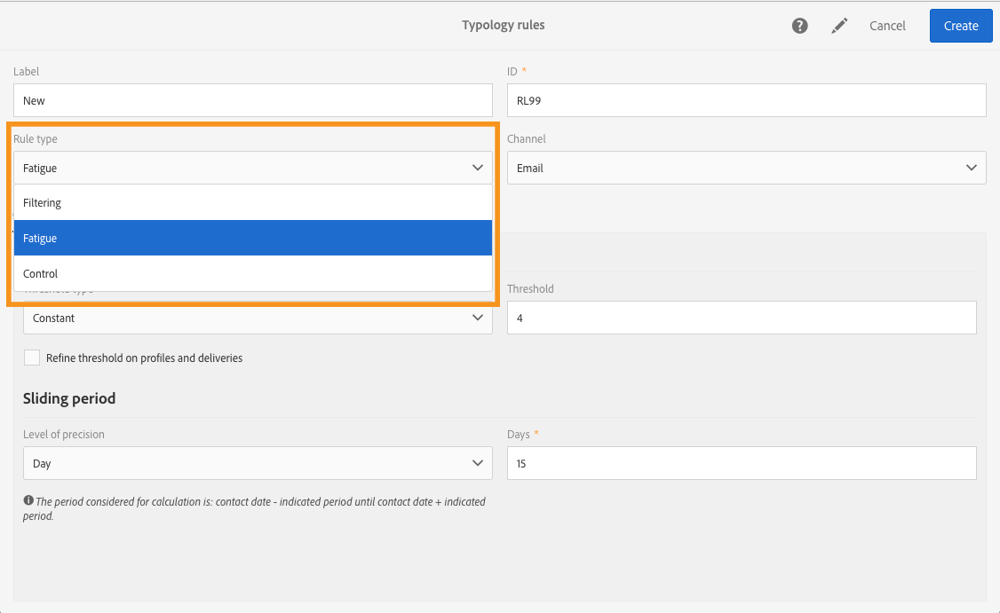
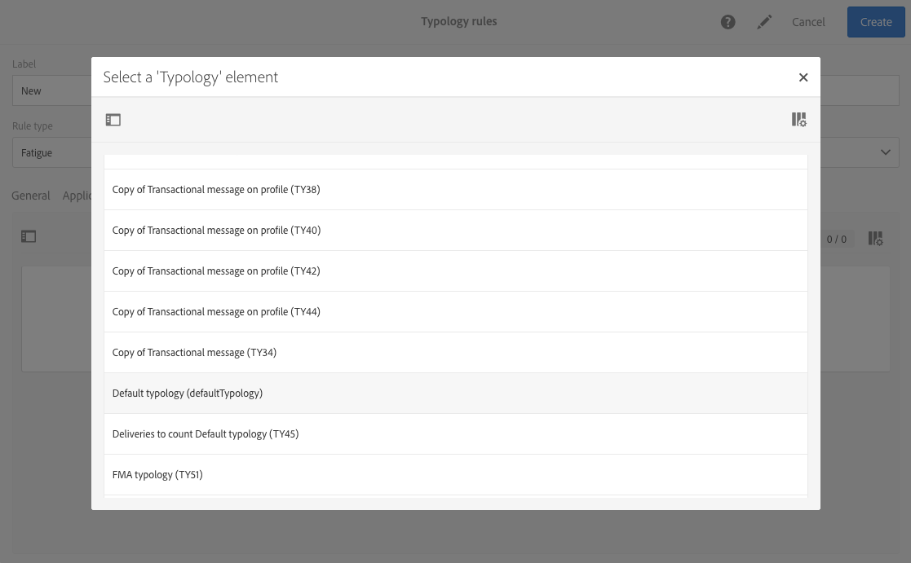
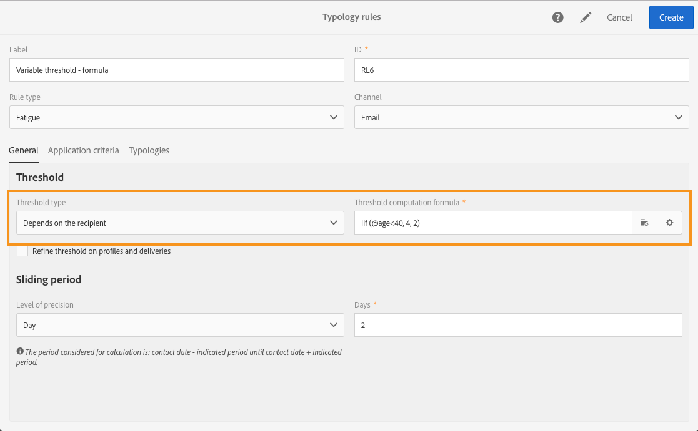

# 피로 규칙{#fatigue-rules}

## 피로 규칙 정보 {#about-fatigue-rules}

피로 규칙을 통해 마케터는 캠페인에서 요청되지 않은 프로필을 자동으로 제외시키는 글로벌 크로스채널 비즈니스 규칙을 설정할 수 있습니다.

피로도 규칙을 구현하려면 프로필당 최대 메시지 수를 정의하고 규칙이 적용될 기간을 선택합니다. 배달 준비 중에, 프로필은 이미 전송된 메시지의 수에 따라 해당하는 경우 배달에서 제외됩니다.

>[!NOTE]
>
>피로도 규칙이 적용되려면 배송에 대한 연락처 날짜를 정의해야 합니다. 메시지를 즉시 보내도록 선택하면 피로 규칙이 적용되지 않습니다.

관련 항목:

* [준비](../../administration/using/configuring-email-channel.md#preparation)
* [유형 관리](../../administration/using/about-typology-rules.md#managing-typologies)
* [유형 규칙 규칙](../../administration/using/about-typology-rules.md#typology-rules)

## 피로 규칙 만들기 {#creating-a-fatigue-rule}

**[!UICONTROL Fatigue]** 유형 분석을 만들고 구성하려면 다음 단계를 적용합니다.

1. 인터페이스의 왼쪽 상단에 있는 Adobe Campaign 로고를 클릭한 다음 **[!UICONTROL Administration]** &gt; **[!UICONTROL Channels]** &gt; **[!UICONTROL Typologies]** &gt; **[!UICONTROL Typology rules]**&#x200B;를 선택합니다.

   

1. 유형 유형 규칙 목록에서 **[!UICONTROL Create]**&#x200B;를 클릭합니다.

   

1. **[!UICONTROL Rule type]** 필드에서 **[!UICONTROL Fatigue]**&#x200B;를 선택합니다.

   

1. **[!UICONTROL Channel]** 필드에서 규칙이 적용될 채널을 선택합니다. 단일 채널 (이메일, SMS, DM, 모바일 애플리케이션) 를 선택하거나 **[!UICONTROL All channels]**&#x200B;선택할 수 있습니다. 채널 [선택을](../../administration/using/fatigue-rules.md#choosing-the-channel)참조하십시오.

   

1. **[!UICONTROL General]** 탭에서 프로필당 최대 메시지 수를 계산하는 방법을 정의합니다. 상수 임계값 또는 변수를 선택할 수 있습니다. 프로필 및 게시에 대한 임계값을 조정할 수도 있습니다. 이에 대한 자세한 내용은 임계값 [정의를](../../administration/using/fatigue-rules.md#defining-the-threshold)참조하십시오.

   

1. 유형 유형 규칙이 적용될 A **[!UICONTROL Sliding period]** 를 선택합니다. 이에 대한 자세한 내용은 슬라이딩 기간 [설정을](../../administration/using/fatigue-rules.md#setting-the-sliding-period)참조하십시오.

   

   이 예에서는 (이전 스크린샷 참조), 15 일의 슬라이딩 기간 동안 최대 4 개의 메시지를 보내도록 선택합니다.

1. **[!UICONTROL Application criteria]** 탭에서 모든 제공에 이 규칙을 적용하도록 선택하거나 보낼 메시지에 따라 규칙의 적용 가능성을 제한할 수 있습니다. 이 규칙은 애플리케이션 조건이 충족되는 경우에만 실행됩니다. 예를 들어 지정된 단어부터 시작하거나 특정 문자가 포함된 ID가 포함된 메시지에만 규칙을 적용할 수 있습니다. 필터링 규칙의 적용 가능성 [제한을 참조하십시오](../../administration/using/filtering-rules.md#restricting-the-applicability-of-a-filtering-rule).

   

1. **[!UICONTROL Typologies]** 탭을 선택하고 유형 유형 규칙을 전달에 사용된 유형 유형에 연결합니다. [유형](../../administration/using/about-typology-rules.md#managing-typologies) 및 [유형 규칙 관리를 참조하십시오](../../administration/using/about-typology-rules.md#typology-rules).

   

   >[!NOTE]
   >
   >유형화는 배달 템플릿에 정의하여 이 템플릿을 사용하여 만든 모든 게시에 자동으로 적용할 수 있습니다.

배달 준비 중에, 프로필은 이미 전송된 배달의 수에 따라 해당하는 경우 배달에서 제외됩니다. 배달 로그에서 피로 규칙 실행 결과를 볼 수 있습니다. 피로 결과 [보기를 참조하십시오](../../administration/using/fatigue-rules.md#viewing-the-fatigue-results).

>[!CAUTION]
>
>피로도 규칙이 작동하려면 배달에 대한 연락처 날짜를 정의해야 합니다. 메시지를 즉시 보내도록 선택하면 피로 규칙이 적용되지 않습니다.

## 채널 선택 {#choosing-the-channel}

피로 규칙은 다양한 채널에 사용할 수 있습니다. 채널은 유형 규칙 규칙 설정의 **[!UICONTROL Channel]** 필드에 정의됩니다. 단일 채널을 선택하거나 **[!UICONTROL All channels]**&#x200B;선택할 수 있습니다.

**사용 가능한 채널**

다음 채널을 사용할 수 있습니다.

* 이메일
* 모바일 (SMS)
* DM
* 모바일 애플리케이션: 이 채널을 통해 푸시 알림을 프로필 또는 앱 가입자에게 보낼 수 있습니다. 프로파일에 알림을 보내도록 선택하면 다중 채널 피로도 규칙과 호환됩니다.

   >[!CAUTION]
   >
   >피로 규칙은 앱 가입자에게 전송된 푸시 알림과 호환되지 않습니다. 앱 가입자에게 메시지를 보내는 경우 피로 규칙이 적용되지 않습니다.

* 모든 채널: 이 옵션을 사용하면 모든 채널에 규칙을 적용할 수 있습니다. 예를 들어 모든 채널에서 매월 최대 3 개의 메시지를 보내도록 결정할 수 있습니다. 지난 주에 2 개의 이메일을 프로필로 보냈고 푸시 알림을 오늘 보내려고 하는 경우, 동일한 프로필이 제외됩니다.

**배달 유형**

피로 규칙은 모든 배달 유형과 호환됩니다. 한 번의 샷 전달, 반복되는 전달, 워크플로우 전달 및 트랜잭션 메시지.

**트랜잭션 메시지는** 리마케팅 메시지와 같은 마케팅 메시지 (타깃팅 프로필) 는 물론 이벤트 (Rtevent) 를 타깃팅하는 서비스 메시지를 전송하는 데 사용할 수 있습니다. 피로 규칙은 마케팅 메시지만 (타깃팅 프로필) 와 호환됩니다. 이벤트 트랜잭션 메시지에는 프로필 정보가 포함되어 있지 않으므로, 프로필이 있는 취약점의 경우에도, 피로도 규칙과 호환되지 않습니다. 트랜잭션 메시징에서 마케팅 메시지를 지원하므로 마케팅 거래 메시지를 포함한 모든 채널에 피로 규칙을 **적용할**&#x200B;수 있습니다.

## 임계값 정의 {#defining-the-threshold}

각 피로 규칙은 임계값을 정의합니다. 즉, 지정된 기간 동안 하나의 프로필로 전송할 수 있는 최대 메시지 수를 정의합니다. 이 임계값에 도달하면, 고려된 기간이 끝날 때까지 더 이상 배달을 수행할 수 없습니다. 이 프로세스를 사용하면 메시지가 설정된 임계값을 초과하는 경우 배달에서 프로파일을 자동으로 제외하여 과도하게 요청되지 않아도 됩니다.

임계값은 상수 또는 변수일 수 있습니다. 즉, 특정 기간 동안 임계값은 하나의 프로필에서 다른 프로필로 또는 동일한 프로필에 따라 다를 수 있습니다.

**수정 임계값 사용**

임계값은 관련 기간 동안 프로필로 전송할 수 있는 최대 메시지 수를 나타냅니다.

기본적으로 임계값은 일정하며 규칙에서 인증한 최대 메시지 수를 표시해야 합니다.

**변수 임계값 사용**

변수 임계값을 정의하려면 필드에서 값을 **[!UICONTROL Depends on the recipient]****[!UICONTROL Threshold type]** 선택합니다.

다음 두 가지 옵션이 있습니다.

* 프로필 필드를 선택합니다. 임계값은 선택한 필드에 따라 각 프로필에 따라 다릅니다. 예를 들어,' 통신 빈도'필드로 프로필 리소스를 확장한 경우 **[!UICONTROL Threshold computation formula]** 필드 오른쪽의 단추를 클릭하고 필드를 선택합니다. 각 프로필에 대해 임계값은'통신 빈도'필드의 값을 가져옵니다.

   

* 공식을 정의합니다. **[!UICONTROL Threshold computation formula]** 필드 오른쪽의 두 번째 단추를 클릭하여 고급 임계값 계산 공식을 정의합니다. 예를 들어 프로필이 속한 세그먼트에 따라 승인 메시지의 수를 인덱싱할 수 있습니다. 즉,' 웹'세그먼트에 속하는 프로필은 다른 프로필보다 더 많은 메시지를 받을 수 있음을 의미합니다. **[!UICONTROL Iif (@origin='Web', 5, 3)]** 유형 공식은 5 개의 메시지를 웹 세그먼트의 프로필로 전달하고 다른 세그먼트에 대해 3 개의 메시지를 전달합니다.

   

**프로필 및 전달 기준 개선**

기본적으로 모든 메시지는 임계값 계산에 고려됩니다. 배달을 준비할 때 카운트하도록 프로필 및 배달을 필터링하려면 **[!UICONTROL Refine Threshold on profiles and deliveries]** 상자를 선택합니다.

다음 예에서는 남성 프로파일만 계산되며 **뉴스레터로** 시작하는 레이블이 있는 전달만 계산됩니다.

납품의 임계값을 조정하는 것은 전체 규칙 ( **[!UICONTROL Application criteria]** 탭) 의 적용 가능성을 제한하는 것과 다릅니다.

* **[!UICONTROL Application criteria]**: 특정 기준에 따라 규칙을 실행하도록 선택할 수 있습니다. 예를 들어 응용 프로그램 조건이'Newsletter로 시작'인 경우 규칙은 이러한 조건을 준수하는 배달물에만 적용됩니다. 배달 레이블이'홍보'로 시작하는 경우 규칙이 전혀 실행되지 않습니다.
* **[!UICONTROL Refine threshold on profiles and deliveries > Deliveries to count]**: 이 유형 규칙을 사용한 모든 배달은 규칙을 실행하지만, 과거 및 예약된 배달을 계산하려는 배달 중에 결정합니다. 예를 들어 제한이'뉴스레터로 시작'인 경우 배달 레이블이'판촉 행사'로 시작되는 경우에도 규칙이 실행됩니다. 선택한 슬라이딩 기간 동안 레이블이'뉴스레터'로 시작하는 배달의 수를 계산합니다.

## 슬라이딩 기간 설정 {#setting-the-sliding-period}

피로 규칙은 N 일 순환 기간에 정의됩니다. 기간은 **[!UICONTROL Sliding period]** 섹션에 구성됩니다 (예: 2 주, 7 일 또는 5 시간).

규칙이 실행되면 이전 배달과 예약된 배달이 모두 고려됩니다. 이렇게 하면 지정된 슬라이딩 기간 동안 임계값을 초과하지 않습니다.

예를 들어, 48 시간 기간을 정의하는 경우 시스템은 연락처 날짜 48 시간 **전이나 연락처** 날짜 48 시간 **후에 보게**&#x200B;됩니다. 따라서 선택한 기간은 두 배로 증가하여 이전 배달과 이전 배달의 통합을 가능하게 합니다.

2 주 기간으로 전달되는 배달을 제한하려면 [슬라이딩 기간] 섹션에 **하루** , **7** 또는 **1 주를** 입력합니다. 배달일로부터 7 일까지 보내지고 규칙이 적용되는 배달 날짜 이후 7 일까지 예약된 배달은 계산에 고려된다.

## 피로 결과 보기 {#viewing-the-fatigue-results}

배달 준비 중에, 프로필은 이미 전송된 배달의 수에 따라 해당하는 경우 배달에서 제외됩니다. 피로 규칙 실행 결과를 보려면 **[!UICONTROL Deployment]** 블록의 오른쪽 하단에 있는 단추를 클릭합니다.

세 개의 탭을 사용할 수 있으며, 적용된 규칙 이름을 포함하여 피로 실행 결과에 대한 세부 사항을 보여 줍니다.

* 배달 로그:

   

* 제외 로그:

   

* 제외 원인:

   

## 피로 규칙 요약 보고서 보기 {#viewing-the-fatigue-rule-summary-report}

Adobe Campaign는 캠페인의 적용 방법을 이해하는 데 도움이 되는 피로 규칙에 대한 전용 보고서를 제공합니다. 이를 통해 캠페인이 서로에게 미치는 영향을 파악하고 적절한 조정을 할 수 있습니다.

**[!UICONTROL Fatigue rules summary]** 보고서는 **[!UICONTROL Reports]** 각 프로그램, 캠페인 및 메시지의 오른쪽 상단 모서리에 있는 단추에서 액세스할 수 있습니다.

화면의 왼쪽 부분에서는 배달'연락처 날짜'에서 보고서 데이터를 필터링할 수 있습니다. 기본적으로 선택한 기간은 현재 날짜 15 일 전에 시작되고 이후 15 일 후에 종료됩니다. 특정 피로 규칙을 필터링할 수도 있습니다.

파이 차트는 선택한 기간에 다음 정보를 표시합니다.

* **[!UICONTROL Total targeted]**: 메시지 준비 전 총 목표 수
* **[!UICONTROL Excluded]**: 피로 규칙 애플리케이션으로 인한 총 제외 수
* **[!UICONTROL Other exclusions]**: 기타 유형 규칙으로 인한 총 제외 수
* **[!UICONTROL To deliver]**: 메시지 준비 후 배달될 메시지의 총 수 ( **[!UICONTROL To deliver]** = **[!UICONTROL Total targeted]** - **[!UICONTROL Excluded]** - **[!UICONTROL Other exclusions]** )

차트 오른쪽에는 피로 규칙으로 분류된 제외 수가 있습니다.

하단 표에는 선택한 기간 내의 모든 배달이 표시됩니다. 각 배달에 대해 적용된 피로 규칙 및 해당 제외를 볼 수 있습니다. 연락처 날짜가 없는 배달도 표에도 표시됩니다.

* **[!UICONTROL 0]** fatigue 규칙이 적용되었지만 제외되지 않았음을 의미합니다.
* **[!UICONTROL -N]** n 제외 발생을 의미합니다.
* 빈 필드는 피로 규칙이 적용되지 않았음을 의미합니다.

>[!NOTE]
>
>표시되는 데이터는 보고서에 액세스하는 프로그램, 메시지 또는 캠페인에는 컨텍스트가 없습니다. 이 보고서에는 모든 조직 단위에 대한 모든 피로 규칙 및 배달이 표시됩니다. 이렇게 하면 캠페인이 다른 사람들의 영향을 받는 방법을 이해하기 위해 모든 게재의 전체 보기를 얻을 수 있습니다.

## examples {#examples}

피로 관리 구현에는 여러 가지 가능성이 있습니다. 다음은 수행할 수 있는 작업의 예입니다.

* 모든 채널에 적용되는 **상수 임계값을** 사용하여 피로 규칙을 **만듭니다**.

   7 일의 슬라이딩 기간 동안 상수 임계값 3 이 있는 멀티채널 규칙을 만든다고 가정합니다.

   지난 주 프리미엄 프로필은 홍보 이메일과 트랜잭션 리마케팅 이메일을 받았습니다. 다음 주에 전송할 SMS도 예약했습니다. 현재 모든 프로파일을 대상으로 하는 푸시 알림을 전송하기로 결정했습니다. 프리미엄 프로필은 2 주 동안 최대 메시지 수에 도달했으므로 오늘 푸시 시 제외됩니다.

   

* 프로필 필드를 기반으로 **변수 임계값을** 사용하여 피로 **규칙을 만듭니다**.

   ' Communication Limit'필드로 프로필 리소스를 확장하여 각 프로필에 대해 다른 임계값을 정의했습니다. 피로 규칙에서 이 필드를 기반으로 변수 임계값을 정의하고 슬라이딩 기간을 2 일로 선택합니다. 프로필의 예를 살펴보겠습니다. John의 커뮤니케이션 제한은 1 이고 David의 한계값은 2 입니다. 모두 어제 뉴스레터 이메일을 받았습니다. 지금 다른 이메일을 보내 주십시오. John 이 Target에서 제외되었기 때문에 David 만이 이를 받게 됩니다.

   

* **임계값 계산 공식을 사용하여 피로 규칙을 만듭니다**.

   프로필 연령에 따라 임계값을 변경하려고 합니다. 프로필이 40 미만이면 제한 4와 이전 프로필에 대한 제한 2를 정의합니다. 확장 필드가 있는 각 프로필에 대해 이 임계값을 정의하는 대신, 피로도 규칙에 공식을 직접 만들어 프로필 연령에 따른 임계값을 계산할 수 있습니다. 이 예에서는 공식이 **[!UICONTROL Iif (@age<40, 4, 2)]**&#x200B;있을 것입니다.

   

   >[!NOTE]
   >
   >이 섹션에는 한계값 계산 공식을 사용한 피로 규칙의 단계별 예가 포함되어 있습니다.

* 프로필 및 배달의 임계값을 **조정하는** 피로 규칙을 만듭니다.

   ' 점수'필드를 사용하여 프로필 리소스를 확장했으며'유형'필드로 배달 리소스를 확장했습니다. 상수 임계값 3를 정의하려고 하지만, 유형'alert'또는'black friday'유형의 모든 배달과 점수가 10 이상인 모든 프로필에서 제외하려고 합니다. 규칙이 실행되면 과거 및 예약된 배달 중에 점수가 10 보다 작은 프로필에 전송되는'alert'또는'black friday'유형이 아닌 모든 배달이 계산됩니다.

   

다음은 임계값 계산 공식을 사용한 피로 규칙의 단계별 예입니다.

이 사례에서는 매주 2 개 이상의 메시지를 프리미엄 프로필로 전달하고 일주일에 2 개의 메시지를 표준 프로필에 전달하지 않도록 유형 지정 규칙을 만듭니다.

고객 및 잠재 고객을 파악하기 위해 프리미엄 프로필의 경우 0, 표준 프로필의 경우 1 이 포함된 프로필 리소스를 **[!UICONTROL Status]** 필드에 추가했습니다.

규칙을 만들려면 다음 단계를 적용합니다.

1. **새 피로** 유형 유형 유형을 만듭니다.
1. **[!UICONTROL Threshold]** 섹션에서 각 프로필에 따라 임계값을 계산하는 공식을 만듭니다. 필드에서 **[!UICONTROL Depends on the recipient]** 값을 선택한 **[!UICONTROL Threshold type]** 다음 **[!UICONTROL Threshold computation formula]** 필드 오른쪽의 두 번째 단추 아이콘을 클릭합니다.

   

1. **[!UICONTROL List of functions]** 섹션에서 노드에 **있는 IIF** 함수를 **[!UICONTROL Others]** 두 번 클릭합니다.

   

1. 그런 다음 섹션에서 프로필 **상태를** **[!UICONTROL Available fields]** 선택합니다.

   

1. 원하는 값을 입력하여 다음 공식을 만듭니다. **IIF (@ status = 0,2,4)**

   

   이 공식을 사용하면 상태가 0 이면 2를 지정하고 다른 모든 상태에 대해 4를 지정할 수 있습니다.

1. 공식을 **[!UICONTROL Confirm]** 승인하려면을 클릭합니다.
1. 규칙이 **[!UICONTROL Sliding period]** 적용되는 대상을 지정합니다. 이 경우 7 일 동안 2 주 기간으로 배달된 배달을 제한합니다.

   

1. 이제 방금 만든 규칙을 배달에 적용하기 위해 유형 유형에 연결합니다. 이렇게 하려면 **[!UICONTROL Typologies]** 탭을 선택하고 **[!UICONTROL Create element]** 게시에 사용된 유형을 선택합니다.

   

1. 규칙을 저장하여 만들기를 승인합니다.

규칙은 유형 유형에 따라 모든 배달에 적용됩니다.
