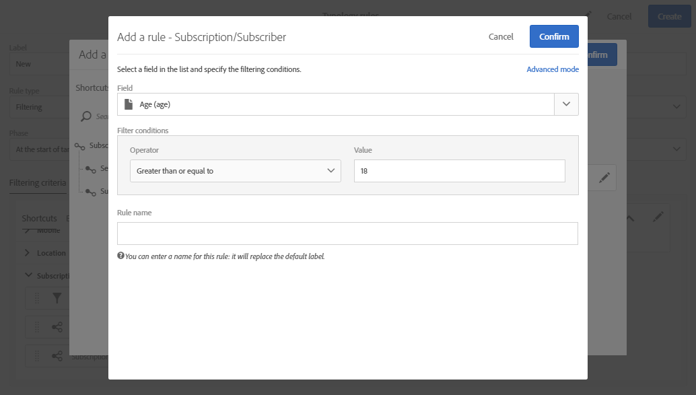
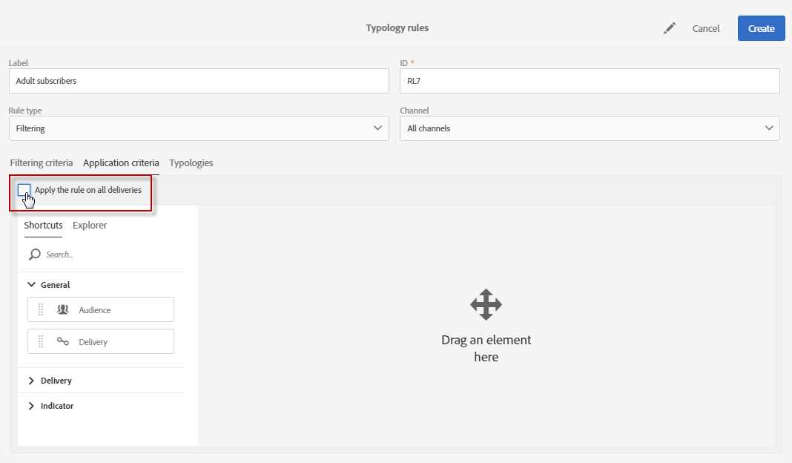

# Filtering rules{#filtering-rules}

필터링 규칙을 사용하면 이미 지정된 수의 이메일 또는 이미 전송된 프로필과 같이 쿼리에 정의된 기준에 따라 메시지 타겟의 한 부분을 제외할 수 있습니다.

예를 들어 18 세 미만의 구독자가 통신문을 받지 못하도록 뉴스레터 가입자를 필터링할 수 있습니다.

## Creating a filtering rule {#creating-a-filtering-rule}

1. Create a **Filtering** typology rule, one that can be applied on all communication channels.

   

1. **[!UICONTROL Filtering criteria]** 탭에서 **[!UICONTROL Subscription]** 카테고리에서 구독을 선택합니다.

   

1. In the **[!UICONTROL Explorer]** tab of the query editor, drag and drop the **[!UICONTROL Subscriber]** node into the main part of the screen.

   

1. Select the **[!UICONTROL Age]** field and define the filtering conditions so that the age of the subscribers is 18 or above.

   

1. **[!UICONTROL Typologies]** 탭에서 이 규칙을 유형 분석에 연결합니다.

   

1. 사용할 배달 템플릿에서 문제의 유형을 선택해야 합니다.

   

   >[!NOTE]
   >
   >To access the delivery templates, select **[!UICONTROL Resources]** &gt; **[!UICONTROL Templates]** in the navigation menu, which can be accessed via the Adobe Campaign logo.

이 규칙을 메시지에 사용할 때마다 미성년자로 간주되는 가입자는 자동으로 제외됩니다.

## Restricting the applicability of a filtering rule {#restricting-the-applicability-of-a-filtering-rule}

보낼 메시지에 따라 필터링 규칙의 적용 가능성을 제한할 수 있습니다.

1. In the typology rule's **[!UICONTROL Application criteria]** tab, uncheck the **[!UICONTROL Apply the rule on all deliveries]** option, which is enabled by default.

   

1. 필터를 정의하려면 쿼리 편집기를 사용합니다. 예를 들어 레이블이 지정된 단어로 시작하는 메시지나 특정 문자가 포함된 메시지에 대해서만 규칙을 적용할 수 있습니다.

   

이 경우 규칙은 정의된 기준에 해당하는 메시지에만 적용됩니다.

## Default deliverability exclusion rules {#default-deliverability-exclusion-rules}

Two filtering rules are available by default: **[!UICONTROL Exclusion of addresses]** ( **[!UICONTROL addressExclusions]** ) and **[!UICONTROL Exclusion of domains]** ( **[!UICONTROL domainExclusions]** ). 이메일 분석 중에 이러한 규칙은 수신자 이메일 주소를 배달 가능성 인스턴스에서 관리되는 암호화된 전역 제외 목록에 포함된 금지된 주소 또는 도메인 이름과 비교합니다. 일치하는 항목이 있으면 해당 받는 사람에게 메시지가 전송되지 않습니다.

이것은 악의적인 활동, 특히 스팸 사용으로 인해 블랙리스트에 추가되지 않도록 하기 위한 것입니다. 예를 들어, 웹 양식을 통해 구독하는 데 Spamtrap 이 사용되는 경우 확인 이메일이 해당 Spamtrap에 자동으로 보내지며 이로 인해 주소가 자동으로 차단됩니다.

>[!NOTE]
>
>전역 억제 목록에 포함된 주소 및 도메인 이름은 숨겨집니다. 제외된 받는 사람의 수만 배달 분석 로그에 표시됩니다.

