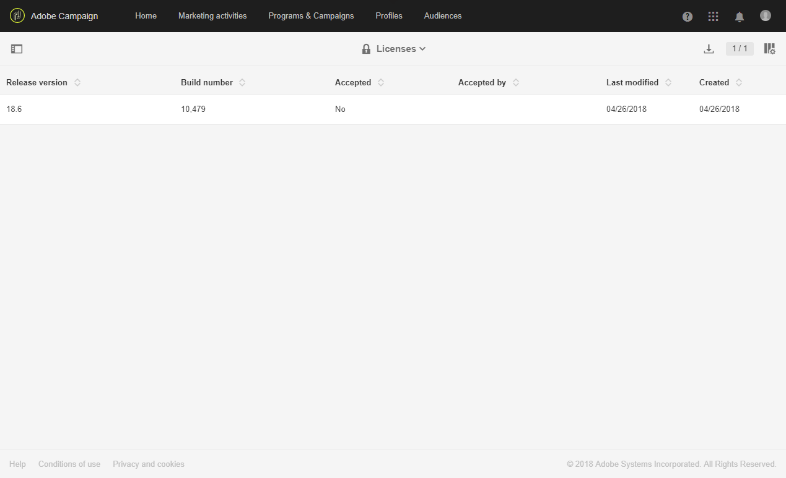
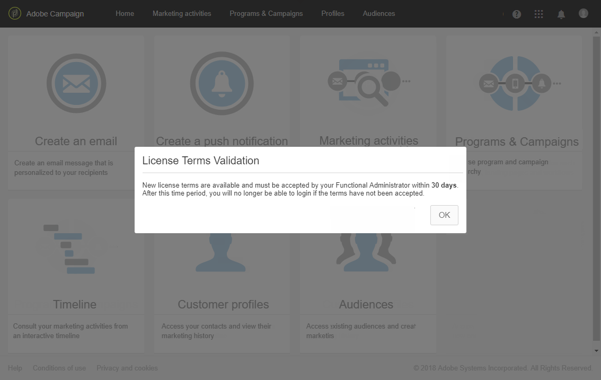
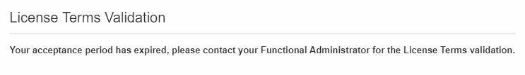

# 라이선스{#licenses}

이 **[!UICONTROL Licenses]** 창에서는 인스턴스에 설치된 라이선스와 빌드 번호, 릴리스 버전 또는 계약 약관이 수락된 사람 및 그 사람에 의해 다른 정보를 볼 수 있습니다.

새로운 빌드 또는 새로운 기능을 사용하면 라이선스 약관이 변경될 수 있으며 인스턴스의 기능 관리자가 라이선스를 부여해야 합니다.

표준 사용자는 로그인 후 다음 창이 나타나며 해당 부분에 필요한 작업은 없습니다. 그래도 Adobe Campaign에서 **[!UICONTROL OK]** 버튼을 클릭해도 됩니다

관리자는 설치 후 30일 이내에 체크 및 클릭하여 새로운 계약 약관을 읽고 확인해야 **[!UICONTROL I accept the terms from the license agreement]** 합니다 **[!UICONTROL Confirm]**.

계약이 수락되지 않는 경우 30일이 경과했으며, 사용자는 이 인스턴스를 사용할 수 없습니다. 표준 사용자는 Adobe Campaign 기능에 액세스할 수 없으며 기능 관리자가 계약 조건을 수락할 때까지 다음 메시지만 볼 수 있습니다.

