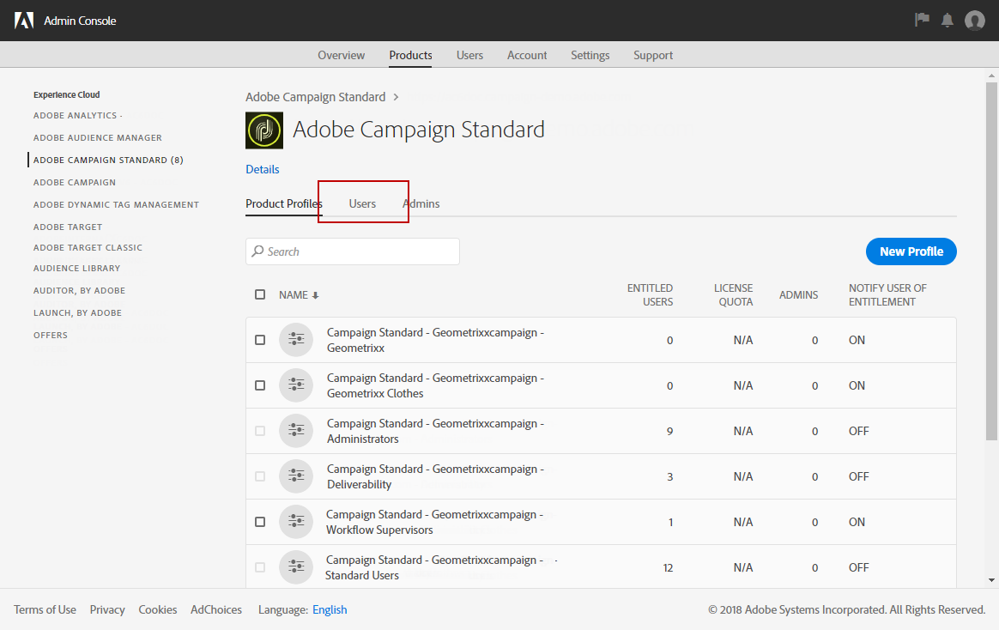
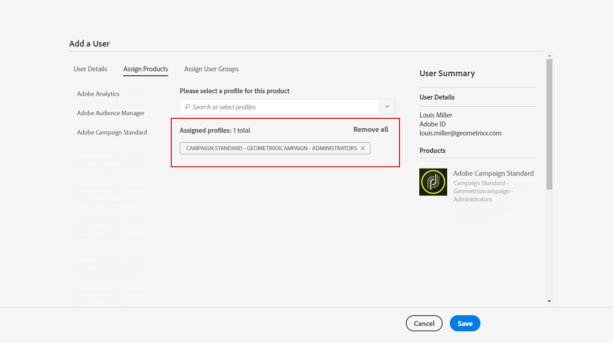
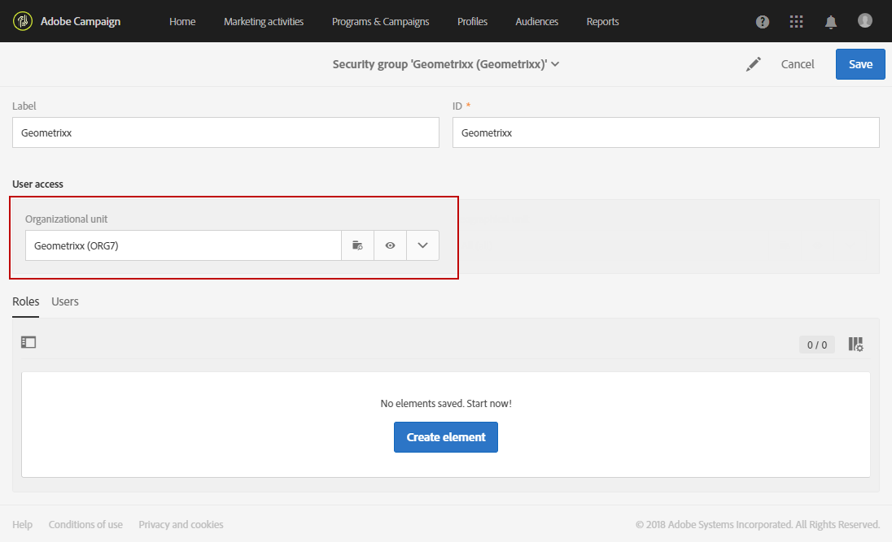

# 그룹 및 사용자 관리{#managing-groups-and-users}

## 보안 그룹 기본 정보 {#about-security-groups}

보안 그룹은 조직 내에서 동일한 역할과 권한을 공유하는 사용자의 집합입니다.

사용자는 항상 보안 그룹에 연결되어 있어야 합니다. 이를 통해 특정 역할 및 조직 단위를 할당할 수 있습니다.

역할에 대해 더 자세히 알아보고 싶다면, 다음 페이지의 표에 사용자의 역할에 따라 사용할 수 있는 다양한 작업이 나타나 있습니다. [Adobe Campaign Standard 권한](https://docs.campaign.adobe.com/doc/standard/en/Technotes/AdobeCampaign-ACSRights.pdf)

기본 보안 그룹은 다음과 같습니다.

* **[!UICONTROL Administrators]**
* **[!UICONTROL Delivery supervisors]**
* **[!UICONTROL Message Center agents]**
* **[!UICONTROL Standard Users]**
* **[!UICONTROL Workflow supervisors]**

보안 그룹에 연결되어 있지 않은 사용자는 Adobe Campaign에 액세스할 수 없습니다.

사용자의 액세스를 제한하려면 해당 사용자를 Campaign Standard 사용자 그룹에 추가하지 마십시오. 이 그룹은 **[!UICONTROL All]** 조직 단위와 연결되어 있기 때문입니다. 

>[!NOTE]
>
>**[!UICONTROL All (all)]** 조직 단위는 기본적으로 **[!UICONTROL Administrators]** 보안 그룹에 할당되어 있습니다. 이는 읽기 전용이므로 수정할 수 없습니다.

## 보안 그룹 만들기 및 사용자 할당 {#creating-a-security-group-and-assigning-users}

>[!IMPORTANT]
>
>Admin Console에서 보안 그룹은 프로필로 지칭됩니다.

기본 제공 그룹이 사용자를 관리하기에 충분하지 않은 경우 자체 보안 그룹을 만들 수 있습니다. Adobe Campaign 관리 메뉴와 Admin Console에 모두 액세스할 수 있는 관리자가 이 그룹을 관리할 수 있습니다. Admin Console에 대한 자세한 내용은 이 [설명서](https://helpx.adobe.com/kr/enterprise/managing/user-guide.html)를 참조하십시오.

여기서는 먼저 표준 사용자와 관리자의 두 기본 제공 그룹을 사용자에게 할당합니다. 이 보안 그룹은 Adobe Campaign의 일부 기능을 제한합니다. 표준 사용자는 Adobe Campaign에 대한 기본적인 액세스 권한이 있으며, 관리자는 관리 메뉴 등에 액세스할 수 있습니다.

Admin Console에서 보안 그룹을 변경하면 사용자가 Adobe Campaign에 로그인하는 즉시 모든 변경 사항이 동기화됩니다.

다음으로 보안 그룹 Geometrixx와 Geometrixx Clothes 집합을 만들어 표준 사용자 및 관리자의 일부 액세스를 조직 단위에 따라 제한하려고 합니다.

먼저 사용자에게 기본 제공 보안 그룹 중 하나를 할당합니다.

1. Admin Console에서 인스턴스 선택하고 **사용자** 탭을 선택합니다.

   

1. **[!UICONTROL Add user]** 버튼을 클릭하고 사용자의 이메일 주소를 입력합니다.
1. **[!UICONTROL Assign Products]** 탭에서 인스턴스를 선택한 다음 드롭다운 목록에서 **[!UICONTROL Administrators]** 기본 제공 보안 그룹을 선택합니다. 이렇게 하면 해당 사용자가 관리 메뉴에 액세스하고 다음 보안 그룹을 만들 수 있습니다.

   

1. **[!UICONTROL Save]**&#x200B;을(를) 클릭하고 같은 절차를 따라 **[!UICONTROL Standard Users]** 기본 제공 보안 그룹을 새로운 사용자에게 할당합니다.

   

두 사용자에게 **[!UICONTROL Administrators]** 및 **[!UICONTROL Standard users]** 기본 제공 보안 그룹을 통해 역할을 할당하고 나면 이제 관리자 사용자는 두 보안 그룹 **Geometrixx**&#x200B;와 **Geometrixx Clothes**&#x200B;를 만들어 사용자에게 기본 제공 보안 그룹 외에도 조직 단위를 할당할 수 있습니다.

1. Admin Console에서 인스턴스를 선택하고 **제품** 탭을 선택합니다.
1. **새 프로필** 버튼을 클릭하여 **Geometrixx** 보안 그룹을 만듭니다.

   

1. **[!UICONTROL Campaign Standard- instance name - ID of the security group]** 구문을 정확히 따라 **[!UICONTROL Profile name]**&#x200B;을(를) 입력하고 **[!UICONTROL Done]**&#x200B;을(를) 클릭합니다. 

   선택한 ID는 Adobe Campaign에서 보안 그룹을 만들 때 사용됩니다.

   >[!NOTE]
   >
   >위의 구문이 이전 인스턴스에서 작동하지 않는 경우 **[!UICONTROL Campaign - instance name - ID of the security group]**(으)로 바꿉니다.

   

1. 그런 다음 동일한 절차에 따라 **Geometrixx Clothes** 보안 그룹을 만듭니다.
1. **[!UICONTROL Users]** 탭을 선택하여 사용자에게 보안 그룹을 지정합니다.

   

1. 앞에서 만든 사용자를 클릭한 다음 **[!UICONTROL Products]** 카테고리의  아이콘을 클릭합니다.

   **[!UICONTROL Edit products assigned directly]**&#x200B;을(를) 선택하여 새로운 보안 그룹을 사용자에게 할당합니다.

   

1. **[!UICONTROL Assign Products]** 탭에서 인스턴스를 선택한 다음 드롭다운 목록에서 앞에서 만든 보안 그룹 Geometrixx를 선택하여 관리자 사용자에게 할당합니다.

   **[!UICONTROL Save]**&#x200B;을(를) 클릭합니다.

   

   한 사용자가 여러 그룹에 있는 경우에는, 

   * 여러 그룹의 역할이 누적됩니다. 여기서는 사용자가 두 개의 다른 그룹에 있습니다. 하나는 역할에 해당하며, 다른 하나는 단위에 해당합니다.
   * 사용할 계층에서 가장 높은 위치에 있는 것은 단위입니다([조직 단위](../../administration/using/organizational-units.md) 섹션의 예제 참조).
   * 단위가 동일한 수준을 가지고 있고 계층에서 병렬 분기에 있는 경우, 해당 사용자는 더 이상 연결할 수 없습니다.

1. 같은 절차에 따라 Geometrixx Clothes 보안 그룹을 표준 사용자에게 할당합니다.

   

이제 새로 만든 보안 그룹은 Admin Console에서 만들어졌습니다. 이를 완전히 동기화하려면 Adobe Campaign에서도 만들어야 합니다.

관리자 사용자는 조직 단위를 할당하는 데 사용되는 보안 그룹 집합(Geometrixx 및 Geometrixx Clothes)을 만들어야 합니다. 조직 단위를 만드는 방법에 대해 알아보려면 [단위 만들기 및 관리](../../administration/using/organizational-units.md#creating-and-managing-units)를 참조하십시오.

1. 왼쪽 상단 모서리에서 **[!UICONTROL Adobe Campaign]** 로고를 클릭한 다음 **[!UICONTROL Administration > Users & Security > Security groups]**&#x200B;을(를) 선택합니다.
1. 새 보안 그룹을 만들고 **[!UICONTROL Label]** 및 **[!UICONTROL ID]**&#x200B;을(를) 지정합니다.

   ID는 Admin Console에서 선택한 ID와 동일해야 합니다.

1. **[!UICONTROL User access]** 필드에서 조직 단위를 할당합니다. 여기서는 Geometrixx 보안 그룹에 **[!UICONTROL All]** 조직 구성 단위가 할당됩니다.

   >[!NOTE]
   >
   >사용자에게 기본 보안 그룹을 할당하는 경우 조직 구성 요소를 재설정해야 합니다.

   

1. 보안 그룹에 역할을 할당할 수도 있습니다. 이 예제에서는 역할 할당에 기본 제공 보안 그룹 **[!UICONTROL Administrators]** 및 **[!UICONTROL Standard users]**&#x200B;을(를) 사용했으므로 이 단계를 진행할 필요가 없습니다.
1. 같은 절차에 따라 마지막 보안 그룹 Geometrixx Clothes를 만들고 Geometrixx Clothes 조직 단위를 할당합니다.

   

이제 사용자가 보안 그룹에 할당되어 Adobe Campaign에 연결할 수 있습니다.

>[!IMPORTANT]
>
>Admin Console에서 사용자를 보안 그룹에서 제거할 경우, 해당 사용자는 Adobe Campaign 보안 그룹의 일부로 남으며 더 이상 Adobe Campaign에 로그인할 수 없습니다. 이 경우 민감한 정보를 수신하지 못하도록 Admin Console에서 해당 사용자의 이메일 주소를 제거합니다.

