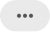

# 그룹 및 사용자 관리{#managing-groups-and-users}

## 보안 그룹 정보 {#about-security-groups}

보안 그룹은 조직 내에서 동일한 역할과 권한을 공유하는 사용자 집합입니다.

사용자는 항상 보안 그룹에 연결되어 있어야 합니다. 이렇게 하면 특정 역할 및 조직 단위를 할당할 수 있습니다.

역할에 대한 자세한 내용은 다음 페이지의 표를 통해 사용자의 역할에 따라 사용할 수 있는 다양한 작업을 제공합니다.Adobe [Campaign Standard 인증](https://docs.campaign.adobe.com/doc/standard/en/Technotes/AdobeCampaign-ACSRights.pdf).

기본 보안 그룹은 다음과 같습니다.

* **[!UICONTROL Administrators]**
* **[!UICONTROL Delivery supervisors]**
* **[!UICONTROL Message Center agents]**
* **[!UICONTROL Standard Users]**
* **[!UICONTROL Workflow supervisors]**

사용자가 보안 그룹에 연결되어 있지 않으면 Adobe Campaign에 액세스할 수 없습니다.

사용자의 액세스를 제한하려면 **[!UICONTROL All]**조직 구성 단위에 연결되어 있으므로 사용자를 Campaign Standard 사용자 그룹에 추가하지 마십시오.

>[!NOTE]
>
>기본적으로 조직 구성 **[!UICONTROL All (all)]**단위는**[!UICONTROL Administrators]** 보안 그룹에 할당됩니다. 읽기 전용이므로 수정할 수 없습니다.

## 보안 그룹 만들기 및 사용자 할당 {#creating-a-security-group-and-assigning-users}

>[!CAUTION]
>
>관리 콘솔에서 보안 그룹을 프로필이라고 합니다.

기본 그룹이 사용자를 관리하기에 충분하지 않은 경우 자체 보안 그룹을 만들 수 있습니다. Adobe Campaign 관리 메뉴와 관리 콘솔에 액세스할 수 있는 관리자가 관리할 수 있습니다. 관리 콘솔에 대한 자세한 내용은 이 [설명서를 참조하십시오](https://helpx.adobe.com/enterprise/managing/user-guide.html).

여기서는 우선 두 개의 기본 그룹 Standard 사용자와 관리자를 사용자에게 할당해야 합니다. 이러한 보안 그룹은 Adobe Campaign의 일부 기능을 제한합니다.표준 사용자는 Adobe Campaign에 대한 기본 액세스 권한을 가지지만 관리자는 예를 들어 관리 메뉴에 액세스할 수 있습니다.

관리 콘솔에서 보안 그룹에 대한 모든 변경 사항은 사용자가 Adobe Campaign에 로그인하는 즉시 동기화됩니다.

그런 다음 Adobe Standard 사용자 및 관리자의 조직 단위에 따라 일부 액세스를 제한하는 Geometrixx 및 Geometrixx Closes 보안 그룹 세트를 만듭니다.

먼저 사용자에게 즉시 사용 가능한 보안 그룹 중 하나를 할당해야 합니다.

1. 관리 콘솔에서 인스턴스를 선택하고 사용자 **탭을** 선택합니다.

   

1. 단추를 **[!UICONTROL Add user]**클릭하고 사용자의 이메일 주소를 입력합니다.
1. 탭에서 인스턴스를 선택한 다음 드롭다운 목록에서 **[!UICONTROL Assign Products]****[!UICONTROL Administrators]** 즉시 사용 가능한 보안 그룹을 선택합니다. 이렇게 하면 사용자가 관리 메뉴에 액세스하고 다음 보안 그룹을 만들 수 있습니다.

   

1. 동일한 **[!UICONTROL Save]**절차를 클릭하여**[!UICONTROL Standard Users]** 즉시 사용 가능한 보안 그룹을 새 사용자에게 할당합니다.

   

두 사용자가 즉시 사용 가능한 보안 그룹에 **[!UICONTROL Administrators]**연결되면, 관리자는 사용자 역할을 할당하는 보안 그룹 Geometrixx와 Geometrixx Closes를**[!UICONTROL Standard users]** 만들어 **기본 보안 그룹 외에도 사용자에게 조직 구성 단위를** 할당할 수 **** 있습니다.

1. 관리 콘솔에서 인스턴스를 선택하고 제품 **탭을** 선택합니다.
1. 새 **프로필** 단추를 클릭하여 Geometrixx **보안 그룹을** 만듭니다.

   

1. 다음 정확한 구문을 **[!UICONTROL Profile name]**입력하여 입력합니다.을**[!UICONTROL Campaign Standard- instance name - ID of the security group]** 클릭하고 **[!UICONTROL Done]**을 클릭합니다.

   선택한 ID는 Adobe Campaign에서 보안 그룹을 만드는 동안 사용됩니다.

   >[!NOTE]
   >
   >위의 구문이 이전 인스턴스와 작동하지 않는 경우 이 구문을 바꿀 필요가 **[!UICONTROL Campaign - instance name - ID of the security group]**있습니다.

   

1. 그런 다음 동일한 절차에 따라 Geometrixx Clothing **보안 그룹을** 만듭니다.
1. 탭을 선택하여 사용자에게 보안 그룹을 지정합니다. **[!UICONTROL Users]**

   

1. 이전에 만든 사용자를 클릭한 다음  카테고리의 **[!UICONTROL Products]**아이콘을 클릭합니다.

   새 보안 그룹을 사용자에게 할당하려면 **[!UICONTROL Edit products assigned directly]**선택합니다.

   

1. 탭에서 인스턴스를 선택한 다음 드롭다운 목록에서 이전에 만든 보안 그룹 Geometrixx를 선택하여 관리자 사용자에게 할당합니다. **[!UICONTROL Assign Products]**

   클릭 **[!UICONTROL Save]**.

   

   사용자가 여러 그룹에 있는 경우:

   * 여러 그룹의 역할이 누적됩니다. 사용자는 두 개의 다른 그룹에 있습니다.한 가지는 다른 역할에서 작동될 것입니다.
   * 이 단위는 사용될 계층 구조에서 가장 높은 단위입니다(조직 단위 [섹션의 예](../../administration/using/organizational-units.md) 참조).
   * 단위가 동일한 레벨에 있고 계층의 병렬 분기에 있는 경우 더 이상 연결할 수 없습니다.

1. 동일한 절차에 따라 Geometrixx Clothing 보안 그룹을 표준 사용자에게 할당합니다.

   

이제 새로 만든 보안 그룹이 관리 콘솔에서 생성됩니다. 또한 Adobe Campaign에서 완전히 동기화하려면 이 둘을 만들어야 합니다.

관리자 사용자는 조직 단위를 할당하는 데 사용되는 보안 그룹 집합을 만들어야 합니다.Geometrixx 및 Geometrixx Clothing. 조직 단위를 만드는 방법에 대한 자세한 내용은 단위 [만들기 및 관리를](../../administration/using/organizational-units.md#creating-and-managing-units) 참조하십시오.

1. 왼쪽 상단 모서리에서 **[!UICONTROL Adobe Campaign]**로고를 클릭한 다음**[!UICONTROL Administration > Users & Security > Security groups]**&#x200B;선택합니다.
1. 새 보안 그룹을 만들고 **[!UICONTROL Label]**및 를 지정합니다**[!UICONTROL ID]**.

   ID는 관리 콘솔에서 선택한 ID와 같아야 합니다.

1. 필드에서 조직 구성 단위를 **[!UICONTROL User access]**지정합니다. 여기서는 Geometrixx 보안 그룹에**[!UICONTROL All]** 조직 구성 단위가 할당됩니다.

   

1. 보안 그룹에 역할을 할당할 수도 있습니다. 기본 보안 그룹 **[!UICONTROL Administrators]****[!UICONTROL Standard users]** 및 역할을 할당하는 데 사용되므로 이 단계는 필요하지 않습니다.
1. 동일한 절차에 따라 마지막 보안 Geometrixx Clothing을 만들고 Geometrixx Clothing 구성 단위를 할당합니다.

   

이제 사용자가 보안 그룹에 할당되어 Adobe Campaign에 연결할 수 있습니다.

>[!CAUTION]
>
>관리 콘솔의 보안 그룹에서 사용자가 제거되면 사용자는 Adobe Campaign 보안 그룹의 일부로 남으며 더 이상 Adobe Campaign에 로그인할 수 없게 됩니다. 이 경우 관리 콘솔에서 사용자의 이메일 주소를 제거하여 중요한 정보를 수신하지 못하도록 합니다.

