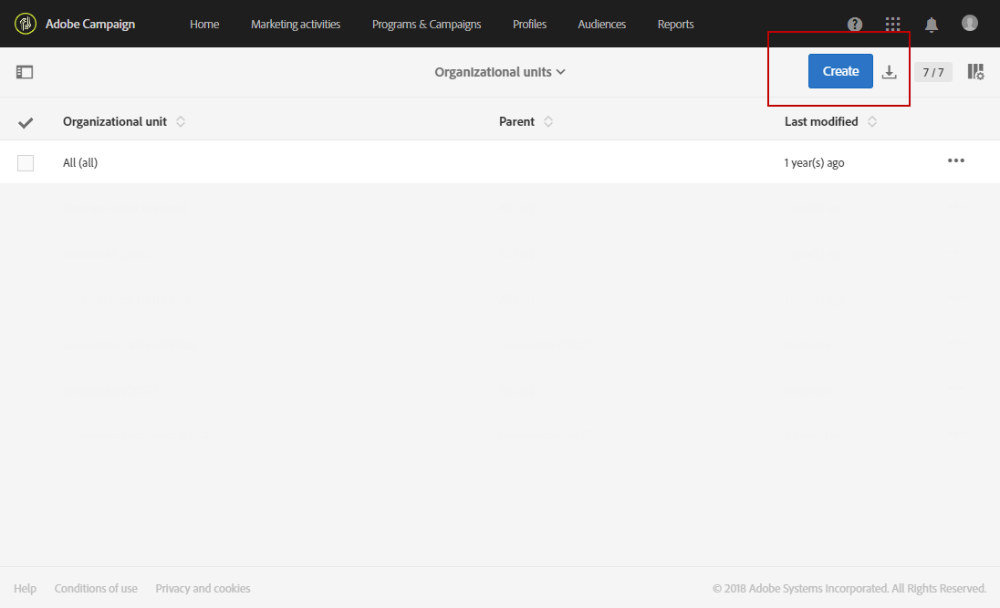

# 조직 단위{#organizational-units}

## 단위 {#about-units} 정보

플랫폼의 각 개체 및 사용자는 조직 구성 요소에 연결됩니다. 이 단위를 사용하면 사용자에게 필터링된 보기를 제공하기 위해 계층 구조를 정의할 수 있습니다. 사용자의 단위는 서로 다른 플랫폼 개체에 대한 액세스 수준을 정의합니다.

>[!IMPORTANT]
>
>사용자가 어떤 장치에도 연결되어 있지 않으면 해당 사용자는 Adobe Campaign에 연결할 수 없습니다. 특정 사용자 또는 사용자 그룹에 대한 액세스를 제한하려면 **[!UICONTROL All]** 장치에 연결하지 마십시오. 프로필을 가져오기 전에 **액세스 권한 관리 필드** 옵션을 추가하는 것이 좋습니다. 자세한 정보는 이 [섹션](../../administration/using/organizational-units.md#partitioning-profiles)을 참조하십시오.
>
>**[!UICONTROL All (all)]** 조직 단위는 기본적으로 **[!UICONTROL Administrators]** 보안 그룹에 할당되어 있습니다. 이는 읽기 전용이므로 수정할 수 없습니다.

사용자는 상위 단위의 모든 객체에 대한 읽기 전용 액세스 권한을 가집니다. 그는 자기 부대와 어린이 부대에서 모든 물건을 읽고 쓸 수 있다. 사용자는 병렬 분기의 개체에 액세스할 수 없습니다.

기본적으로 **[!UICONTROL All]** 단위만 사용할 수 있습니다.

사용자에게 조직 구성 단위가 지정되면 이 단위는 사용자가 만든 개체에 항상 적용됩니다.

>[!NOTE]
>
>사용자가 여러 장치에 연결된 여러 그룹에 있으면 특정 규칙이 적용됩니다. 자세한 내용은 [그룹 및 사용자 관리](../../administration/using/managing-groups-and-users.md) 섹션을 참조하십시오.

## 단위 만들기 및 관리{#creating-and-managing-units}

조직 단위를 사용하면 사용자가 연결된 조직에 따라 인스턴스를 필터링할 수 있습니다. 이 단위는 인스턴스 내에서 지역, 국가 또는 브랜드까지 나타낼 수 있습니다.

여기에서 이전에 두 명의 사용자에게 서로 다른 역할을 가진 보안 그룹을 만들었습니다.한 사용자에게 관리자 및 Geometrixx 보안 그룹이 할당되고, 다른 사용자는 표준 사용자 및 Geometrixx 패션에 속합니다. 자세한 예로는 [보안 그룹 만들기 및 사용자 할당 ](../../administration/using/managing-groups-and-users.md#creating-a-security-group-and-assigning-users)을(를) 참조하십시오.

이제 Geometrixx 의류 및 Geometrixx 보안 그룹을 위한 조직 구성 단위를 만들어야 합니다.

1. Adobe 캠페인 고급 메뉴에서 **[!UICONTROL Administration]** > **[!UICONTROL Users & security]** > **[!UICONTROL Organizational units]**&#x200B;를 선택합니다.
1. **[!UICONTROL Create]**&#x200B;을 클릭하여 조직 구성 단위 구성을 시작합니다.

   

1. 기본 **[!UICONTROL Label]** 및 **[!UICONTROL ID]**&#x200B;을 Geometrixx으로 변경합니다.
1. 그런 다음 이 장치를 상위 장치에 연결합니다. 여기서 **[!UICONTROL All]**&#x200B;을 선택했습니다.

   

1. 마지막으로 **[!UICONTROL Create]**&#x200B;을 클릭하여 새 조직 단위를 보안 그룹에 할당합니다.
1. Geometrixx 의류 제품군에 대해 동일한 절차를 따르도록 하십시오. 단, Geometrixx의 상위 단위가 이전에 생성된 단위여야 합니다.

   

서로 다른 장치를 다른 보안 그룹에 할당하는 효과를 보기 위해 관리자 및 Geometrixx 그룹에 할당된 사용자는 두 개의 이메일 템플릿을 만들어 표준 사용자 및 Geometrixx 패스에 지정된 다른 사용자가 액세스할 수 있거나 액세스할 수 없는 내용을 확인합니다.

1. 고급 메뉴에서 **[!UICONTROL Resources]** > **[!UICONTROL Templates]** > **[!UICONTROL Delivery Templates]**&#x200B;를 선택합니다.
1. 기존 템플릿을 복제하여 필요에 따라 개인화합니다. 자세한 내용은 [템플릿 정보](../../start/using/marketing-activity-templates.md) 섹션을 참조하십시오.
1. 템플릿이 만들어지면 **[!UICONTROL Edit properties]** 아이콘을 선택하여 템플릿에 단위를 할당합니다.

   

1. **[!UICONTROL Access authorization]** 드롭다운 메뉴에서 조직 단위를 선택합니다.

   여기에서 이전에 만든 조직 구성 단위 Geometrixx을 사용하여 하나의 템플릿을 만듭니다.

   

1. 동일한 절차에 따라 이전에 만든 Geometrixx 의류 조직 부서에 할당된 두 번째 템플릿을 만듭니다.

표준 사용자 및 Geometrixx 의류 그룹에 할당된 사용자는 두 템플릿을 모두 볼 수 있습니다. 조직 단위의 계층 구조 때문에 Geometrixx 의류 단위에 연결된 템플릿을 읽고 쓸 수 있으며 Geometrixx 단위로 연결된 템플릿에 대한 읽기 전용 액세스만 받게 됩니다.

Geometrixx 의류 단위는 Geometrixx의 하위 단위이므로 사용자가 Geometrixx 템플릿을 수정하려고 하면 다음 메시지가 나타납니다.

조직에서는 프로필과 같은 다른 기능에 대한 액세스를 제한할 수 있습니다. 예를 들어, Geometrixx 의류 사용자가 **[!UICONTROL Profiles]** 탭에 액세스하는 경우, 그는 Geometrixx 의류 조직 부대에서 프로필을 완전히 액세스하고 수정할 수 있습니다.

Geometrixx 조직 구성 단위가 있는 프로필은 읽기 전용이지만 사용자가 하나의 프로필을 수정하려고 하면 다음 오류가 표시됩니다.**[!UICONTROL You do not have the rights needed to modify the 'profile' resource of ID]**.

## 파티션 프로필 {#partitioning-profiles}

>[!IMPORTANT]
>
>조직 단위가 없는 프로필은 사용자가 액세스할 수 없으므로 프로필을 가져오기 전에 이 옵션을 추가하는 것이 좋습니다.
>
>고객 데이터베이스를 이미 가져온 경우, 이미 가져온 프로필의 조직 단위 값을 설정하기 위해 업데이트가 필요합니다.

조직에서 서로 다른 브랜드 각각에서 접촉한 프로필을 격리해야 하는 경우 조직의 단위로 프로필을 분할할 수 있습니다.

기본적으로 조직의 단위 필드는 프로필에 사용할 수 없으므로 추가해야 합니다.

1. 고급 메뉴에서 Adobe Campaign 로고를 통해 **관리 > 개발 > 사용자 지정 리소스**&#x200B;를 선택합니다.
1. **프로필**&#x200B;을 선택하거나 새 사용자 지정 리소스를 만들어 프로필을 확장합니다. 프로필 확장 방법에 대한 자세한 내용은 이 [페이지](../../developing/using/extending-the-profile-resource-with-a-new-field.md#step-1--extend-the-profile-resource)를 참조하십시오.
1. **액세스 권한 관리 필드 추가** 상자를 선택하여 **프로필** 확장에서 조직 단위를 추가합니다.

   

1. **[!UICONTROL Save]**&#x200B;을(를) 클릭합니다.
1. 사용자 지정 리소스를 다시 게시하여 구조를 업데이트합니다. 게시 프로세스에 대한 자세한 내용은 [구조 업데이트](../../developing/using/updating-the-database-structure.md) 섹션을 참조하십시오.

**[!UICONTROL Access authorization]** 섹션의 프로필에 조직 단위 필드가 추가됩니다.

**관련 항목**:

* [단위 정보](../../administration/using/organizational-units.md#about-units)
* [액세스 관리 기본 정보](../../administration/using/about-access-management.md)

