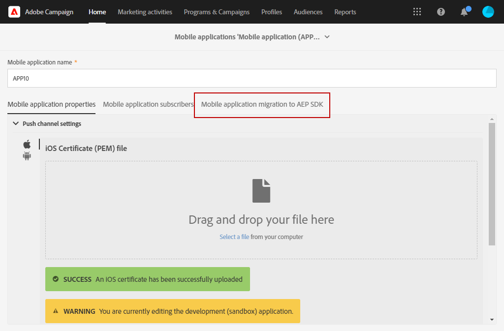

# 모바일 응용 프로그램을 SDK v4에서 Adobe Experience Platform SDK {#sdkv4-migration}로 마이그레이션하는 방법

>[!IMPORTANT]
>
> 마이그레이션 과정은 되돌릴 수 없습니다.
>
> SDK V4 모바일 응용 프로그램을 Adobe Experience Platform SDK로 마이그레이션하기 전에 문서를 주의 깊게 읽으십시오.

## SDK V4 마이그레이션 정보

Adobe Campaign Standard은 SDK V4를 Adobe Experience Platform SDK를 사용하는 애플리케이션과 별도의 애플리케이션으로 사용하여 모바일 애플리케이션을 처리합니다.
v4에서 Adobe Experience Platform으로 Adobe SDK 버전을 업그레이드한 후 모바일 애플리케이션은 기존 애플리케이션 가입자 데이터 및 캠페인을 계속 사용해야 합니다.따라서 마이그레이션이 필요합니다.

>[!NOTE]
>
> 이 페이지에서는 SDK v4 모바일 응용 프로그램을 새로 만든 Adobe Experience Platform SDK 응용 프로그램으로 마이그레이션하는 방법을 설명합니다. SDK v4 모바일 애플리케이션은 **[!UICONTROL Configured]** **[!UICONTROL Property status]**&#x200B;과(와) 함께 Adobe Experience Platform SDK 모바일 애플리케이션과 병합되지 않습니다.

| 마이그레이션 후 변경되지 않는 항목 |
|:-:|
| 마이그레이션된 SDK V4 응용 프로그램을 사용하는 기존 게재 및 캠페인에는 영향을 주지 않습니다. |
| 모바일 응용 프로그램의 이름은 동일하게 유지됩니다. |
| iOS 및 Android에 대한 플랫폼 자격 증명이 유지됩니다. |
| 애플리케이션의 모든 구독자와 해당 데이터는 그대로 유지됩니다. |
| 기존 SDK v4 모바일 애플리케이션은 데이터(PII 데이터, 구독자 및 토큰 정보)를 Adobe Campaign Standard으로 계속 전송합니다. |
| 모바일 응용 프로그램의 **[!UICONTROL Organizational unit]**&#x200B;은(는) 동일하게 유지됩니다. |

| 마이그레이션 후 변경되는 사항 |
|:-:|
| 모바일 응용 프로그램은 **[!UICONTROL Administration]** > **[!UICONTROL Channels]** > **[!UICONTROL Mobile app (Adobe Experience Platform SDK)]**&#x200B;에서 사용할 수 있습니다. 마이그레이션 전에는 **[!UICONTROL Administration]** > **[!UICONTROL Channels]** > **[!UICONTROL Mobile app (SDK V4)]**&#x200B;에서 사용할 수 있었습니다. |
| 응용 프로그램의 **[!UICONTROL Collect PII Endpoint]**&#x200B;이(가) 변경됩니다. 이전 **[!UICONTROL Collect PII Endpoint]**&#x200B;은(는) 계속 작동하므로 보낸 데이터는 손실되지 않습니다. |
| 애플리케이션은 Adobe Experience Platform Launch **[!UICONTROL Mobile Property]**&#x200B;에 연결됩니다. 새로 만든 모바일 애플리케이션으로 처리됩니다. |
| 마이그레이션에 사용된 원래 Adobe Experience Platform SDK 응용 프로그램은 별도의 응용 프로그램으로 존재하지 않습니다. 마이그레이션된 SDK v4 애플리케이션만 사용할 수 있습니다. |

## 모바일 응용 프로그램을 SDK v4에서 Adobe Experience Platform SDK {#how-to-migrate}로 마이그레이션

마이그레이션하기 전에 다음 권장 사항을 고려해야 합니다.

* 마이그레이션 과정은 되돌릴 수 없습니다.
* 여러 응용 프로그램의 마이그레이션을 동시에 실행해서는 안 됩니다. 또한 동일한 응용 프로그램의 마이그레이션이 여러 창에서 동시에 트리거되지 않도록 해야 합니다.
* 마이그레이션 전에 마이그레이션할 모바일 응용 프로그램 및 마이그레이션에 사용하는 Adobe Experience Platform 응용 프로그램의 **[!UICONTROL Organizational unit]**&#x200B;이 할당되었는지 확인합니다.
* 마이그레이션 후 응용 프로그램은 Adobe Experience Platform SDK 응용 프로그램이 됩니다. 변경 사항은 해당 론치 **[!UICONTROL Mobile Property]**&#x200B;에 연결됩니다.

1. Adobe Experience Platform Launch에서 새 **[!UICONTROL Mobile property]**&#x200B;을 만듭니다. 자세한 내용은 [Adobe Experience Platform Launch 설명서](https://aep-sdks.gitbook.io/docs/getting-started/create-a-mobile-property#create-a-mobile-property)를 참조하십시오.

1. Adobe Campaign Standard의 고급 메뉴에서 **[!UICONTROL Administration]** > **[!UICONTROL Application Settings]** > **[!UICONTROL Workflows]**&#x200B;를 선택하고 **[!UICONTROL syncWithLaunch]** 작업 과정을 엽니다. 워크플로우가 오류 없이 끝났는지 확인합니다.

1. 작업 과정이 완료된 후 **[!UICONTROL Administration]** > **[!UICONTROL Channels]** > **[!UICONTROL Mobile app (Adobe Experience Platform SDK)]** 메뉴에서 모바일 응용 프로그램을 Adobe Campaign Standard에서 사용할 수 있으며 **[!UICONTROL Ready to Configure]** 상태인지 확인합니다.

   

1. **[!UICONTROL Administration]** > **[!UICONTROL Channels]** > **[!UICONTROL Mobile app (SDK V4)]**&#x200B;에서 마이그레이션할 SDK V4 응용 프로그램을 선택합니다.

1. **[!UICONTROL Mobile application migration to AEP SDK]** 탭을 선택합니다. 

   

1. **[!UICONTROL Select AEP SDK mobile application to merge current application with]** 드롭다운에서 이전에 만든 Adobe Experience Platform SDK 모바일 애플리케이션을 선택합니다.

1. **[!UICONTROL Migrate]**&#x200B;을(를) 클릭합니다.

   

1. **[!UICONTROL Migration application]** 창에서 **[!UICONTROL Ok]**&#x200B;을 클릭합니다.

   

1. 완료 창이 나타나면 **[!UICONTROL Go to Adobe Experience Platform SDK Channel list]** 을 클릭합니다.

1. Adobe Experience Platform SDK 채널 목록 페이지에서 이전 V4 모바일 애플리케이션이 **[!UICONTROL Ready To Configure]**&#x200B;으로 설정되어 있는지 확인합니다.

1. 모바일 응용 프로그램을 선택하고 **[!UICONTROL Save]**&#x200B;을 클릭하여 마이그레이션을 완료합니다.

이 마이그레이션 후 V4 버전의 모바일 응용 프로그램에서 수집된 구독자 및 모바일 응용 프로그램의 AEP 버전에서 수집한 새 구독자는 마이그레이션된 응용 프로그램에서 사용할 수 있습니다.

사용자 지정 리소스 **[!UICONTROL Subscriptions to an application (appSubscriptionRcp)]**&#x200B;을(를) `sdkversion` 또는 `appVersion`으로 확장할 때 두 가지 서로 다른 유형의 구독자를 구별하기 위해 **[!UICONTROL Text]** 유형의 새 사용자 정의 필드를 추가할 수 있습니다. 사용자 지정 리소스를 확장하는 방법에 대한 자세한 내용은 이 [페이지](../../developing/using/creating-or-extending-the-resource.md)를 참조하십시오.
그런 다음 PII 수집 호출에서 이 사용자 지정 필드 값을 전송하고 그에 따라 모바일 응용 프로그램 구성을 변경하려면 관련 시작 **[!UICONTROL Mobile property]**&#x200B;을 구성해야 합니다.

## FAQ {#faq}

### Q:SDK v4 모바일 응용 프로그램에서는 Adobe Experience Platform SDK로 모바일 응용 프로그램 마이그레이션 탭이 표시되지 않습니다.{#tab-not-visible}

A:고급 메뉴 **[!UICONTROL Administration]** > **[!UICONTROL Application Settings]** > **[!UICONTROL Options]**&#x200B;에서 **[!UICONTROL Enable migration of mobile app from SDK v4 to Adobe Experience Platform SDK option]** 옵션의 값을 확인합니다. 기본적으로 1로 설정하고 활성화해야 합니다. 관리자가 수동으로 비활성화했을 수 있습니다.

### Q:Adobe Experience Platform SDK로 모바일 애플리케이션 마이그레이션 탭에서 데이터 없음이라는 메시지가 나타납니다.{#no-data}

A:자격 조건을 갖춘 **[!UICONTROL Organizational unit]** 애플리케이션만 목록에 표시됩니다. 마이그레이션할 Adobe Experience Platform 응용 프로그램이 올바른지 확인하십시오. Adobe Experience Platform 응용 프로그램의 **[!UICONTROL Property Status]**&#x200B;은 **[!UICONTROL Ready to Configure]**&#x200B;로 설정하고 **[!UICONTROL Mobile app migration status]**&#x200B;는 **[!UICONTROL Not Migrated]**&#x200B;로 설정해야 합니다.

### Q:구성된 속성 상태의 Adobe Experience Platform SDK 응용 프로그램을 마이그레이션에 사용할 수 없는 이유는 무엇입니까?{#property-status}

A:마이그레이션 프로세스에서는 SDK v4 구독자 및 특성을 유지합니다. Adobe Experience Platform SDK 응용 프로그램의 Launch 관련 정보만 유지합니다. 구독자 및 Adobe Experience Platform SDK 애플리케이션의 기타 데이터가 손실됩니다. 데이터 손실을 방지하기 위해 **[!UICONTROL Ready to Configure]** **[!UICONTROL Property Status]**&#x200B;이(가) 있는 Adobe Experience Platform SDK 애플리케이션만 마이그레이션할 수 있습니다.

### Q:마이그레이션 후 이전 SDK v4 모바일 애플리케이션은 어디에서 찾을 수 있습니까?{#v4-app-not-visible}

A:마이그레이션 후 모바일 응용 프로그램은 고급 메뉴 **[!UICONTROL Administration]** > **[!UICONTROL Channels]** > **[!UICONTROL Mobile app (Adobe Experience Platform SDK)]**&#x200B;에서 볼 수 있습니다.

### Q:마이그레이션 후 새로 만든 Adobe Experience Platform SDK 애플리케이션은 어디에서 찾을 수 있습니까?{#aep-not-visible}

A:마이그레이션에 사용된 새로 만든 Adobe Experience Platform SDK 응용 프로그램은 별도의 응용 프로그램으로 존재하지 않습니다. 마이그레이션된 SDK v4 애플리케이션만 사용할 수 있습니다.

### Q:SDK v4 모바일 애플리케이션 조직 구성 단위가 A(조직 구성 요소의 하위)로 설정되어 있고 Adobe Experience Platform SDK가 모두 로 설정되어 있는 경우. 모바일 애플리케이션을 어떻게 마이그레이션할 수 있습니까?{#v4-org-unit}

A:**[!UICONTROL Organizational unit]** ALL의 관리자는 모바일 응용 프로그램을 모두 관리할 수 있는 권한을 가지며, 마이그레이션이 담당됩니다.

### Q:SDK v4 모바일 애플리케이션 구성 단위가 A로 설정되어 있고 Adobe Experience Platform SDK 응용 프로그램이 B(조직 단위 A의 동위)로 설정되어 있는 경우. 모바일 애플리케이션을 어떻게 마이그레이션할 수 있습니까?{#aep-org-unit}

A:동위 멤버 **[!UICONTROL Organizational unit]**&#x200B;의 에셋인 Adobe Experience Platform SDK 응용 프로그램은 모바일 응용 프로그램이 **[!UICONTROL Organizational unit]** A 사용자에게 표시되지 않습니다. 모바일 응용 프로그램은 **[!UICONTROL Organizational unit]** ALL의 관리자가 사용할 수 있지만 모바일 응용 프로그램을 마이그레이션하도록 해당 관리자를 권장하지 않습니다.
이 경우 모바일 응용 프로그램을 동일한 **[!UICONTROL Organizational unit]** 또는 상위 링크가 있는 **[!UICONTROL Organizational unit]**에서 이동해야 합니다.
**[!UICONTROL Organizational unit]**&#x200B;에 대한 자세한 내용은 이 [섹션](../../administration/using/organizational-units.md)을 참조하십시오.

### Q:Adobe Experience Platform SDK 모바일 응용 프로그램(v4 모바일 응용 프로그램에서 마이그레이션된) 페이지의 푸시 채널 설정 드롭다운 아래에 Android 키 또는 iOS 인증서 {#no-information-v5}에 대해 업로드된 날짜/이름과 같은 정보가 표시되지 않습니다

A:SDK V4 모바일 응용 프로그램이 만들어지면 시스템은 이 정보를 저장하지 않습니다. SDK V4 모바일 애플리케이션을 Adobe Experience Platform SDK 모바일 애플리케이션으로 마이그레이션할 때 마이그레이션된 모바일 애플리케이션에 이러한 유형의 정보도 포함되지 않습니다. 사용자가 새 iOS 인증서 또는 Android 키를 업로드하는 즉시 키 또는 인증서의 다른 세부 정보가 저장되고 **[!UICONTROL Push channel settings]** 드롭다운 아래에 올바로 표시됩니다.
