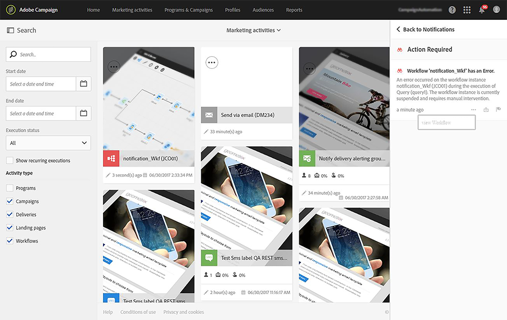

# 내부 알림 보내기{#sending-internal-notifications}

Adobe Campaign에서는 애플리케이션 내에서 직접 중요한 시스템 활동에 대한 알림을 받을 수 있습니다. 실시간 알림은 관련 이해 관계자에게 정보를 계속 제공하고 사용자가 애플리케이션 내에서 활동 알림에 대해 즉시 직접 대응할 수 있는 기능을 제공합니다. 팀을 위한 결과는 고급 민첩성, 효율성 및 더욱 원활한 캠페인 실행을 의미합니다.

다음 객체에 대한 알림을 구성할 수 있습니다.

* **[!UICONTROL A/B Test emails]**: 이메일 생성자 및 수정자는 변형을 선택했거나(자동 모드) 변형을 선택해야 한다는(수동 모드) 알림을 받습니다. 알림을 클릭하면 해당 이메일이 표시됩니다. 기본 제공 A/B 테스트 템플릿에서 기본적으로 알림이 활성화됩니다. 비활성화하려면 전자 메일 또는 전자 메일 템플릿의 속성을 편집하고 아래에 있는 상자의 선택을 취소합니다 **일반 > 알림**. A/B 테스트 이메일에 대한 자세한 내용은 [AB 테스트 만들기](../../channels/using/designing-an-a-b-test-email.md). 전자 메일 속성에 대한 자세한 내용은 [전자 메일 속성 목록](../../administration/using/configuring-email-channel.md#list-of-email-properties).

   

* **[!UICONTROL Workflows]**: 워크플로우가 오류가 발생할 때마다 선택한 보안 그룹의 각 구성원에게 알림(전자 메일 및 인앱 알림)이 표시됩니다. 알림 또는 이메일 링크를 클릭하면 해당 워크플로우가 표시됩니다. 기본 제공 워크플로우 템플릿에서 기본적으로 알림이 비활성화됩니다. 이를 활성화하려면 워크플로우 또는 워크플로우 템플릿의 속성을 편집하고 아래에 보안 그룹을 추가합니다 **일반 > 실행 > 오류 관리 > 감독자**. 보안 그룹에 대한 자세한 내용은 [그룹 및 사용자 관리](../../administration/using/managing-groups-and-users.md). 워크플로우 속성에 대한 자세한 내용은 [워크플로우 속성](../../automating/using/managing-execution-options.md).

   
