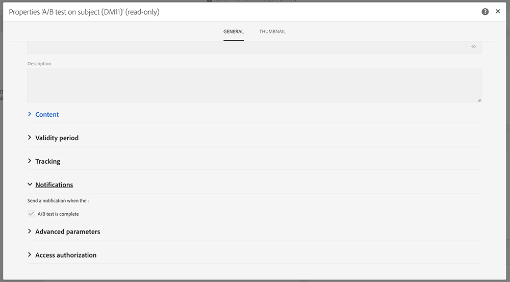

# 내부 알림 보내기{#sending-internal-notifications}

Adobe Campaign을 사용하면 애플리케이션 내에서 바로 중요한 시스템 활동에 대한 알림을 받을 수 있습니다.  실시간 알림은 관련 이해 관계자에게 정보를 제공하고 사용자에게 애플리케이션 내에서 활동 알림에 대해 즉시 조치를 취할 수 있는 기능을 제공합니다. 팀은 민첩성, 효율성 및 원활한 캠페인 실행을 통해 성과를 달성할 수 있습니다.

다음 개체에 대한 알림을 구성할 수 있습니다.

* **[!UICONTROL A/B Test emails]**:이메일 생성자 및 수정자는 변형을 선택했거나(자동 모드) 변형을 선택해야 한다는 알림을 받습니다(수동 모드). 알림을 클릭하면 해당 이메일이 표시됩니다. 기본 A/B 테스트 템플릿에서 기본적으로 알림이 활성화됩니다. 비활성화하려면 이메일 또는 이메일 템플릿의 속성을 편집하고 일반 &gt; 알림 아래에 있는 상자의 **선택을 취소합니다**. A/B 테스트 이메일에 대한 자세한 내용은 AB 테스트 [만들기를 참조하십시오](../../channels/using/designing-an-a-b-test-email.md). 이메일 속성에 대한 자세한 내용은 이메일 [속성](../../administration/using/configuring-email-channel.md#list-of-email-properties)목록을 참조하십시오.

   

* **[!UICONTROL Workflows]**:워크플로우가 오류일 때마다 선택한 보안 그룹의 각 구성원에게 알림(이메일 및 인앱 알림)이 표시됩니다. 알림 또는 이메일 링크를 클릭하면 해당 워크플로우가 표시됩니다. 기본 워크플로 템플릿에서 알림은 기본적으로 비활성화됩니다. 활성화하려는 경우 워크플로우 또는 워크플로우 템플릿의 속성을 편집하고 일반 &gt; 실행 &gt; 오류 관리 **&gt; 감독자 아래에 보안 그룹을 추가합니다**. 보안 그룹에 대한 자세한 내용은 그룹 및 [사용자](../../administration/using/managing-groups-and-users.md)관리를 참조하십시오. 워크플로우 속성에 대한 자세한 내용은 워크플로우 [속성을](../../automating/using/executing-a-workflow.md#workflow-properties)참조하십시오.

   

