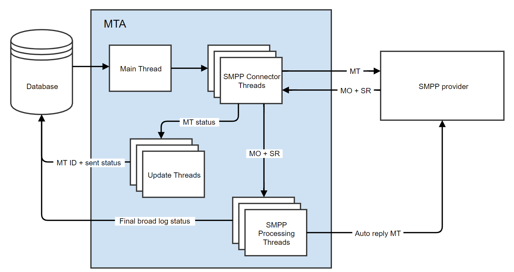

# SMS 커넥터 프로토콜 및 설정 {#sms-connector-protocol}

>[!NOTE]
>
>이 [페이지](https://experienceleague.adobe.com/docs/campaign-classic/using/sending-messages/sending-messages-on-mobiles/sms-protocol.html)에서 Adobe Campaign Classic에 대한 **SMS 커넥터 프로토콜 및 설정**&#x200B;을 찾을 수 있습니다.
>
>이 문서를 통해 프로토콜, 필드 이름 및 값에 대한 세부 정보에 대한 모든 참조는 [SMPP 3.4 사양](https://smpp.org/SMPP_v3_4_Issue1_2.pdf)을 참조합니다.

## 개요 {#overview}

SMS는 형식이 지정되지 않은 짧은 텍스트 메시지로 제한적일 수 있지만 SMS의 간소화는 귀중한 통신 채널로 사용됩니다.

SMS를 보내는 주요 방법에는 두 가지가 있습니다.

* 사람들 간에 직접 통신하는 일반적인 방법인 휴대폰에서 수동으로 보냅니다.

* Adobe Campaign에서 메시지를 보내는 방식인 인터넷에서 보냅니다. 이를 위해서는 인터넷을 모바일 네트워크에 연결하는 SMS 서비스 공급자가 필요합니다.
Adobe Campaign은 SMPP 프로토콜을 사용하여 서비스 공급자에게 SMS를 전송합니다.

이 문서에서는 Adobe Campaign과 SMPP 공급자 간의 연결 설정 방법을 안내합니다.

SMPP 공급자는 때때로 공식 사양을 벗어날 수 있지만 Adobe Campaign의 SMS 커넥터는 대부분의 공급자와 호환되도록 동작을 조정하는 다양한 옵션을 제공합니다.

>[!IMPORTANT]
>
>새 공급자에 대한 연결을 설정하려면 TCP, 이진, 16진수 표현 및 텍스트 인코딩에 대한 기술 지식 및 몇 가지 기술이 필요할 수 있습니다. 또한 제공자와의 적극적인 협력이 필요할 것이다.

### SMS 유형 {#sms-types}

SMS 공급자를 통해 대량 SMS를 전송하는 경우 세 가지 유형의 SMS가 발생합니다.

* **SMS MT(모바일 착신)**: Adobe Campaign에서 SMPP 공급자를 통해 휴대폰으로 보내는 SMS입니다.

* **SMS MO(모바일 원본)**: 모바일에서 SMPP 공급자를 통해 Adobe Campaign으로 전송하는 SMS입니다.

* **SMS SR(상태 보고서) 또는 DR 또는 DLR(배달 확인)**: SMPP 공급자를 통해 모바일이 Adobe Campaign으로 보낸 SMS가 성공적으로 수신되었음을 나타내는 반환 확인 메일입니다. Adobe Campaign은 종종 오류에 대한 설명과 함께 메시지가 전달되지 않았음을 나타내는 SR을 수신할 수도 있습니다.

확인(RESP PDU, SMPP 프로토콜의 일부)과 SR을 구분해야 합니다. SR은 네트워크를 통해 종단 간 전송되는 SMS의 일종이지만 확인은 하나의 전송이 성공했다는 확인일 뿐입니다.

승인과 SR 모두 오류를 트리거할 수 있으므로 두 가지를 구별하면 문제 해결에 도움이 됩니다.

### SMS에서 전송한 정보 {#information-sms}

SMS는 텍스트보다 더 많은 정보를 전달합니다. 다음은 SMS에서 찾을 수 있는 항목 목록입니다.

* 텍스트는 140바이트로 제한되며, 인코딩에 따라 70~160자 사이를 의미합니다. 자세한 내용 및 제한 사항에 대해서는 아래의 [SMS 텍스트 인코딩](../../administration/using/sms-protocol.md#sms-text-encoding)을 참조하십시오.

* `ADC` 또는 `MSISDN`이라고도 하는 받는 사람 주소입니다. SMS를 수신할 모바일 번호입니다.

* `oADC` 또는 경우에 따라 `sender id`(으)로 호출할 수 있는 보낸 사람 주소. 공급자 또는 이름을 통해 전송할 때 짧은 코드가 될 수 있습니다. 이름은 선택적 기능으로, 이 경우 SMS에 회신할 수 없습니다.

* 메시지가 플래시 메시지인지 여부를 나타내는 플래그입니다. 플래시 메시지는 메모리에 저장되지 않는 팝업입니다.

* SR 예상 여부를 나타내는 플래그입니다.

* 네트워크 장비 재시도가 허용되지 않는 유효 일자.

* 텍스트 인코딩을 나타내는 `data_coding` 필드.

## SMPP 프로토콜 {#smpp-protocol}

Adobe Campaign Standard은 SMPP 프로토콜 버전 3.4를 지원합니다. SMS를 공급자(SMSC)에게 전송하고 SMS와 영수증을 받을 수 있는 광범위한 프로토콜입니다. 자세한 내용은 [SMPP 설명서](https://smpp.org/SMPP_v3_4_Issue1_2.pdf)를 참조하세요.

SMS 서비스 공급자 측의 네트워크 장비는 종종 SMSC라고 합니다.

### SMPP 연결 {#smpp-connections}

Adobe Campaign은 TCP를 통해 SMS 서비스 공급자의 네트워크 장비에 연결합니다. SMPP 프로토콜은 Adobe Campaign에서 공급자로의 영구 TCP 연결을 설정합니다. TCP 연결은 메시지를 받을 때에도 항상 Adobe Campaign에 의해 시작됩니다.
SMPP는 모드에 따라 1개 또는 2개의 TCP 연결을 엽니다. 모든 연결은 항상 Adobe Campaign에 의해 시작됩니다.

SMPP 프로토콜은 다음 두 가지 모드에서 작동할 수 있습니다.

* **송신기+수신기(또는 TX+RX)**: 두 개의 별도 TCP 연결이 메시지 송수신에 사용됩니다.
* **송수신기(abor TRX)**: 단일 TCP 연결이 메시지 송수신에 사용됩니다.

>[!NOTE]
>
>TRX는 연결 수를 줄이고 장애 발생 시 연결 복구를 단순화하기 때문에 Adobe Campaign Standard에 선호됩니다.

### SMPP PDU {#smpp-pdu}

SMPP 전송 단위(&quot;패킷&quot;)를 PDU라고 합니다. **PDU**&#x200B;에는 명령, 상태, 시퀀스 번호 및 데이터가 포함되어 있습니다.

각 PDU는 `SMPP RESP PDU`(동기 응답)에 의해 확인되어야 합니다. 요청이 파이프라인될 수 있음: 보낸 사람이 `RESP`을(를) 기다리지 않고 많은 명령을 보낼 수 있으며 언제든지 파이프라인될 수 있는 요청 수를 창이라고 합니다. `RESP PDU`은(는) 해당 이니시에이터 PDU의 순서와 관련이 없는 순서로 도착할 수 있습니다.

분리된 **송신기+수신기** 모드에서 사용되는 연결은 전송된 메시지의 종류에 따라 다릅니다. 송신기 연결은 MT에, 수신기 연결은 MO와 SR에 사용됩니다. 각 유형의 메시지에 대한 요청과 응답은 동일한 TCP 연결을 통해 전송됩니다.

예를 들어 MT를 전송할 때 송신기 연결이 사용되며 MT를 확인하는 `RESP`도 송신기 채널을 통해 전송됩니다. MO(또는 SR)를 받으면 수신기 연결을 사용하여 MO를 수신하고 MO를 승인하는 `RESP`을(를) 보냅니다.


Adobe Campaign Standard에서 MT 및 SR 조정은 MTA가 기본이므로 전용 SMS 프로세스가 없습니다.

성공한 `SUBMIT_SM_RESP PDU`은(는) 전송 로그에서 &quot;보낸&quot; 메시지 상태를 트리거하고 성공한 `DELIVER_SM (SR) PDU`은(는) &quot;받은&quot; 메시지 상태를 트리거합니다.

### 보안 측면 {#security-aspects}

프로토콜 자체는 암호화되지 않습니다. 대부분의 공급자는 변형 IP를 허용 목록에 추가하다에서 구현하므로 Adobe Campaign 서버 IP 주소를 공급자에게 선언해야 합니다.

Adobe Campaign은 바인드 단계 동안 로그인 및 암호 전달을 지원합니다. 또한 TLS보다 SMPP를 지원합니다. 적절한 보안을 위해 인증서가 필요하다는 점을 유의해야 합니다. SMPP 커넥터는 인증서 검사를 우회할 수 있지만 인증서가 없는 TLS는 훨씬 낮은 수준의 보안을 제공하므로 테스트용으로만 사용해야 합니다.

커넥터가 시스템 `openssl` 라이브러리에서 제공하는 기본 인증서를 사용합니다. 일반적으로 Debian의 `/etc/ssl/certs` 디렉터리에서 제공합니다. 이 디렉터리는 기본적으로 &quot;ca-certificates&quot; 패키지에서 제공되지만 사용자 지정할 수 있습니다.

### 각 유형의 PDU에 있는 정보 {#information-pdu}

각 유형의 PDU에는 서로 다른 정보를 전달하는 개별 필드가 있습니다. 이러한 PDU는 [SMPP 3.4 사양](https://smpp.org/SMPP_v3_4_Issue1_2.pdf)에 자세히 설명되어 있습니다.

아래 각 섹션에서는 PDU와 동기 응답(`*_RESP PDU`)에 대해 설명합니다. 모든 PDU는 해당 `RESP`에서 확인해야 합니다. 이는 사양의 필수 부분입니다.

PDU에는 선택적 필드가 있을 수 있습니다. 가장 일반적인 필드만 여기에 설명되어 있습니다. 자세한 내용은 [SMPP 3.4 사양](https://smpp.org/SMPP_v3_4_Issue1_2.pdf)을 참조하세요.

#### BIND_TRANSMITTER / BIND_RECEIVER / BIND_TRANSCEIVER {#bind-transmitter}

이 PDU는 SMSC에 대한 연결을 시작하는 데 사용됩니다. **송신기**, **수신기** 및 **송수신기** 모드는 이 연결을 통해 전송할 수 있는 SMS의 종류만 변경합니다. 구체적으로 다음과 같습니다.

| 모드 | 허용되는 SMS 종류 |
|:-:|:-:|
| 송신기 | MT |
| 수신자 | MO + SR |
| 송수신기 | MT + MO + SR |

`BIND_* PDU`의 주목할 만한 필드:

* **system_id**: 인증에 사용되는 로그인입니다. 외부 계정에서 설정합니다.

* **암호**: 인증에 사용되는 암호입니다. 외부 계정에서 설정합니다.

* **system_type**: 일부 공급자에 대해 특정 값으로 설정해야 합니다. 모든 버전에서 사용할 수 있는 외부 계정에서 설정합니다. 종종 계약, 채널, 국가 등이 서로 다른 유형을 구분합니다.

* **addr_ton** 및 **addr_npi**: 일부 공급자에 필요합니다. 외부 계정의 `Bind TON` 및 `Bind NPI` 설정에 의해 설정됩니다.

* **address_range**: 일부 공급자에 필요합니다. 대부분의 경우 이 연결에 허용된 바로 가기 코드 목록입니다. 외부 계정에서 설정합니다.

`BIND_*_RESP`에 특정 필드가 없으므로 연결이 성공했는지 여부를 확인합니다.

#### 바인딩 해제 {#unbind}

연결을 끊기 전에 시스템에서 이 PDU를 보내야 합니다. 연결을 닫기 전에 일치하는 `UNBIND_RESP PDU`을(를) 기다려야 합니다.

SMSC를 준수하는 경우 연결을 닫으면 안 됩니다. TCP 연결은 Adobe Campaign 커넥터에 의해 제어됩니다.

#### SUBMIT_SM {#submit-sm}

이 PDU는 MT를 SMSC로 전송합니다. 응답 PDU는 MT의 ID를 제공합니다.

`SUBMIT_SM PDU`의 주목할 만한 필드:

* **service_type**: 일부 공급자에 필요합니다. 게재 속성에서 을 설정합니다.

* **source_addr_ton** 및 **source_addr_npi**: 전송되는 소스 주소의 종류를 나타냅니다. 이러한 필드의 의미는 표준화되어 있지만 일부 공급자가 필드를 다르게 사용하므로 공급자에게 정확한 값을 요청해야 합니다. 외부 계정에서 설정합니다.

* **source_addr**: MT의 원본 주소/oADC 휴대폰에 표시됩니다. 외부 계정 및 게재에서 설정하면 게재 값이 외부 계정 값보다 우선합니다.

* **dest_addr_ton** 및 **dest_addr_npi**: 전송되는 대상 주소의 종류(예: 로컬 또는 국제 형식)를 나타냅니다. 이러한 필드의 의미는 표준화되어 있지만 일부 공급자가 필드를 다르게 사용하므로 공급자에게 정확한 값을 요청해야 합니다. 외부 계정에서 설정합니다.

* **destination_addr**: 받는 사람 주소, 전화 번호 또는 MSISDN입니다.

* **esm_class**: 텍스트 필드에 UDH가 사용되는지 여부를 확인하는 데 사용됩니다. `message_payload` 모드가 사용되지 않는 경우 커넥터가 분할 SMS에 대해 자동으로 사용하도록 설정합니다.

* **priority_flag**: 이 메시지의 우선 순위를 다른 메시지보다 우선합니다. 이는 게재 자체의 우선 순위와 연관되어 있습니다.

* **validity_period**: 그 이후에는 다시 시도하지 않아야 하는 타임스탬프입니다. 게재 자체를 설정합니다.

* **registered_delivery**: SR이 요청되었는지 여부를 알려줍니다. Adobe Campaign은 자동 회신을 제외하고 항상 이 플래그를 설정합니다. 다중 파트 메시지의 경우 플래그는 첫 번째 파트에만 설정됩니다. 모든 버전의 비헤이비어가 동일합니다.

* **data_coding**: 텍스트 필드에 사용된 인코딩을 나타냅니다. 자세한 내용은 [SMS 텍스트 인코딩](../../administration/using/sms-protocol.md#sms-text-encoding) 섹션을 참조하십시오.

* **짧은 메시지**: 메시지 텍스트입니다. UDH를 사용하는 경우 여기에 UHD 헤더도 포함됩니다.

Adobe Campaign은 다음과 같은 옵션 필드를 지원합니다.

* **dest_addr_subunit**: SMS 대상(플래시, 모바일 또는 SIM 카드)을 지정하는 데 사용됩니다. 게재 속성에서 을 설정합니다.

* **message_payload**: 외부 계정에서 활성화하면 긴 메시지가 단일 PDU에서 전송되고 `short_message` 필드 대신 이 필드에서 텍스트가 전송됩니다.

#### SUBMIT_SM_RESP {#submit-sm-resp}

이 PDU에는 MT의 ID가 포함됩니다. 이는 수신 SR과 연결하는 데 유용합니다.

>[!IMPORTANT]
>
>많은 공급자가 MT ID를 16진수로 전송합니다. 외부 계정에서 MT 승인&#x200B;**설정의** ID 형식을 올바르게 설정했는지 확인하십시오.

일부 공급자는 SR을 보낸 후 `SUBMIT_SM_RESP`을(를) 보냅니다. 이 동작을 설명하기 위해 Adobe Campaign은 알 수 없는 ID가 있는 SR에 **잘못된 메시지 ID**&#x200B;을(를) 응답하기 전에 30초를 기다립니다.

#### DELIVER_SM {#delivery-sm}

이 PDU는 SMSC에서 Adobe Campaign으로 전송됩니다. 여기에는 MO 또는 SR이 포함되어 있습니다.

대부분의 필드는 해당 `SUBMIT_SM` 필드와 같은 의미를 갖습니다. 다음은 유용한 필드 목록입니다.

* **source_addr**: MO/SR의 원본 주소입니다. 보통 이것은 전화번호입니다.

* **destination_addr**: MO 또는 SR을 받은 짧은 코드.

* **esm_class**: PDU가 MO인지 SR인지 확인하는 데 사용됩니다.

* **짧은 메시지**: 메시지 텍스트입니다. SR의 경우 SMPP 프로토콜 사양의 부록 B에 설명된 데이터가 포함됩니다. 자세한 내용은 [SR 오류 관리](../../administration/using/sms-protocol.md#sr-error-management)를 참조하십시오.

Adobe Campaign에서 일부 구성 조정을 통해 선택적 필드 `receipted_message_id`의 메시지 ID를 읽을 수 있습니다.

#### DELIVER_SM_RESP {#deliver-sm-resp}

이 PDU는 Adobe Campaign에서 SR 및 MO를 승인하도록 전송됩니다.

Adobe Campaign Standard은 모든 처리 단계가 성공하면 `DELIVER_SM_RESP`만 보냅니다. 이는 처리 오류의 위험이 여전히 있는 동안 SR 또는 MO가 승인되지 않음을 보장합니다.

#### ENQUIRE_LINK {#enquire-links}

이 PDU는 연결이 활성 상태인지 확인하는 데만 사용됩니다. 그 빈도는 제공자의 필요에 따라 설정되어야 한다.

기본 60초는 외부 계정에 설정된 대부분의 구성과 일치해야 합니다.

#### ENQUIRE_LINK_RESP {#enquire-links-resp}

이 PDU는 연결이 활성 상태임을 확인합니다.

### 다중 파트 SMS(긴 SMS) {#multipart}

다중 부분 SMS 또는 긴 SMS는 여러 부분으로 전송되는 SMS입니다. 모바일 네트워크 프로토콜의 기술적 한계로 인해 SMS는 140바이트보다 클 수 없거나 분할해야 합니다. SMS에 사용할 수 있는 문자 수에 대한 자세한 내용은 [SMS 텍스트 인코딩](../../administration/using/sms-protocol.md#sms-text-encoding) 섹션을 참조하세요.

긴 메시지의 각 부분은 개별 SMS입니다. 이러한 부품은 네트워크 상에서 독립적으로 이동하며 수신 휴대 전화에 의해 조립됩니다. 다시 시도 및 연결 문제를 처리하기 위해 Adobe Campaign은 이러한 부분을 역순으로 보내고 메시지의 첫 번째 부분에만 SR을 요청하며 마지막으로 전송됩니다. 휴대폰은 첫 번째 부품이 수신될 때만 메시지를 표시하므로 추가 부품에 다시 시도해도 휴대폰에서 중복 메시지가 생성되지 않습니다.

**게재 템플릿**&#x200B;의 **메시지당 최대 SMS 수** 설정을 사용하여 게재당 최대 SMS 수를 설정할 수 있습니다. 이 제한을 초과하는 메시지는 SMS를 보내는 동안 실패 이유가 너무 깁니다.

긴 SMS를 보내는 방법에는 두 가지가 있습니다.

* **UDH**: 긴 메시지를 보내는 기본 및 권장 방법입니다. 이 모드에서 커넥터는 UDH 정보가 포함된 여러 `SUBMIT_SM PDU`의 메시지를 분할합니다. 이 프로토콜은 핸드폰이 자체적으로 사용하는 프로토콜이다. 즉, Adobe Campaign은 메시지 생성을 가장 잘 제어하므로 전송된 부분 수와 분할된 방식을 정확하게 계산할 수 있습니다.

* **message_payload**: 전체 긴 메시지를 단일 `SUBMIT_SM PDU`에 보내는 방법입니다. 공급자는 이를 분할해야 할 것인데, Adobe Campaign이 정확히 몇 개의 부품이 전송됐는지 알 수 없다는 의미다. 일부 공급자는 이 모드를 필요로 하지만 UDH를 지원하지 않는 경우에만 사용하는 것이 좋습니다.

프로토콜 및 형식에 대한 자세한 내용은 [SUBMIT_SM PDU](../../administration/using/sms-protocol.md#information-pdu)의 `esm_class`, `short_message` 및 `message_payload` 필드에 대한 설명을 참조하십시오.

### 처리량 제한 및 창 {#throughput-capping}

대부분의 공급업체는 각 SMPP 연결에 대해 처리량 제한을 필요로 합니다. 이 작업은 외부 계정에서 SMS 수를 설정하여 수행할 수 있습니다. 처리량 제한은 접속당 발생하며, 총 유효 처리량은 접속당 한도에 총 접속 수를 곱한 값입니다. 자세한 내용은 [동시 연결](../../administration/using/sms-protocol.md#connection-settings) 섹션을 참조하십시오.

가능한 최대 처리량에 도달하려면 최대 전송 창을 미세 조정해야 합니다. 전송 기간은 `SUBMIT_SM_RESP`을(를) 기다리지 않고 보낼 수 있는 `SUBMIT_SM PDU`의 수입니다. 자세한 내용은 [전송 창 설정](../../administration/using/sms-protocol.md#throughput-timeouts) 섹션을 참조하십시오.

### SR 및 오류 관리 (&quot;부록 B&quot;) {#sr-error-management}

SMPP 프로토콜은 `RESP PDU`의 표준 동기 오류를 정의하지만 SR에 대한 오류 코드를 정의하지 않습니다. 각 공급자는 자신의 의미를 갖는 자체 오류 코드를 사용합니다.

[SMPP 프로토콜 사양](https://smpp.org/SMPP_v3_4_Issue1_2.pdf)(페이지 167)의 부록 B 섹션에 권장 사항이 있지만 실제 오류 코드와 그 의미가 나열되지 않습니다.

오류 관리에 적응하기 위해 Adobe Campaign의 Broadlog 메시지 시스템을 활용하여 오류와 심각도(하드, 소프트 등)를 적절하게 프로비저닝합니다.

위에서 언급했듯이 두 가지 유형의 오류가 있습니다.

* `SUBMIT_SM_RESP`에서 메시지가 SMSC로 전송된 직후 발생하는 동기 답글
* 확인 메일은 모바일이 메시지를 수신했을 때 또는 메시지가 시간 초과되었을 때 훨씬 나중에 올 수 있습니다. 이 경우 SR에서 오류가 발견되었습니다.

SR을 받으면 `short_message` 필드에서 상태 및 오류를 찾을 수 있습니다(예: 부록 B 준수 구현). PDU의 `short_message` 필드는 MT의 텍스트를 포함하므로 종종 **텍스트 필드**&#x200B;라고 합니다. SR의 경우 기술 정보와 **Text**&#x200B;이라는 하위 필드가 포함되어 있습니다. 이 두 필드는 서로 다르며 `short_message`에는 실제로 **텍스트** 필드 및 기타 정보가 포함되어 있습니다.

#### SR 텍스트 필드 형식 {#sr-text-field-format}

사양은 SR 텍스트 필드에 이 형식을 사용하는 것을 권장합니다. 이 목록은 필드 이름과 값을 구분하기 위해 콜론으로 공백으로 구분된 하위 필드 목록입니다. 필드 이름은 대소문자를 구분하지 않습니다.

부록 B 권장 사항과 일치하는 SR 텍스트 필드의 예:

```
id:1234567890 sub:001 dlvrd:001 submit date:1608011415 done date:1608011417 stat:DELIVRD err:000 Text:Hello Adobe world
```

ID 필드는 `SUBMIT_SM_RESP PDU`에서 받은 ID, MT의 승인입니다.

`sub` 및 `dlvrd`은(는) 배달된 부분 및 배달된 메시지의 양을 계산해야 하지만 broadlog 시스템이 더 나은 통합 정보를 제공하므로 Adobe Campaign에서는 이 정보를 사용하지 않습니다.

`submit date` 및 `done date` 필드는 MT를 보낸 시기와 모바일에서 SR를 보낸 시기를 나타내는 타임스탬프입니다. 시간대와 관련된 일부 문제 또는 잘못된 날짜가 설정된 모바일이 제공한 잘못된 타임스탬프를 예상하십시오.

통계 필드는 메시지 상태를 알려주기 때문에 중요합니다. 중요한 상태는 `DELIVRD`, `UNDELIV` 및 `REJECTD`뿐입니다. `DELIVRD` 상태는 성공을 나타내고 나머지 두 상태는 오류를 나타냅니다. 다른 값도 가능하지만 일반적으로 중간 알림입니다(예: MT가 이동통신사에 도달했지만 휴대폰은 아님). Adobe Campaign에서는 이러한 중간 알림을 무시합니다.

err 필드에는 공급자별 오류 코드가 포함됩니다. 공급자는 이 값을 해석할 수 있도록 가능한 오류 코드 표를 의미와 함께 제공해야 합니다.

마지막으로 텍스트 필드에는 일반적으로 MT 텍스트의 시작이 포함됩니다. Adobe Campaign에서는 이를 무시하며 일부 공급업체는 PII 누출 및 네트워크 대역폭 소비를 방지하기 위해 전송하지 않습니다. 이 필드를 읽으면 문제 해결 중에 테스트 MT와 일치하는 SR을 더 쉽게 찾을 수 있습니다.

### Adobe Campaign Standard Extended Generic SMPP의 SR 처리 예 {#sr-processing}

이 예는 부록 B 권장 사항, 외부 계정의 기본값 및 성공적인 SMS MT에 따른 구현 사례를 표시합니다.

```
id:1234567890 sub:001 dlvrd:001 submit date:1608011415 done date:1608011417 stat:DELIVRD err:000 Text:Hello Adobe world
```

먼저 `id extraction` 정규식을 적용하여 ID를 추출하고 해당 MT와 조정합니다.

그런 다음 `status extraction` 정규 표현식 및 `error code extraction` 정규 표현식이 적용되어 이러한 필드를 추출하고 문자열에 추가됩니다.

broadlog 메시지는 이 정보로 구성되며, 참조용으로 변경되지 않은 원래 문자열이 추가됩니다.

```
SR ExampleProvider DELIVRD 000|MESSAGE=id:1234567890 sub:001 dlvrd:001 submit date:1608011415 done date:1608011417 stat:DELIVRD err:000 Text:Hello Adobe world
```

그런 다음 메시지가 표준화되어 MESSAGE 부분이 제거되어 동일한 통계 및 오류 코드로 여러 메시지를 일치시킬 수 있습니다.

```
SR ExampleProvider DELIVRD 000|#MESSAGE#
```

메시지가 broadlog 메시지 테이블에 아직 프로비저닝되지 않은 경우 전체 메시지를 **firstText**(으)로 사용하고 정규화된 메시지를 사용하여 새 항목이 만들어집니다. 그런 다음 커넥터는 성공 및 `error` 정규식을 사용하여 성공 또는 실패인지를 확인합니다.

* `success` 정규식과 일치하면 성공한 것으로 간주됩니다.

* `error` 정규식과 일치하면 메시지가 오류로 처리됩니다.

* 이 두 정규 표현식 중 어느 하나도 일치하지 않으면 SR이 무시됩니다. Adobe Campaign에서 처리하지 않는 중간 알림일 수 있습니다.

기본적으로 모든 오류는 소프트 오류로 프로비저닝됩니다. 즉, 하드 오류를 직접 프로비저닝해야 합니다.

### SMS 텍스트 인코딩 {#sms-text-encoding}

인코딩 문제가 발생하면 **항상 SMSC 공급자에게 문의**&#x200B;해야 합니다. SMSC 공급자만 지원하는 인코딩과 기술 플랫폼의 제약으로 인해 적용될 수 있는 특수 규칙에 대해 정확히 알고 있습니다.

SMS 메시지는 GSM7 인코딩이라고도 하는 특수 7비트 인코딩을 사용합니다.

SMPP 프로토콜에서 GSM7 텍스트를 문자당 8비트로 확장하면 보다 간편하게 문제를 해결할 수 있습니다. SMSC는 모바일로 전송하기 전에 문자당 7비트로 압축합니다. 즉, SMPP 프레임에서 SMS의 `short_message` 필드 길이는 최대 160바이트일 수 있지만, 모바일 네트워크에서 전송하는 경우에는 140바이트로 제한됩니다.

인코딩 문제가 발생하면 몇 가지 중요한 사항을 확인해야 합니다.

* 인코딩에 속한 문자를 알고 있어야 합니다. GSM7은 발음 구별 기호(액센트)를 완전히 지원하지 않습니다. 특히 프랑스어에서 é와 è는 GSM7의 일부이지만 ê, â 또는 ï은 일부가 아닙니다. 스페인어도 마찬가지다.

* cedilla(ç)가 있는 C는 GSM7 알파벳에서 대문자로만 표시되지만 통화 시 소문자 또는 &quot;스마트&quot; 문자로 렌더링됩니다. 일반적인 권장 사항은 완전히 피하고 세딜라를 제거하거나 UCS-2로 전환하는 것입니다.

* **SMSC 공급자가 명시적으로 요청하지 않는 한 SMS에서 ASCII를 사용하지 마십시오**. 이 인코딩은 8비트 문자를 포함하고 GSM7보다 적용 범위가 적으므로 공간을 낭비합니다. 이러한 인코딩은 북미에서 사용되는 CDMA 네트워크에 필요할 수 있다.

* Latin-1이 항상 지원되는 것은 아닙니다. Latin-1을 사용하기 전에 SMSC 공급자와의 호환성을 확인하십시오.

* Adobe Campaign 커넥터에서는 자국어 시프트 테이블을 지원하지 않습니다. 대신 UCS-2 또는 다른 `data_coding`을(를) 사용해야 합니다.

* UCS-2와 UTF-16은 종종 전화기에서 혼합됩니다. 이는 UCS-2에 없는 이모지와 다른 문자를 사용할 때 문제가 됩니다.

* 대부분의 휴대폰에는 모든 UCS-2 문자에 대한 글꼴 글리프가 없습니다. 스마트폰은 희귀한 캐릭터를 다소 쉽게 표시할 수 있는 경향이 있지만, 피처폰은 일반적으로 그들이 구입한 나라의 모국어로 유용한 것에 대한 지원이 제한적이다. 이모지나 ASCII-art를 사용하려면 보내기 전에 다양한 휴대폰에서 테스트하십시오. Adobe Campaign 미리 보기는 누락된 글리프를 시뮬레이트하지 않으며 웹 브라우저에서 사용할 수 있는 기호를 표시합니다.

`data_coding` 필드는 사용되고 있는 인코딩을 알려 줍니다. 큰 문제는 값 0이 사양에서 기본 SMSC 인코딩을 의미한다는 것입니다. 이 인코딩은 일반적으로 GSM7을 나타냅니다. Adobe Campaign에서만 지원하는 `data_coding` = 0과 연결된 인코딩에 대해 SMSC 파트너에게 문의하십시오. 다른 `data_coding` 값은 사양을 따르는 경향이 있지만 SMSC 공급자에게 확인하는 것이 유일한 방법입니다.

메시지의 최대 크기는 인코딩에 따라 다릅니다. 이 표에는 관련 모든 정보가 요약되어 있습니다.

| 인코딩 | 일반적인 데이터 코딩 | 메시지 크기(문자) | 다중 부분 SMS의 부분 크기 | 사용 가능한 문자 |
|:-:|:-:|:-:|:-:|:-:|
| GSM7 | 0 | 160 | 152 | GSM7 기본 문자 세트 + 확장 문자(확장 문자에는 문자 2개가 필요) |
| 라틴-1 | 3 | 140 | 134 | ISO-8859-1 |
| UCS-2 <br>UTF-16 | 8 | 70 | 67 | 유니코드(통화 시 다름) |

## SMPP 외부 계정 매개 변수 {#SMPP-parameters-external}

SMPP 프로토콜의 각 구현에는 많은 변형이 있습니다. 호환성과 적응성을 향상시키기 위해 SMPP 커넥터의 동작을 변경하는 데 사용할 수 있는 다양한 설정을 제공합니다. 이 섹션에서는 모든 매개 변수와 커넥터에 미치는 영향을 설명합니다.

### 일반 매개 변수 및 라우팅 {#general-parameters-routing}

**이 계정의 MTA 인스턴스 제한**

SMPP 공급자에 연결할 수 있는 MTA 인스턴스 수로 제한을 설정할 수 있습니다. 선택할 경우 최대 사용할 수 있는 MTA 수를 지정할 수 있습니다.

이 옵션을 사용하면 연결 수를 보다 세밀하게 제어할 수 있습니다. [동시 연결](../../administration/using/sms-protocol.md#connection-settings)을 참조하세요.

실행 중인 MTA 수보다 큰 값을 설정하면 모든 MTA가 정상적으로 실행됩니다. 이 옵션은 제한일 뿐이며 추가 MTA를 생성할 수 없습니다.

공급자 요구 사항과 같은 연결 수를 정확하게 제어해야 하는 경우, 현재 배포에 실행 중인 MTA의 수가 적절하더라도 항상 이 옵션을 설정하는 것이 좋습니다. 이후에 추가 MTA가 추가되더라도 연결 제한은 계속 유지됩니다.

### 연결 설정 {#connection-settings}

#### SMPP 연결 모드 {#smpp-connection-mode}

**transceiver** 모드 또는 분리된 **transmitter+receiver** 모드로 연결을 설정합니다. 분리된 **송신기+수신기** 모드로 전환하면 **SMPP 연결 모드** 섹션의 설정이 송신기에 적용되고 **수신기 연결 설정** 섹션의 설정이 수신기 연결에 적용됩니다. **수신기에 대해 다른 매개 변수 사용** 확인란을 선택한 경우에만 해당됩니다.

#### SMSC 구현 이름 {#smsc-implementation-name}

SMSC 구현의 이름을 설정합니다. 공급자 이름으로 설정해야 합니다. 이 필드에 추가할 내용을 알아보려면 관리자 또는 게재 팀에 문의하십시오. 이 필드의 역할은 [SR 오류 관리](../../administration/using/sms-protocol.md#sr-error-management) 섹션에 설명되어 있습니다.

#### 서버 {#server}

연결할 서버의 DNS 이름 또는 IP 주소입니다.

#### 포트 {#port}

연결할 TCP 포트입니다.

#### 계정 {#account}

연결의 로그인. BIND PDU의 `system_id` 필드에 전달되었습니다.

#### 암호 {#password}

SMPP 연결 암호입니다. BIND PDU의 암호 필드에 전달됩니다.

#### 시스템 유형 {#system-type}

BIND PDU의 `system_id` 필드에 전달된 값. 일부 공급자는 여기에서 특정 값이 필요합니다.

#### 동시 연결 {#simultaneous-connections}

Adobe Campaign Standard에서는 SMS 스레드 및 MTA 프로세스당 연결 수를 정의합니다.
MTA 프로세스 수는 배포에 의해 결정됩니다. 일반적으로 2개의 MTA와 1개의 스레드가 있습니다. smppConnectorThreads 설정을 사용하여 config-instance.xml 파일에서 스레드 수를 변경할 수 있습니다. 일반적으로 컨테이너당 1개의 MTA 프로세스와 MTA 프로세스당 1개의 스레드가 있습니다.

Adobe Campaign Standard에 대한 총 연결 공식:

* **총 연결 수 = 동시 연결 수 * 스레드 수 * MTA 수**

동시 연결은 외부 계정에 설정되고 스레드 수는 config-instance.xml 파일(smppConnectorThreads)에 설정되며 MTA 수는 외부 계정에서 제한될 수 있습니다.

분리된 **송신기/수신기** 모드에서 위의 연결 수는 **송신기/수신기** 쌍의 수를 나타냅니다. 이는 총 연결 수가 두 배가 됨을 의미합니다.

#### SMPP에 대해 TLS 활성화 {#enable-TLS}

TLS를 사용하여 공급자에 연결합니다. 연결이 암호화됩니다. OpenSSL 라이브러리에서 TLS 연결을 관리합니다. OpenSSL에 적용되는 모든 항목은 이 연결에 대해 적용됩니다.

#### 로그 파일의 자세한 SMPP 추적 활성화 {#enable-verbose-log-file}

이 설정은 모든 SMPP 트래픽을 로그 파일로 덤프합니다. 초기 설정 중에 매개 변수를 조정해야 하는 경우가 많습니다. 커넥터의 문제를 해결할 때 공급자가 보는 트래픽과 비교하여 이 기능을 활성화해야 합니다.

### 수신자 연결 설정 {#receiver-connection}

이 섹션은 분리된 **송신기+수신기** 모드에서만 볼 수 있습니다.

#### 수신자에 대해 다른 매개 변수 사용 {#receiver-parameters}

확인란을 선택 취소하면 송신기와 수신기에 동일한 설정이 사용됩니다.

확인란을 선택하면 **연결 설정** 섹션의 설정이 전송기에 적용되고 **수신기 연결** 설정의 설정이 수신기에 적용됩니다.

**받는 사람 서버, 포트, 계정, 암호, 시스템 유형**

이러한 설정은 **transmitter+receiver** 모드에 있을 때 수신자에게 적용됩니다. 송신기 부품처럼 작동합니다. 자세한 내용은 위 를 참조하십시오.

### SMPP 채널 설정 {#smpp-channel-settings}

#### 문자 음역 허용 {#allow-character-transliteration}

음역은 누락된 문자와 동등한 문자를 찾는 프로세스입니다. 예를 들어 프랑스어 &quot;ê&quot;(곡절 악센트가 있는 e) 문자가 GSM 인코딩에서 누락되었지만 가독성을 손상시키지 않고 &quot;e&quot;로 대체할 수 있습니다.

이 상자를 선택 취소하면 문자열을 있는 그대로 인코딩할 수 없으면 텍스트 인코딩이 실패합니다.

이 상자를 선택하면 텍스트 인코딩이 문자열을 실패하는 대신 근사 버전으로 변환하려고 합니다. 대상 인코딩에서 일부 문자에 해당하는 문자가 없으면 텍스트 인코딩이 실패합니다.

인코딩 프로세스에 대한 일반적인 설명은 [인코딩의 특정 매핑 정의](../../administration/using/sms-protocol.md#SMSC-specifics)를 참조하십시오.

#### 데이터베이스에 수신 MO 저장 {#incoming-mo-storing}

활성화되면 들어오는 MO가 데이터베이스의 inSMS 테이블에 저장됩니다. 이 테이블은 모든 워크플로우의 쿼리 활동을 사용하여 쿼리할 수 있습니다.

#### SR 처리 중 실시간 KPI 업데이트 활성화 {#real-time-kpi}

활성화되면 오류 SR이 수신될 때 기본 게재 페이지에서 KPI가 실시간으로 업데이트됩니다.

이 경우 데이터베이스 경합 때문에 성능이 저하될 수 있습니다. 사용하지 않도록 설정하면 20분마다 실행되는 **syncfromexec** 워크플로우로 통계가 업데이트됩니다.

#### 소스 번호 {#source-number}

메시지의 기본 소스 주소를 정의합니다. 이 설정은 게재의 소스 번호가 비어 있는 경우에만 적용됩니다.

기본적으로 소스 번호 필드는 전달되지 않으므로 공급자가 짧은 코드로 대체합니다.

이렇게 하면 발신자 주소/oADC 재정의 기능이 활성화됩니다.

#### 짧은 코드 {#short-code}

계정의 기본 짧은 코드를 나타냅니다. 이 계정에 여러 짧은 코드가 사용되거나 짧은 코드를 알 수 없는 경우 이 필드를 비워 둡니다.

짧은 코드를 지정하면 두 가지 기능에 유용합니다.

* 소스 번호가 제공되지 않으면 미리보기에 짧은 코드가 표시됩니다. 그것은 휴대폰의 실제 행동을 반영할 것입니다.

* 자동 회신 기능의 설정에 대한 차단 목록에 추가하다는 특정 짧은 코드만 사용자에게 보냅니다.

#### Source TON/NPI, 대상 TON/NPI {#ton-npi}

TON(숫자 유형) 및 NPI(번호 매기기 계획 표시기)는 [SMPP 3.4 사양](https://smpp.org/SMPP_v3_4_Issue1_2.pdf)(페이지 117)의 섹션 5.2.5에 설명되어 있습니다. 이러한 값은 공급자의 필요에 맞게 설정해야 합니다.

`SUBMIT_SM PDU`의 `source_addr_ton`, `source_addr_npi`, `dest_addr_ton` 및 `dest_addr_npi` 필드에 있는 그대로 전송됩니다.

#### 서비스 유형 {#service-type}

이 필드는 `SUBMIT_SM PDU`의 `service_type` 필드에 있는 그대로 전송됩니다. 공급자의 필요에 맞게 설정합니다.

### 처리량 및 시간 초과 {#throughput-timeouts}

이 설정은 SMPP 채널의 모든 타이밍 측면을 제어합니다. 일부 공급자는 메시지 속도, 창 및 다시 시도 시간을 매우 정확하게 제어할 수 있어야 합니다. 이러한 설정은 공급자의 용량과 계약에 명시된 조건에 일치하는 값으로 설정해야 합니다.

#### 전송 기간 {#sending-window}

창은 일치하는 `SUBMIT_SM_RESP`을(를) 기다리지 않고 보낼 수 있는 `SUBMIT_SM PDU`의 수입니다.

최대 4개의 창을 사용하는 전송의 예:


네트워크 링크의 지연 시간이 길면 처리량을 늘리는 데 도움이 됩니다.  다음 메시지를 보내기 전에 커넥터가 `SUBMIT_SM_RESP`을(를) 기다리지 않도록 창의 값은 SMS/s 수에 링크 대기 시간을 초 단위로 곱한 값 이상이어야 합니다.
창이 너무 크면 연결 문제가 발생할 경우 중복 메시지를 더 많이 보낼 수 있습니다. 또한 대부분의 공급자는 창에 대한 매우 엄격한 제한을 가지며 제한을 초과하는 메시지를 거부합니다.

최적의 전송 창 수식을 계산하는 방법:

* `SUBMIT_SM`에서 `SUBMIT_SM_RESP` 사이의 최대 대기 시간을 측정합니다.

* 이 값을 최대 MT 처리량에 초 단위로 곱합니다. 이렇게 하면 최적의 전송 창 값이 제공됩니다.

예: 최대 MT 처리량으로 설정된 SMS/s가 300개이고 평균적으로 `SUBMIT_SM`과(와) `SUBMIT_SM_RESP` 사이에 100ms 지연 시간이 있는 경우 최적의 값은 `300×0.1 = 30`입니다.

#### 최대 MT 처리량 {#max-mt-throughput}

초당 및 연결당 최대 MT 수. 이 설정은 엄격하게 적용되며 MTA가 이 제한보다 더 빨리 메시지를 푸시하지 않습니다. 이 메서드는 정확한 조정이 필요한 공급자에게 유용합니다.

총 처리량 제한을 확인하려면 위의 공식에 자세히 설명된 대로 이 수에 총 연결 수를 곱하십시오.

0은 제한이 없음을 의미합니다. MTA는 가능한 한 빨리 MT를 전송합니다.

최종 아키텍처에서 적절히 벤치마킹하지 않는 한 이 숫자 이상의 정확한 처리량을 보장할 수 없기 때문에 일반적으로 이 설정을 1000 미만으로 유지하는 것이 좋습니다. 처리량이 1000을 초과해야 하는 경우 공급자에게 문의하십시오. 1000 MT/s 이상으로 연결하는 연결 수를 늘리는 것이 더 나을 수 있습니다.

#### 다시 연결 이전 시간 {#time-reconnection}

TCP 연결이 끊기면 커넥터는 연결을 시도하기 전에 이 시간(초)을 기다립니다.

#### MT 만료일 {#expiration-period}

`SUBMIT_SM`과(와) 일치하는 `SUBMIT_SM_RESP` 사이의 시간 제한. `RESP`이(가) 정시에 수신되지 않으면 메시지가 실패한 것으로 간주되고 MTA의 전역 다시 시도 정책이 적용됩니다.

#### 바인딩 시간 초과 {#bind-timeout}

TCP 연결 시도와 `BIND_*_RESP` 응답 사이의 시간 제한. 시간 초과되면 Adobe Campaign 커넥터에 의해 연결이 닫히고 다시 연결하기 전에 시간을 기다린 후 다시 시도합니다.

#### enquire_link 기간 {#enquire-link-period}

`enquire_link`은(는) 연결을 유지하기 위해 전송되는 특수한 종류의 PDU입니다. 이 기간은 초 단위입니다. Campaign 커넥터는 대역폭을 절약하기 위해 연결이 유휴 상태일 때만 `enquire_link`을(를) 보냅니다. 이 기간이 두 번 경과해도 RESP가 수신되지 않으면 연결이 끊어진 것으로 간주되고 재연결 프로세스가 트리거됩니다.

### SMSC 세부 사항 {#SMSC-specifics}

이러한 설정은 Adobe Campaign 커넥터를 대부분의 SMPP 구현 특성에 적용하는 고급 설정입니다.

#### 인코딩의 특정 매핑 정의 {#encoding-specific-mapping}

텍스트 인코딩에 대한 자세한 내용은 [SMS 텍스트 인코딩](../../administration/using/sms-protocol.md#sms-text-encoding) 섹션을 참조하십시오.

이 설정을 사용하면 사양과 다른 사용자 지정 인코딩 매핑을 정의할 수 있습니다. 인코딩 목록과 해당 `data_coding` 값을 선언할 수 있습니다.

MTA는 목록의 첫 번째 인코딩을 사용하여 인코딩하려고 합니다. 실패할 경우 목록의 다음 인코딩 등을 사용합니다. 메시지를 인코딩하는 데 인코딩을 사용할 수 없는 경우 오류가 발생합니다. 인코딩이 발견되면 MTA는 인코딩된 텍스트로 `SUBMIT_SM PDU`을(를) 만들고 테이블에 지정된 값으로 설정된 `data_coding` 필드를 만듭니다.

표의 항목 순서는 중요합니다. 인코딩은 위에서 아래로 시도됩니다. 가장 저렴하거나 가장 권장되는 인코딩을 목록의 맨 위에 지정한 다음 더 많은 비싼 인코딩을 차례로 추가해야 합니다.

Adobe Campaign에서 지원되는 모든 문자를 인코딩할 수 있고 UCS-2 SMS의 최대 길이가 70자보다 훨씬 작으므로 UCS-2는 실패하지 않습니다.

이 설정을 사용하여 매핑 테이블에서 한 줄만 선언하여 특정 인코딩을 항상 사용하도록 강제할 수도 있습니다.

확인란을 선택하지 않은 경우 사용되는 기본 매핑은 다음 테이블과 같습니다.

| data_coding | 인코딩 |
|---|---|
| 0 | GSM |
| 9 | UCS- |

이는 MTA가 메시지를 GSM으로 인코딩하려고 시도함을 의미합니다. 성공하면 `data_coding`이(가) 0으로 설정된 상태로 전송됩니다.

메시지를 GSM으로 인코딩할 수 없으면 UCS-2로 인코딩되고 `data_coding`이(가) 8로 설정됩니다.

#### message_payload 활성화 {#enable-message-payload}

선택하지 않으면 긴 SMS가 MTA로 분할되어 UDH를 사용하는 여러 `SUBMIT_SM PDU`에서 전송됩니다. UDH 데이터 뒤에 오는 휴대폰으로 메시지가 다시 작성된다.

선택하면 하나의 SUBMIT_SM PDU에 긴 SMS가 전송되어 message_payload 선택 필드에 텍스트가 입력됩니다. 자세한 내용은 [SMPP 사양](../../administration/using/sms-protocol.md#ACS-SMPP-connector)을 참조하세요.

이 기능이 활성화되어 있으면 Adobe Campaign에서 SMS 부분을 개별적으로 카운트할 수 없습니다. 모든 메시지는 한 부분에서 전송된 것으로 카운트됩니다.

#### 전체 전화 번호 보내기 {#send-full-phone-number}

이 확인란을 선택하지 않으면 전화번호의 숫자만 공급자에게 전송됩니다(`SUBMIT_SM` 필드의 `destination_addr` 필드). 국제 번호 표시기(일반적으로 + 접두사)가 SMPP의 TON 및 NPI 필드로 대체되므로 이 작업이 기본 동작입니다.

확인란을 선택하면 사전 처리 및 잠재적 공백, + 접두사 또는 파운드/해시/별 기호 없이 전화 번호가 있는 그대로 전송됩니다.

차단 목록에 추가하다 이 기능은 자동 회신 기능의 동작에도 영향을 줍니다. 확인란을 선택하지 않으면 SMPP 프로토콜 자체에서 전화 번호에서 제거되는 + 접두어를 보상하기 위해 격리 테이블에 삽입된 전화 번호에 + 접두어가 추가됩니다.

#### TLS 인증서 검사 건너뛰기 {#skip-tls}

TLS가 활성화되면 모든 인증서 검사를 건너뜁니다.

선택하면 연결이 더 이상 안전하지 않습니다. 프로덕션에서 활성화해서는 안 됩니다.

이 메서드는 디버깅 또는 테스트 목적으로 유용합니다.

#### 바인딩 TON/NPI {#bind-ton-npi}

[SMPP 3.4 사양](https://smpp.org/SMPP_v3_4_Issue1_2.pdf)(페이지 117)의 섹션 5.2.5에 설명된 TON(숫자 유형) 및 NPI(번호 매기기 계획 표시기). 이러한 값은 공급자에게 필요한 값으로 설정해야 합니다.

BIND PDU의 `addr_ton` 및 `addr_npi` 필드에서 그대로 전송됩니다.

#### 주소 범위 {#address-range}

BIND PDU의 address_range 필드에 있는 그대로 전송됩니다. 이 값은 공급자에게 필요한 값으로 설정해야 합니다.

#### 잘못된 ID 승인 수 {#invalid-id}

단일 SR에 대해 보낼 수 있는 **잘못된 메시지 ID** `DELIVER_SM_RESP`의 수를 제한합니다.

**문제 해결 목적으로만 사용해야 합니다** 정상적인 경우 0으로 설정합니다.

Fox 예, 를 2로 설정할 때:

* 공급자가 ID가 &quot;1234&quot;인 SR(`DELIVER_SM`)을 보냅니다.

* 데이터베이스에서 ID &quot;1234&quot;를 찾을 수 없습니다.

* 커넥터는 해당 ID에 대해 1 **잘못된 ID** 오류를 계산하므로 &quot;메시지 ID 잘못됨&quot; 오류 코드와 함께 `DELIVER_SM_RESP`을(를) 보냅니다(일반 동작).

* 공급자는 ID가 &quot;1234&quot;인 동일한 SR을 다시 시도합니다.

* 데이터베이스에서 ID &quot;1234&quot;를 찾을 수 없습니다.

* 커넥터는 해당 ID에 대해 2 **잘못된 ID** 오류를 계산하므로 올바르게 처리되지 않았더라도 `DELIVER_SM_RESP` &quot;확인&quot;을 보냅니다.

* 이 기능은 잘못된 SR 블록이 메시지를 처리할 수 없을 때 공급자 측의 SR 버퍼를 플러시하기 위한 것입니다.

이 필드를 0으로 설정하면 **메시지 ID가 잘못됨**&#x200B;이(가) 항상 반환되는 메커니즘이 비활성화됩니다. 이는 일반적인 동작입니다.

이 필드를 1로 설정하면 ID가 유효하지 않은 경우에도 커넥터가 항상 &quot;확인&quot;으로 응답하게 됩니다. 문제 해결 및 최소 시간(예: 공급업체측 문제 복구)을 위해 감독 하에서만 1로 설정해야 합니다.

#### SR 내 ID의 추출 정규 표현식 {#regex-extraction}

SR 형식은 SMPP 프로토콜 사양에 의해 엄격히 적용되지 않습니다. 사양의 [부록 B](../../administration/using/sms-protocol.md#sr-error-management)(167페이지)에 설명된 권장 사항일 뿐입니다. 일부 SMPP 구현자는 이 필드의 형식을 다르게 지정하므로 Adobe Campaign에서는 올바른 필드를 추출하는 방법이 필요합니다.

기본적으로 `id:` 뒤에 최대 10자의 영숫자를 캡처합니다.

정규 표현식은 괄호 안에 부분이 포함된 정확히 하나의 캡처 그룹이 있어야 합니다. 괄호는 ID 부분을 둘러싸야 합니다. 정규 표현식 형식은 PCRE입니다.

이 설정을 조정할 때는 가능한 많은 컨텍스트를 포함하여 false 트리거를 방지해야 합니다. 표준에 `id:`과(와) 같은 특정 접두사가 있으면 정규 표현식에 포함하십시오. 또한 단어 중간에 텍스트를 캡처하지 않으려면 단어 구분 기호(\b)를 최대한 사용하십시오.

정규 표현식에 컨텍스트를 충분히 포함하지 않으면 사소한 보안 결함이 발생할 수 있습니다. 즉, 메시지의 실제 내용은 SR에 포함될 수 있습니다. 컨텍스트가 없는 특정 ID 형식(예: UUID)만 일치시키는 경우 ID 대신 실제 텍스트 콘텐츠(예: 텍스트 필드에 포함된 UUID)를 구문 분석할 수 있습니다.

#### 성공/오류 상태를 결정하기 위해 적용된 정규 표현식 {#regex-applied}

알 수 없는 stat/err 필드 조합이 있는 메시지가 발생하면 이 정규 표현식이 stat 필드에 적용되어 SR이 성공인지 아니면 오류인지 파악합니다. 이 정규 표현식과 일치하지 않는 통계 값이 있는 SR은 무시됩니다.

기본적으로 [부록 B](../../administration/using/sms-protocol.md#sr-error-management)에서 `DELIV`(예: `DELIVRD`)으로 시작하는 통계 값은 성공적으로 전달된 것으로 간주되며 `REJECTED`, `UNDELIV` 같은 오류와 일치하는 모든 통계 값은 오류로 간주됩니다.

#### MT 승인의 ID 형식 {#id-format-mt}

`SUBMIT_SM_RESP PDU`의 `message_id` 필드에서 반환된 ID의 형식을 나타냅니다.

* **수정하지 않음**: ID가 데이터베이스에 있는 그대로 ASCII로 인코딩된 텍스트로 저장됩니다. 사전 처리나 필터링이 발생하지 않습니다.

* **10진수**: ID는 ASCII 형식의 10진수입니다. 이 설정을 사용하면 선행 및 후행 공백과 선행 0이 제거됩니다.

* **16진수**: ID는 ASCII 형식의 16진수여야 하며 앞에 0x가 없고 뒤에 h가 없습니다. 그런 다음 ID가 데이터베이스에 저장되기 전에 10진수로 변환됩니다.

* **16진수 문자열**: ID는 16진수로 인코딩된 바이트 문자열인 ASCII 인코딩된 텍스트여야 합니다. 예를 들어 PDU에서 ASCII &quot;414243&quot;으로 변환되는 `0x34 0x31 0x34 0x32 0x34 0x33`을(를) 찾을 수 있습니다. 그런 다음 이 문자열은 16진수 바이트 문자열로 디코딩되며 그 결과 &quot;ABC&quot;를 얻습니다. ID &quot;ABC&quot;를 데이터베이스에 저장합니다.

#### SR의 ID 포맷 {#id-format-sr}

SR에서 ID의 `Extraction` 정규식에 의해 캡처된 ID의 형식을 나타냅니다. 값은 위의 MT에서 포맷과 동일한 의미 및 동일한 동작을 갖습니다.

선택적 필드에 **SR ID 또는 오류 코드**

선택하면 선택적 필드의 내용이 위의 정규 표현식에서 처리한 텍스트에 추가됩니다. 텍스트에는 `0xTAG:VALUE`, `0xTAG` 형식의 태그가 있으며, 이 값은 대소문자가 `0x002E`인 4자리 16진수 값입니다.

예를 들어 `receipted_message_id` 필드에서 ID를 캡처할 수 있습니다. 이를 위해 이 확인란을 활성화하면 다음 텍스트가 상태에 추가됩니다.

```
0x001E:05e3299e-8d37-49d0-97c6-8e4fe60c7739
```

이 예에서 0x001E는 선택적 필드의 태그이고 UUID는 필드의 값입니다.

이제 이 값을 캡처하기 위해 SR 필드의 ID 추출 정규 표현식에서 다음 정규 표현식을 설정할 수 있습니다.

```
\b0x001E:([0-9a-f]{8}-[0-9a-f]{4}-[0-9a-f]{4}-[0-9a-f]{4}-[0-9a-f]{12})\b
```

>[!IMPORTANT]
>
>텍스트(ASCII/UTF-8) 값이 있는 선택적 필드만 캡처할 수 있습니다. 특히, 이진 필드는 현재의 정규 표현식 시스템으로는 안정적으로 캡처될 수 없다.

**텍스트 필드의 SR ID 또는 오류 코드**

선택하면 SR의 상태 텍스트를 처리하는 동안 **텍스트** 필드가 유지됩니다.

공급자가 ID 또는 상태와 같은 중요한 데이터를 이 필드에 배치하는 경우 유용합니다. 일반적으로 이 필드는 ASCII가 아닌 인코딩이 포함된 텍스트를 포함할 수 있고 정규 표현식 처리를 방해할 수 있으므로 안전하게 삭제할 수 있습니다.

이 옵션을 활성화하면 SR 필드에 있는 ID의 `Extraction` 정규 표현식이 충분히 특정되지 않은 경우 매우 작은 보안 결함이 발생할 수 있습니다. **Text** 필드의 내용을 ID로 구문 분석하여 공격자가 위조된 ID를 주입할 수 있으며, 이로 인해 서비스 거부 상황이 발생할 수 있습니다.

**서비스 ID 태그**

사용자 지정 TLV를 추가할 수 있습니다. 이 필드는 태그 부분을 설정합니다. 게재의 고급 매개 변수에서 **서비스 또는 프로그램 ID** 값의 게재별로 값을 사용자 지정할 수 있습니다.

이 설정은 메시지당 하나의 TLV 옵션만 추가할 수 있습니다.

>[!NOTE]
>
>21.1 릴리스부터 두 개 이상의 선택적 매개 변수를 추가할 수 있습니다. 자세한 정보는 이 [섹션](../../administration/using/sms-protocol.md#automatic-reply-tlv)을 참조하십시오.

### MO로 자동 회신 전송됨 {#automatic-reply}

이 기능을 사용하면 MO에 빠르게 텍스트를 응답하고 짧은 코드별로 차단 목록에 추가하다에 보내는 것을 처리할 수 있습니다.

**키워드** 및 **짧은 코드** 열은 자동 응답을 트리거하는 조건을 정의합니다. 두 필드가 일치하면 MO가 전송되고 추가 작업이 트리거됩니다. 와일드카드를 지정하려면 필드를 비워 두어야 합니다. 키워드는 문장 부호 및 선행 공백을 무시하고 MO 텍스트의 첫 번째 영숫자 단어와 일치합니다. 즉, **키워드** 필드는 공백을 포함할 수 없으며 단일 단어여야 합니다.

**키워드** 설정은 접두사입니다. 예를 들어 &quot;AD&quot;를 지정하는 경우 &quot;AD&quot;, &quot;ADAPT&quot; 및 &quot;ADOBE&quot;와 일치합니다. 공통 접두사가 있는 키워드가 여러 개 있는 경우 키워드가 위에서 아래로 처리되므로 순서에 주의해야 합니다.

**회신** 열은 회신할 텍스트입니다. 이 필드에는 사용할 수 있는 개인화가 없습니다. 이 필드를 비워 두면 메시지가 회신되지 않지만 추가 작업이 트리거됩니다.

**추가 작업** 열은 **키워드**&#x200B;와 **짧은 코드**&#x200B;가 모두 일치하고 빈 짧은 코드가 모든 짧은 코드와 일치하는 경우 추가 작업을 제공합니다. 격리로 보내거나 격리에서 제거할 수 있습니다. value none은 텍스트에 답글을 달지 않습니다. **추가 작업**&#x200B;을 지정했지만 **회신** 필드를 비워 두면 작업이 실행되지만 회신이 전송되지 않습니다. 격리는 지정된 짧은 코드에만 적용되거나 필드가 비어 있는 경우 모든 짧은 코드에 적용됩니다.

>[!IMPORTANT]
>
>전체 전화 번호 보내기 설정은 자동 회신 격리 메커니즘의 동작에 영향을 줍니다. 전체 전화 번호 보내기를 선택하지 않으면 격리된 전화 번호에 국제 전화 번호 형식과 호환되도록 더하기 기호(&quot;+&quot;)가 붙습니다.

테이블의 모든 항목은 하나의 규칙이 일치할 때까지 지정된 순서로 처리됩니다. 여러 규칙이 MO와 일치하는 경우 최상위 규칙만 적용됩니다.

### 자동 회신 선택적 매개 변수(TLV) {#automatic-reply-tlv}

21.1 릴리스부터 자동 회신 MT에 선택적 매개 변수를 추가할 수 있습니다. 이 매개 변수는 [SMPP 사양](https://smpp.org/SMPP_v3_4_Issue1_2.pdf)(페이지 131)의 섹션 5.3에 설명된 대로 회신의 `SUBMIT_SM PDU`에 선택적 TLV 매개 변수로 추가됩니다.

선택적 매개 변수에 대한 자세한 내용은 이 [섹션](../../administration/using/sms-protocol.md#smpp-optional-parameters)을 참조하세요.

## SMS 게재 템플릿 매개 변수 {#sms-delivery-template-parameters}

일부 매개 변수는 게재 템플릿별로 설정할 수 있습니다.

### 발신 필드 {#from-field}

이 필드는 선택 사항입니다. 이를 통해 발신자 주소(oADC)를 재정의할 수 있습니다. 이 필드의 내용이 `SUBMIT_SM PDU`의 `source_addr` 필드에 배치됩니다.

필드는 SMPP 사양에 따라 21자로 제한되지만 일부 공급자는 더 긴 값을 허용할 수 있습니다. 일부 국가에서는 길이, 내용, 허용되는 문자 등 매우 엄격한 제한이 적용될 수 있습니다.

### 게재 매개 변수 {#delivery-parameters}

#### 메시지당 최대 SMS 수 {#maximum-sms}

이 설정은 **메시지 페이로드** 설정을 사용하지 않도록 설정한 경우에만 작동합니다. 자세한 내용은 이 [페이지](../../administration/using/configuring-sms-channel.md)를 참조하세요. 메시지에 이 값보다 많은 SMS가 필요한 경우 오류가 트리거됩니다.

SMS 프로토콜은 SMS를 255개 부품으로 제한하지만, 일부 휴대폰은 10개 이상의 부품으로 긴 메시지를 결합하는 데 문제가 있으며, 제한은 정확한 모델에 따라 다릅니다. 우리는 당신이 메시지당 5부분을 넘기지 말라고 충고한다.

Adobe Campaign에서 개인화된 메시지가 작동하는 방식으로 인해 메시지 크기가 달라질 수 있습니다. 긴 메시지의 양이 많으면 전송 비용이 증가할 수 있습니다.

#### 변속 모드 {#transmission-mode}

이 필드는 전송할 SMS 종류를 나타냅니다(모바일 또는 SIM 카드에 저장된 일반 또는 플래시 메시지).

이 설정은 `SUBMIT_SM PDU`의 `dest_addr_subunit` 선택적 필드에서 전송됩니다.

* **지정되지 않음**&#x200B;에서 PDU에 선택적 필드를 보내지 않습니다.

* **Flash**&#x200B;이(가) 값을 1로 설정합니다. 이 메시지는 모바일에 표시되며 메모리에 저장되지 않는 플래시 메시지를 보냅니다.

* **보통**&#x200B;은 값을 0으로 설정합니다. 정상적인 메시지를 보냅니다.

* **모바일에 저장**&#x200B;에서 값을 2로 설정합니다. SMS를 내부 메모리에 저장하도록 전화기에 알립니다.

* **터미널에 저장**&#x200B;에서 값을 3으로 설정합니다. SMS를 SIM 카드에 저장하도록 전화기에 알려줍니다.

#### 유효 기간 {#validity-period}

유효 기간이 `SUBMIT_SM PDU`의 `validity_period` 필드에서 전송됩니다. 날짜는 항상 절대 UTC 시간 형식(날짜 필드는 &quot;00+&quot;로 끝나게 됨)으로 지정됩니다.

#### SMPP 선택적 매개 변수(TLV) {#smpp-optional-parameters}

21.1 릴리스부터 이 게재를 위해 전송된 모든 MT에 여러 선택적 매개 변수를 추가할 수 있습니다. 이러한 선택적 매개 변수는 [SMPP 사양](https://smpp.org/SMPP_v3_4_Issue1_2.pdf)(페이지 131)의 섹션 5.3에 설명된 대로 회신의 `SUBMIT_SM PDU`에 추가됩니다.

테이블의 각 행은 선택적 매개 변수를 나타냅니다.

* **매개 변수**: 매개 변수에 대한 설명입니다. 공급자에게 전송되지 않았습니다.
* **태그 ID**: 선택적 매개 변수의 태그입니다. 0x1234 형식을 사용하는 유효한 16진수여야 합니다. 값이 잘못되면 게재 준비 오류가 발생합니다.
* **값**: 선택적 필드의 값입니다. 공급자에게 전송될 때 UTF-8로 인코딩됩니다. 인코딩 형식을 변경할 수 없습니다. 이진 값을 보내거나 UTF-16 또는 GSM7과 같은 다른 인코딩을 사용할 수 없습니다.

선택적 매개 변수에 외부 계정에 정의된 **서비스 태그 ID**&#x200B;와(과) 동일한 **태그 ID**&#x200B;이(가) 있는 경우 이 표에 정의된 값이 우선합니다.

## SMPP 커넥터 {#ACS-SMPP-connector}



화살표는 데이터 흐름을 나타냅니다.

여기서 가장 중요한 것은 여러 SMPP 커넥터 스레드가 있다는 것입니다. 이러한 스레드는 모두 동일하며 동일한 구성을 공유합니다. 따라서 연결 수에 항상 스레드 수를 곱합니다.

고객은 구성 파일을 변경해야 하므로 스레드 수를 변경할 수 없습니다.

### SMPP 커넥터 동작에 대한 설명 {#behavior-smpp-connector}

#### 일치하는 MT, SR 및 broadlog 항목 {#matching-mt-sr}

Adobe Campaign에서 메시지는 브로드로그 항목입니다. Adobe Campaign Standard에서 외부 커넥터는 작동하는 브로드로그 테이블에 대해서만 알고 있으면 됩니다. `nmsBroadLogExec`. 워크플로우는 브로드로그 항목을 특정 타겟팅 차원(nmsBroadLogXXX)으로 다시 복사하는 역할을 합니다.

안타깝게도 SMPP는 메시지와 함께 ID를 보낼 수 없습니다. 공급자는 각 MT에 MT ID를 제공한 다음 동일한 ID를 가진 하나 이상의 SR을 제공합니다.

공급자가 제공한 ID가 `nmsBroadLogExec` 테이블의 `sProviderId` 열에 저장됩니다. SR은 항상 MT가 성공적으로 전송되고 승인된 후에 도착하지만, 경우에 따라 Adobe Campaign에서 뛰어난 SR로 알려진 잘못된 순서로 도착할 수 있습니다. 처리 스레드는 전체 정보가 도착할 때까지 이러한 SR을 일시적으로 RAM에 저장합니다.

MT가 승인되면(`SUBMIT_SM_RESP`) `sProviderId`이(가) 즉시 데이터베이스에서 업데이트됩니다.

각 SR은 SMPP 처리 스레드에 의해 개별적으로 처리됩니다. 이 프로세스는 의사 동기화입니다. 외부에서 동기화되는 것으로 보이지만 이벤트 기반 구현으로 내부적으로 구현됩니다. SR은 브로드로그가 성공적으로 업데이트된 경우에만 승인되며, 오류가 발생하면 SR이 거부됩니다.

각 SR에 적용되는 프로세스는 다음과 같습니다.

* SR의 ID는 정규 표현식을 사용하여 추출됩니다.
* ID는 `nmsBroadLogExec:sProviderId`에서 검색됩니다.
* 상태 + 오류 코드는 정규 표현식을 사용하여 SR에서 추출됩니다.
* broadlog 메시지 메커니즘을 사용하여 오류를 확인하고 broadlog 메시지 ID를 찾습니다.
* 위의 모든 정보로 브로드로그가 업데이트됩니다.
* SR이 승인됩니다.

위의 단계를 확인하려면 **자세한 SMPP 추적을 사용하도록 설정**&#x200B;하여 모든 단계가 올바르게 적용되었는지 수동으로 확인해야 합니다. Adobe Campaign이 새 SMPP 공급자에 연결될 때마다 필요합니다.

## 시작하기 전 {#checklist}

이 체크리스트는 시작하기 전에 확인해야 하는 항목의 목록을 제공합니다. 설정이 완료되지 않으면 많은 문제가 발생할 수 있습니다.

### 외부 계정 충돌 확인 {#external-account-conflict}

이전 SMS 외부 계정이 없는지 확인합니다. 테스트 계정을 비활성화한 상태로 두면 프로덕션 시스템에서 다시 활성화하여 잠재적인 충돌을 발생시킬 수 있습니다.

이 계정에 연결된 다른 인스턴스가 없는지 확인합니다. 특히, 스테이지 환경이 계정에 연결되지 않도록 합니다. 일부 공급자는 이를 지원하지만 Adobe Campaign 측과 공급자의 플랫폼 모두에서 매우 구체적인 구성이 필요합니다.

동일한 Adobe Campaign 인스턴스에 동일한 공급자에 연결하는 계정이 여러 개 있어야 하는 경우 공급자에게 문의하여 이러한 계정 간에 연결을 실제로 구분하는지 확인하십시오. 동일한 로그인을 사용하는 계정이 여러 개 있으면 추가 구성이 필요합니다.

### 확인하는 동안 자세한 SMPP 추적 활성화 {#enable-verbose}

검사 중에 항상 자세한 SMPP 추적을 활성화해야 합니다.
로그를 직접 확인할 수 없는 경우에도 지원에서 도움을 주는 것이 더 쉬워집니다.

### SMS 테스트 {#test}

* **모든 종류의 문자가 포함된 SMS 보내기**
GSM 또는 ASCII 이외 문자로 SMS를 전송해야 하는 경우 가능한 한 다양한 문자로 일부 메시지를 보내십시오. 사용자 지정 문자 매핑 테이블을 설정하는 경우 가능한 모든 `data_coding` 값에 대해 하나 이상의 SMS를 전송하십시오.

* **SR이 제대로 처리되었는지 확인**
SMS는 게재 로그에 수신된 것으로 표시되어야 합니다. 게재 로그는 성공해야 하며 다음과 같습니다.
  `SR yourProvider stat=DELIVRD err=000|#MESSAGE`
게재 공급자 이름을 변경했는지 확인합니다. 프로덕션 환경에서는 게재 로그에 **SR 일반**&#x200B;이 포함되어서는 안 됩니다.

* **MO가 처리되었는지 확인**
MO(자동 회신, 데이터베이스에 MO 저장 등)를 처리해야 하는 경우 몇 가지 테스트를 해보십시오. 모든 자동 회신 키워드에 대해 몇 개의 SMS를 보내고 몇 초 내로 회신이 충분히 빠른지 확인합니다.
Adobe Campaign이 `DELIVER_SM_RESP`(으)로 답글을 남겼는지 로그를 확인합니다(command_status=0).

### PDU 확인 {#check-pdus}

메시지가 성공한 것처럼 보이는 경우에도 PDU의 형식이 제대로 지정되었는지 확인하는 것이 중요합니다.

이 단계는 이전에 Adobe Campaign에 연결되지 않은 공급자에 연결할 때 필요합니다.

#### 바인딩 {#bind}

`BIND_* PDUs`이(가) 올바르게 전송되었는지 확인하십시오. 가장 중요한 점은 공급자가 항상 성공적인 `BIND_*_RESP PDUs`을(를) 반환한다는 것입니다(command_status = 0).

`BIND_* PDU`이(가) 너무 많지 않은지 확인하십시오. 너무 많으면 연결이 불안정하다는 것을 나타낼 수 있습니다. 자세한 내용은 [연결이 불안정한 문제](../../administration/using/sms-protocol.md#issues-unstable-connection) 섹션을 참조하십시오.

#### ENQUIRE_LINK {#enquire-link-pdus}

연결이 유휴 상태일 때 `ENQUIRE_LINK PDU`이(가) 정기적으로 교환되는지 확인하십시오.

#### SUBMIT_SM / DELIVER_SM {#submit-sm-deliver-sm}

메시지를 보낸 다음 로그에서 해당 `SUBMIT_SM`, `SUBMIT_SM_RESP`, `DELIVER_SM` 및 `DELIVER_SM_RESP PDU`을(를) 검색합니다.

`SUBMIT_SM PDU` 사용:

* `data_coding`이(가) 올바른지 확인하십시오. 기본적으로 0입니다.
* `short_message`이(가) 올바르게 인코딩되어 있는지 확인하십시오. 여러 인코딩을 지원하는 16진수 변환기를 사용하여 디코딩해 보십시오.

`SUBMIT_SM_RESP PDU` 사용:

* 성공했는지 확인합니다. command_status = 0.
* 본문 뒤에 &#39;0&#39; 바이트가 오는 올바른 형식의 ID를 포함하는지 확인하십시오.

`DELIVER_SM PDU` 사용:

* 16진수 `short_message` 필드를 디코딩합니다.
* SR에 있는 ID의 `Extraction` regex에 정의된 regex가 정확히 하나의 캡처 그룹을 반환하고 메시지의 전체 ID를 캡처하는지 regex 확인 도구를 사용하여 확인합니다.
* 추출된 ID가 `SUBMIT_SM_RESP`의 ID와 일치하는지 확인하십시오.
* SR에 있는 상태의 `Extraction` 정규식에 정의된 정규식이 통계 필드의 내용을 반환하는지 확인하십시오.
* SR에 있는 오류의 `Extraction` regex에 정의된 regex가 err 필드의 내용을 반환하는지 확인하십시오.

`DELIVER_SM_RESP PDU` 사용:

* `DELIVER_SM PDU`을(를) 받은 후 빠르게 전송되었는지 확인합니다(일반적으로 1초 미만).
* 성공했는지 확인합니다. command_status = 0.

### 모든 것이 정상인지 공급자에게 묻기 {#provider}

SMS가 정상적으로 작동하는 경우에도 공급자에게 문의하여 모든 것이 제대로 되어 있는지 확인하십시오.

### 자세한 SMPP 추적 비활성화 {#disable-verbose}

모든 검사가 완료되면 마지막으로 **자세한 SMPP 추적을 사용하지 않도록 설정**&#x200B;하여 너무 많은 로그를 생성하지 않는 것입니다. 프로덕션 시스템에서도 문제 해결 목적으로 다시 활성화할 수 있습니다.
