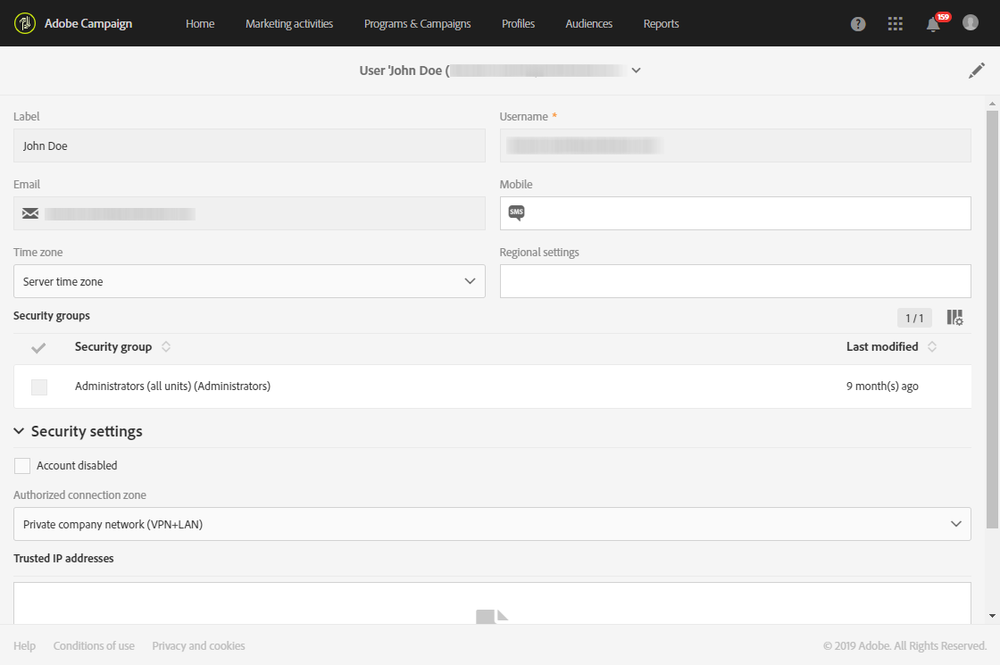

# 사용자 관리{#users-management}

## 사용자 정보 {#about-users}

Adobe Campaign을 사용하면 사용자에게 역할 세트를 할당하여 액세스 가능한 인터페이스의 일부를 정의할 수 있습니다.

특정 역할 및 해당 승인은 다음 섹션에 자세히 설명되어 있습니다.역할 [및](../../administration/using/list-of-roles.md) 권한 이해

관리자는 관리 콘솔에서 사용자를 관리할 수 있습니다. 그러면 사용자가 Adobe Campaign과 자동으로 동기화됩니다. 자세한 내용은 관리 콘솔 [설명서를 참조하십시오](https://helpx.adobe.com/enterprise/using/users.html) .

Adobe Campaign에서 사용자를 보려면 왼쪽 상단 모서리에서 **[!UICONTROL Adobe Campaign]** 로고를 클릭한 다음 **[!UICONTROL Administration > Users & Security > Users]**&#x200B;을 선택합니다.

Adobe Campaign에서 사용자 관리 인터페이스에 액세스하려면 을 **[!UICONTROL User administration]**&#x200B;클릭합니다.

**관련 항목:**

* [사용자 권한](https://docs.adobe.com/content/help/en/campaign-learn/campaign-standard-tutorials/getting-started/access-management.html) 관리 비디오
* [역할 목록](../../administration/using/list-of-roles.md)
* [인증 목록](https://docs.campaign.adobe.com/doc/standard/en/Technotes/AdobeCampaign-ACSRights.pdf)

## 사용자 유형 {#type-of-users}

이 사용자 세그먼테이션은 필수가 아닙니다. Adobe Campaign의 가장 일반적인 사용을 보여주는 것입니다.

이 섹션은 Adobe Campaign 사용자의 주요 유형을 이해하는 데 도움이 됩니다. 여기서는 사용자가 보유할 수 있는 모든 특정 역할(배달 시작, 내보내기, 배달 준비 등)을 검토하지 않습니다. 역할에 대한 자세한 내용은 역할 [목록 및](../../administration/using/list-of-roles.md) 그룹 및 사용자  관리를 참조하십시오.

Adobe Campaign의 다양한 작업이 다음 세 가지 주요 사용자 유형 간에 어떻게 분할되는지 집중적으로 살펴봅니다.

* [기능 관리자](#functional-administrators):조직의 모든 사용자 중에서 가장 전문적인 사용자에게 적합합니다.
* [고급 사용자](#advanced-users):마케터가 전달을 전송하고 모니터링하는 데 필요한 모든 요소를 설정합니다.
* [기본 사용자](#basic-users):캠페인을 개인화하고 전달 및 모니터링하는 마케터입니다.

>[!NOTE]
>
>기능 관리자는 Adobe 기술 관리자와 다릅니다. Adobe 기술 관리자는 고객이 사용할 수 없는 Adobe 내부 역할을 담당합니다. 인스턴스 프로비저닝, 호스팅, 인프라 모니터링 및 감독, 기술 문제 해결을 관리합니다.

### 기능 관리자 {#functional-administrators}

기능 관리자는 인터페이스의 가장 기술적인 부분에 액세스할 수 있는 사용자입니다. 따라서 마케터는 자신의 캠페인 전달에만 집중할 수 있도록 플랫폼을 **[!UICONTROL Administration]** 모두 설정해야 합니다.

기능 관리자는 Adobe Campaign 인터페이스에서 **[!UICONTROL Administration]** 메뉴에 액세스할 수 있는 유일한 사용자입니다. 이러한 사용자는 기술 리소스에 액세스해야 하므로 **[!UICONTROL Administration]** 및 **[!UICONTROL Datamodel]** 즉시 사용 가능한 역할과 같은 고급 역할을 할당해야 합니다. 이러한 역할은 **[!UICONTROL Administrators]** 즉시 사용 가능한 보안 그룹에 결합됩니다. For more on this, refer to this [section](../../administration/using/list-of-roles.md).

다음은 수행할 수 있는 주요 작업입니다.

* [사용자 및 권한](../../administration/using/about-access-management.md)관리:플랫폼(사용자, 역할, 보안 그룹, 장치)에 대한 액세스 권한을 관리합니다.
* [다양한 채널을](../../administration/using/about-channel-configuration.md)구성합니다.유형 및 격리 관리는 물론 다른 플랫폼 채널을 설정합니다.
* [일반 응용 프로그램 설정을](../../administration/using/external-accounts.md)구성합니다.다양한 애플리케이션 요소(외부 계정, 옵션, 기술 워크플로우)를 구성합니다.
* [새로운 기능을 개발하여 바로 사용할 수 있는 기능](../../developing/using/data-model-concepts.md)강화:맞춤형 리소스를 관리하고 진단 툴을 이용할 수 있습니다.
* [인스턴스 매개 변수를](../../administration/using/branding.md)설정합니다.다양한 브랜드를 정의하고 해당 설정(로고, 추적 관리, 랜딩 페이지에 액세스하기 위한 URL 도메인 등)을 구성합니다.
* [데이터 패키지](../../automating/using/managing-packages.md)내보내기 및 가져오기:structured XML 파일을 통해 서로 다른 Adobe Campaign 인스턴스 간에 리소스를 교환할 수 있습니다.
* [로그를](../../automating/using/exporting-logs.md) 내보내고 가져오기 템플릿을 [정의합니다](../../automating/using/defining-import-templates.md).

### 고급 사용자 {#advanced-users}

고급 사용자는 Adobe Campaign에서 가장 기술적인 활용 사례를 수행하는 마케팅 사용자입니다. 마케터가 게재를 보내고 모니터링하는 데 사용하는 모든 요소를 미리 구성합니다.

이 유형의 사용자는 기능 관리자보다 더 많은 일반 역할이 필요하지만 일부 기술 작업을 수행할 수 있어야 합니다. 이렇게 하려면, **[!UICONTROL Export]**&#x200B;또는 **[!UICONTROL Generic import]** **[!UICONTROL Workflow]** 기본 역할 등의 역할을 할당해야 합니다. For more on this, refer to this [section](../../administration/using/list-of-roles.md).

다음은 수행할 수 있는 주요 작업입니다.

* [복잡한 데이터 관리 워크플로우](../../automating/using/about-data-management-activities.md)작성 및 실행:데이터를 가져와 데이터베이스 피드 역할을 하거나 외부 파일에서 필요한 데이터를 내보내 도구로 처리할 수 있습니다.
* [템플릿](../../start/using/marketing-activity-templates.md)관리:템플릿을 관리하여 필요에 따라 마케팅 활동의 특정 매개 변수를 미리 구성합니다.
* [쿼리를](../../automating/using/editing-queries.md#about-query-editor) 만들고 대상을 [관리합니다](../../audiences/using/about-audiences.md).쿼리를 사용하거나 전용 워크플로우를 사용하여 자동으로 고객을 만들 수 있습니다.
* [고급 표현식 편집](../../automating/using/editing-queries.md#about-query-editor)수행:고급 함수를 사용하여 날짜, 문자열, 숫자 필드, 정렬 등과 같은 특정 쿼리를 수행하는 데 사용되는 값을 조작할 수 있습니다.
* [목록을](../../automating/using/exporting-lists.md) 내보내고 기존 가져오기 템플릿을 [사용하여 데이터를](../../automating/using/importing-data-with-import-templates.md)가져옵니다.

### 기본 사용자 {#basic-users}

기능 관리자와 고급 사용자 덕분에 마케터는 기술 구성에 대한 걱정 없이 캠페인을 개인화하고 제공 및 모니터링할 수 있습니다. 이렇게 하려면, 예를 들어, **[!UICONTROL Prepare deliveries]**&#x200B;및 **[!UICONTROL Workflow]** 기본 **[!UICONTROL Start deliveries]** 역할을 할당해야 합니다. 이러한 역할은 **[!UICONTROL Standard Users]** 즉시 사용 가능한 보안 그룹에 결합됩니다. For more on this, refer to this [section](../../administration/using/list-of-roles.md).

다음은 수행할 수 있는 주요 작업입니다.

* [프로그램 및 캠페인](../../start/using/programs-and-campaigns.md)관리:다양한 유형의 활동(이메일, SMS 메시지, 푸시 알림, 워크플로우, 랜딩 페이지)을 비롯한 마케팅 캠페인을 제작할 수 있습니다.
* 프로필 [관리](../../audiences/using/about-profiles.md) 및 [테스트 프로필](../../audiences/using/managing-test-profiles.md):배달이 타깃팅할 식별된 수신자와 테스트 수신자를 관리합니다. 이름, 성, 연락처 정보, 구독, 이메일 등과 같은 정보를 추가합니다.
* [메시지](../../sending/using/confirming-the-send.md)만들기 및 보내기:메시지를 만들고, 대상을 선택하고, 메시지 컨텐츠와 개인화 요소를 정의하고, 교정본을 보내고, 최종 메시지를 고객에게 보냅니다.
* [랜딩 페이지](../../channels/using/getting-started-with-landing-pages.md)만들기 및 게시:구독 또는 구독 취소 양식과 같이 고객에게 제공할 서비스 세트를 만들고 관리합니다.
* [캠페인 워크플로우](../../automating/using/building-a-workflow.md)만들기 및 실행:워크플로우를 사용하여 캠페인 프로세스를 자동화할 수 있습니다.
* [사용 가능한 보고서를](../../reporting/using/defining-the-report-period.md)통해 마케팅 활동을 모니터링합니다.

## 사용자 만들기 {#creating-a-user}

인스턴스에 사용자를 추가하려면 먼저 Adobe Campaign Standard에서 관리하기 전에 관리 콘솔에서 사용자를 만들어야 합니다.

1. 고급 메뉴에서 **[!UICONTROL Administration > Users & Security > Users]** 을 선택하고 클릭하여 관리 콘솔에 **[!UICONTROL User administration]** 액세스합니다.

   

1. 탭에서 **[!UICONTROL Admin Console]**&#x200B;을 클릭합니다 **[!UICONTROL Users]** .

1. 클릭 **[!UICONTROL Add User]**.

   

1. 이 **[!UICONTROL User details]** 탭에서 이메일 주소, 이름 및 성과 같은 사용자 세부 사항을 입력합니다.

   

1. 탭에서 하나 이상의 보안 그룹을 사용자에게 할당합니다. **[!UICONTROL Assign products]** 보안 그룹에 대한 자세한 내용은 이 [페이지를](../../administration/using/managing-groups-and-users.md)참조하십시오.

   구성이 완료되면 을 **[!UICONTROL Save]** 클릭합니다.

   

이제 사용자가 만들어져 사용자가 암호를 설정한 다음 계약 사용 약관에 동의해야 하는 다음 창으로 리디렉션되는 이메일을 수신하게 됩니다. 그러면 이 사용자는 Adobe Campaign Standard 인스턴스에 연결할 수 있습니다.

사용자가 인스턴스에 로그인하는 즉시 Adobe Campaign Standard에 동기화됩니다.

그런 다음 사용자가 Adobe Campaign에 올바르게 동기화되었는지 확인할 수 있습니다.

1. 고급 메뉴에서 이전에 만든 사용자를 **[!UICONTROL Administration > Users & Security > Users]** 선택합니다.

1. 또는 필요한 경우 **[!UICONTROL Mobile]****[!UICONTROL Time zone]** 를 **[!UICONTROL Regional settings]** 업데이트합니다.

1. 사용자의 보안 그룹을 확인합니다. 여기에서 사용자에게 **[!UICONTROL Administrators]** 보안 그룹이 할당되었음을 확인할 수 있습니다.

   >[!Note]
   >
   >보안 그룹은 관리 콘솔에서만 제거하거나 사용자에게 추가할 수 있습니다.

   

1. 이 사용자를 비활성화할지 **[!UICONTROL Account disabled]** 확인합니다.

1. 필드에서 사용자가 이 인스턴스에 연결하는 방법(예: 내부 네트워크 또는 VPN)을 선택합니다. **[!UICONTROL Authorized connection zone]**

1. 클릭 **[!UICONTROL Save]**.

이제 사용자가 Adobe Campaign Standard를 사용할 수 있습니다.
