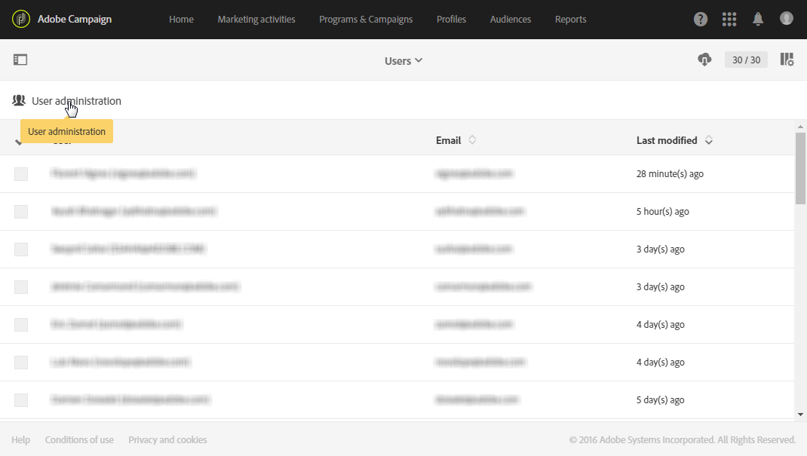

# 사용자 관리{#users-management}

## 사용자 기본 정보 {#about-users}

Adobe Campaign을 사용하면 사용자에게 역할 세트를 할당하여 인터페이스에서 액세스 가능한 부분을 정의할 수 있습니다.

특정 역할 및 이에 해당하는 권한은 다음 섹션에 자세히 설명되어 있습니다. [역할 이해](../../administration/using/list-of-roles.md) 및 [권한](https://experienceleague.adobe.com/docs/campaign-standard/assets/acs_rights.pdf?lang=en)

관리자는 Admin Console에서 사용자를 관리할 수 있습니다. 그러면 사용자는 Adobe Campaign과 자동으로 동기화됩니다. 자세한 내용은 [Admin Console](https://helpx.adobe.com/kr/enterprise/using/users.html) 설명서를 참조하십시오.

 [비디오에서 이 기능 살펴보기](#video)

Adobe Campaign의 사용자를 보려면 왼쪽 상단 모서리에서 **[!UICONTROL Adobe Campaign]** 로고를 클릭한 다음 **[!UICONTROL Administration > Users & Security > Users]**&#x200B;을(를) 선택합니다.

Adobe Campaign에서 사용자 관리 인터페이스에 액세스하려면 **[!UICONTROL User administration]**&#x200B;을(를) 클릭합니다.

**관련 항목:**

* [사용자 권한 관리](https://docs.adobe.com/content/help/en/campaign-learn/campaign-standard-tutorials/getting-started/access-management.html) 비디오
* [역할 목록](../../administration/using/list-of-roles.md)
* [권한 목록](https://experienceleague.adobe.com/docs/campaign-standard/assets/acs_rights.pdf?lang=en)

## 사용자 유형 {#type-of-users}

사용자 세분화는 필수가 아니며, Adobe Campaign에서 일반적으로 사용하는 예시를 보여주는 것입니다.

이 섹션은 Adobe Campaign 사용자의 주요 유형을 이해하는 데 도움이 됩니다. 여기에서 사용자가 가질 수 있는 특정 역할(게재 시작, 내보내기, 게재 준비 등)을 모두 다루지는 않을 것입니다. 역할에 대한 자세한 내용은 [역할 목록](../../administration/using/list-of-roles.md) 및 [그룹 및 사용자 관리](../../administration/using/managing-groups-and-users.md) 페이지를 참조하십시오.

여기에서는 다음 세 가지 주요 사용자 유형 간에 Adobe Campaign의 다양한 작업이 어떻게 구분되는지를 중점적으로 살펴봅니다.

* [기능 관리자](#functional-administrators): 조직의 사용자 중 가장 기술적인 역할을 하는 사용자입니다.
* [고급 사용자](#advanced-users): 마케터가 게재를 보내고 모니터링하는 데 필요한 모든 요소를 설정합니다.
* [기본 사용자](#basic-users): 캠페인을 개인화, 게재 및 모니터링하는 마케터입니다.

>[!NOTE]
>
>기능 관리자는 Adobe 기술 관리자와는 다릅니다. Adobe 기술 관리자의 경우 고객은 사용할 수 없는 Adobe 내부의 역할을 담당합니다. 이들은 인스턴스 프로비전, 호스팅, 인프라 모니터링 및 감독, 기술 문제 해결 등을 관리합니다.

### 기능 관리자 {#functional-administrators}

기능 관리자는 인터페이스의 가장 기술적인 부분에 액세스할 수 있는 사용자입니다. 이들은 **[!UICONTROL Administration]** 역할을 맡아서 마케터가 캠페인 게재에만 집중할 수 있도록 플랫폼이 제대로 설정되어 있는지 확인합니다.

>[!IMPORTANT]
>
>**[!UICONTROL Administration]** 역할 및 **All** 장치에 대한 액세스 권한을 가진 기능 관리자만 전송 로그, 메시지 로그, 추적 로그, 제외 로그, 제안 로그 및 구독 로그에 액세스할 수 있습니다. 관리자가 아닌 사용자는 이러한 로그를 타깃팅할 수 있지만 연결된 테이블(프로필, 배달)부터 시작합니다.

기능 관리자만이 Adobe Campaign 인터페이스의 **[!UICONTROL Administration]** 메뉴에 액세스할 수 있습니다. 이 사용자들은 기술 리소스에 액세스해야 하므로 고급 역할(예: **[!UICONTROL Administration]** 및 **[!UICONTROL Datamodel]** 기본 역할)을 할당해 주어야 합니다. 이러한 역할은 **[!UICONTROL Administrators]** 기본 보안 그룹에 결합되어 있습니다. 자세한 정보는 이 [섹션](../../administration/using/list-of-roles.md)을 참조하십시오.

다음은 이들이 수행할 수 있는 주요 작업입니다.

* [사용자 및 권한 관리](../../administration/using/about-access-management.md): 플랫폼에 대한 액세스(사용자, 역할, 보안 그룹, 단위)를 관리합니다.
* [다양한 채널 구성](../../administration/using/about-channel-configuration.md): 유형화와 격리 관리 및 다양한 플랫폼 채널을 설정합니다.
* [일반 애플리케이션 설정 구성](../../administration/using/external-accounts.md): 다양한 애플리케이션 요소(외부 계정, 옵션, 기술 워크플로우)를 구성합니다.
* [새로운 기능을 개발하여 기본 제공 기능 향상](../../developing/using/data-model-concepts.md): 사용자 정의 리소스를 관리하고 진단 도구에 액세스합니다.
* [인스턴스 매개 변수 설정](../../administration/using/branding.md): 다양한 브랜드를 정의하고 설정(로고, 추적 관리, 랜딩 페이지에 액세스하기 위한 URL 도메인 등)을 구성합니다.
* [데이터 패키지 내보내기 및 가져오기](../../automating/using/managing-packages.md): 구조화된 XML 파일을 통해 다양한 Adobe Campaign 인스턴스 간에 리소스를 교환합니다.
* [로그를 내보내고](../../automating/using/exporting-logs.md) [가져오기 템플릿을 정의](../../automating/using/importing-data-with-import-templates.md#setting-up-import-templates)합니다.

### 고급 사용자 {#advanced-users}

고급 사용자는 Adobe Campaign의 가장 기술적인 사용 사례를 수행하는 마케팅 사용자입니다. 이들은 마케터가 게재를 보내고 모니터링하는 데 사용하는 모든 요소를 사전 구성합니다.

이 유형의 사용자에게는 기능 관리자보다 더 일반적인 역할이 필요하지만, 일부 기술 작업도 수행할 수 있어야 합니다. 이를 위해서는 **[!UICONTROL Export]**, **[!UICONTROL Generic import]** 또는 **[!UICONTROL Workflow]** 기본 역할 등을 할당해 주어야 합니다. 자세한 정보는 이 [섹션](../../administration/using/list-of-roles.md)을 참조하십시오.

다음은 이들이 수행할 수 있는 주요 작업입니다.

* [복잡한 데이터 관리 워크플로우를 만들고 실행](../../automating/using/about-data-management-activities.md): 데이터를 가져오고 보강 및 변형하여 데이터베이스를 채우거나 필요한 데이터를 외부 파일로 내보내 원하는 도구로 처리합니다.
* [템플릿 관리](../../start/using/marketing-activity-templates.md): 템플릿을 관리하여 필요에 따라 마케팅 활동의 특정 매개 변수를 사전 구성합니다.
* [쿼리 만들기](../../automating/using/editing-queries.md#about-query-editor) 및 [대상자 관리](../../audiences/using/about-audiences.md): 쿼리를 수동으로 사용하거나 전용 워크플로우를 자동으로 사용하여 대상자를 만듭니다.
* [고급 표현식 편집 수행](../../automating/using/editing-queries.md#about-query-editor): 고급 함수를 사용하여 날짜, 문자열, 숫자 필드, 정렬 등의 특정 쿼리 수행에 사용할 값을 조정합니다.
* [목록을 내보내고](../../automating/using/exporting-lists.md) [기존 가져오기 템플릿을 사용하여 데이터를 가져옵니다](../../automating/using/importing-data-with-import-templates.md).

### 기본 사용자 {#basic-users}

기능 관리자와 고급 사용자가 있으므로, 마케터는 기술 구성에 대한 걱정 없이 캠페인을 개인화, 게재 및 모니터링할 수 있습니다. 이를 위해서는 **[!UICONTROL Prepare deliveries]**, **[!UICONTROL Workflow]** 및 **[!UICONTROL Start deliveries]** 기본 역할 등을 할당해 주어야 합니다. 이러한 역할은 **[!UICONTROL Standard Users]** 기본 보안 그룹에 결합되어 있습니다. 자세한 정보는 이 [섹션](../../administration/using/list-of-roles.md)을 참조하십시오.

다음은 이들이 수행할 수 있는 주요 작업입니다.

* [프로그램 및 캠페인 관리](../../start/using/programs-and-campaigns.md): 다양한 유형의 활동(이메일, SMS 메시지, 푸시 알림, 워크플로우, 랜딩 페이지)을 포함하는 마케팅 캠페인을 만듭니다.
* [프로필](../../audiences/using/about-profiles.md) 및 [테스트 프로필](../../audiences/using/managing-test-profiles.md) 관리: 게재 시 타겟팅할 확인 및 테스트 수신자를 관리합니다. 이름, 성, 연락처 정보, 구독, 이메일 등의 정보를 추가합니다.
* [메시지 만들기 및 보내기](../../sending/using/confirming-the-send.md): 메시지를 만들고, 대상자를 선택하고, 메시지 콘텐츠와 개인화 요소를 정의하고, 증명을 보내고, 대상자에게 최종 메시지를 보냅니다.
* [랜딩 페이지 만들기 및 게시](../../channels/using/getting-started-with-landing-pages.md): 고객에게 제공할 서비스 세트(구독이나 구독 취소 양식 등)를 만들고 관리합니다.
* [캠페인 워크플로우 만들기 및 실행](../../automating/using/building-a-workflow.md): 워크플로우를 사용하여 캠페인 프로세스를 자동화합니다.
* [사용 가능한 보고서](../../reporting/using/defining-the-report-period.md)를 통해 마케팅 활동을 모니터링합니다.

## 사용자 만들기 {#creating-a-user}

인스턴스에 사용자를 추가하려면 먼저 Admin Console에서 사용자를 만든 후 Adobe Campaign Standard에서 관리해야 합니다.

1. 고급 메뉴에서 **[!UICONTROL Administration > Users & Security > Users]**&#x200B;을(를) 선택하고 **[!UICONTROL User administration]**&#x200B;을(를) 클릭하여 Admin Console에 액세스합니다.

   

1. **[!UICONTROL Admin Console]**&#x200B;에서 **[!UICONTROL Users]** 탭을 클릭합니다.

1. **[!UICONTROL Add User]**&#x200B;을(를) 클릭합니다.

   

1. **[!UICONTROL User details]** 탭에서 사용자의 이메일 주소, 이름, 성 등 세부 사항을 입력합니다.

   

1. **[!UICONTROL Assign products]** 탭에서 사용자에게 하나 이상의 보안 그룹을 할당합니다. 보안 그룹에 대한 자세한 내용은 이 [페이지](../../administration/using/managing-groups-and-users.md)를 참조하십시오.

   구성을 완료하면 **[!UICONTROL Save]**&#x200B;을(를) 클릭합니다.

   

이제 사용자가 만들어졌고 다음 창으로 리디렉션되는 이메일을 받게 됩니다. 사용자는 해당 창에서 암호를 설정하고 사용 약관에 동의해야 합니다. 그러고 나면 이 사용자는 Adobe Campaign Standard 인스턴스에 연결할 수 있습니다.

사용자는 인스턴스에 로그인하는 즉시 Adobe Campaign Standard에 동기화됩니다.

그 다음 사용자가 Adobe Campaign에 올바르게 동기화되었는지 다음 방법으로 확인할 수 있습니다.

1. **[!UICONTROL Administration > Users & Security > Users]** 고급 메뉴에서 앞에서 만든 사용자를 선택합니다.

1. 필요한 경우 **[!UICONTROL Mobile]**, **[!UICONTROL Time zone]** 또는 **[!UICONTROL Regional settings]**&#x200B;을(를) 업데이트합니다.

1. 사용자의 보안 그룹을 확인합니다. 여기에서 해당 사용자에게 **[!UICONTROL Administrators]** 보안 그룹이 할당되었음을 확인할 수 있습니다.

   >[!NOTE]
   >
   >보안 그룹을 제거하거나 사용자에게 추가하는 작업은 Admin Console에서만 수행할 수 있습니다.

   

1. 이 사용자를 비활성화하려면 **[!UICONTROL Account disabled]**&#x200B;을(를) 선택합니다.

1. **[!UICONTROL Authorized connection zone]** 필드에서 사용자가 이 인스턴스에 연결할 방법(내부 네트워크나 VPN 등)을 선택합니다.

1. **[!UICONTROL Save]**&#x200B;을(를) 클릭합니다.

이제 사용자가 Adobe Campaign Standard를 사용할 준비가 되었습니다.

## 자습서 비디오(#video)

이 비디오에서는 사용자 액세스 권한을 관리하는 방법을 보여 줍니다.

>[!VIDEO](https://video.tv.adobe.com/v/24671?quality=12)

추가 Campaign Standard 방법 비디오는 [여기](https://experienceleague.adobe.com/docs/campaign-standard-learn/tutorials/overview.html?lang=ko)에서 사용할 수 있습니다.
