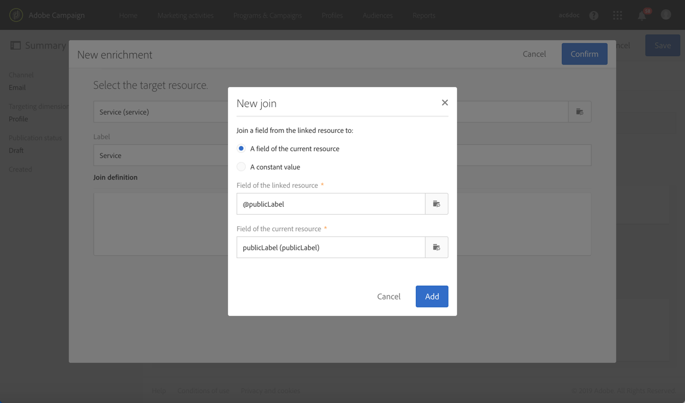
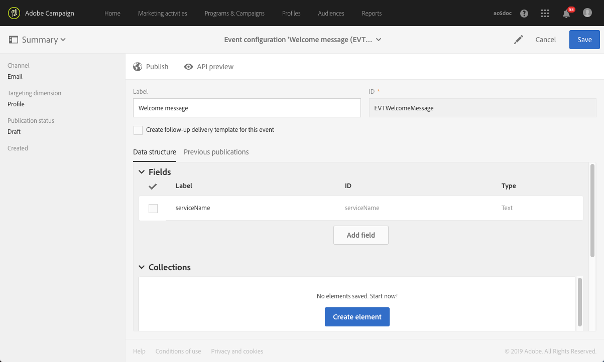
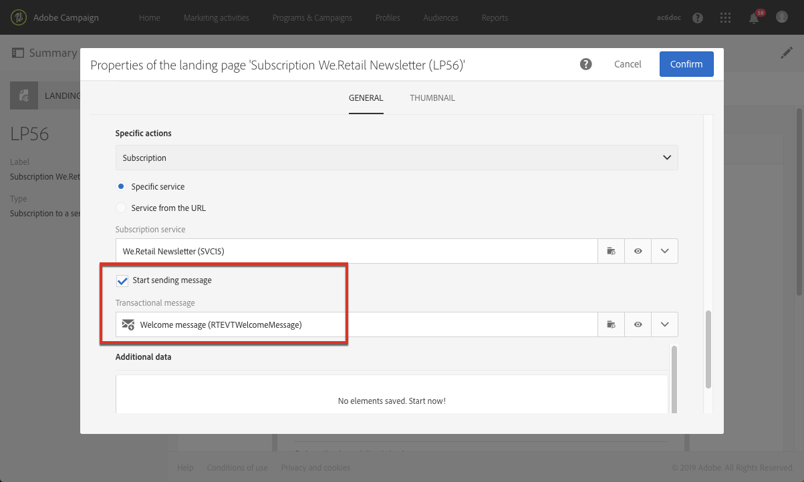

# 서비스 구독 확인{#confirming-subscription-to-a-service}

## 구독 확인 보내기 기본 정보 {#sending-subscription-confirmation}

이 섹션에서는 특정 서비스를 구독하는 프로필에 자동 사용자 정의 확인 이메일을 보내는 방법에 대해 설명합니다.

서비스 구독(또는 구독 취소)에 대한 확인 메시지를 보내려면 기본 메시지나 사용자 정의 메시지를 사용할 수 있습니다. 확인 메시지를 선택하는 단계는 [서비스 만들기](../../audiences/using/creating-a-service.md) 섹션에 나와 있습니다.

기본 메시지를 사용하도록 선택하면 다음 제한 사항 하에 콘텐츠를 편집할 수 있습니다.
* 메시지 콘텐츠 개인화 시 이벤트 컨텍스트에서 제한된 필드만 사용할 수 있습니다.
* 이 메시지는 기본 모드를 사용하는 모든 서비스에 대해 동일합니다.

특정 서비스에만 해당하는 확인 이메일을 보내려면 사용자 정의 메시지를 만들 수 있습니다. 이 경우 기타 리소스에서 가져온 개인화 필드도 활용할 수 있습니다. 이를 수행하려면 트랜잭션 메시지를 만들고 구성해야 합니다. 이 메시지는 다음에서 참조될 수 있습니다.
* 서비스 자체. 자세한 내용은 [서비스에서 확인 메시지 구성](#configuring-confirmation-message-from-service)을 참조하십시오.
* 구독 랜딩 페이지. 자세한 내용은 [랜딩 페이지에서 확인 메시지 구성](#configuring-confirmation-message-from-landing-page)을 참조하십시오.

## 서비스에서 확인 메시지 구성 {#configuring-confirmation-message-from-service}

웹사이트 방문자가 브랜드 뉴스레터를 구독할 때 확인 메시지를 자동으로 보내려는 경우를 예로 들어 보겠습니다.

트랜잭션 이메일을 구성하고 원하는 서비스(이 경우 브랜드 뉴스레터 구독)에서 메시지를 참조해야 합니다. 서비스 정보로 트랜잭션 메시지를 보강하기 위해 이벤트를 만들 때 조정을 정의할 수 있습니다.

서비스에서 구성한 경우, 확인 트랜잭션 메시지는 각 방문자가 해당 서비스를 처음 구독할 때만 보내집니다. 이미 해당 서비스를 구독한 프로필에는 확인 메시지를 다시 보내지 않습니다.

### 1단계: 확인 이메일 만들기 {#step-1--create-the-confirmation-email-1}

뉴스레터를 구독(랜딩 페이지 또는 기타 수단을 통해)하는 각 프로필에 자동으로 확인 이메일을 보냅니다. 구독은 이벤트로 간주되며 이메일은 서비스를 구독하는 각 프로필을 타겟팅하는 [트랜잭션 메시지](../../channels/using/getting-started-with-transactional-msg.md)입니다.

확인 이메일을 만드는 단계는 아래에 설명되어 있습니다. 트랜잭션 메시지가 서비스에서 참조되므로, 이를 먼저 만들어야 합니다.

#### 이벤트 만들기 {#create-the-event-1}

확인 이메일은 서비스 구독이라는 이벤트에 반응하는 트랜잭션 메시지입니다. 이 메시지는 뉴스레터 구독을 확인하기 위해 전송됩니다.

1. Adobe Campaign 로고에서 액세스할 수 있는 **[!UICONTROL Marketing plans]** > **[!UICONTROL Transactional messages]** > **[!UICONTROL Event configuration]** 메뉴에서 이벤트를 만듭니다.
1. 레이블을 입력하고 타겟팅 차원을 선택한 뒤 **[!UICONTROL Create]**&#x200B;을(를) 클릭합니다.

   구성 단계는 [트랜잭션 이벤트](../../channels/using/configuring-transactional-event.md) 구성 섹션에 제공됩니다.

1. **[!UICONTROL Fields]** 섹션에서 **[!UICONTROL Create element]**&#x200B;을(를) 클릭하고 데이터 구조에 **[!UICONTROL publicLabel]**&#x200B;을(를) 추가하여 조정을 활성화합니다.

   

   >[!NOTE]
   >
   >**[!UICONTROL publicLabel]** 필드는 필수입니다. 이벤트 데이터 구조에 이 필드를 추가하지 않으면 Adobe Campaign에서 서비스에 대해 조정을 수행할 수 없습니다. 서비스를 구독하면 이 필드에 해당 서비스의 **[!UICONTROL Service label]**&#x200B;이(가) 입력됩니다.

1. **[!UICONTROL Enrichment]** 섹션에서 **[!UICONTROL Create element]**&#x200B;을(를) 클릭하고 **[!UICONTROL Service]** 타겟 리소스를 선택합니다.

   

1. **[!UICONTROL Join definition]** 섹션에서 **[!UICONTROL Service]** 리소스의 **[!UICONTROL publicLabel]** 필드를 이벤트 구성의 **[!UICONTROL publicLabel]** 필드에 매핑합니다.

   

   >[!NOTE]
   >
   >이를 통해 **[!UICONTROL Service]** 리소스에서 가져온 개인화 필드를 트랜잭션 메시지에 사용할 수 있습니다.

1. 이벤트 구성을 저장하고 **[!UICONTROL Publish]**&#x200B;을(를) 클릭하여 이벤트를 게시합니다.

이벤트가 준비되었습니다. 이제 트랜잭션 이메일 메시지를 디자인할 수 있습니다.

#### 확인 메시지 디자인 {#design-the-confirmation-message-1}

확인 이메일은 방금 게시한 이벤트를 기반으로 하는 트랜잭션 메시지입니다.

1. Adobe Campaign 로고에서 **[!UICONTROL Marketing plans]** > **[!UICONTROL Transactional messages]**&#x200B;을(를) 선택하고 **[!UICONTROL Transactional messages]**&#x200B;을(를) 클릭합니다.
1. 방금 게시한 이벤트에 해당하는 트랜잭션 이메일을 선택합니다.

1. **[!UICONTROL Content]** 섹션을 클릭하고 이메일 템플릿을 선택합니다. 트랜잭션 메시지 내용 편집에 대한 자세한 내용은 [트랜잭션 메시지 편집](../../channels/using/editing-transactional-message.md)을 참조하십시오.
1. **[!UICONTROL Service]** 리소스의 모든 필드에 직접 액세스할 수 있으므로, **[!UICONTROL Context]** > **[!UICONTROL Real-time event (rtEvent)]** > **[!UICONTROL Event context (ctx)]** > **[!UICONTROL Service]** 노드에서 필드를 선택하여 콘텐츠를 개인화할 수 있습니다.

   

   트랜잭션 메시지 개인화에 대한 자세한 내용은 [이 섹션](../../channels/using/editing-transactional-message.md#personalizing-a-transactional-message)을 참조하십시오.

1. 테스트 프로필을 사용하여 메시지를 미리 봅니다. 자세한 내용은 [특정 테스트 프로필 정의](../../channels/using/publishing-transactional-message.md#defining-specific-test-profile)를 참조하십시오.

1. **[!UICONTROL Save & close]**&#x200B;을(를) 클릭하여 콘텐츠를 저장합니다.
1. 트랜잭션 메시지를 게시합니다. [트랜잭션 메시지 게시](../../channels/using/publishing-transactional-message.md#publishing-a-transactional-message)를 참조하십시오.

### 2단계: 서비스 만들기 및 구성 {#step-2--create-and-configure-the-service-1}

1. Adobe Campaign 로고를 통해 고급 메뉴 **프로필 및 대상자** > **서비스**&#x200B;에서 서비스를 만듭니다.
1. 서비스 대시보드의  버튼을 통해 액세스할 수 있는 **[!UICONTROL Service properties]** 섹션으로 이동합니다.
1. **[!UICONTROL Service label]** 필드를 입력합니다.

   

   >[!NOTE]
   >
   >트랜잭션 메시지에 대한 조정을 활성화하려면 이 필드를 입력해야 합니다.

1. **[!UICONTROL Confirmation messages]** 섹션에서 **[!UICONTROL Custom message]**&#x200B;을(를) 선택합니다. 이 모드에서는 서비스를 구독하는 프로필에 대한 특정 확인 메시지를 참조할 수 있습니다.
1. 만든 트랜잭션 메시지와 관련된 **[!UICONTROL Custom subscription event configuration]**&#x200B;을(를) 선택합니다.

   

1. **[!UICONTROL Confirm]**&#x200B;을(를) 클릭하고 서비스를 저장합니다.

이제 프로필이 이 서비스를 구독할 때마다 정의된 트랜잭션 메시지를 받고, 선택한 서비스에 개인화 필드가 매핑됩니다.

>[!NOTE]
>
>사용자가 처음 구독할 때만 메시지가 전송됩니다.

## 랜딩 페이지에서 확인 메시지 구성 {#configuring-confirmation-message-from-landing-page}

구독 랜딩 페이지에서 랜딩 페이지의 **[!UICONTROL Job]** 섹션에 있는 **[!UICONTROL Start sending messages]** 옵션을 사용하여 확인 메시지를 참조할 수도 있습니다.

확인 메시지를 랜딩 페이지에서 참조하면 랜딩 페이지가 제출될 때마다(이미 구독한 프로필인 경우에도) 메시지를 보냅니다.

### 1단계: 확인 이메일 만들기 {#step-1--create-the-confirmation-email-2}

랜딩 페이지를 통해 뉴스레터를 구독하는 각 프로필에 자동으로 확인 이메일을 보냅니다. 구독은 이벤트로 간주되며 이메일은 서비스에 가입한 각 프로필을 타겟팅하는 [트랜잭션 메시지](../../channels/using/getting-started-with-transactional-msg.md)입니다.

이러한 요소를 만드는 단계는 아래에 설명되어 있습니다. 트랜잭션 메시지가 랜딩 페이지에서 참조되므로, 이를 먼저 만들어야 합니다.

#### 이벤트 만들기 {#create-the-event-2}

확인 이메일은 서비스 구독이라는 이벤트에 반응하는 [트랜잭션 메시지](../../channels/using/getting-started-with-transactional-msg.md)입니다. 이 메시지는 뉴스레터 구독을 확인하기 위해 전송됩니다.

1. Adobe Campaign 로고에서 액세스할 수 있는 **[!UICONTROL Marketing plans]** > **[!UICONTROL Transactional messages]** > **[!UICONTROL Event configuration]** 메뉴에서 이벤트를 만듭니다.
1. 레이블을 입력하고 타겟팅 차원을 선택한 뒤 **[!UICONTROL Create]**&#x200B;을(를) 클릭합니다.

   구성 단계는 [트랜잭션 이벤트](../../channels/using/configuring-transactional-event.md) 구성 섹션에 제공됩니다.

1. **[!UICONTROL Fields]** 섹션에서 **[!UICONTROL Create element]**&#x200B;을(를) 클릭하고 데이터 구조에 **[!UICONTROL serviceName]**&#x200B;을(를) 추가하여 조정을 활성화합니다.

   

   >[!NOTE]
   >
   >**[!UICONTROL serviceName]** 필드는 필수입니다. 이벤트 데이터 구조에 이 필드를 추가하지 않으면 Adobe Campaign에서 구독 서비스에 대해 조정을 수행할 수 없습니다.

1. **[!UICONTROL Enrichment]** 섹션에서 **[!UICONTROL Create element]**&#x200B;을(를) 클릭하고 **[!UICONTROL Service]** 타겟 리소스를 선택합니다.
1. **[!UICONTROL Join definition]** 섹션에서 **[!UICONTROL Service]** 리소스의 **[!UICONTROL serviceName]** 필드를 이벤트 구성의 **[!UICONTROL name]** 필드에 매핑합니다.

   

   >[!NOTE]
   >
   >이를 통해 [!UICONTROL Service] 리소스에서 가져온 개인화 필드를 트랜잭션 메시지에 사용할 수 있습니다.

#### 확인 메시지 디자인 {#design-the-confirmation-message-2}

트랜잭션 메시지를 디자인하는 단계는 이 [섹션](#design-the-confirmation-message-1)에 나와 있습니다.

### 2단계: 서비스 만들기 및 구성 {#step-2--create-and-configure-the-service-2}

1. Adobe Campaign 로고를 통해 고급 메뉴 **[!UICONTROL Profiles & audiences]** > **[!UICONTROL Services]**&#x200B;에서 서비스를 만듭니다.
1. 서비스 대시보드의  버튼을 통해 액세스할 수 있는 **[!UICONTROL Service properties]** 섹션으로 이동합니다.
1. **[!UICONTROL Service label]** 필드를 입력합니다. 이 레이블은 확인 메시지와 구독 랜딩 페이지에 표시됩니다.
1. **[!UICONTROL Confirm]**&#x200B;을(를) 클릭하고 서비스를 저장합니다.

### 3단계: 랜딩 페이지 만들기 및 구성 {#step-3--create-and-configure-the-landing-page}

구독 랜딩 페이지를 만들어 웹사이트에 게시합니다.

이 랜딩 페이지를 만들고 구성하려면 아래 단계를 수행하십시오.

1. **[!UICONTROL Subscription]** 템플릿을 기반으로 [새 랜딩 페이지](../../channels/using/getting-started-with-landing-pages.md)를 디자인합니다.
1. 랜딩 페이지 속성을 편집합니다. **[!UICONTROL Job]** > **[!UICONTROL Specific actions]** 섹션에서 **[!UICONTROL Specific service]** 옵션을 선택하고 드롭다운 목록에서 방금 만든 서비스를 선택합니다.

   

1. **[!UICONTROL Start sending message]** 옵션을 선택하고 드롭다운 목록에서 방금 만든 트랜잭션 메시지를 선택합니다.

   

1. 랜딩 페이지의 콘텐츠를 사용자 정의합니다.

1. 랜딩 페이지를 [테스트 및 게시](../../channels/using/testing-publishing-landing-page.md)합니다.

이제 프로필이 랜딩 페이지를 제출하여 뉴스레터를 구독할 때마다 정의된 확인 메시지를 받고, 해당 서비스에 개인화 필드가 매핑됩니다.

>[!NOTE]
>
>해당 프로필이 이미 구독 중이더라도 랜딩 페이지를 제출할 때마다 메시지가 보내집니다.
