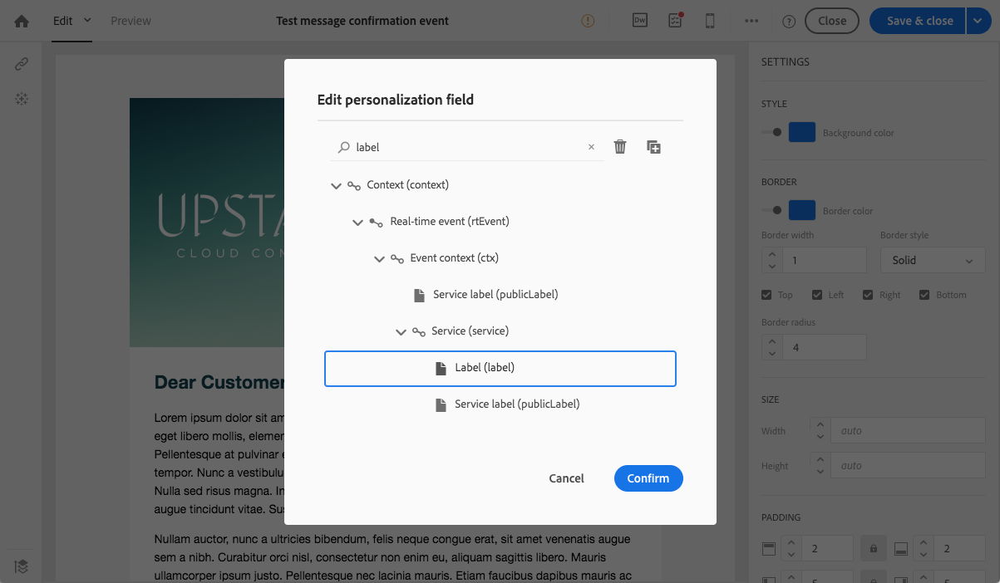
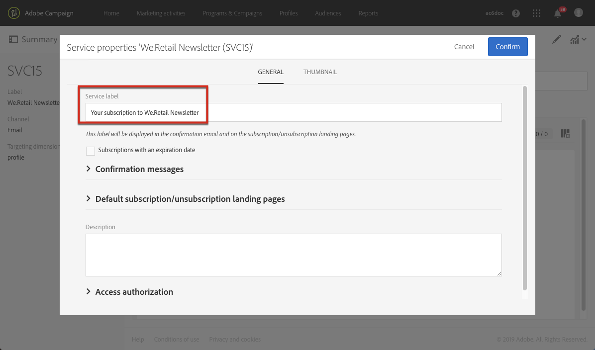

# 서비스 구독 확인{#confirming-subscription-to-a-service}

## 구독 확인 보내기 정보 {#sending-subscription-confirmation}

이 섹션에서는 특정 서비스를 구독하는 프로필에 자동 사용자 정의 확인 이메일을 보내는 방법에 대해 설명합니다.

서비스에 구독(또는 구독 취소)에 대한 확인 메시지를 보내려면 기본 메시지 또는 사용자 지정 메시지를 사용할 수 있습니다. 확인 메시지를 선택하는 단계는 서비스 [만들기](../../audiences/using/creating-a-service.md) 섹션에 나와 있습니다.

기본 메시지를 사용하도록 선택한 경우 다음 제한 사항을 사용하여 컨텐츠를 편집할 수 있습니다.
* 이벤트 컨텍스트의 필드가 제한된 메시지 컨텐츠만 개인화할 수 있습니다.
* 이 메시지는 기본 모드를 사용하는 모든 서비스에 대해 동일합니다.

특정 서비스에 대한 특정 확인 이메일을 보내려면 사용자 지정 메시지를 만들어 다른 리소스의 개인화 필드를 활용할 수도 있습니다. 이렇게 하려면 트랜잭션 메시지를 만들고 구성해야 합니다. 이 메시지는 참조할 수 있습니다.
* 서비스 자체에서 자세한 내용은 서비스의 [확인 메시지 구성을](#configuring-confirmation-message-from-service)참조하십시오.
* 구독 랜딩 페이지에서 자세한 내용은 랜딩 [페이지에서](#configuring-confirmation-message-from-landing-page)확인 메시지 구성을 참조하십시오.

## 서비스의 확인 메시지 구성 {#configuring-confirmation-message-from-service}

예를 들어 웹 사이트 방문자가 브랜드 뉴스레터를 구독할 때 확인 메시지를 자동으로 보낼 수 있습니다.

트랜잭션 이메일을 구성하고 원하는 서비스의 메시지를 참조해야 합니다(이 경우 브랜드 뉴스레터에 대한 구독). 서비스 정보로 트랜잭션 메시지를 보완하려면 이벤트를 만들 때 조정을 정의할 수 있습니다.

서비스에서 구성 시 확인 트랜잭션 메시지는 각 방문자가 해당 서비스에 처음으로 가입했을 때에만 전송됩니다. 프로파일이 이미 구독되어 있는 경우 해당 프로필에 확인 메시지가 다시 전송되지 않습니다.

### 1단계:확인 이메일 만들기 {#step-1--create-the-confirmation-email-1}

확인 이메일은 뉴스레터에 가입하는 각 프로필(랜딩 페이지 또는 기타 수단을 통해)에 자동으로 전송됩니다. 구독은 이벤트로 간주되며 이메일은 서비스에 가입한 각 프로필을 대상으로 하는 [트랜잭션 메시지입니다](../../channels/using/about-transactional-messaging.md) .

확인 이메일을 만드는 단계는 아래에 설명되어 있습니다. 트랜잭션 메시지는 서비스에서 참조되므로 먼저 만들어야 합니다.

#### 이벤트 만들기 {#create-the-event-1}

확인 이메일은 이벤트에 반응하는 트랜잭션 메시지입니다.서비스의 가입. 이 메시지는 뉴스레터의 구독을 확인하기 위해 전송됩니다.

1. Adobe Campaign 로고에서 액세스할 수 있는 **[!UICONTROL Marketing plans]** &gt; **[!UICONTROL Transactional messages]** &gt; **[!UICONTROL Event configuration]** 메뉴에서 이벤트를 만듭니다.
1. 레이블을 입력하고 타깃팅 차원을 선택하고 을 **[!UICONTROL Create]**&#x200B;클릭합니다.

   구성 단계는 트랜잭션 메시지 [구성](../../administration/using/configuring-transactional-messaging.md) 섹션에 나와 있습니다.

1. 섹션에서 **[!UICONTROL Fields]** 데이터 구조를 **[!UICONTROL Create element]** 클릭하여 **[!UICONTROL publicLabel]** 추가하여 조정을 활성화합니다.

   

   >[!NOTE]
   >
   >필수 **[!UICONTROL publicLabel]** 필드입니다. 이벤트 데이터 구조에 추가하지 않으면 Adobe Campaign에서 서비스와 조정을 수행할 수 없습니다. 서비스를 구독하면 이 필드에 해당 서비스의 **[!UICONTROL Service label]** 내용이 채워집니다.

1. 섹션에서 **[!UICONTROL Enrichment]** 타겟 리소스를 **[!UICONTROL Create element]** 클릭하고 **[!UICONTROL Service]** 선택합니다.

   

1. 섹션에서 **[!UICONTROL Join definition]** 리소스의 **[!UICONTROL publicLabel]** 필드를 이벤트 구성의 **[!UICONTROL Service]** **[!UICONTROL publicLabel]** 필드와 매핑합니다.

   

   >[!NOTE]
   >
   >이렇게 하면 트랜잭션 메시지의 **[!UICONTROL Service]** 리소스의 개인화 필드를 사용할 수 있습니다.

1. 이벤트 구성을 저장하고 을 클릭하여 이벤트를 **[!UICONTROL Publish]** 게시합니다.

이벤트가 준비되었습니다. 이제 트랜잭션 이메일 메시지를 디자인할 수 있습니다.

#### 확인 메시지 디자인 {#design-the-confirmation-message-1}

확인 이메일은 방금 게시한 이벤트를 기반으로 하는 트랜잭션 메시지입니다.

1. Adobe Campaign 로고에서 **[!UICONTROL Marketing plans]** &gt; **[!UICONTROL Transactional messages]** 을 선택하고 **[!UICONTROL Transactional messages]**&#x200B;클릭합니다.
1. 방금 게시한 이벤트에 해당하는 트랜잭션 이메일을 선택합니다.

1. 섹션을 **[!UICONTROL Content]** 클릭하고 이메일 템플릿을 선택합니다. 트랜잭션 메시지 컨텐츠 편집에 대한 자세한 내용은 이벤트 트랜잭션 [메시지를](../../channels/using/event-transactional-messages.md)참조하십시오.
1. 리소스의 모든 필드에 직접 액세스할 수 있으므로 **[!UICONTROL Service]** &gt; **[!UICONTROL Context]** &gt; **[!UICONTROL Real-time event (rtEvent)]** &gt; 노드에서 원하는 필드를 선택하여 컨텐츠를 개인화할 수 있습니다 **[!UICONTROL Event context (ctx)]****[!UICONTROL Service]** .

   

   트랜잭션 메시지 개인화에 대한 자세한 내용은 [이 섹션을](../../channels/using/event-transactional-messages.md#personalizing-a-transactional-message)참조하십시오.

1. 테스트 프로필을 사용하여 메시지를 미리 봅니다. 자세한 내용은 트랜잭션 [메시지에서](../../channels/using/event-transactional-messages.md#defining-a-test-profile-in-a-transactional-message)테스트 프로필 정의를 참조하십시오.

1. 컨텐츠를 **[!UICONTROL Save & close]** 저장하려면 을 클릭합니다.
1. 트랜잭션 메시지를 게시합니다. 트랜잭션 [메시지](../../channels/using/event-transactional-messages.md#publishing-a-transactional-message)게시를 참조하십시오.

### 2단계:서비스 만들기 및 구성 {#step-2--create-and-configure-the-service-1}

1. 고급 메뉴 프로필 및 **대상** &gt; **Adobe Campaign** 로고를 통해 서비스에서 서비스를 만듭니다.
1. 서비스 대시보드의 단추를 통해 액세스할 수 있는 **[!UICONTROL Service properties]**  섹션으로 이동합니다.
1. 필드를 **[!UICONTROL Service label]** 채웁니다.

   

   >[!NOTE]
   >
   >트랜잭션 메시지로 조정을 활성화하려면 이 필드를 채워야 합니다.

1. 섹션에서 **[!UICONTROL Confirmation messages]** 다음을 선택합니다 **[!UICONTROL Custom message]**.이 모드에서는 서비스에 가입하는 프로필에 대한 특정 확인 메시지를 참조할 수 있습니다.
1. 만든 트랜잭션 메시지와 **[!UICONTROL Custom subscription event configuration]** 관련된 메시지를 선택합니다.

   

1. 서비스를 **[!UICONTROL Confirm]** 클릭하여 저장합니다.

이제 프로필이 이 서비스에 가입될 때마다, 그는 선택한 서비스에 매핑된 개인화된 필드를 사용하여 사용자가 정의한 트랜잭션 메시지를 받습니다.

>[!NOTE]
>
>사용자가 처음 구독할 때만 메시지가 전송됩니다.

## 랜딩 페이지에서 확인 메시지 구성 {#configuring-confirmation-message-from-landing-page}

랜딩 페이지의 **[!UICONTROL Start sending messages]** **[!UICONTROL Job]** 섹션에서 옵션을 사용하여 구독 랜딩 페이지에서 확인 메시지를 참조할 수도 있습니다.

랜딩 페이지에서 확인 메시지를 참조할 때, 랜딩 페이지가 제출될 때마다(프로파일이 이미 구독되었더라도) 메시지가 전송됩니다.

### 1단계:확인 이메일 만들기 {#step-1--create-the-confirmation-email-2}

확인 이메일은 랜딩 페이지를 통해 뉴스레터에 가입하는 각 프로필에 자동으로 전송됩니다. 구독은 이벤트로 간주되며 이메일은 서비스에 가입한 각 프로필을 대상으로 하는 [트랜잭션 메시지입니다](../../channels/using/about-transactional-messaging.md) .

이러한 요소를 만드는 단계는 아래에 설명되어 있습니다. 트랜잭션 메시지는 랜딩 페이지에서 참조되므로 먼저 만들어야 합니다.

#### 이벤트 만들기 {#create-the-event-2}

확인 이메일은 이벤트에 반응하는 [트랜잭션 메시지입니다](../../channels/using/about-transactional-messaging.md) .서비스의 가입. 이 메시지는 뉴스레터의 구독을 확인하기 위해 전송됩니다.

1. Adobe Campaign 로고에서 액세스할 수 있는 **[!UICONTROL Marketing plans]** &gt; **[!UICONTROL Transactional messages]** &gt; **[!UICONTROL Event configuration]** 메뉴에서 이벤트를 만듭니다.
1. 레이블을 입력하고 타깃팅 차원을 선택하고 을 **[!UICONTROL Create]**&#x200B;클릭합니다.

   구성 단계는 트랜잭션 메시지 [구성](../../administration/using/configuring-transactional-messaging.md) 섹션에 나와 있습니다.

1. 섹션에서 **[!UICONTROL Fields]** 데이터 구조를 **[!UICONTROL Create element]** 클릭하여 **[!UICONTROL serviceName]** 추가하여 조정을 활성화합니다.

   

   >[!NOTE]
   >
   >필수 **[!UICONTROL serviceName]** 필드입니다. 이벤트 데이터 구조에 추가하지 않는 경우 Adobe Campaign은 가입된 서비스와 조정을 수행할 수 없습니다.

1. 섹션에서 **[!UICONTROL Enrichment]** 타겟 리소스를 **[!UICONTROL Create element]** 클릭하고 **[!UICONTROL Service]** 선택합니다.
1. 섹션에서 **[!UICONTROL Join definition]** 리소스의 **[!UICONTROL serviceName]** 필드를 이벤트 구성의 **[!UICONTROL Service]** **[!UICONTROL name]** 필드와 매핑합니다.

   

   >[!NOTE]
   >
   >이렇게 하면 트랜잭션 메시지의 [!UICONTROL Service] 리소스의 개인화 필드를 사용할 수 있습니다.

#### 확인 메시지 디자인 {#design-the-confirmation-message-2}

트랜잭션 메시지를 디자인하는 단계는 이 [섹션에](#design-the-confirmation-message-1)설명되어 있습니다.

### 2단계:서비스 만들기 및 구성 {#step-2--create-and-configure-the-service-2}

1. 고급 메뉴 **[!UICONTROL Profiles & audiences]** &gt; Adobe Campaign 로고를 **[!UICONTROL Services]** 통해 서비스를 만듭니다.
1. 서비스 대시보드의 단추를 통해 액세스할 수 있는 **[!UICONTROL Service properties]**  섹션으로 이동합니다.
1. 필드를 **[!UICONTROL Service label]** 채웁니다. 이 레이블은 확인 메시지와 구독 랜딩 페이지에 표시됩니다.
1. 서비스를 **[!UICONTROL Confirm]** 클릭하여 저장합니다.

### 3단계:랜딩 페이지 만들기 및 구성 {#step-3--create-and-configure-the-landing-page}

웹 사이트에 게시할 구독 랜딩 페이지를 만듭니다.

이 랜딩 페이지를 만들고 구성하려면 아래 단계를 따르십시오.

1. 템플릿을 기반으로 [새 랜딩 페이지를](../../channels/using/getting-started-with-landing-pages.md) 디자인합니다 **[!UICONTROL Subscription]** .
1. 랜딩 페이지 속성을 편집합니다. &gt; **[!UICONTROL Job]** 섹션에서 **[!UICONTROL Specific actions]** **[!UICONTROL Specific service]** 옵션을 선택하고 드롭다운 목록에서 방금 만든 서비스를 선택합니다.

   

1. 옵션을 **[!UICONTROL Start sending message]** 선택하고 드롭다운 목록에서 방금 만든 트랜잭션 메시지를 선택합니다.

   

1. 랜딩 페이지의 컨텐츠를 사용자 정의합니다.

1. [랜딩 페이지를 테스트하고 게시합니다](../../channels/using/testing-publishing-landing-page.md) .

이제 프로필이 랜딩 페이지를 제출하여 뉴스레터에 가입할 때마다 서비스에 매핑된 개인화된 필드로 정의한 확인 메시지를 받게 됩니다.

>[!NOTE]
>
>프로필이 이미 구독되어 있어도 랜딩 페이지를 제출할 때마다 메시지가 전송됩니다.
