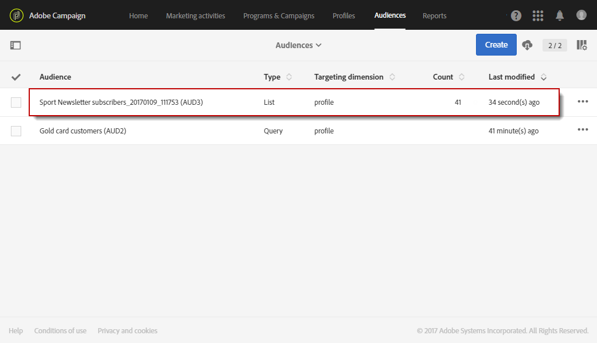

# 대상자 만들기{#creating-audiences}

## 쿼리 대상 만들기 {#creating-query-audiences}

이 섹션에서는 **쿼리 대상을 만드는 방법을** 설명합니다. 또한 [워크플로우에서 파일 가져오기 또는 타깃팅에서 대상을 만들 수도 있습니다](../../automating/using/get-started-workflows.md).

대상 목록에서 Adobe Campaign 프로필에 대한 쿼리를 수행하거나 Adobe Experience Cloud 대상을 가져와서 대상을 만들 수 있습니다.

1. 탭이나 카드를 통해 대상 목록으로 **[!UICONTROL Audiences]** 이동합니다.

   

1. 화면 **[!UICONTROL Create]** 에 액세스하여 새 대상자를 만듭니다.

   

1. 고객 이름 지정 대상 레이블은 대상 목록과 쿼리 도구 팔레트에서 사용됩니다.
1. 대상 유형을 **[!UICONTROL Query]** 선택합니다. 쿼리에 의해 정의된 대상은 추가 사용 시 다시 계산됩니다.

   

1. 그런 다음 고객 **[!UICONTROL Targeting dimension]** 을 필터링하는 데 사용할 항목을 선택합니다. 각 대상은 단일 타깃팅 차원으로 구성됩니다. 예를 들어 프로필, 테스트 프로필 및 구독자 모두로 구성된 대상은 만들 수 없습니다. 차원 타깃팅에 대한 자세한 내용은 [이 페이지를 참조하십시오](../../automating/using/query.md#targeting-dimensions-and-resources).
1. 대상 모집단을 정의하는 쿼리를 만듭니다. 쿼리 [편집 섹션을 참조하십시오](../../automating/using/editing-queries.md).
1. 대상을 저장하려면 **[!UICONTROL Create]** 단추를 클릭합니다.

>[!NOTE]
>
>이 대상에 설명을 추가하고 아이콘을 통해 액세스 권한을 정의할 수 **[!UICONTROL Edit properties]** 있습니다.

## 목록 대상 만들기 {#creating-list-audiences}

이 섹션에서는 워크플로우에서 타깃팅 후 **목록** 대상을 만드는 방법을 설명합니다. 또한 파일을 워크플로로 [가져오거나](../../automating/using/get-started-workflows.md) 메뉴에서 쿼리를 통해 대상을 **[!UICONTROL Audiences]** 만들 수도 있습니다.

목록 **대상을** 만들려면 다음 단계를 수행하십시오.

1. 마케팅 활동 **탭에서 만들기를** 클릭한 **다음** **워크플로우를**&#x200B;선택합니다.

   

1. 드래그 앤 드롭한 다음 **알려진** 차원이 있는 모집단을 선택할 수 있도록 하는 타깃팅 활동을 구성합니다. 사용 가능한 활동 및 구성 목록은 타깃팅 활동 [섹션에 자세히 설명되어 있습니다](../../automating/using/about-targeting-activities.md) .

   활동을 사용하여 가져온 데이터의 차원을 식별하기 전에 **[!UICONTROL Query]** 활동을 사용하거나 **[!UICONTROL Load file]** 활동을 사용하여 데이터를 가져올 수 **[!UICONTROL Reconciliation]** 있습니다. 여기에서 활동 관련 스포츠 뉴스레터를 구독한 수신자를 타깃팅하고자 **[!UICONTROL Query]** 합니다.

   

1. 타깃팅 후 활동을 워크플로우로 드래그하여 **[!UICONTROL Save audience]** 놓습니다. 예를 들어, 이렇게 선택할 수 있습니다. 이렇게 하면 **[!UICONTROL Create or update an audience]**&#x200B;를 만든 다음 새 데이터로 대상을 자동으로 업데이트할 수 있습니다. 이 경우 워크플로가 시작될 때 **[!UICONTROL Scheduler]** 활동을 추가합니다.

   이 활동 구성에 대한 자세한 내용은 대상 [저장](../../automating/using/save-audience.md) 섹션을 참조하십시오.

   

1. 워크플로우를 저장하고 시작합니다.

   알려진 차원이 **[!UICONTROL Save audience]** 있는 타깃팅 다음에 배치되면 이 활동을 통해 생성된 대상은 **목록** 대상입니다.

   저장된 대상자의 컨텐츠는 대상 목록을 통해 액세스할 수 있는 대상의 세부 보기에서 사용할 수 있습니다. 이 보기에서 사용할 수 있는 열은 워크플로우의 저장 활동의 인바운드 전환 열에 해당합니다. 예: 가져온 파일의 열, 쿼리에서 추가된 추가 데이터

   

## 파일 대상 만들기 {#creating-file-audiences}

이 섹션에서는 파일을 워크플로우로 가져와서 **파일** 대상을 만드는 방법에 대해 자세히 설명합니다. 또한 [워크플로우](../../automating/using/get-started-workflows.md) 또는 **[!UICONTROL Audiences]** 메뉴에서 쿼리를 통해 타깃팅 활동에서 대상을 만들 수도 있습니다.

파일 **대상을** 만들려면 다음 단계를 수행하십시오.

1. 마케팅 활동 **탭에서 만들기를** 클릭한 **다음** **워크플로우를**&#x200B;선택합니다.
1. 드래그 앤 드롭한 다음, 워크플로우 실행 시 **[!UICONTROL Load file]** 알 수 없는 **차원이 있는 모집단** 을 가져올 수 있는 활동을 구성합니다. 이 활동 구성에 대한 자세한 내용은 파일 [로드 섹션을 참조하십시오](../../automating/using/load-file.md) .

   

1. 활동 후에 **[!UICONTROL Save audience]** 활동을 드래그하여 **[!UICONTROL Load file]** 놓습니다. 이 활동 구성에 대한 자세한 내용은 대상 [저장](../../automating/using/save-audience.md) 섹션을 참조하십시오.
1. 워크플로우를 저장하고 시작합니다.

   

   가져오기 후 **[!UICONTROL Save audience]** 에 배치되면 데이터 차원을 알 수 없으며 이 활동을 통해 생성된 대상은 **파일** 대상입니다.

   저장된 대상자의 컨텐츠는 대상 목록을 통해 액세스할 수 있는 대상의 세부 보기에서 사용할 수 있습니다. 이 보기에서 사용할 수 있는 열은 워크플로우의 저장 활동의 인바운드 전환 열에 해당합니다. 예: 가져온 파일의 열, 쿼리에서 추가된 추가 데이터

   

## Experience Cloud 대상 만들기 {#creating-experience-cloud-audiences}

Adobe Campaign을 사용하면 Adobe Experience Cloud를 통해 고객을 공유하고 교환할 수 있습니다. Experience **Cloud** 유형 대상은 **[!UICONTROL Import shared audience]** 기술 워크플로우를 통해 사람 핵심 서비스에서 Adobe Campaign으로 직접 가져옵니다.

Adobe Campaign에서 프로필을 쿼리할 **쿼리** 유형 대상과 달리 **Experience Cloud** 대상은 방문자 ID 목록으로 구성됩니다.

이 통합이 작동하려면 먼저 구성해야 합니다. 구성 및 사람 핵심 서비스를 사용하여 대상을 가져오거나 내보내는 방법에 대한 자세한 내용은 다음 [섹션을 참조하십시오](../../integrating/using/sharing-audiences-with-audience-manager-or-people-core-service.md).

## 대상자 편집 {#editing-audiences}

대상자 유형에 따라 대상을 편집하는 방법은 다릅니다.

* 쿼리 **대상을** 편집하려면 **[!UICONTROL Audiences]** 메뉴를 통해 대상 목록 또는 Adobe Campaign 홈 페이지의 **[!UICONTROL Audiences]** 카드로 이동합니다.

   관련 고객을 엽니다. 이전에 만든 대상의 모든 요소를 편집할 수 있습니다.

   >[!CAUTION]
   >
   >쿼리에서 을 변경하면 이전에 정의된 규칙 **[!UICONTROL Filtering dimension]** 이 손실됩니다.

* 목록 **또는** **파일** 대상을 편집하려면 **[!UICONTROL Save audience]** 대상을 만든 워크플로우를 편집하고활동을 수정합니다. 대상이 수정되도록 워크플로우를 시작합니다.
* Experience **Cloud** 대상을 편집하려면 [핵심 서비스를](../../integrating/using/sharing-audiences-with-audience-manager-or-people-core-service.md) 사용하여 대상 가져오기/내보내기 섹션을 참조하십시오.

## 대상자 삭제 {#deleting-audiences}

하나 또는 여러 대상을 삭제하는 두 가지 방법이 있습니다. 먼저 사용자에게 만료 날짜를 추가할 수 있습니다

이렇게 하려면:

1. 고객 중 한 사람에게 액세스
1. 대상자의 구성에 액세스하려면  단추를 클릭합니다.

   

1. 필드에서 **[!UICONTROL Expires on]** 잠재고객에게 만료 날짜를 추가합니다.

   

1. 을 **[!UICONTROL Confirm]** 클릭합니다 **[!UICONTROL Save]**.

이제 만료 날짜가 구성됩니다. 이 날짜가 되면 대상이 자동으로 삭제됩니다.

또는 대상을 삭제해야 하는 경우 한 명 또는 여러 대상을 선택한 다음 **[!UICONTROL Delete element]** 단추를 클릭하면 됩니다.

