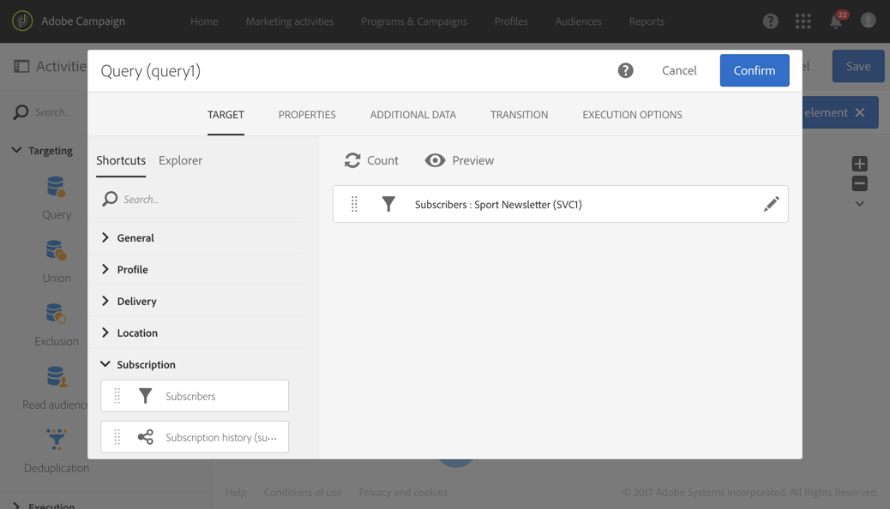

# Creating audiences{#creating-audiences}

## Creating query audiences {#creating-query-audiences}

This section describes how to create a **Query** audience. You can also create audiences from importing a file or targeting in a [workflow](../../automating/using/discovering-workflows.md).

대상 목록에서 Adobe Campaign 프로필에 대한 쿼리를 수행하거나 Adobe Experience Cloud 대상을 가져와서 대상을 만들 수 있습니다.

1. Go to the audience list via the **[!UICONTROL Audiences]** tab or card.

   

1. Select **[!UICONTROL Create]** to access the screen to create a new audience.

   

1. 고객 이름 지정 대상 레이블은 대상 목록과 쿼리 도구의 팔레트에서 사용됩니다.
1. **[!UICONTROL Query]** 대상 유형을 선택합니다. 쿼리에 의해 정의된 대상은 각 추가 사용시 다시 계산됩니다.

   

1. Then select the **[!UICONTROL Targeting dimension]** that you would like to use to filter your customers. 각 대상은 단일 타깃팅 차원으로 구성됩니다. 예를 들어 프로필, 테스트 프로필 및 구독자 모두로 구성된 대상자를 만들 수 없습니다. For more on targeting dimensions, refer to [this page](../../automating/using/query.md#targeting-dimensions-and-resources).
1. 대상 모집단을 정의하는 쿼리를 만듭니다. Refer to the section on [editing queries](../../automating/using/editing-queries.md).
1. Click the **[!UICONTROL Create]** button to save your audience.

>[!NOTE]
>
>You can add a description to this audience and define the access authorizations via the **[!UICONTROL Edit properties]** icon.

## Creating list audiences {#creating-list-audiences}

This section describes how to create a **List** audience after targeting in a workflow. You can also create audiences by importing a file into a [workflow](../../automating/using/discovering-workflows.md) or via a query from the **[!UICONTROL Audiences]** menu.

**목록** 대상자를 만들기 위해 단계는 다음과 같습니다.

1. **마케팅 활동** 탭에서 **만들기를** 클릭한 다음 **워크플로우를 선택합니다**.

   

1. **알려진** 차원이 있는 모집단을 선택할 수 있도록 타깃팅 활동을 드래그 앤 드롭한 다음 구성합니다. The list of available activities and their configuration are detailed in the [Targeting activities](../../automating/using/about-targeting-activities.md) section.

   You can use a **[!UICONTROL Query]** activity, or import data using a **[!UICONTROL Load file]** activity before using a **[!UICONTROL Reconciliation]** activity to identify the dimension of the data imported. Here, we want to target recipients who subscribed to the Sport Newsletter with a **[!UICONTROL Query]** activity .

   

1. After your targeting, drag and drop a **[!UICONTROL Save audience]** activity into your workflow. For example, you can chose to **[!UICONTROL Create or update an audience]**, this allows you to create then automatically update your audience with new data. In this case, add a **[!UICONTROL Scheduler]** activity at the beginning of your workflow.

   For more information on configuring this activity, refer to the [Save audience](../../automating/using/save-audience.md) section.

   

1. 워크플로우를 저장하고 시작합니다.

   As the **[!UICONTROL Save audience]** is placed after a targeting with a known dimension, the audiences created via this activity are **List** audiences.

   저장된 대상의 컨텐츠는 대상 목록을 통해 액세스할 수 있는 대상의 세부 보기에서 사용할 수 있습니다. 이 보기에서 사용할 수 있는 열은 워크플로우의 저장 활동 전환 전환 열에 해당합니다. 예를 들면 다음과 같습니다. 가져온 파일의 열 (쿼리에서 추가 데이터)

   

## Creating file audiences {#creating-file-audiences}

This section details how to create a **File** audience by importing a file into a workflow. [워크플로우나](../../automating/using/discovering-workflows.md) **[!UICONTROL Audiences]** 메뉴에서 쿼리를 통해 타깃팅 활동에서 대상을 만들 수도 있습니다.

**파일** 대상자를 만들기 위해 단계는 다음과 같습니다.

1. **마케팅 활동** 탭에서 **만들기를** 클릭한 다음 **워크플로우를 선택합니다**.
1. Drag and drop, and then configure a **[!UICONTROL Load file]** activity which will allow you to import a population that has an **unknown** dimension when the workflow is executed. For more information on configuring this activity, refer to the [Load file](../../automating/using/load-file.md) section.

   

1. Drag and drop a **[!UICONTROL Save audience]** activity after the **[!UICONTROL Load file]** activity. For more information on configuring this activity, refer to the [Save audience](../../automating/using/save-audience.md) section.
1. 워크플로우를 저장하고 시작합니다.

   

   As the **[!UICONTROL Save audience]** is placed after an import, the data dimension is unknown and the audiences created via this activity are **File** audiences.

   저장된 대상의 컨텐츠는 대상 목록을 통해 액세스할 수 있는 대상의 세부 보기에서 사용할 수 있습니다. 이 보기에서 사용할 수 있는 열은 워크플로우의 저장 활동 전환 전환 열에 해당합니다. 예를 들면 다음과 같습니다. 가져온 파일의 열 (쿼리에서 추가 데이터 추가)

   

## Creating Experience Cloud audiences {#creating-experience-cloud-audiences}

Adobe Campaign를 사용하면 Adobe Experience Cloud를 통해 고객을 공유하고 공유할 수 있습니다. **Experience Cloud** 유형 대상은 **[!UICONTROL Import shared audience]** 기술 워크플로우를 통해 핵심 서비스에서 Adobe Campaign로 직접 가져옵니다.

Unlike **Query** type audience which will query profiles from Adobe Campaign, the **Experience Cloud** audience is composed of a list of Visitor IDs.

이 통합이 작동하려면 먼저 구성해야 합니다. For more information on configuration and how to import or export audiences with People core service, refer to the following [section](../../integrating/using/sharing-audiences-with-audience-manager-or-people-core-service.md).

## Editing audiences {#editing-audiences}

대상자 유형에 따라 대상자를 편집하는 방법은 다양합니다.

* **쿼리** 대상자를 편집하려면 **[!UICONTROL Audiences]** 메뉴 또는 Adobe Campaign 홈 페이지에서 **[!UICONTROL Audiences]** 카드를 통해 대상 목록으로 이동합니다.

   고객 관계 파악 이전에 만든 대상의 모든 요소를 편집할 수 있습니다.

   >[!CAUTION]
   >
   >If you change the **[!UICONTROL Filtering dimension]** in the query, the rules that have previously been defined will be lost.

* **목록** 또는 **파일** 대상을 편집하려면, 만들어진 워크플로우를 편집하고 **[!UICONTROL Save audience]** 활동을 수정합니다. 대상이 수정되도록 워크플로우를 시작합니다.
* **Experience Cloud** 대상을 편집하려면 People 핵심 서비스 영역으로 대상 [가져오기/내보내기를](../../integrating/using/sharing-audiences-with-audience-manager-or-people-core-service.md) 참조하십시오.

## Deleting audiences {#deleting-audiences}

두 가지 방법으로 한 명 또는 여러 대상을 삭제할 수 있습니다. 먼저 대상 만료 날짜를 추가할 수 있습니다.

이렇게 하려면:

1. 고객 중 한 사람 한 사람에게 액세스
1. Click the  button to access your audience's configuration.

   

1. **[!UICONTROL Expires on]** 필드에 만료 날짜를 대상에 추가합니다.

   

1. **[!UICONTROL Confirm]****[!UICONTROL Save]**&#x200B;을 클릭합니다.

이제 만료 날짜가 구성됩니다. 이 날짜에 도달하면 대상이 자동으로 삭제됩니다.

Or if you need to delete an audience, you can simply select one or several audiences then click the **[!UICONTROL Delete element]** button.

