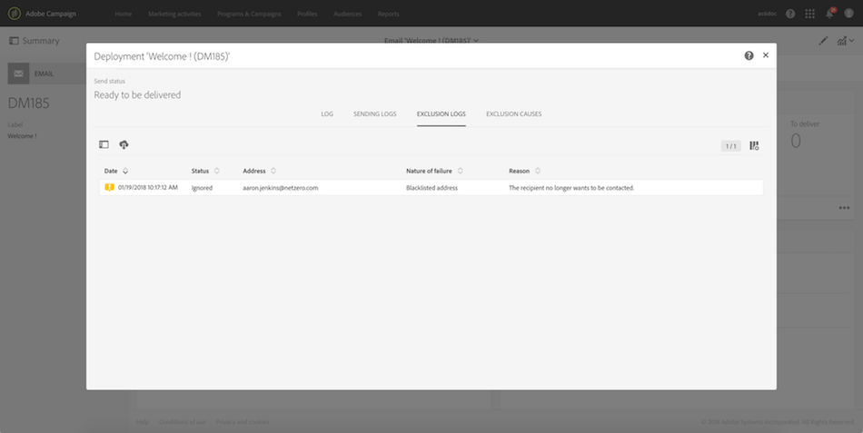

# 게재에 대한 옵트아웃 프로필 확인{#identifying-opt-out-profiles-for-a-delivery}

특정 게재에 대한 옵트아웃 프로필은 준비 단계 후 게재 대시보드의 **[!UICONTROL Exclusion logs]** 탭에 나열됩니다.

**관련 항목:**

* [게재 모니터링](../../sending/using/monitoring-a-delivery.md#exclusion-logs).
* [전송 준비 중](../../sending/using/preparing-the-send.md).
