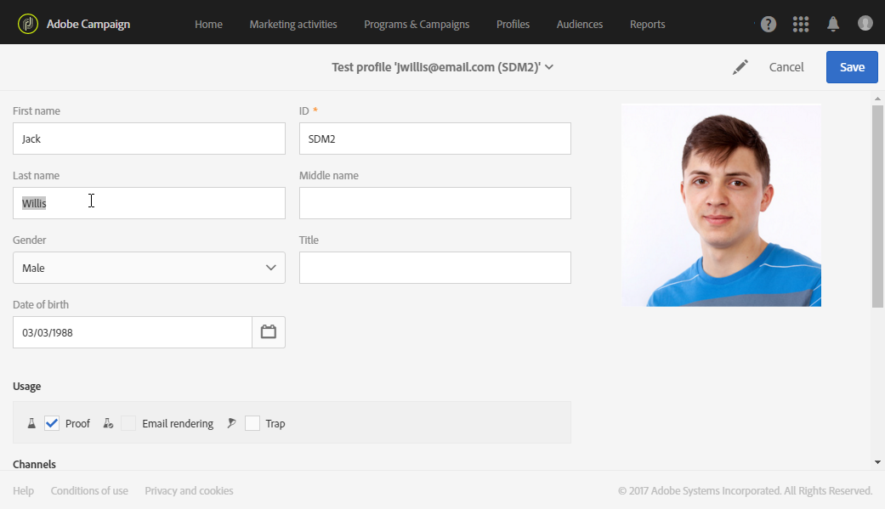

# 테스트 프로필 관리 {#managing-test-profiles}

## 테스트 프로필 정보 {#about-test-profiles}

테스트 프로필을 사용하면 정의된 타깃팅 기준과 일치하지 않는 추가 수신자를 타깃팅할 수 있습니다. 받는 사람 데이터베이스의 부정 사용을 감지하거나 받은 이메일이 받은 편지함에 도착하도록 하기 위해 메시지 대상자에 추가됩니다.

고급 메뉴에서 테스트 프로필을 관리할 수 **[!UICONTROL Profiles & audiences > Test profiles]**&#x200B;있습니다.

테스트 프로필에는 가상 연락처 정보 또는 발신자가 제어하는 연락처 정보가 포함되어 있으며, 이러한 정보는 다음 컨텍스트의 메시지에 사용할 수 있습니다.

* 교정본을 보내는 **경우**:수표는 최종 배달을 수신자에게 보내기 전에 메시지를 확인하는 데 사용되는 특정 메시지입니다. 증명 테스트 프로필은 해당 컨텐츠 및 형식과 관련하여 배달을 확인하는 역할을 합니다. 교정본 [전송을 참조하십시오](../../sending/using/sending-proofs.md).
* 이메일 **렌더링의**&#x200B;경우:이메일 렌더링 테스트 프로필은 메시지를 받는 받은 편지함에 따라 메시지가 표시되는 방식을 확인하는 데 사용됩니다. 예: 웹 메일, 메시지 서비스, 모바일 등 이메일 [렌더링을](../../sending/using/email-rendering.md)참조하십시오.

   이메일 **렌더링** 사용은 읽기 전용입니다. 이 기능을 사용하는 테스트 프로필은 Adobe Campaign에서 바로 사용할 수 있습니다.

* 트랩( **As a Trap**):메시지는 기본 타겟으로 전송되는 것처럼 테스트 프로필로 전송됩니다. 트랩 [사용을](../../sending/using/using-traps.md)참조하십시오.
* 메시지를 **미리** 보려면:개인화 요소를 테스트하기 위한 메시지를 미리 볼 때 테스트 프로필을 선택할 수 있습니다. 메시지 [미리 보기를](/help/sending/using/previewing-messages.md)참조하십시오.

## 테스트 프로필 만들기 {#creating-test-profiles}

1. 고급 메뉴에서 Adobe Campaign 로고를 통해 프로필 및 대상 **> 테스트 프로필을** 선택하여 테스트 프로필 목록에 액세스합니다.

   

1. 대시보드에서 **[!UICONTROL Test profiles]** 만들기를 **클릭합니다**.

   

1. 이 프로필에 대한 데이터를 입력합니다.

   

1. 테스트 프로필에 사용할 용도를 선택합니다.

   

1. 필요한 경우 연락처 채널과 테스트 프로필 주소를 **[!UICONTROL Email, Telephone, Mobile, Mobile app]**&#x200B;입력합니다.

   >[!NOTE]
   >
   >선호하는 이메일 형식을 정의할 수 있습니다. **[!UICONTROL Text]** 또는 **[!UICONTROL HTML]**.

1. 트랜잭션 메시지의 개인화를 테스트하기 위해 이 테스트 프로필을 사용하려면 이벤트 유형과 이 이벤트에 대한 데이터를 지정하십시오.
1. 을 **[!UICONTROL Create]** 클릭하여 테스트 프로필을 저장합니다.

그러면 테스트 프로필이 프로필 목록에 추가됩니다.

**관련 항목:**

[테스트 프로필](https://docs.adobe.com/content/help/en/campaign-learn/campaign-standard-tutorials/profiles-and-audiences/test-profiles.html) 비디오 만들기

## 테스트 프로필 편집 {#editing-test-profiles}

테스트 프로필을 편집하고 연결된 데이터를 참조하거나 수정하려면:

1. 이미지를 클릭하여 편집할 테스트 프로필을 선택합니다.
1. 필드를 참조하거나 수정합니다.

   

1. 변경 내용을 **[!UICONTROL Save]** 입력한 경우 을 클릭하고 테스트 프로필의 이름을 선택한 다음 화면 상단의 **[!UICONTROL Test profiles]** 섹션에서 테스트 프로필 대시보드로 돌아갑니다.
