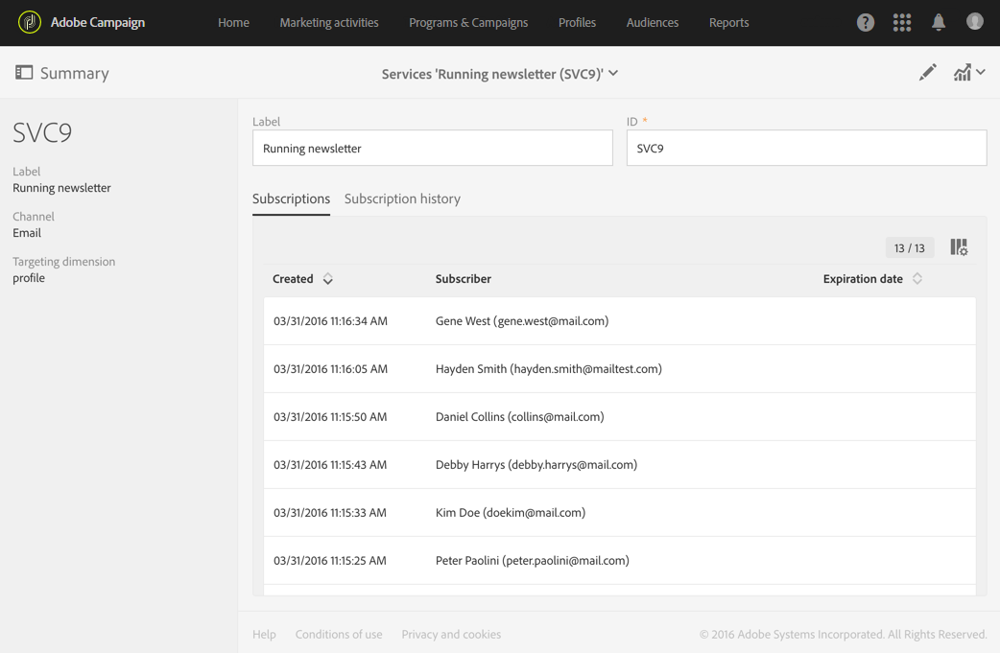

# 구독 모니터링{#monitoring-subscriptions}

Adobe Campaign 인터페이스를 사용하여 구독자를 추적하고 서비스의 성공을 측정합니다.

구독 및 구독 취소를 모니터링하는 다음과 같은 몇 가지 옵션이 있습니다.

* 서비스 대시보드에서 현재 서비스를 구독한 사람 목록을 봅니다. [서비스 대시보드](#service-dashboard)를 참조하십시오.
* 서비스 대시보드의 **구독 내역** 탭에서 구독 및 구독 취소 내역을 참조하십시오. [구독 내역](#subscription-history)을 참조하십시오.
* 서비스 **Reports**&#x200B;에서 구독 및 구독 취소에 대한 세부 사항을 설명하는 보고서를 표시합니다. [서비스 보고서](#service-reports)를 참조하십시오.
* 사용자가 **프로필**&#x200B;에서 구독한 서비스 목록을 찾습니다. 프로필](#history-of-events-linked-to-a-profile)에 연결된 이벤트 내역 을 참조하십시오.[

## 서비스 대시보드 {#service-dashboard}

서비스를 구독한 사람 목록을 보려면 다음을 수행하십시오.

1. Adobe Campaign 로고에서 액세스할 수 있는 고급 메뉴 **프로필 및 대상** > **서비스**&#x200B;를 통해 서비스 목록으로 이동합니다.
1. 원하는 서비스를 선택하여 해당 대시보드를 표시합니다.
1. 서비스에 가입한 사람 목록은 **구독** 탭에서 찾을 수 있습니다.

## 구독 내역 {#subscription-history}

구독 및 구독 취소 내역을 확인하려면:

1. Adobe Campaign 로고에서 액세스할 수 있는 고급 메뉴 **프로필 및 대상** > **서비스**&#x200B;를 통해 서비스 목록으로 이동합니다.
1. 원하는 서비스를 선택하여 해당 대시보드를 표시합니다.
1. **가입 내역** 탭을 선택하여 각 사용자가 가입하고 구독을 취소한 날짜를 표시합니다.

## 서비스 보고서 {#service-reports}

구독 및 구독 취소에 대한 개선 사항을 설명하는 보고서를 표시하려면

1. Adobe Campaign 로고에서 액세스할 수 있는 고급 메뉴 **프로필 및 대상** > **서비스**&#x200B;를 통해 서비스 목록으로 이동합니다.
1. 원하는 서비스를 선택하여 해당 대시보드를 표시합니다.
1. 작업 표시줄에서 **보고서** 단추를 클릭한 다음 선택 화면에서 **구독 모니터링** 을 클릭합니다.

   

1. **서비스 요약** 보고서는 가입의 수, 가입의 전체 발전 및 시간의 경과를 보여주는 곡선을 보여 줍니다.

## 프로필에 연결된 이벤트 내역 {#history-of-events-linked-to-a-profile}

연락처가 가입한 서비스 목록을 참조하려면 해당 마케팅 내역을 참조하십시오. 자세한 내용은 [Integrated Customer Profile](../../audiences/using/integrated-customer-profile.md) 섹션을 참조하십시오.

