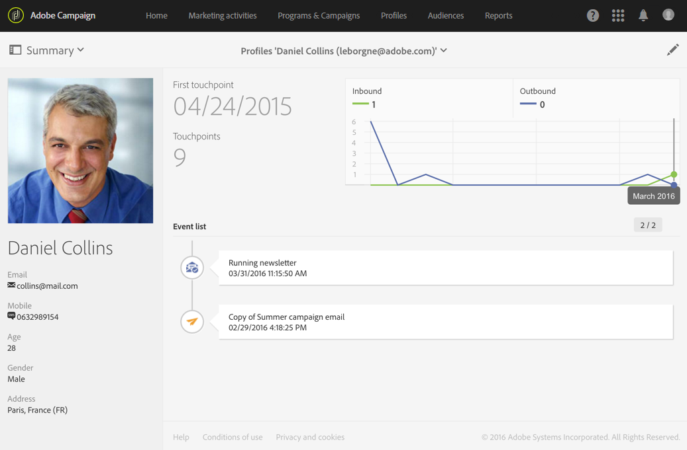

# Monitoring subscriptions{#monitoring-subscriptions}

Adobe Campaign 인터페이스를 사용하여 가입자를 추적하고 서비스의 성공을 측정할 수 있습니다.

구독 구독 및 구독 취소 모니터링에 대한 여러 가지 옵션이 있습니다.

* 서비스 대시보드에서 서비스를 현재 구독한 사람의 목록을 봅니다. [서비스 대시보드를 참조하십시오](../../audiences/using/monitoring-subscriptions.md#service-dashboard).
* consult the history of subscriptions and unsubscriptions from the **Subscription history** tab in the service dashboard. [구독 내역을 참조하십시오](../../audiences/using/monitoring-subscriptions.md#subscription-history).
* display a report detailing the evolution of subscriptions and unsubscriptions in the service **Reports**. [서비스 보고서를 참조하십시오](../../audiences/using/monitoring-subscriptions.md#service-reports).
* find the list of services a person has subscribed from its **Profile**. See [History of events linked to a profile](../../audiences/using/monitoring-subscriptions.md#history-of-events-linked-to-a-profile).

## Service dashboard {#service-dashboard}

서비스에 가입된 사람 목록을 보려면:

1. Go to the list of services via the advanced menu **Profiles &amp; audiences** &gt; **Services**, which can be accessed from the Adobe Campaign logo.
1. 해당 대시보드를 표시하려면 원하는 서비스를 선택합니다.
1. The list of people subscribed to the service can be found in the **Subscriptions** tab.

## Subscription history {#subscription-history}

구독 및 구독 취소 내역을 확인하려면 다음을 수행하십시오.

1. Go to the list of services via the advanced menu **Profiles &amp; audiences** &gt; **Services**, which can be accessed from the Adobe Campaign logo.
1. 해당 대시보드를 표시하려면 원하는 서비스를 선택합니다.
1. **구독 내역** 탭을 선택하여 각 사람이 구독하고 구독 취소한 날짜를 표시합니다.

## Service reports {#service-reports}

구독 및 구독 취소의 진화에 대한 보고서를 표시하려면 다음을 수행하십시오.

1. Go to the list of services via the advanced menu **Profiles &amp; audiences** &gt; **Services**, which can be accessed from the Adobe Campaign logo.
1. 해당 대시보드를 표시하려면 원하는 서비스를 선택합니다.
1. Click the **Reports** button in the action bar, then **Subscription monitoring** in the selection screen.

   

1. **서비스 요약** 보고서는 구독 수, 구독 전체 발전 및 시간에 따른 진행률을 보여주는 곡선을 제공합니다.

## History of events linked to a profile {#history-of-events-linked-to-a-profile}

고객이 가입한 서비스 목록을 참조하려면 해당 마케팅 내역을 참조하십시오. For more on this, refer to the [Integrated customer profile](../../audiences/using/integrated-customer-profile.md) section.

