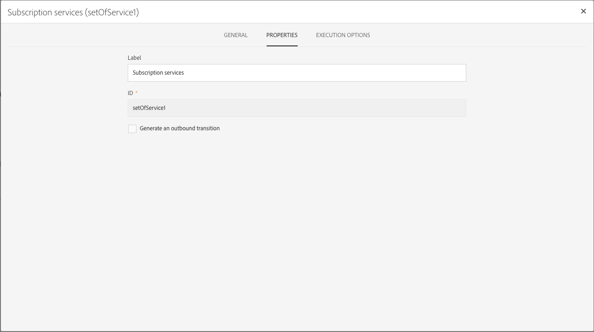

# 활동 속성 관리 {#activity-properties}

## 활동의 전역 속성 {#global-properties-of-an-activity}

각 활동에는 **[!UICONTROL General]** 탭이 있으며, 이를 통해 활동에만 적용되는 일반 매개 변수를 수정할 수 있습니다.

이 **[!UICONTROL Properties]** 탭에서는 활동의 글로벌 매개 변수, 특히 레이블과 ID를 수정할 수 있습니다. 이 탭 구성은 선택 사항입니다.

## 활동의 아웃바운드 전환 관리 {#managing-an-activity-s-outbound-transitions}

기본적으로 특정 활동에는 아웃바운드 전환이 없습니다. 동일한 워크플로우에서 **[!UICONTROL Transitions]** 탭 또는 활동의 **[!UICONTROL Properties]** 탭에서 다른 프로세스를 모집단 전체에 적용할 수 있습니다.

활동에 따라 여러 유형의 아웃바운드 전환을 추가할 수 있습니다.

* **표준 전환**:활동에 의해 계산되는 인구
* **모집단**&#x200B;없이 전환:이러한 유형의 아웃바운드 전환을 추가하여 워크플로우를 계속할 수 있으며 시스템에서 불필요한 공간을 사용하지 않도록 인구 수를 포함하지 않습니다.
* **거부**:모집단에서 거부됨. 예를 들어, 활동의 인바운드 데이터가 잘못되었거나 완전하지 않아 처리되지 못한 경우
* **보완**:활동을 실행한 후 남은 숫자입니다. 예를 들어 세그먼트 활동이 인바운드 인구의 백분율만 저장하도록 구성된 경우

해당하는 경우 활동의 아웃바운드 전환 **[!UICONTROL Segment code]** 에 대해 지정합니다. 이 세그먼트 코드를 사용하면 타겟 모집단에서 하위 세트가 어디에서 왔는지를 식별할 수 있으며, 이후에 메시지 개인화를 위해 제공될 수도 있습니다.

## 활동 실행 옵션 {#activity-execution-options}

활동의 속성 화면에는 오류의 경우 활동의 실행 모드 및 동작을 정의할 수 있는 **[!UICONTROL Advanced options]** 탭이 있습니다.

이러한 옵션에 액세스하려면 워크플로에서 활동을 선택한 다음 작업 표시줄의  단추를 사용하여 엽니다.

이 **[!UICONTROL Execution]** 필드에서는 작업이 시작될 때 수행할 작업을 정의할 수 있습니다. 다음과 같은 세 가지 옵션이 있습니다.

* **표준**:활동이 정상적으로 실행됩니다.
* **활성화하지만 실행하지**&#x200B;않음:활동이 일시 중지되고 그 결과 이후의 모든 프로세스가 됩니다. 이 기능은 작업이 시작될 때 참석하려는 경우에 유용합니다.
* **활성화하지**&#x200B;않음:활동이 실행되지 않으며, 따라서, 모든 활동이 (동일한 분기에) 따라가지 않습니다.

이 **[!UICONTROL In case of error]** 필드에서는 활동에 오류가 발생하는 경우 수행할 작업을 지정할 수 있습니다. 다음 두 가지 옵션을 사용할 수 있습니다.

* **프로세스 일시 중단**:워크플로우가 자동으로 일시 중단됩니다. 그러면 워크플로우 상태가 **잘못됨** 으로 표시되고 연결된 색상이 빨간색으로 표시됩니다. 문제가 해결되면 워크플로우를 다시 시작합니다.
* **무시**:활동이 실행되지 않으며, 따라서 동일한 분기에 따라 어떤 활동도 실행되지 않습니다. 이는 반복되는 작업에 유용할 수 있습니다. 분기에 업스트림 배치 스케줄러가 있는 경우 다음 실행 날짜에 트리거됩니다.

이 **[!UICONTROL Behavior]** 필드에서는 비동기 작업을 사용하는 경우 따를 절차를 정의할 수 있습니다. 다음 두 가지 옵션을 사용할 수 있습니다.

* **다양한 작업 인증**:첫 번째 작업이 완료되지 않았더라도 동시에 여러 작업을 실행할 수 있습니다.
* **현재 작업의 우선 순위**:작업이 진행 중이면 우선 순위가 지정됩니다. 하나의 작업이 아직 진행 중이면 다른 작업이 실행되지 않습니다.

이 **[!UICONTROL Max. execution duration]** 필드에서 &quot;30s&quot; 또는 &quot;1h&quot;와 같은 지속 시간을 지정할 수 있습니다. 지정된 기간이 경과한 후 활동이 완료되지 않으면 경고가 트리거됩니다. 이는 워크플로우의 기능에 영향을 주지 않습니다.

이 **[!UICONTROL Affinity]** 필드를 사용하면 특정 컴퓨터에서 워크플로우 또는 워크플로우 활동을 강제로 실행할 수 있습니다. 이렇게 하려면 해당 워크플로우 또는 활동에 대해 하나 또는 여러 개의 친화성을 지정해야 합니다.

이 **[!UICONTROL Time zone]** 필드에서는 활동의 시간대를 선택할 수 있습니다. Adobe Campaign을 사용하면 동일한 인스턴스에서 여러 국가 간의 시간 차이를 관리할 수 있습니다. 적용된 설정은 인스턴스가 생성될 때 구성됩니다.

>[!NOTE]
>
>기본적으로 시간대를 선택하지 않으면 작업은 워크플로우 속성에 정의된 시간대를 사용합니다.

주석 **** 필드는 메모를 추가할 수 있는 자유 필드입니다.
