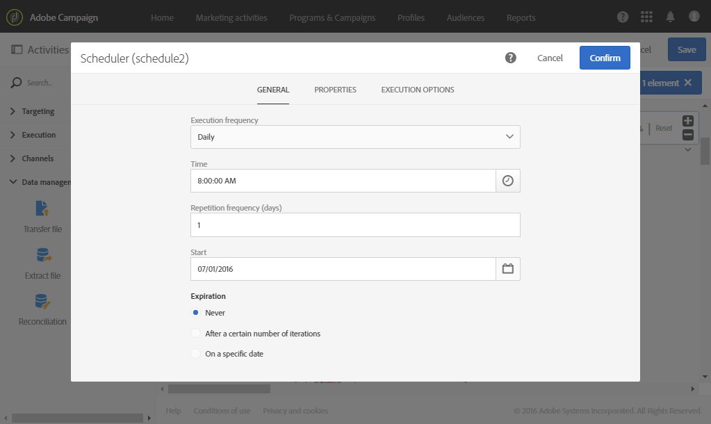
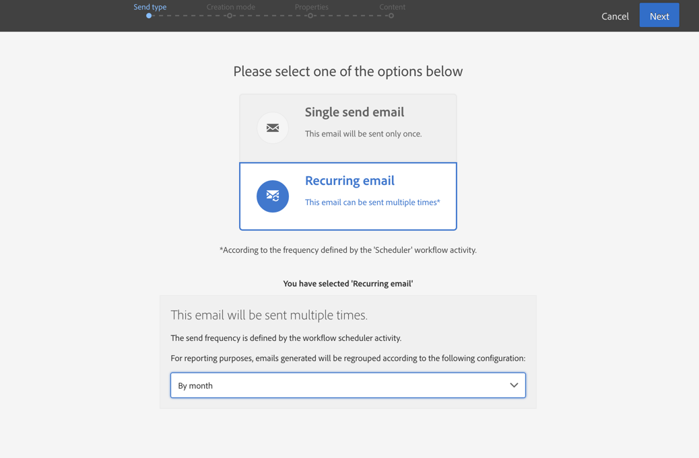

# 생일 배달 {#birthday-delivery}

이 예제는 생일 워크플로우입니다. 매일 이메일이 그 날 생일을 맞는 프로필로 전송됩니다.

워크플로우를 빌드하려면 다음 단계를 따르십시오.

* 스케줄러 [를](../../automating/using/scheduler.md) 사용하면 매일 오전 8시에 워크플로우를 시작할 수 있습니다.

   

* 쿼리  활동을 사용하면 워크플로우를 실행할 때마다 이메일을 제공한 사람 및 생일이 현재 날짜인 프로필을 계산할 수 있습니다. 생일 계산은 쿼리 편집 도구의 팔레트에서 사용할 수 있는 사전 정의된 필터를 사용하여 수행됩니다.

   

* 이메일 [배달이](../../automating/using/email-delivery.md) 반복됩니다. 센드는 월별로 집계됩니다. 따라서 한 달에 전송된 모든 이메일은 하나의 뷰로 집계됩니다. 따라서 1년 동안 365개 배달이 실행되지만 Adobe Campaign 인터페이스에서 12개의 보기( **반복 실행**)로 재그룹화됩니다. 내역 및 보고서 세부 사항은 매번 전송되지 않고 매월 표시됩니다.

   
