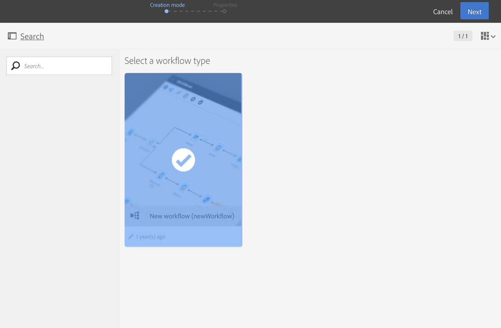

# 워크플로우 구축{#building-a-workflow}

이 섹션에서는 새 워크플로우를 만들기 위한 주요 원칙과 우수 사례를 자세히 설명합니다.

* 워크플로우 만들기
* 활동 추가 및 연결.
* 활동 구성을 참조하십시오.

## 워크플로우 만들기 {#creating-a-workflow}

프로그램, 캠페인 또는 마케팅 활동 목록에서 워크플로우를 만들 수 있습니다.

마케팅 활동 만들기는 마케팅 활동 [만들기](../../start/using/marketing-activities.md#creating-a-marketing-activity) 섹션에서 자세히 설명합니다.

1. 워크플로우 유형 마케팅 활동 생성을 시작한 후 사용할 템플릿을 선택합니다.

   

   >[!NOTE]
   >
   >각 마케팅 활동은 기본적으로 여러 가지 유형을 제공합니다. 이러한 기능을 사용하면 필요에 따라 특정 매개 변수를 미리 구성할 수 있습니다. 자세한 내용은 템플릿 [관리](../../start/using/marketing-activity-templates.md) 섹션을 참조하십시오.

1. 워크플로우의 일반 속성을 입력합니다.

   

   레이블 필드에 이름을 입력하고 **ID를** 수정할 수 있습니다. 활동 이름과 ID는 인터페이스에 표시되지만 메시지 수신자는 이를 볼 수 없습니다.

   >[!NOTE]
   >
   >마케팅 활동 목록에서 상위 캠페인 내에서 워크플로우를 만들 수 있습니다. 이미 만들어진 워크플로우를 선택하여 이 워크플로우를 캠페인에 연결할 수 있습니다.

   사용자가 캠페인 컨텐츠에서 볼 수 있는 설명을 추가할 수 있습니다.

   이러한 기능을 사용하면 예상대로 실행되지 않을 경우 쉽게 찾아 문제를 해결할 수 있으므로 Adobe에서는 워크플로우에 적합한 이름과 레이블을 지정하는 것이 좋습니다.워크플로우의 설명 필드를 채워 연산자가 쉽게 이해할 수 있도록 수행할 프로세스를 요약합니다.

1. 활동을 만들고 해당 활동에 대한 대시보드가 표시되는지 확인합니다. 자세한 내용은 워크플로우 인터페이스 [섹션을](../../automating/using/workflow-interface.md) 참조하십시오.

1. 워크플로우를 구성할 준비가 되면 **[!UICONTROL Edit properties]** 단추를 클릭하여 추가 옵션에 액세스할 수 있습니다. 예를 들어 모든 워크플로우의 활동에서 기본적으로 사용할 특정 시간대를 정의할 수 있습니다. 기본적으로 워크플로우의 표준 시간대는 현재 캠페인 연산자에 대해 정의된 시간대입니다.

   

**관련 항목:**

* [워크플로우](https://docs.adobe.com/content/help/en/campaign-standard/using/managing-processes-and-data/workflow-general-operation/building-a-workflow.html) 비디오 만들기
* [워크플로우 속성](../../automating/using/executing-a-workflow.md#workflow-properties)

## 활동 추가 및 연결 {#adding-and-linking-activities}

이제 다양한 활동을 정의하고 다이어그램에서 함께 연결해야 합니다.

>[!NOTE]
>
>팔레트가 표시되지 않으면 도구 모음의 첫 번째 단추를 클릭하여 표시합니다.

활동은 팔레트의 다른 섹션 내에서 범주별로 그룹화됩니다.

* 첫 번째 섹션에는 [타깃팅 활동이 포함됩니다.](../../automating/using/about-targeting-activities.md)
* 두 번째 섹션에는 다른 활동을 조정하는 데 주로 사용되는 [실행 활동이](../../automating/using/about-execution-activities.md)포함되어 있습니다.
* 세 번째 섹션에는 다른 [채널에서](../../automating/using/about-channel-activities.md)메시지를 보내는 데 사용할 수 있는 활동이 포함되어 있습니다. 이 섹션의 활동은 인스턴스에 대해 활성화된 채널에 따라 달라질 수 있습니다.
* 네 번째 섹션에는 [파일 조작 및 데이터 관리 활동이](../../automating/using/about-data-management-activities.md)포함되어 있습니다.

다이어그램을 만들려면:

1. 팔레트에서 활동을 끌어 다이어그램에 놓아 활동을 추가합니다.

   예를 들어, 시작 **[활동을](../../automating/using/start-and-end.md)**추가한 다음 다이어그램에**[&#x200B;이메일 배달](../../automating/using/email-delivery.md)** 활동을 추가합니다.

1. 시작 활동 전환을 드래그하여 **이메일 배달** 활동에 놓아 활동을 함께 **연결합니다** .

   >[!NOTE]
   >
   >이전 전환 끝에 새 활동을 배치하여 활동을 이전 활동에 자동으로 연결할 수 있습니다.

1. 필요한 활동을 추가하고 이러한 활동을 함께 연결하여 워크플로우를 완료할 수 있습니다.

   >[!NOTE]
   >
   >기존 활동을 복사하여 붙여넣을 수도 있습니다. 이렇게 하면 원래 정의된 설정을 유지합니다. 자세한 내용은 워크플로우 활동 [중복을 참조하십시오](../../automating/using/workflow-interface.md#duplicating-workflow-activities).

워크플로우 활동이 서로 연결되면 원하는 **레이블로** 전환율을 개인화할 수 있습니다. 이렇게 하려면 전환을 두 번 클릭하여 해당 속성에 액세스합니다.

또한 **[!UICONTROL Targeting]** 및 **[!UICONTROL Data management (ETL)]** 활동을 통해 아웃바운드 전환의 **세그먼트 코드를** 정의할 수 있습니다. 그런 다음 마케팅 캠페인의 효율성을 측정하기 위해 이러한 세그먼트 코드를 기반으로 보고서를 만들 수 있습니다. For more on this, refer to [this section](../../reporting/using/creating-a-report-workflow-segment.md).

**워크플로우 활용 사례:**

* [사용 사례:일주일에 한 번 이메일 전달 만들기](../../automating/using/workflow-weekly-offer.md)
* [사용 사례:위치에 세그먼트화된 배달 만들기](../../automating/using/workflow-segmentation-location.md)
* [사용 사례:보충으로 배달 만들기](../../automating/using/workflow-created-query-with-complement.md)
* [사용 사례:비열기 사용자에게 새 배달을 보내는 다시 타깃팅 워크플로우](../../automating/using/workflow-cross-channel-retargeting.md)

## 활동 구성 {#configuring-activities}

기본적으로 활동은 설정되지 않으며 데이터가 구성되지 않은 경우 올바로 처리되지 않습니다. 각 활동에는 특정 구성 및 아웃바운드 전환, 레이블 등과 같은 활동 일반 옵션을 관리할 수 있는 여러 탭이 포함되어 있습니다.

1. 모든 활동이 올바르게 연결되어 있는지 확인합니다. 일부 활동은 올바른 구성 옵션을 제공하기 위해 들어오는 데이터의 구조 또는 특성을 감지해야 합니다.
1. 활동을 두 번 클릭하거나 활동을 선택하고 **[!UICONTROL Edit]** 컨텍스트 동작을 클릭하여 구성 창을 엽니다.
1. 활동의 레이블을 편집합니다.
1. 데이터를 처리하는 데 필요한 다양한 옵션을 모두 정의합니다. 각 활동에 대해 가능한 옵션을 알아보려면 이 설명서의 활동 특정 섹션을 참조하십시오.
1. 활동을 저장하고 워크플로우의 각 활동에 대해 이러한 작업을 반복합니다.
1. 워크플로우를 저장합니다.
