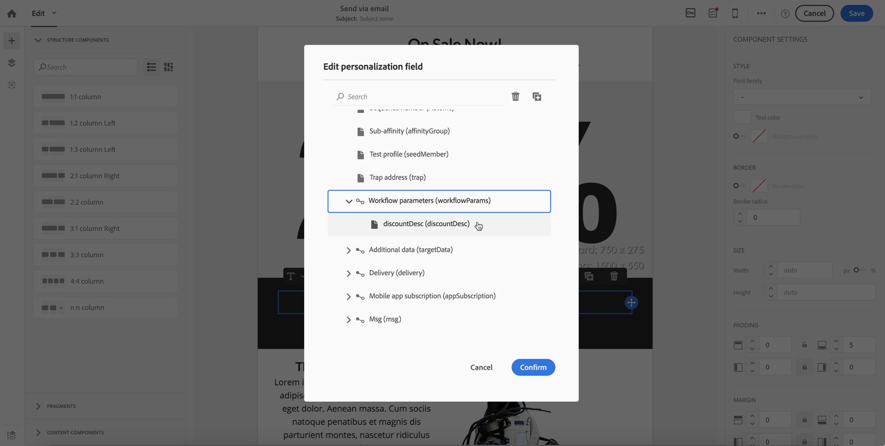

# 외부 파라미터로 워크플로우 호출{#calling-a-workflow-with-external-parameters}

Campaign Standard를 사용하면 매개 변수(타깃팅할 대상 이름, 가져올 파일 이름, 메시지 내용의 일부 등)가 있는 워크플로우를 호출할 수 있습니다. 이렇게 하면 캠페인 자동화를 외부 시스템과 쉽게 통합할 수 있습니다.

다음 예를 들어 CMS에서 바로 이메일을 보낼 수 있습니다. 이러한 경우, 대상을 선택하고 CMS로 이메일을 보내도록 시스템을 구성할 수 있습니다. 전송을 클릭하면 이러한 매개 변수가 있는 캠페인 워크플로우가 호출되므로 전달에 사용할 대상 및 URL 컨텐츠를 정의할 수 있습니다.

매개 변수를 사용하여 워크플로우를 호출하는 프로세스는 다음과 같습니다.

1. 활동의 매개 변수를 **[!UICONTROL External signal]** 선언합니다. 외부 [신호 활동에서](../../automating/using/calling-a-workflow-with-external-parameters.md#declaring-the-parameters-in-the-external-signal-activity)매개 변수 선언을 참조하십시오.
1. 활동 또는 API **[!UICONTROL End]** 호출을 구성하여 매개 변수를 정의하고 워크플로우 **[!UICONTROL External signal]** 활동을 트리거합니다.

워크플로우가 실행되면 매개 변수가 워크플로우의 이벤트 변수에 인제스트되며 워크플로우 내에서 사용할 수 있습니다. 외부 [매개 변수를](../../automating/using/calling-a-workflow-with-external-parameters.md#customizing-a-workflow-with-external-parameters)사용하여 워크플로우 맞춤화를 참조하십시오.


## 외부 신호 활동에서 매개 변수 선언 {#declaring-the-parameters-in-the-external-signal-activity}

매개 변수를 사용하여 워크플로우를 호출하는 첫 번째 단계는 **[!UICONTROL External signal]** 활동에서 선언하는 것입니다.

1. 활동을 **[!UICONTROL External signal]** 연 다음 **[!UICONTROL Parameters]** 탭을 선택합니다.
1. 단추를 **[!UICONTROL Create element]** 클릭한 다음 각 매개 변수의 이름과 유형을 지정합니다.

   >[!CAUTION]
   >
   >워크플로우 호출 시 정의된 매개 변수의 이름 및 수와 동일한지 확인합니다(워크플로우 [호출 시 매개 변수 정의 참조](../../automating/using/calling-a-workflow-with-external-parameters.md#defining-the-parameters-when-calling-the-workflow)). 또한 매개 변수 유형은 예상 값과 일치해야 합니다.

   

1. 매개 변수가 선언되면 워크플로우 구성을 완료한 다음 실행합니다.

## 워크플로우 호출 시 매개 변수 정의 {#defining-the-parameters-when-calling-the-workflow}

이 섹션에서는 워크플로우를 호출할 때 매개 변수를 정의하는 방법에 대해 자세히 설명합니다. API 호출에서 이 작업을 수행하는 방법에 대한 자세한 내용은 REST API [설명서를](../../api/using/triggering-a-signal-activity.md)참조하십시오.

매개 변수를 정의하기 전에 다음을 확인하십시오.

* 매개 변수가 **[!UICONTROL External Signal]** 활동에서 선언되었습니다. 외부 [신호 활동에서](../../automating/using/calling-a-workflow-with-external-parameters.md#declaring-the-parameters-in-the-external-signal-activity)매개 변수 선언을 참조하십시오.
* 신호 활동이 포함된 워크플로우가 실행 중입니다.

활동을 구성하려면 아래 단계를 따르십시오. **[!UICONTROL End]**

1. 활동을 **[!UICONTROL End]** 연 다음 **[!UICONTROL External signal]** 탭을 선택합니다.
1. 호출하려는 워크플로우와 외부 신호 활동을 선택합니다.
1. 매개 변수를 추가하려면 **[!UICONTROL Create element]** 단추를 클릭한 다음 이름과 값을 입력합니다.

   * **[!UICONTROL Name]**:활동에서 선언된 이름입니다(외부 신호 **[!UICONTROL External signal]** 활동에서 [](../../automating/using/calling-a-workflow-with-external-parameters.md#declaring-the-parameters-in-the-external-signal-activity)매개 변수 선언 참조).
   * **[!UICONTROL Value]**:매개 변수에 할당할 값. 값은 **이 섹션에**&#x200B;설명된 표준 구문을 [](../../automating/using/advanced-expression-editing.md#standard-syntax)따라야 합니다.
   

   >[!CAUTION]
   >
   >모든 매개 변수가 **[!UICONTROL External signal]** 활동에 선언되었는지 확인합니다. 그렇지 않으면 활동을 실행할 때 오류가 발생합니다.

1. 매개 변수가 정의되면 활동을 확인한 다음 워크플로우를 저장합니다.

## 이벤트 변수 모니터링 {#monitoring-the-events-variables}

선언된 외부 매개 변수를 포함하여 워크플로우에서 사용할 수 있는 이벤트 변수를 모니터링할 수 있습니다. 이렇게 하려면 아래 절차를 따르십시오.

1. 활동을 따르는 활동을 **[!UICONTROL External signal]** 선택한 다음 **[!UICONTROL Log and tasks]** 단추를 클릭합니다.
1. 탭에서 **[!UICONTROL Tasks]**  단추를 클릭합니다.

   

1. 이제 워크플로우에서 사용할 수 있는 모든 이벤트 변수를 포함하여 작업의 실행 컨텍스트가 표시됩니다(ID, 상태, 기간 등).

   

## Customizing a workflow with external parameters {#customizing-a-workflow-with-external-parameters}

워크플로우가 실행되면 매개 변수가 이벤트 변수에 인제스트되어 워크플로우의 활동을 사용자 지정하는 데 사용할 수 있습니다.

예를 들어 **[!UICONTROL Read audience]** 활동에서 읽을 대상, 활동에서 전송할 파일의 이름 등을 정의하는 데 사용할 수 **[!UICONTROL Transfer file]** 있습니다.

이벤트 변수로 사용자 지정할 수 있는 활동은 [이 섹션에](../../automating/using/calling-a-workflow-with-external-parameters.md#customizing-activities-with-events-variables)자세히 설명되어 있습니다.

### 이벤트 변수 사용 {#using-events-variables}

이벤트 변수는 Standard 구문을 **[](../../automating/using/advanced-expression-editing.md#standard-syntax)**&#x200B;준수해야 하는 표현식 내에서 사용됩니다.

이벤트 변수를 사용하는 구문은 아래 형식을 따라야 하며 **[!UICONTROL External signal]** 활동에 정의된 매개 변수 이름을 사용해야 합니다(외부 신호 [활동에서 매개 변수 선언 참조](../../automating/using/calling-a-workflow-with-external-parameters.md#declaring-the-parameters-in-the-external-signal-activity)).

```
$(vars/@parameterName)
```

이 구문에서 **$** 함수는 **문자열** 데이터 유형을 반환합니다. 다른 유형의 데이터를 지정하려면 다음 함수를 사용합니다.

* **$long**:정수 숫자.
* **$float**:십진수.
* **$boolean**:true/false.
* **$datetime**:timestamp.

활동에서 변수를 사용할 때 이 인터페이스는 변수를 호출하는 데 도움이 됩니다.


* :워크플로우에서 사용할 수 있는 모든 변수 중에서 events 변수를 선택합니다( 참조).

   

* :변수와 함수를 결합하는 표현식을 편집합니다. 표현식 편집기에 대한 자세한 내용은 [이 섹션을](../../automating/using/advanced-expression-editing.md)참조하십시오.

   

**관련 항목:**

* [표현식 편집](../../automating/using/advanced-expression-editing.md#edit-an-expression)
* [표준 구문](../../automating/using/advanced-expression-editing.md#standard-syntax)
* [함수 목록](../../automating/using/list-of-functions.md)

### 이벤트 변수를 사용하여 활동 사용자 정의 {#customizing-activities-with-events-variables}

이벤트 변수는 아래 섹션에 나열된 여러 활동을 사용자 지정하는 데 사용할 수 있습니다. 활동에서 변수를 호출하는 방법에 대한 자세한 내용은 [이 섹션을](../../automating/using/calling-a-workflow-with-external-parameters.md#using-events-variables)참조하십시오.

**[!UICONTROL Read audience]** 활동:이벤트 변수를 기반으로 타깃팅할 대상을 정의합니다.

활동 사용 방법에 대한 자세한 내용은 [전용 섹션을](../../automating/using/read-audience.md)참조하십시오.


**[!UICONTROL Test]** 활동:이벤트 변수를 기반으로 조건을 만듭니다.

활동 사용 방법에 대한 자세한 내용은 [전용 섹션을](../../automating/using/test.md)참조하십시오.


**[!UICONTROL Transfer file]** 활동:events 변수를 기반으로 전송할 파일을 사용자 정의합니다.

활동 사용 방법에 대한 자세한 내용은 [전용 섹션을](../../automating/using/transfer-file.md)참조하십시오.


**[!UICONTROL Query]** 활동:매개 변수는 이벤트 변수와 함수를 결합하는 표현식을 사용하여 쿼리에서 참조할 수 있습니다. 이렇게 하려면 규칙을 추가한 다음 **[!UICONTROL Advanced mode]** 링크를 클릭하여 표현식 편집 창에 액세스합니다(고급 [표현식 편집](../../automating/using/advanced-expression-editing.md)참조).

활동 사용 방법에 대한 자세한 내용은 [전용 섹션을](../../automating/using/query.md)참조하십시오.


**[!UICONTROL Channels]** 활동:이벤트 변수를 기반으로 납품을 개인화합니다.

>[!NOTE]
>
>배달 매개 변수의 값은 배달을 준비할 때마다 검색됩니다.
>
>반복 배달 준비는 배달 **집계 기간을**&#x200B;기반으로 합니다. 예를 들어, 합계 기간이 "일 기준"인 경우, 게재는 하루에 한 번만 다시 준비됩니다. 배달 매개 변수의 값이 일 중에 수정되는 경우, 이미 한 번 준비되었기 때문에 배달 시 업데이트되지 않습니다.
>
>워크플로우를 하루에 여러 번 호출하려는 경우 배달 매개 변수가 매번 업데이트되도록 [!UICONTROL No aggregation] 옵션을 사용합니다. 반복 배달 구성에 대한 자세한 내용은 [이 섹션을](/help/automating/using/email-delivery.md#configuration)참조하십시오.

이벤트 변수를 기반으로 배달을 개인화하려면 먼저 사용할 변수를 배달 활동으로 선언해야 합니다.

1. 활동을 선택한 다음  단추를 클릭하여 설정에 액세스합니다.
1. 탭을 **[!UICONTROL General]** 선택한 다음 배달에서 개인화 필드로 사용할 이벤트 변수를 추가합니다.

   

1. 단추를 **[!UICONTROL Confirm]** 클릭합니다.

선언된 이벤트 변수는 이제 개인화 필드 목록에서 사용할 수 있습니다. 배달에서 이러한 항목을 사용하여 아래 작업을 수행할 수 있습니다.

* 게재에 사용할 템플릿의 이름을 정의합니다.

   >[!NOTE]
   >
   >이 작업은 **반복** 배달에만 사용할 수 있습니다.

   

* 개인화된 전달:개인화 필드를 선택하여 배달을 구성할 때 이벤트 변수를 **[!UICONTROL Workflow parameters]** 요소에서 사용할 수 있습니다. 이러한 필드를 개인화 필드로 사용할 수 있습니다. 예를 들어 게재 제목, 발신자 등을 정의할 수 있습니다.

   전달 개인화는 [이 섹션에](../../designing/using/personalization.md)자세히 설명되어 있습니다.

   

**세그먼트 코드**:events 변수를 기반으로 세그먼트 코드를 정의합니다.

>[!NOTE]
>
>이 작업은 세그먼트 코드(예: **[!UICONTROL Query]** 또는 **[!UICONTROL Segmentation]** 활동)를 정의할 수 있는 모든 활동에서 수행할 수 있습니다.


**배달 레이블**:events 변수를 기반으로 배달 레이블을 정의합니다.


## 사용 사례 {#use-case}

아래의 사용 사례는 워크플로우 내에서 매개 변수를 사용하여 워크플로우를 호출하는 방법을 보여줍니다.

목표는 외부 매개 변수를 사용하여 API 호출에서 워크플로우를 트리거하는 것입니다. 이 워크플로우는 파일에서 데이터베이스에 데이터를 로드하고 관련 대상을 만듭니다. 대상이 만들어지면 두 번째 워크플로우가 트리거되어 API 호출에 정의된 외부 매개 변수를 사용하여 개인화된 메시지를 전송합니다.

이 사용 사례를 수행하려면 아래 작업을 수행해야 합니다.

1. **외부 매개 변수를 사용하여 Workflow 1을 트리거하는 API 호출을** 만듭니다. 1단계를 [참조하십시오.API 호출](../../automating/using/calling-a-workflow-with-external-parameters.md#step-1--configuring-the-api-call)구성을 참조하십시오.
1. **빌드 워크플로 1**:워크플로우가 파일을 전송하여 데이터베이스로 로드합니다. 그러면 데이터가 비어 있는지 여부를 테스트하고 해당 프로필을 대상에 저장합니다. 마지막으로 워크플로우 2가 트리거됩니다. 2단계를 [참조하십시오.워크플로우 구성 1](../../automating/using/calling-a-workflow-with-external-parameters.md#step-2--configuring-workflow-1).
1. **빌드 워크플로 2**:워크플로우는 워크플로우 1에서 만든 대상을 읽은 다음, 매개 변수를 사용하여 사용자 정의된 세그먼트 코드와 함께 개인화된 메시지를 프로필에 보냅니다. 3단계를 [참조하십시오.워크플로우 구성 2](../../automating/using/calling-a-workflow-with-external-parameters.md#step-3--configuring-workflow-2).


### 사전 요구 사항 {#prerequisites}

워크플로우를 구성하기 전에 각 워크플로우의 **[!UICONTROL External signal]** 활동과 함께 워크플로우 1 및 2를 만들어야 합니다. 이렇게 하면 워크플로우를 호출할 때 이러한 신호 활동을 타깃팅할 수 있습니다.

### 1단계:API 호출 구성 {#step-1--configuring-the-api-call}

매개 변수를 사용하여 Workflow 1을 트리거하는 API 호출을 만듭니다. API 호출 구문에 대한 자세한 내용은 Campaign Standard REST [API 설명서를 참조하십시오](../../api/using/triggering-a-signal-activity.md).

Adobe의 경우 아래 매개 변수를 사용하여 워크플로우를 호출하려고 합니다.

* **fileToTarget**:데이터베이스로 가져올 파일의 이름입니다.
* **discountDesc**:할인 가격에 납품에 표시할 설명.

```
-X POST https://mc.adobe.io/<ORGANIZATION>/campaign/<TRIGGER_URL>
-H 'Authorization: Bearer <ACCESS_TOKEN>' 
-H 'Cache-Control: no-cache' 
-H 'X-Api-Key: <API_KEY>' 
-H 'Content-Type: application/json;charset=utf-8' 
-H 'Content-Length:79' 
-i
-d {
-d "source:":"API",
-d "parameters":{
-d "fileToTarget":"profile.txt",
-d "discountDesc":"Running shoes"
-d } 
```

### 2단계:워크플로우 구성 1 {#step-2--configuring-workflow-1}

Workflow 1은 다음과 같이 빌드됩니다.

* **[!UICONTROL External signal]** 활동:여기서 외부 매개 변수를 선언해야 워크플로우 내에서 사용할 수 있습니다.
* **[!UICONTROL Transfer file]** 활동:매개 변수에 정의된 이름으로 파일을 가져옵니다.
* **[!UICONTROL Load file]** 활동:가져온 파일의 데이터를 데이터베이스로 로드합니다.
* **[!UICONTROL Update data]** 활동:가져온 파일의 데이터로 데이터베이스를 삽입하거나 업데이트합니다.
* **[!UICONTROL Test]** 활동:가져온 데이터가 있는지 확인합니다.
* **[!UICONTROL Save audience]** 활동:파일에 데이터가 들어 있으면, 프로필을 대상에 저장합니다.
* **[!UICONTROL End activity]** 활동:워크플로 2를 호출합니다.


아래 절차에 따라 워크플로우를 구성합니다.

1. API 호출에 정의된 매개 변수를 선언합니다. 이렇게 하려면 **[!UICONTROL External signal]** 활동을 연 다음 매개 변수의 이름과 유형을 추가합니다.

   

1. 데이터를 데이터베이스에 가져올 **[!UICONTROL Transfer file]** 활동을 추가합니다.이렇게 하려면 활동을 드래그 앤 드롭한 다음 열고 **[!UICONTROL Protocol]** 탭을 선택합니다.
1. 옵션을 **[!UICONTROL Use a dynamic file path]** 선택한 다음 **fileToTarget** 매개 변수를 전송할 파일로 사용합니다.

   ```
   $(vars/@fileToTarget)
   ```

   

1. 파일의 데이터를 데이터베이스로 로드합니다.

   이렇게 하려면 **[!UICONTROL Load file]** 활동을 워크플로우로 드래그하여 놓은 다음 필요에 따라 구성합니다.

1. 가져온 파일의 데이터로 데이터베이스를 삽입하고 업데이트합니다.

   이렇게 하려면 **[!UICONTROL Update data]** 활동을 드래그하여 놓은 다음 **[!UICONTROL Identification]** 탭을 선택하여 조정 기준을 추가합니다(전자 **메일** 필드).

   

1. 탭을 **[!UICONTROL Fields to update]** 선택한 다음 데이터베이스에서 업데이트할 필드를 지정합니다( **첫 번째 이름** 및 **이메일** 필드).

   

1. 파일에서 데이터를 검색하는지 확인합니다. 이렇게 하려면 **[!UICONTROL Test]** 활동을 워크플로우로 드래그 앤 드롭한 다음 **[!UICONTROL Add an element]** 단추를 클릭하여 조건을 추가합니다.
1. 조건의 이름을 지정하고 정의합니다. 이 경우 아웃바운드 전환 시 아래 구문의 데이터가 포함되어 있는지 테스트하려고 합니다.

   ```
   $long(vars/@recCount)>0
   ```

   

1. 데이터가 검색되면 대상에 저장합니다. 이렇게 하려면 Target 전환이 비어 있지 **[!UICONTROL Save audience]** 않은 **활동에** 추가한 다음 엽니다.
1. 옵션을 **[!UICONTROL Use a dynamic label]** 선택한 다음 **fileToTarget** 매개 변수를 대상 레이블로 사용합니다.

   ```
   $(vars/@fileToTarget)
   ```

   

1. 매개 변수를 사용하여 Workflow 2를 호출할 **[!UICONTROL End]** 활동을 드래그하여 놓은 다음 엽니다.
1. 탭을 **[!UICONTROL External signal]** 선택한 다음 트리거할 워크플로우와 연관된 신호 활동을 지정합니다.
1. Workflow 2에서 사용할 매개 변수와 관련 값을 정의합니다.

   이 경우, API 호출에 원래 정의된 매개 변수(fileToTarget 및&#x200B;**discountDesc** ) **와**&#x200B;상수 값을 갖는 추가 **segmentCode** 매개 변수를 전달하려고 합니다("20% 할인").

   

워크플로우 1이 구성되었으므로 이제 워크플로우 2를 작성할 수 있습니다. For more on this, refer to [this section](../../automating/using/calling-a-workflow-with-external-parameters.md#step-3--configuring-workflow-2).

### 3단계:워크플로우 구성 2 {#step-3--configuring-workflow-2}

Workflow 2는 다음과 같이 빌드됩니다.

* **[!UICONTROL External signal]** 활동:여기서 매개 변수를 선언해야 워크플로우 내에서 사용할 수 있습니다.
* **[!UICONTROL Read audience]** 활동:워크플로우 1에 저장된 대상을 읽습니다.
* **[!UICONTROL Email delivery]** 활동:매개 변수를 사용하여 개인화된 반복 메시지를 타깃팅된 대상자에게 보냅니다.


아래 절차에 따라 워크플로우를 구성합니다.

1. 워크플로 1에서 정의된 매개 변수를 선언합니다.

   이렇게 하려면 **[!UICONTROL External signal]** **[!UICONTROL End]** 활동을 연 다음 워크플로우 1 활동에 정의된 각 매개 변수의 이름과 유형을 추가합니다.

   

1. 워크플로우 1에서 저장한 대상을 사용합니다. 이렇게 하려면 **[!UICONTROL Read audience]** 활동을 워크플로우로 드래그하여 놓은 다음 엽니다.
1. 옵션을 **[!UICONTROL Use a dynamic audience]** 선택한 다음 **fileToTarget** 매개 변수를 읽을 대상의 이름으로 사용합니다.

   ```
   $(vars/@fileToTarget)
   ```

   

1. segmentCode 매개 변수에 따라 아웃바운드 전환 **이름을 지정합니다** .

   이렇게 하려면 **[!UICONTROL Transition]** 탭을 선택한 다음 **[!UICONTROL Use a dynamic segment code]** 옵션을 선택합니다.

1. segmentCode **매개 변수를** 아웃바운드 전환 이름으로 사용합니다.

   ```
   $(vars/@segmentCode)
   ```

   

1. 활동을 드래그 앤 드롭하여 대상자에게 메시지를 보냅니다. **[!UICONTROL Email delivery]**
1. 메시지에 사용할 매개 변수를 식별하여 discountDesc 매개 변수로 개인화합니다 **** . 이렇게 하려면 활동의 고급 옵션을 연 다음 매개 변수 이름과 값을 추가합니다.

   

1. 이제 메시지를 구성할 수 있습니다. 활동을 연 다음 **[!UICONTROL Recurring email]**&#x200B;선택합니다.

   

1. 사용할 템플릿을 선택한 다음 필요에 따라 이메일 속성을 정의합니다.
1. discountDesc **매개 변수를** 개인화 필드로 사용합니다. 이렇게 하려면 개인화 필드 목록에서 선택합니다.

   

1. 이제 메시지 구성을 완료한 다음 평소대로 전송할 수 있습니다.

   

### 워크플로우 실행 {#executing-the-workflows}

워크플로우가 만들어지면 실행할 수 있습니다. API 호출을 수행하기 전에 두 개의 워크플로우가 시작되었는지 확인합니다.
