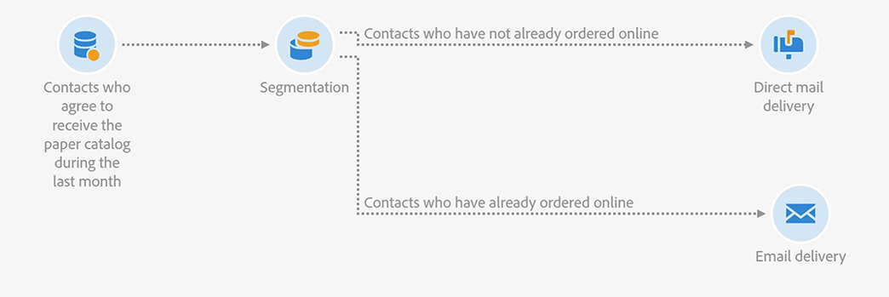

# 이메일 및 DM 게재 연결 {#coupling-email-direct-mail}

마케터가 DM을 통해 카탈로그를 보내려 하는 경우가 있습니다. 종이 카탈로그의 특정 페이지에 프로모션 코드와 웹사이트의 해당 제품 구매 링크를 통한 10% 할인 오퍼를 넣을 수 있습니다.

오프라인과 온라인의 결합은 흥미로울 수 있습니다. 일부 고객은 온라인 주문을 선호하면서도 제품 오퍼는 종이로 보는 것을 선호하기 때문입니다.

다음은 사용해 볼 만한 DM 템플릿의 예입니다.

다음은 DM과 이메일 채널을 혼합하는 워크플로의 예입니다.

**관련 항목:**

* [DM 게재 활동](../../automating/using/direct-mail-delivery.md)
* [DM 기본 정보](../../channels/using/about-direct-mail.md)
