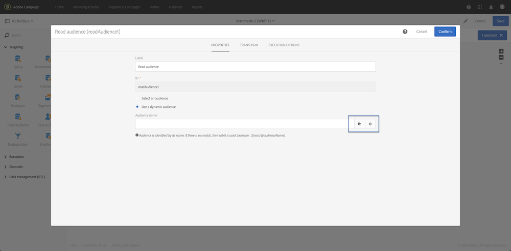
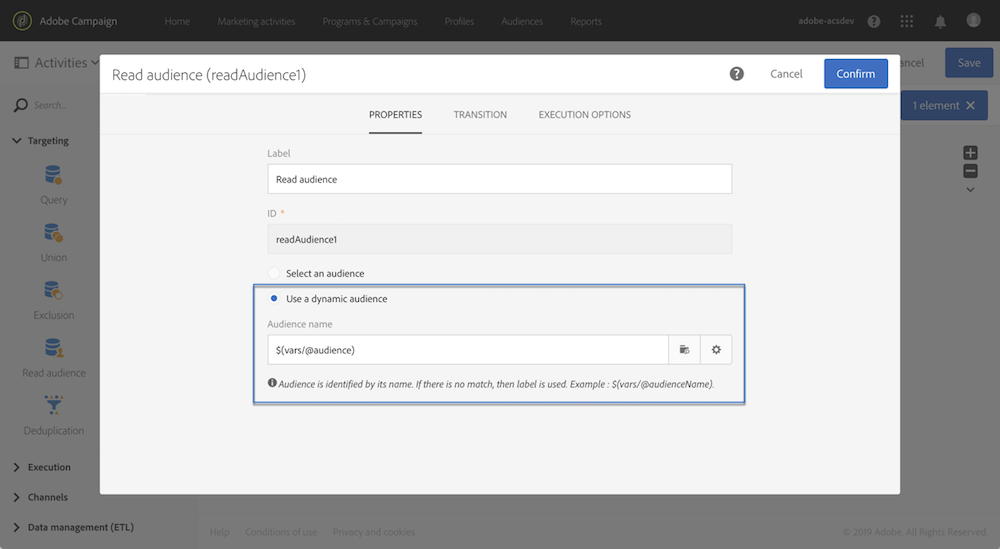
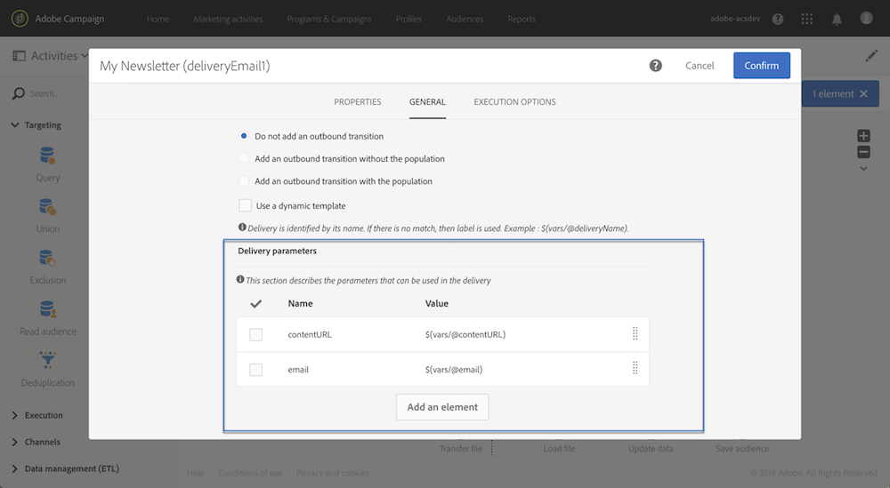

# 외부 매개 변수 {#customizing-a-workflow-with-external-parameters}을(를) 사용하여 워크플로 사용자 정의

워크플로우가 트리거되면 매개 변수를 이벤트 변수에 인제스트하여 워크플로우의 활동을 사용자 지정하는 데 사용할 수 있습니다.

예를 들어, **[!UICONTROL Read audience]** 활동에서 읽을 대상, **[!UICONTROL Transfer file]** 활동에서 전송할 파일의 이름 등을 정의하는 데 사용할 수 있습니다. ([이 페이지](../../automating/using/customizing-workflow-external-parameters.md) 참조).

## 이벤트 변수 {#using-events-variables} 사용

이벤트 변수는 [표준 구문](../../automating/using/advanced-expression-editing.md#standard-syntax)을(를) 준수해야 하는 표현식 내에서 사용됩니다.

이벤트 변수를 사용하는 구문은 아래 형식을 따르고 **[!UICONTROL External signal]** 활동에 정의된 매개 변수 이름을 사용해야 합니다([외부 신호 활동에서 매개 변수 선언 참조:](../../automating/using/declaring-parameters-external-signal.md)).

```
$(vars/@parameterName)
```

이 구문에서 **$** 함수는 **문자열** 데이터 유형을 반환합니다. 다른 유형의 데이터를 지정하려면 다음 함수를 사용합니다.

* **$long**:정수 숫자.
* **$float**:소수 자릿수입니다.
* **$부울**:참/거짓.
* **$datetime**:타임스탬프.

활동에서 변수를 사용할 때 인터페이스는 해당 변수를 호출하는 데 도움이 됩니다.



* :워크플로우에서 사용할 수 있는 모든 변수 중에서 events 변수를 선택합니다.

   

* :변수와 함수를 결합하는 표현식을 편집합니다( [이 페이지](../../automating/using/advanced-expression-editing.md) 참조).

   

   이 목록은 복잡한 필터링을 수행할 수 있도록 해주는 기능을 제공합니다. 이러한 함수는 [이 섹션](../../automating/using/list-of-functions.md)에 자세히 설명되어 있습니다.

   또한 외부 매개 변수를 사용하여 워크플로를 호출한 후에 이벤트 변수를 사용할 수 있도록 하는 모든 활동에서 사용할 수 있는 아래 함수를 사용할 수 있습니다([이 섹션](../../automating/using/customizing-workflow-external-parameters.md#customizing-activities-with-events-variables) 참조).

   | 이름 | 설명 | 구문 |
   ---------|----------|---------
   | 다음으로 끝남 | 문자열(1번째 매개 변수)이 특정 문자열(2번째 매개 변수)로 끝나는지 여부를 나타냅니다. | EndWith(&lt;String>,&lt;String>) |
   | startWith | 문자열(1번째 매개 변수)이 특정 문자열(2번째 매개 변수)로 시작하는지 여부를 나타냅니다. | startWith(&lt;String>,&lt;String>) |
   | Extract | 구분 기호를 사용하여 문자열의 첫 번째 문자를 반환합니다. | Extract(&lt;String>,&lt;Separator>) |
   | ExtractRight | 구분 기호를 사용하여 문자열의 마지막 문자를 반환합니다. | ExtractRight(&lt;String>,&lt;Separator>) |
   | DateFormat | 2차 매개 변수에 지정된 형식을 사용하여 날짜를 서식 지정합니다(예: &#39;%4Y%2M%2D&#39;) | DateFormat(&lt;날짜>,&lt;형식>) |
   | 파일 이름 | 파일 경로의 이름을 반환합니다. | FileName(&lt;String>) |
   | FileExt | 파일 경로의 확장명을 반환합니다. | FileExt(&lt;String>) |
   | IsNull | 문자열 또는 날짜가 null인지 여부를 나타냅니다. | IsNull(&lt;String/date>) |
   | UrlUtf8Encode | UTF8로 URL을 인코딩합니다. | UrlUtf8Encode(&lt;String>) |

## 이벤트 변수 {#customizing-activities-with-events-variables}을(를) 사용하여 활동 사용자 정의

이벤트 변수는 아래 섹션에 나열된 여러 활동을 사용자 지정하는 데 사용할 수 있습니다. 활동에서 변수를 호출하는 방법에 대한 자세한 내용은 [이 섹션](../../automating/using/customizing-workflow-external-parameters.md#using-events-variables)을 참조하십시오.

**[!UICONTROL Read audience]** 활동:이벤트 변수를 기반으로 타깃팅할 대상을 정의합니다. 활동 사용 방법에 대한 자세한 내용은 [이 섹션](../../automating/using/read-audience.md)을 참조하십시오.



**[!UICONTROL Test]** 활동:이벤트 변수를 기반으로 조건을 만듭니다. 활동 사용 방법에 대한 자세한 내용은 [이 섹션](../../automating/using/test.md)을 참조하십시오.


**[!UICONTROL Transfer file]** 활동:이벤트 변수에 따라 전송할 파일을 사용자 정의합니다. 활동 사용 방법에 대한 자세한 내용은 [이 섹션](../../automating/using/transfer-file.md)을 참조하십시오.


**[!UICONTROL Query]** 활동:매개 변수는 이벤트 변수와 함수를 결합하는 표현식을 사용하여 쿼리에서 참조할 수 있습니다. 이렇게 하려면 규칙을 추가한 다음 **[!UICONTROL Advanced mode]** 링크를 클릭하여 표현식 편집 창에 액세스합니다([고급 표현식 편집](../../automating/using/advanced-expression-editing.md) 참조).

활동 사용 방법에 대한 자세한 내용은 [이 섹션](../../automating/using/query.md)을 참조하십시오.


**[!UICONTROL Channels]** 활동:이벤트 변수를 기반으로 제공을 개인화합니다.

>[!NOTE]
>
>배달 매개 변수의 값은 배달을 준비할 때마다 검색됩니다.
>
>반복 배달 준비는 배달 **집계 기간**&#x200B;을 기반으로 합니다. 예를 들어 합계 기간이 &quot;일 기준&quot;인 경우 하루 한 번만 배달이 다시 준비됩니다. 배달 매개 변수의 값이 일 중에 수정되는 경우 이미 한 번 준비되었기 때문에 배달 시 업데이트되지 않습니다.
>
>워크플로우를 하루에 여러 번 호출할 계획인 경우 배달 매개 변수가 매번 업데이트되도록 [!UICONTROL No aggregation] 옵션을 사용합니다. 반복 배달 구성에 대한 자세한 내용은 [이 섹션](/help/automating/using/email-delivery.md#configuration)을 참조하십시오.

이벤트 변수를 기반으로 배달을 개인화하려면 먼저 사용할 변수를 게재 활동에 선언해야 합니다.

1. 활동을 선택한 다음  단추를 클릭하여 설정에 액세스합니다.
1. **[!UICONTROL General]** 탭을 선택한 다음 게재에서 개인화 필드로 사용할 이벤트 변수를 추가합니다.

   

1. **[!UICONTROL Confirm]** 버튼을 클릭합니다.

선언된 이벤트 변수를 이제 개인화 필드 목록에서 사용할 수 있습니다. 배달에서 이러한 항목을 사용하여 아래 작업을 수행할 수 있습니다.

* 게재에 사용할 템플릿 이름을 정의합니다.

   >[!NOTE]
   >
   >이 작업은 **반복** 배달에만 사용할 수 있습니다.

   

* 개인화된 전달:배달을 구성할 개인화 필드를 선택하면 이벤트 변수를 **[!UICONTROL Workflow parameters]** 요소에서 사용할 수 있습니다. 이러한 필드를 개인화 필드로 사용할 수 있습니다. 예를 들어 전달 주체, 발신자 등을 정의할 수 있습니다.

   배달 개인화는 [이 섹션](../../designing/using/personalization.md)에 자세히 설명되어 있습니다.

   

**세그먼트 코드**:이벤트 변수를 기반으로 세그먼트 코드를 정의합니다.

>[!NOTE]
>
>이 작업은 **[!UICONTROL Query]** 또는 **[!UICONTROL Segmentation]** 활동과 같은 세그먼트 코드를 정의할 수 있는 모든 활동에서 수행할 수 있습니다.


**배달 레이블**:이벤트 변수를 기반으로 배달 레이블을 정의합니다.


