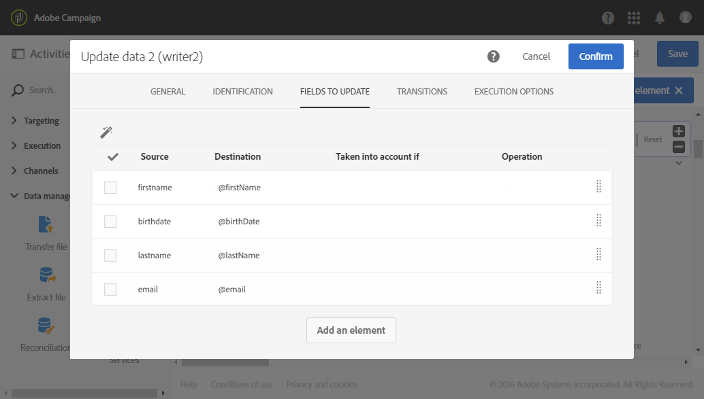

# 중복 제거{#deduplication}

## 설명 {#description}


활동을 **[!UICONTROL Deduplication]** 통해 인바운드 활동의 결과 중복 항목을 삭제할 수 있습니다.

## 사용 상황 {#context-of-use}

일반적으로 **[!UICONTROL Deduplication]** 활동은 타깃팅된 활동 후에 또는 파일을 가져온 후 타깃팅된 데이터를 사용할 수 있는 활동 전에 사용됩니다.

데이터 중복 제거 시 인바운드 전환이 개별적으로 처리됩니다. 예를 들어, 쿼리 1의 결과에 &#39;A&#39; 프로필이 있고 쿼리 2의 결과에도 있는 경우 중복 제거가 되지 않습니다.

따라서 데이터 중복 제거는 인바운드 전환이 하나만 있는 것이 좋습니다. 이를 위해 조합 활동, 교차 활동 등과 같은 타깃팅 요구 사항에 해당하는 활동을 사용하여 서로 다른 쿼리를 결합할 수 있습니다. 예:


## 구성 {#configuration}

데이터 중복 제거 활동을 구성하려면 결과 관련 옵션뿐만 아니라 레이블, 방법 및 데이터 중복 제거 기준을 입력해야 합니다.

1. 활동을 워크플로우로 드래그하여 **[!UICONTROL Deduplication]** 놓습니다.
1. 활동을 선택한 다음 나타나는 빠른 작업의  단추를 사용하여 활동을 엽니다.

   

1. 데이터 중복 제거 **[!UICONTROL Resource type]** 를 수행할 대상 선택:

   * **[!UICONTROL Database resource]** 데이터 중복 제거가 데이터베이스에 이미 존재하는 데이터에 대해 수행되는 경우 중복 **[!UICONTROL Filtering dimension]** 을 **[!UICONTROL Targeting dimension]**&#x200B;제거하려는 데이터에 따라 및 를 선택합니다. 데이터 중복 제거는 기본적으로 **프로파일에서 수행됩니다**.
   * **[!UICONTROL Temporary resource]** 워크플로우의 임시 데이터에 대해 중복 제거가 수행되는 경우: 중복 **[!UICONTROL Targeted set]** 제거하려는 데이터가 포함된 항목을 선택합니다. 이 사용 사례는 파일을 가져온 후 또는 데이터베이스의 데이터가 풍부해진 경우(예: 세그먼트 코드 포함) 발생할 수 있습니다.

1. 을 **[!UICONTROL Number of unique records to keep]**&#x200B;선택합니다. 이 필드의 기본값은 1입니다. 값 0을 사용하면 모든 중복을 유지할 수 있습니다.

   예를 들어 레코드 A와 B가 레코드 Y의 중복으로 간주되고 레코드 C가 레코드 Z의 중복으로 간주되는 경우:

   * 필드의 값이 1인 경우: Y와 Z 레코드만 보관됩니다.
   * 필드의 값이 0이면: 모든 기록은 보관된다.
   * 필드의 값이 2인 경우: C 와 Z 는 보존되고 A, B 및 Y의 2개의 레코드는 나중에 선택한 데이터 중복 제거 방법에 따라 보관됩니다.

1. 제공된 목록에 조건을 추가하여 **[!UICONTROL Duplicate identification]** 기준을 정의합니다. 동일한 값에서 중복을 식별할 수 있는 필드 및/또는 표현식을 지정합니다. 이메일 주소, 이름, 성 등 조건의 순서를 사용하면 먼저 처리할 조건을 지정할 수 있습니다.
1. 드롭다운 목록에서 사용할 항목 **[!UICONTROL Deduplication method]** 을 선택합니다.

   * **[!UICONTROL Choose for me]**: 임의로 복제되지 않도록 할 레코드를 선택합니다.
   * **[!UICONTROL Following a list of values]**: 하나 이상의 필드에 대한 값 우선 순위를 정의할 수 있습니다. 값을 정의하려면 필드를 선택하거나 표현식을 만든 다음 해당 표에 값을 추가합니다. 새 필드를 정의하려면 값 목록 위에 있는 **[!UICONTROL Add]** 단추를 클릭합니다.

      

   * **[!UICONTROL Non-empty value]**: 이렇게 하면 선택한 표현식의 값이 우선 순위로 비어 있지 않은 레코드를 유지할 수 있습니다.

      

   * **[!UICONTROL Using an expression]**: 이렇게 하면 입력한 표현식 값이 가장 작거나 가장 큰 레코드를 유지할 수 있습니다.

      

1. 필요한 경우 활동의 전환 [을](../../automating/using/activity-properties.md) 관리하여 아웃바운드 모형에 대한 고급 옵션에 액세스합니다.
1. 활동 구성을 확인하고 워크플로우를 저장합니다.

## 예 1: 배달 전 중복 항목 식별 {#example-1--identifying-duplicates-before-a-delivery}

다음 예에서는 이메일을 보내기 전에 대상의 중복 제거를 제외할 수 있는 데이터 중복 제거를 보여 줍니다. 즉, 동일한 프로필에 여러 번 통신을 보내지 않습니다.

워크플로우는 다음과 같이 구성됩니다.


* 이메일 대상을 정의할 수 **[!UICONTROL Query]** 있는 도구입니다. 여기서 워크플로우는 1년 이상 클라이언트 데이터베이스에 있었던 18세에서 25세 사이의 모든 프로필을 대상으로 합니다.

   

* 이전 **[!UICONTROL Deduplication]** 쿼리에서 얻은 중복을 식별할 수 있는 활동입니다. 이 예에서는 각 복제에 대해 하나의 레코드만 저장됩니다. 중복된 항목은 이메일 주소를 사용하여 식별됩니다. 즉, 각 이메일 주소가 타깃팅에 표시되도록 한 번만 이메일 배달을 보낼 수 있습니다.

   선택한 데이터 중복 제거 방법입니다 **[!UICONTROL Non-empty value]**. 이 기능을 사용하면 중복 레코드 중에서 **이름이** 제공된 레코드에 우선 순위가 지정되도록 할 수 있습니다. 이메일 컨텐츠의 개인화 필드에 이름을 사용하는 경우 더욱 일관됩니다.

   또한 중복 항목을 유지하고 나열할 수 있도록 추가 전환이 추가됩니다.

   

* 데이터 중복 제거의 기본 아웃바운드 전환 이후 **[!UICONTROL Email delivery]** 가져옵니다. 이메일 전달에 대한 구성은 [이메일 배달](../../automating/using/email-delivery.md) 섹션에 자세히 설명되어 있습니다.
* 중복 제거 추가 전환 후 중복된 항목을 중복 대상에 저장하기 위해 **[!UICONTROL Save audience]** 추가된 **** 활동입니다. 이 대상자는 모든 이메일 배달에서 구성원을 직접 제외하는 데 재사용할 수 있습니다.

## 예 2: 가져온 파일에서 데이터 중복 제거 {#example-2--deduplicating-the-data-from-an-imported-file}

이 예에서는 데이터를 데이터베이스에 로드하기 전에 가져온 파일에서 데이터를 중복 제거하는 방법을 보여 줍니다. 이 절차는 데이터베이스에 로드된 데이터의 품질을 향상시킵니다.

워크플로우는 다음과 같이 구성됩니다.


* 프로필 목록이 포함된 파일은 **[!UICONTROL Load file]** 활동을 사용하여 가져옵니다. 이 예제에서 가져온 파일은 .csv 형식이며 10개의 프로필을 포함합니다.

   ```
   lastname;firstname;dateofbirth;email
   Smith;Hayden;23/05/1989;hayden.smith@example.com
   Mars;Daniel;17/11/1987;dannymars@example.com
   Smith;Clara;08/02/1989;hayden.smith@example.com
   Durance;Allison;15/12/1978;allison.durance@example.com
   Lucassen;Jody;28/03/1988;jody.lucassen@example.com
   Binder;Tom;19/01/1982;tombinder@example.com
   Binder;Tommy;19/01/1915;tombinder@example.com
   Connor;Jade;10/10/1979;connor.jade@example.com
   Mack;Clarke;02/03/1985;clarke.mack@example.com
   Ross;Timothy;04/07/1986;timross@example.com
   ```

   이 파일을 샘플 파일로 사용하여 열 형식을 감지하고 정의할 수도 있습니다. 탭에서 **[!UICONTROL Column definition]** 가져온 파일의 각 열이 올바르게 구성되어 있는지 확인합니다.

   

* 활동 **[!UICONTROL Deduplication]** . 데이터 중복 제거는 파일을 가져온 후 데이터베이스에 데이터를 삽입하기 전에 직접 수행됩니다. 그러므로 그것은 활동으로부터 **[!UICONTROL Temporary resource]** 를 기준으로 **[!UICONTROL Load file]** 해야 합니다.

   이 예에서는 파일에 포함된 고유한 이메일 주소당 하나의 항목을 보관하려고 합니다. 따라서 임시 리소스의 **이메일** 열에 중복 식별이 수행됩니다. 그러나 파일에 두 개의 이메일 주소가 나타납니다. 따라서 두 줄은 중복으로 간주됩니다.

   

* 데이터 **[!UICONTROL Update data]** 중복 제거 프로세스에서 유지된 데이터를 데이터베이스에 삽입할 수 있습니다. 가져온 데이터가 프로필 차원에 속하는 것으로 식별되는 경우에만 데이터가 업데이트됩니다.

   데이터베이스에 아직 존재하지 않는 프로필 **[!UICONTROL Insert only]** 을 만듭니다. 이 작업을 수행하려면 프로필 **차원의 이메일** 필드 및 이메일 필드를 조정 키로 사용합니다.

   

   데이터를 삽입할 파일의 열과 탭의 데이터베이스 필드 간의 매핑을 **[!UICONTROL Fields to update]** 지정합니다.

   

그런 다음 워크플로우를 시작합니다. 데이터 중복 제거 프로세스에서 저장된 레코드가 데이터베이스의 프로파일에 추가됩니다.
