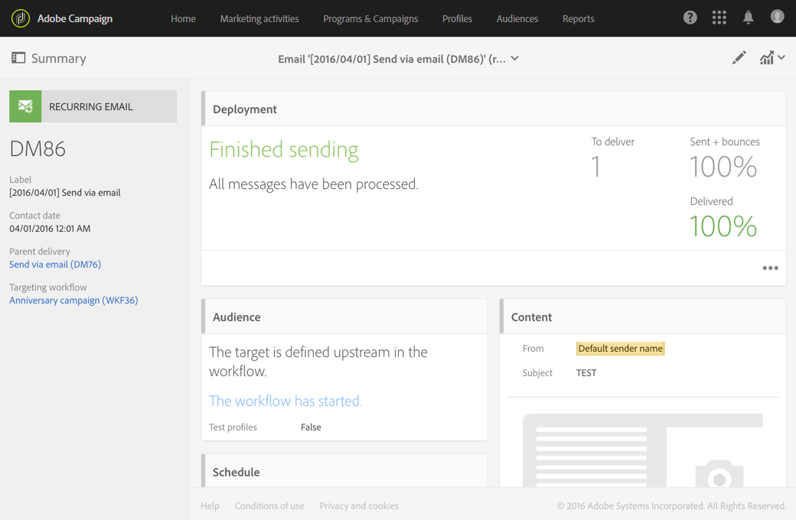

# 이메일 게재{#email-delivery}

## 설명 {#description}

이 **[!UICONTROL Email delivery]** 활동을 통해 워크플로우에서 이메일 전송을 구성할 수 있습니다. 이 이메일은 **한 번의** 전송으로 한 번만 전송되거나 **반복되는** 이메일이 될 수 있습니다.

단일 전송 이메일은 한 번 전송되는 표준 이메일입니다.

반복 이메일을 사용하면 지정된 기간 동안 동일한 이메일을 여러 개의 타겟으로 보낼 수 있습니다. 필요에 해당하는 보고서를 가져오려면 기간당 납품을 집계할 수 있습니다.

## 사용 상황 {#context-of-use}

이 **[!UICONTROL Email delivery]** 활동은 일반적으로 동일한 워크플로우에서 계산된 타겟으로 이메일 전송을 자동화하는 데 사용됩니다.

스케줄러에 연결할 때 반복되는 이메일을 정의할 수 있습니다.

이메일 수신자는 쿼리, 교차로 등과 같은 타깃팅 활동을 통해 동일한 워크플로우에서 활동의 업스트림으로 정의됩니다.

메시지 준비는 워크플로우 실행 매개 변수에 따라 트리거됩니다. 메시지 대시보드에서 수동 확인을 요청할지 여부를 선택할 수 있습니다(기본적으로 필수). 워크플로우를 수동으로 시작하거나 워크플로우에 스케줄러 활동을 배치하여 실행을 자동화할 수 있습니다.

## 구성 {#configuration}

1. 워크플로우를 워크플로우로 드래그하여 **[!UICONTROL Email delivery]** 놓을 수 있습니다.
1. 활동을 선택한 다음 나타나는 빠른 작업의  단추를 사용하여 엽니다.

   >[!NOTE]
   >
   >활동의 빠른 작업의  단추를 통해 배달 자체가 아닌 활동의 일반 속성 및 고급 옵션에 액세스할 수 있습니다. 이 단추는 **[!UICONTROL Email delivery]** 활동에 따라 다릅니다. 이메일 속성은 이메일 대시보드의 작업 표시줄을 통해 액세스할 수 있습니다.

1. 이메일 보내기 모드를 선택합니다.

   * **[!UICONTROL Email]**:이메일이 한 번 전송됩니다. 활동에 아웃바운드 전환을 추가할지 여부를 여기에서 지정할 수 있습니다. 이 절차의 7단계에서 다양한 전환 유형에 대해 자세히 설명합니다.
   * **[!UICONTROL Recurring email]**:활동에 정의된 빈도에 따라 이메일이 여러 번 전송됩니다. **[!UICONTROL Scheduler]** 전송의 집계 기간을 선택합니다. 이렇게 하면 반복 실행이라고도 하며 애플리케이션의 마케팅 활동 목록에서 액세스할 수 있는 단일 이메일에서 정의된 기간 동안 발생하는 모든 **전송을** 다시 그룹화할 수 있습니다.

      예를 들어 매일 전송되는 반복 생일 이메일의 경우 월별 전송을 집계하도록 선택할 수 있습니다. 이메일을 매일 보내더라도 매월 배달 보고서를 받을 수 있습니다.

1. 이메일 유형을 선택합니다. 이메일 유형은 **[!UICONTROL Resources]** &gt; **[!UICONTROL Templates]** &gt; **[!UICONTROL Delivery templates]** 메뉴에 정의된 이메일 템플릿에서 가져옵니다.
1. 이메일의 일반 속성을 입력합니다. 기존 캠페인에 연결할 수도 있습니다. 워크플로우의 배달 활동의 레이블이 이메일 레이블로 업데이트됩니다.
1. 이메일 컨텐츠를 정의합니다. 컨텐츠 [편집에](../../designing/using/designing-content-in-adobe-campaign.md)대한 섹션을 참조하십시오.
1. 기본적으로 이 **[!UICONTROL Email delivery]** 활동에는 아웃바운드 전환이 포함되지 않습니다. 활동에 아웃바운드 전환을 추가하려면 고급 활동 옵션(활동의 빠른 동작에 있는 **[!UICONTROL Email delivery]** 단추)의 **[!UICONTROL General]**  탭으로 이동한 다음 다음 다음 옵션 중 하나를 선택합니다.

   * **[!UICONTROL Add outbound transition without the population]**:이를 통해 인바운드 전환과 정확히 동일한 인구를 포함하는 아웃바운드 전환을 생성할 수 있습니다.
   * **[!UICONTROL Add outbound transition with the population]**:이렇게 하면 이메일을 보낸 모집단을 포함하는 아웃바운드 전환을 생성할 수 있습니다. 배달 준비 중 제외된 대상 구성원(격리, 잘못된 이메일 등) 는 이 전환에서 제외됩니다.

1. 활동 구성을 확인하고 워크플로우를 저장합니다.

활동을 다시 열면 이메일 대시보드로 바로 이동합니다. 컨텐트만 편집할 수 있습니다.

기본적으로 배달 워크플로우를 시작하면 메시지 준비만 트리거됩니다. 워크플로우가 시작된 후에도 워크플로우에서 만든 메시지 전송을 확인해야 합니다. 그러나 메시지 대시보드에서 메시지를 만든 경우에만 **[!UICONTROL Request confirmation before sending messages]** 옵션을 비활성화할 수 있습니다. 이 옵션을 선택 해제하면 준비가 완료되면 추가 통보 없이 메시지가 전송됩니다.

## 주의 사항 {#remarks}

워크플로우 내에서 생성된 게재는 애플리케이션의 마케팅 활동 목록에서 액세스할 수 있습니다. 대시보드를 사용하여 워크플로우의 실행 상태를 볼 수 있습니다. 이메일 요약 창의 링크를 사용하면 연결된 요소(반복 이메일의 경우 워크플로우, 캠페인, 상위 배달)에 직접 액세스할 수 있습니다.

반복 게재의 실행은 기본적으로 숨겨집니다. 이를 보려면 마케팅 활동의 검색 패널에서 **[!UICONTROL Show recurring executions]** 옵션을 선택합니다.

마케팅 활동 목록에서 액세스하거나 관련 반복 실행을 통해 직접 액세스할 수 있는 상위 배달에서 처리된 총 전송 수를 볼 수 있습니다(활동이 구성되었을 때 지정된 집계 기간에 따라). **[!UICONTROL Email delivery]** 이렇게 하려면 상위 배달 **[!UICONTROL Deployment]** 블록의 세부 사항 보기를 선택하여 엽니다 .

## 예 {#example}

이 예는 생일 워크플로우입니다. 매일 이메일이 그 날 생일을 맞는 프로필로 전송됩니다. 이렇게 하려면:

* 이 **[!UICONTROL Scheduler]** 기능을 사용하면 매일 오전 8시에 워크플로우를 시작할 수 있습니다.

   

* 이 **[!UICONTROL Query]** 활동을 사용하면 워크플로우를 실행할 때마다 이메일을 제공한 사람 및 생일이 현재 일자인 프로필을 계산할 수 있습니다. 생일 계산은 쿼리 편집 도구의 팔레트에서 사용할 수 있는 사전 정의된 필터를 사용하여 수행됩니다.

   

* 이것은 **[!UICONTROL Email]** 되풀이된다. 센드는 월별로 집계됩니다. 따라서 한 달에 전송된 모든 이메일은 하나의 뷰로 집계됩니다. 따라서 1년 동안 365개 게시가 실행되지만 Adobe Campaign 인터페이스에서 12개의 보기( **반복 실행이라고도**&#x200B;함)로 다시 그룹화됩니다. 기록 및 보고서 세부 사항은 매달 표시되지만 모든 전송에 대해서는 표시되지 않습니다.

   

**관련 항목**

* [사용 사례:일주일에 한 번 이메일 전달 만들기](../../automating/using/workflow-weekly-offer.md)
* [사용 사례:위치에 세그먼트화된 배달 만들기](../../automating/using/workflow-segmentation-location.md)
* [사용 사례:보충으로 배달 만들기](../../automating/using/workflow-created-query-with-complement.md)
* [사용 사례:비열기 사용자에게 새 배달을 보내는 다시 타깃팅 워크플로우](../../automating/using/workflow-cross-channel-retargeting.md)