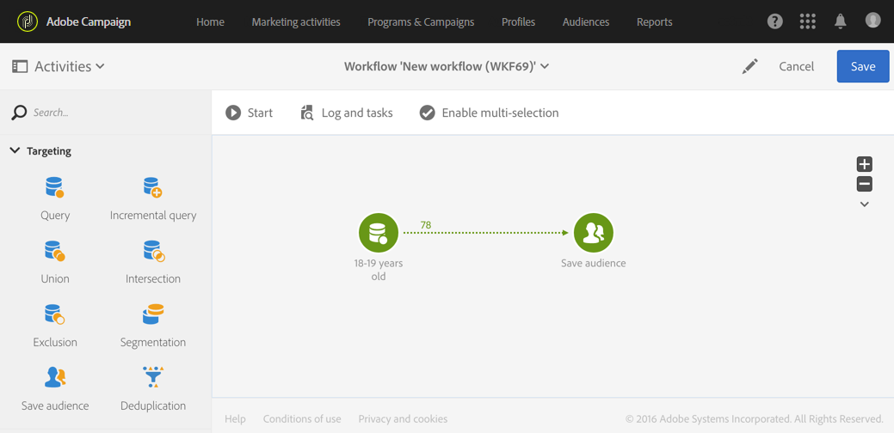
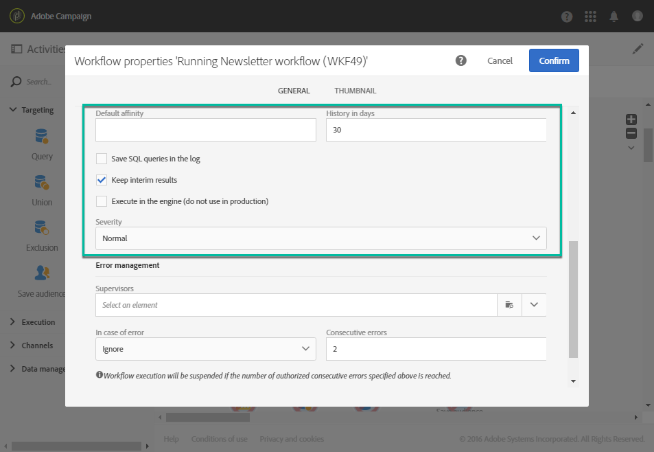

# 워크플로우 실행{#executing-a-workflow}

## 워크플로우 실행 정보 {#about-workflow-execution}

워크플로우는 항상 수동으로 시작됩니다. 하지만, 시작한 후에는 스케줄러 활동에 지정된 정보에 따라 비활성 상태로 [유지될 수](../../automating/using/scheduler.md) 있습니다.

>[!CAUTION]
>
> Adobe에서는 고객이 워크플로우 실행에 우선 순위를 지정하고 최대 20개의 동시 워크플로우 실행을 실행하여 인스턴스 전체에서 일관되게 최대의 성과를 달성할 것을 권장합니다. 20개 이상의 동시 워크플로우 실행을 계획할 수 있으며 기본적으로 순차적으로 실행됩니다. 고객 지원 센터에 티켓을 제출하면 동시 작업 흐름 실행 횟수의 기본 설정을 조정할 수 있습니다.

실행 관련 작업(시작, 중지, 일시 중지 등) 은(는) **비동기** 프로세스입니다.명령이 저장되고 서버가 해당 명령을 적용할 수 있게 되면 효과가 적용됩니다.

워크플로우에서는 일반적으로 각 활동의 결과가 화살표로 표시되는 전환을 통해 다음 활동으로 전송됩니다.

전환이 대상 활동에 연결되지 않으면 종료되지 않습니다.

>[!NOTE]
>
>종료되지 않은 전환이 포함된 워크플로우는 여전히 실행할 수 있습니다.경고 메시지가 생성되며 워크플로우가 전환에 도달하면 일시 중지되지만 오류가 생성되지 않습니다. 또한 디자인을 완전히 마치지 않고도 워크플로우를 시작할 수 있으며 작업을 계속 진행하면서 완료할 수 있습니다.

활동이 실행되면 전환에서 전송된 레코드 수가 그 위에 표시됩니다.

전환을 열어 워크플로우를 실행하는 동안 또는 이후에 전송된 데이터가 올바른지 확인할 수 있습니다. 데이터와 데이터 구조를 볼 수 있습니다.

기본적으로 워크플로우의 마지막 전환 세부 사항만 액세스할 수 있습니다. 이전 활동의 결과에 액세스하려면 워크플로우를 시작하기 전에 워크플로우 속성 **[!UICONTROL Keep interim results]** 섹션의 **[!UICONTROL Execution]** 옵션을 선택해야 합니다.

>[!NOTE]
>
>이 옵션은 많은 메모리를 사용하며 워크플로우를 구성하고 제대로 구성되고 작동하는지 확인하기 위해 고안되었습니다. 프로덕션 인스턴스에서 선택 취소하지 않습니다.

전환이 열려 있으면 전환의 **[!UICONTROL Label]** 내용을 편집하거나 해당 변환에 연결할 **[!UICONTROL Segment code]** 수 있습니다. 이렇게 하려면 해당 필드를 편집하고 수정 내용을 확인합니다.

Campaign Standard REST API를 사용하면 워크플로우를 **시작**, **일시 중지**, **다시 시작** 및 **중지할 수 있습니다** . API 설명서에서 REST 호출에 대한 자세한 내용 및 예를 확인할 [수 있습니다.](../../api/using/controlling-a-workflow.md)

## 라이프 사이클 {#life-cycle}

워크플로우의 라이프 사이클에는 세 가지 기본 단계가 포함되며 각 단계는 상태 및 색상으로 연결됩니다.

* **편집** (회색)

   워크플로우의 초기 디자인 단계입니다(워크플로우 [만들기](../../automating/using/building-a-workflow.md#creating-a-workflow)참조). 워크플로우는 서버에서 아직 처리되지 않으며, 아무런 위험 없이 수정할 수 있습니다.

* **진행** 중(파란색)

   초기 디자인 단계가 완료되면 워크플로우를 시작하고 서버에서 처리할 수 있습니다.

* **완료** (녹색)

   진행 중인 작업이 더 이상 없거나 연산자가 인스턴스를 명시적으로 중지한 경우 워크플로우가 완료됩니다.

작업이 시작되면 워크플로우에 두 가지 다른 상태가 있을 수도 있습니다.

* **경고** (노란색)

   워크플로가 완료되지 않았거나  또는  단추를 사용하여 일시 중지되었습니다.

* **오류** (빨간색)

   워크플로우가 실행될 때 오류가 발생했습니다. 워크플로우가 중지되었으며 사용자가 작업을 수행해야 합니다. 이 오류에 대한 자세한 내용을 보려면  단추를 사용하여 워크플로우 로그에 액세스하십시오(모니터링 [참조](#monitoring)).

마케팅 활동 목록을 사용하면 모든 워크플로우와 해당 상태를 표시할 수 있습니다. 자세한 내용은 마케팅 활동 [관리를](../../start/using/marketing-activities.md#about-marketing-activities)참조하십시오.

## 실행 명령 {#execution-commands}

작업 표시줄의 아이콘을 사용하여 워크플로우 실행을 시작, 추적 및 수정할 수 있습니다. 작업 [막대를](../../automating/using/workflow-interface.md#action-bar)참조하십시오.

사용 가능한 작업은 다음과 같습니다.

**시작**

이  단추는 워크플로우 실행을 시작한 다음 진행 중( **파란색** ) 상태를 수행합니다. 워크플로가 일시 중지된 경우 다시 시작되고, 다시 시작된 후 초기 활동이 활성화됩니다.

>[!NOTE]
>
>시작하는 것은 비동기 프로세스입니다.요청이 저장되고 Workflow 실행 엔진에서 가능한 한 빨리 처리됩니다.

**일시 중지**

이  단추는 실행을 일시 중지합니다. 워크플로우는 경고( **노란색** ) 상태를 수행합니다. 새 활동이 다시 시작될 때까지 활성화되지 않지만 진행 중인 작업이 일시 중단되지 않습니다.

**중지**

이  단추는 실행 중인 워크플로우를 중지한 다음 완료됨( **녹색** ) 상태가 됩니다. 진행 중인 작업이 가능한 경우 중단되고 진행 중인 가져오기 또는 SQL 쿼리가 즉시 취소됩니다. 워크플로우가 중지된 위치에서 다시 시작할 수 없습니다.

**다시 시작**

이  단추에는 워크플로를 중지한 다음 다시 시작하는 작업이 포함됩니다. 대부분의 경우 빠르게 다시 시작할 수 있습니다. 또한 정지하는 데 일정 시간이 소요되면 다시 시작을 자동화하는 것이 유용할 수 있습니다.  단추는 정지하는 것이 효과적인 경우에만 사용할 수 있습니다.

워크플로우에서 하나 이상의 활동을 선택하면 수행할 수 있는 다른 작업(예:

**즉각적인 실행**

이  단추는 선택한 보류 중인 모든 활동을 가능한 한 빨리 시작합니다.

**일반 실행**

이  단추는 일시 중지되거나 비활성화된 활동을 다시 활성화합니다.

**실행이 일시 중단됨**

이  단추는 선택한 활동에서 워크플로우를 일시 중지합니다.이 작업 및 후속 작업(동일한 분기)이 실행되지 않습니다.

**실행 안 함**

이  단추는 선택한 모든 활동을 비활성화합니다.

>[!NOTE]
>
>빠른 작업을 사용하면 특정 활동과 관련된 다양한 작업에 액세스할 수 있으며 활동이 선택되면 나타납니다.

## 모니터링 {#monitoring}

이  아이콘은 워크플로우 로그 및 작업 메뉴를 엽니다.

워크플로우 내역은 워크플로우 실행 옵션에 지정된 기간 동안 저장됩니다(워크플로우 속성 [참조](#workflow-properties)). 따라서 이 기간 동안 다시 시작한 후에도 모든 메시지가 저장됩니다. 이전 실행에서 메시지를 저장하지 않으려면  단추를 클릭하여 내역을 삭제해야 합니다.

이 **[!UICONTROL Log]** 탭에는 모든 활동 또는 선택한 활동의 실행 내역이 포함되어 있습니다. 시간 순서대로 수행 및 실행 오류를 인덱싱합니다.

이 **[!UICONTROL Tasks]** 탭은 활동의 실행 순서 지정에 대해 자세히 설명합니다. 작업을 클릭하여 자세한 내용을 확인하십시오.

다음 두 가지 목록에서 다음을 수행합니다.

* 적용된 필터에 따라 총 활동 수를 보려면 카운터를 클릭합니다. 목록의 요소 수가 30개 미만인 경우 기본적으로 카운터가 표시됩니다.
* 이 **[!UICONTROL Configure list]** 단추를 사용하면 표시되는 정보를 선택하고 열 순서를 정의하며 목록을 정렬할 수 있습니다.
* 필터를 사용하여 필요한 정보를 더 빠르게 찾을 수 있습니다. 검색 필드를 사용하여 워크플로우 활동 이름의 특정 텍스트를 찾습니다(예:&quot;query&quot;) 및 로그

## 오류 관리 {#error-management}

오류가 발생하면 워크플로우가 일시 정지되고 오류가 발생했을 때 실행 중인 활동이 빨간색으로 표시됩니다.

워크플로우 상태가 빨간색으로 바뀌고 오류가 로그에 기록됩니다.

일시 중지되지 않고 오류 없이 계속 실행되도록 워크플로우를 구성할 수 있습니다. 이렇게 하려면  단추를 통해 워크플로우 속성으로 이동하고 **[!UICONTROL Execution]** 섹션에서 오류 **** 발생 필드에서 무시 **옵션을** 선택합니다.

이 경우 잘못된 작업이 중단됩니다. 이 모드는 나중에 작업을 다시 시도하도록 설계된 워크플로우에 특히 적합합니다(주기적 작업).

>[!NOTE]
>
>각 활동에 대해 이 구성을 개별적으로 적용할 수 있습니다. 이렇게 하려면 활동을 선택하고 빠른 작업을 사용하여 엽니다 . 그런 다음 실행 옵션 **탭에서 오류 관리 모드를** 선택합니다. 활동 [실행 옵션을](#activity-execution-options)참조하십시오.

워크플로우의 속성에서 오류 관리와 관련된 추가 옵션을 사용할 수 있습니다.

가능한 옵션은 다음과 같습니다.

* **[!UICONTROL Supervisors]**:워크플로우에 오류가 발생하면 알릴 사람 그룹을 정의할 수 있습니다(이메일 및 인앱 알림). 정의된 그룹이 없으면 아무도 알림을 받지 않습니다. Adobe Campaign 알림에 대한 자세한 내용은 Adobe Campaign [알림을](../../administration/using/sending-internal-notifications.md)참조하십시오.

* **[!UICONTROL In case of error]**:활동에 오류가 발생하면 수행할 작업을 지정할 수 있습니다. 다음과 같은 두 가지 옵션을 사용할 수 있습니다.

   * **프로세스**&#x200B;일시 중단:워크플로우가 자동으로 일시 중단됩니다. 그러면 워크플로우 상태가 **잘못되고** 연결된 색상이 빨간색으로 바뀝니다. 문제가 해결되면 워크플로우를 다시 시작합니다.
   * **무시**:활동이 실행되지 않으며, 따라서 동일한 분기에 따라 어떤 활동도 실행되지 않습니다. 이는 반복되는 작업에 유용할 수 있습니다. 분기에 업스트림 배치가 있는 경우 다음 실행 날짜에 트리거됩니다.

* **[!UICONTROL Consecutive errors]** :워크플로우 실행이 자동으로 일시 중단되기 전에 인증되는 여러 개의 연속 오류를 정의할 수 있습니다.

   * 지정된 수가 **[!UICONTROL 0]**&#x200B;이거나 지정된 수에 도달하지 않으면 오류가 발생하는 활동이 무시됩니다. 다른 워크플로우 분기는 정상적으로 실행됩니다.

   * 지정된 수에 도달하면 전체 워크플로우가 일시 중단되고 **[!UICONTROL Erroneous]**&#x200B;됩니다. 감독자가 정의된 경우 자동으로 이메일로 통보를 받습니다. Adobe [Campaign 알림을](../../administration/using/sending-internal-notifications.md)참조하십시오.

## 워크플로우 속성 {#workflow-properties}

워크플로우의 실행 옵션을 수정하려면  단추를 사용하여 워크플로우 속성에 액세스하고 **[!UICONTROL Execution]** 섹션을 선택합니다.

가능한 옵션은 다음과 같습니다.

* **[!UICONTROL Default affinity]**:이 필드를 사용하면 특정 컴퓨터에서 워크플로우 또는 워크플로우 활동을 강제로 실행할 수 있습니다.

* **[!UICONTROL History in days]**:내역을 삭제할 일 수를 지정합니다. 작업 내역에는 워크플로와 관련된 요소가 포함되어 있습니다.로그, 작업, 이벤트(워크플로우 작업과 연결된 기술 개체) 및 **[!UICONTROL Transfer file]** 활동에 의해 다운로드한 파일 기본 워크플로우 템플릿의 경우 기본값은 30일입니다.

   작업 내역 제거는 데이터베이스 정리 기술 워크플로우에 의해 수행되며, 이 워크플로우는 기본적으로 매일 실행됩니다(기술 [워크플로우](../../administration/using/technical-workflows.md)목록 참조).

   >[!IMPORTANT]
   >
   >필드를 비워 두면 해당 값이 &quot;1&quot;로 간주됩니다. 즉, 내역은 1일 후에 삭제됩니다. **[!UICONTROL History in days]**

* **[!UICONTROL Save SQL queries in the log]**:워크플로우의 SQL 쿼리를 로그에 저장할 수 있습니다.

* **[!UICONTROL Keep interim results]**:전환 세부 사항을 보려면 이 옵션을 선택합니다. 경고:이 옵션을 선택하면 워크플로우 실행이 크게 느려질 수 있습니다.

* **[!UICONTROL Execute in the engine (do not use in production)]**:개발 환경 테스트 목적으로 로컬에서 워크플로우를 실행할 수 있습니다.

* **[!UICONTROL Severity]**:adobe Campaign 인스턴스에서 워크플로우 실행에 대한 우선 순위 수준을 지정할 수 있습니다. 중요한 워크플로우가 먼저 실행됩니다.

이 **[!UICONTROL Error management]** 섹션에서는 오류가 발생하는 경우 워크플로우의 작동 방식을 관리할 수 있는 추가 옵션을 제공합니다. 이러한 옵션은 오류 [관리](#error-management) 섹션에 자세히 설명되어 있습니다.

## 활동 속성 {#activity-properties}

### 활동의 일반 속성 {#general-properties-of-an-activity}

각 활동에는 **[!UICONTROL Properties]** 탭이 있습니다. 이 탭에서는 활동의 일반 매개 변수, 특히 레이블과 ID를 수정할 수 있습니다. 이 탭 구성은 선택 사항입니다.

### 활동의 아웃바운드 전환 관리 {#managing-an-activity-s-outbound-transitions}

기본적으로 특정 활동에는 아웃바운드 전환이 없습니다. 탭 또는 활동 **[!UICONTROL Transitions]** **[!UICONTROL Properties]** 탭에서 다른 프로세스를 추가하여 동일한 워크플로우에서 모집단 전체에 다른 프로세스를 적용할 수 있습니다.

활동에 따라 다음과 같은 여러 유형의 아웃바운드 전환을 추가할 수 있습니다.

* 표준 전환:활동에 의해 계산된 인구
* 모집단 없이 전환:이 유형의 아웃바운드 전환을 추가하여 워크플로우를 계속할 수 있으며 시스템에서 불필요한 공간을 사용하지 않도록 채우기를 포함하지 않습니다.
* 거부:인구 수를 줄였습니다. 예를 들어, 활동의 인바운드 데이터가 잘못되었거나 완전하지 않아 처리되지 못한 경우
* 보완:활동을 실행한 후 남은 모집단. 예를 들어, 세그먼테이션 활동이 인바운드 인구의 백분율만 저장하도록 구성된 경우

해당하는 경우 활동의 아웃바운드 **[!UICONTROL Segment code]** 전환에 대해 을 지정합니다. 이 세그먼트 코드를 사용하면 타겟 모집단에서 하위 세트가 어디에서 오는지 식별할 수 있으며, 나중에 메시지 개인화를 위해 제공할 수 있습니다.

### 활동 실행 옵션 {#activity-execution-options}

활동의 속성 화면에는 활동의 실행 모드와 오류가 발생할 경우 동작을 정의할 수 있는 **[!UICONTROL Advanced options]** 탭이 있습니다.

이러한 옵션에 액세스하려면 워크플로에서 활동을 선택한 다음 작업 표시줄의  단추를 사용하여 엽니다.

이 **[!UICONTROL Execution]** 필드를 사용하면 작업이 시작될 때 수행할 작업을 정의할 수 있습니다. 다음과 같은 세 가지 옵션이 있습니다.

* **표준**:활동이 정상적으로 실행됩니다.
* **활성화하지만 실행하지**&#x200B;않음:활동이 일시 중지되고 그 결과 이후의 모든 프로세스가 일시 중지됩니다. 이 기능은 작업이 시작될 때 제공하려는 경우에 유용할 수 있습니다.
* **활성화하지**&#x200B;않음:활동이 실행되지 않으며, 따라서, 모든 활동이 동일한 분기에 속합니다.

이 **[!UICONTROL In case of error]** 필드를 사용하면 활동에 오류가 발생하면 수행할 작업을 지정할 수 있습니다. 다음과 같은 두 가지 옵션을 사용할 수 있습니다.

* **프로세스**&#x200B;일시 중단:워크플로우가 자동으로 일시 중단됩니다. 그러면 워크플로우 상태가 **잘못되고** 연결된 색상이 빨간색으로 바뀝니다. 문제가 해결되면 워크플로우를 다시 시작합니다.
* **무시**:활동이 실행되지 않으며, 따라서 동일한 분기에 따라 어떤 활동도 실행되지 않습니다. 이는 반복되는 작업에 유용할 수 있습니다. 분기에 업스트림 배치가 있는 경우 다음 실행 날짜에 트리거됩니다.

이 **[!UICONTROL Behavior]** 필드를 사용하면 비동기 작업을 사용하는 경우 따를 절차를 정의할 수 있습니다. 다음과 같은 두 가지 옵션을 사용할 수 있습니다.

* **여러 작업을 인증했습니다**.첫 번째 작업이 완료되지 않았더라도 동시에 여러 작업을 실행할 수 있습니다.
* **현재 작업의 우선 순위는**&#x200B;다음과 같습니다.작업이 진행 중이면 우선 순위가 지정됩니다. 하나의 작업이 아직 진행 중이면 다른 작업이 실행되지 않습니다.

이 **[!UICONTROL Max. execution duration]** 필드를 사용하면 &quot;30s&quot; 또는 &quot;1h&quot;와 같은 기간을 지정할 수 있습니다. 지정된 기간이 경과한 후 활동이 완료되지 않으면 경고가 트리거됩니다. 이는 워크플로우의 기능에 영향을 주지 않습니다.

이 **[!UICONTROL Affinity]** 필드를 사용하면 특정 컴퓨터에서 워크플로우 또는 워크플로우 활동을 강제로 실행할 수 있습니다. 이렇게 하려면 해당 워크플로우 또는 활동에 대해 하나 또는 여러 개의 친화성을 지정해야 합니다.

이 **[!UICONTROL Time zone]** 필드를 사용하면 활동의 시간대를 선택할 수 있습니다. Adobe Campaign을 사용하면 동일한 인스턴스에서 여러 국가의 시간 차이를 관리할 수 있습니다. 적용된 설정은 인스턴스를 만들 때 구성됩니다.

>[!NOTE]
>
>기본적으로 선택된 시간대가 없으면 활동은 워크플로우 속성에 정의된 시간대를 사용합니다.

댓글 **필드는** 메모를 추가할 수 있는 자유 필드입니다.
