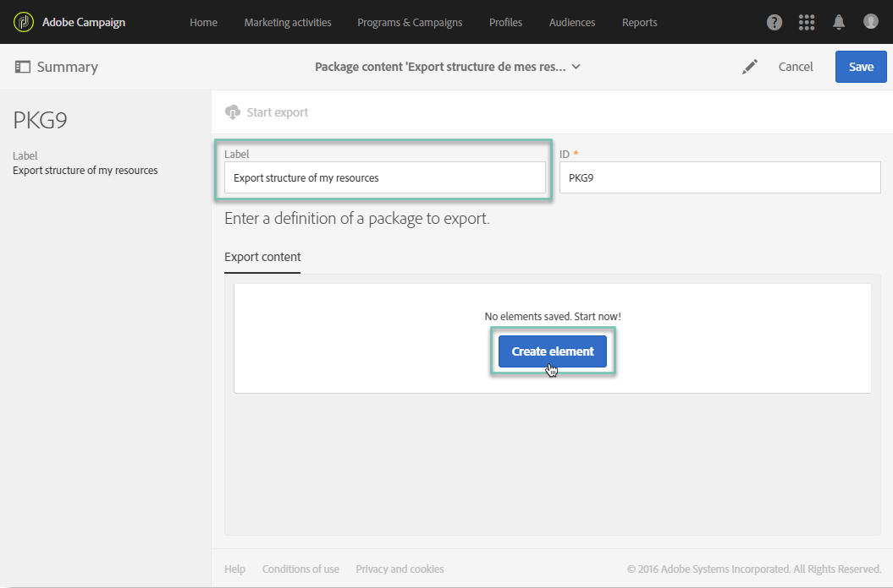
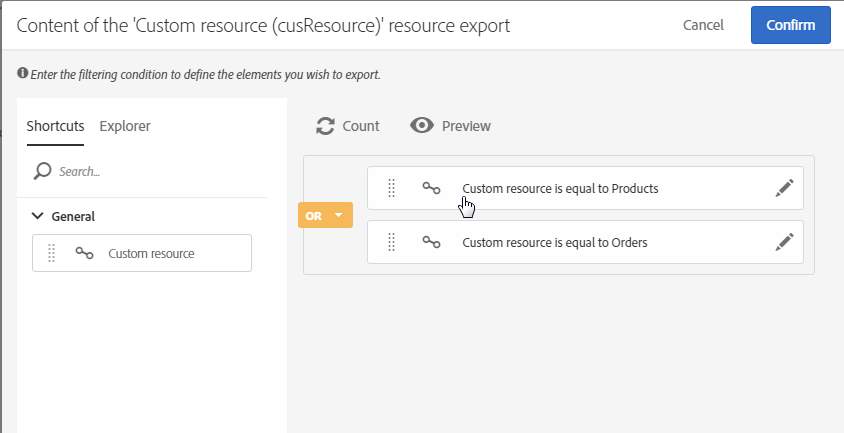

# 사용자 지정 리소스 내보내기/가져오기 {#exporting-importing-custom-resources}

이 튜토리얼에서는 개발 환경에서 프로덕션 환경으로 사용자 지정 리소스 패키지를 내보내고 가져오는 방법에 대해 설명합니다.

이 예는 Adobe Campaign에 연결된 기능 관리자를 대상으로 합니다.

전제 조건은 다음과 같습니다.

* 사용 가능하고 게시된 **하나 또는 여러 개의 사용자 지정 리소스**&#x200B;여야 합니다.

   또한 자동 기본 키는 패키지에서 내보내지 않으므로 이러한 리소스에 대한 고유한 키를 정의해야 합니다. 따라서 리소스에는 기본 키와 추가 고유 키가 있어 레코드의 고유성을 보장할 수 있습니다.
* 패키지를 만들고 내보내는 데 **필요한 권한**&#x200B;이 있어야 합니다.

추가 리소스:

* [패키지 관리](../../automating/using/managing-packages.md)
* [패키지 배포: 운영 원칙](../../developing/using/data-model-concepts.md)
* [리소스 추가 또는 확장](../../developing/using/key-steps-to-add-a-resource.md)

## 구조 내보내기 {#exporting-the-structure} 

이 섹션에서는 사용자 지정 리소스 데이터의 물리적 구조를 자세히 설명하는 첫 번째 패키지 내보내기를 수행합니다.

이 예에는 두 개의 사용자 지정 리소스, **Products** 및 **Orders**&#x200B;가 있습니다.

1. **[!UICONTROL Administration]**/**[!UICONTROL Deployment]**/**[!UICONTROL Package exports]** 메뉴로 이동합니다.

   두 개의 사용자 지정 리소스 &quot;Products&quot; 및 &quot;Orders&quot;로 필터링된 **[!UICONTROL Custom resource (cusResource)]**&#x200B;을(를) 내보내는 새 패키지를 만들 것입니다.

1. **[!UICONTROL Package exports]** 페이지에서 **[!UICONTROL Create]**&#x200B;을(를) 클릭하여 새 패키지를 만듭니다.
1. 레이블을 완료한 다음 **[!UICONTROL Create element]**&#x200B;을(를) 클릭합니다.

   

1. **[!UICONTROL Custom resource (cusResource)]**&#x200B;을(를) 검색하고 선택합니다.

   

1.  **[!UICONTROL Custom resource]**&#x200B;의 세부 사항을 구성하려면 필터링 조건에서 두 리소스 **Products** 및 **Orders**&#x200B;를 선택합니다.

   논리 연산자는 반드시 변경해야 합니다. 제품 리소스 및 주문 리소스의 구조를 패키지에 통합하려면 **OR**&#x200B;로 값을 설정해야 합니다.

   

1. 패키지 정의를 확인하고 저장합니다.

이제 **[!UICONTROL Start export]**&#x200B;을(를) 클릭합니다.

생성된 패키지는 다운로드 폴더에서 사용할 수 있습니다. zip 파일의 이름은 임의로 생성됩니다. 이름은 변경할 수 있습니다.

## 데이터 내보내기 {#exporting-the-data}

이 두 번째 내보내기를 통해 **Products** 및 **Orders** 사용자 지정 리소스에서 데이터를 내보낼 수 있습니다.

구조 내보내기와 동일한 유형의 내보내기를 기준으로 데이터가 포함된 두 번째 패키지를 만들 것입니다.

1. **[!UICONTROL Package exports]** 페이지에서 **[!UICONTROL Create]**&#x200B;을(를) 클릭하여 새 패키지를 만듭니다.
1. **[!UICONTROL Export data of my resources]**&#x200B;을(를) 통해 레이블을 완성하고 **[!UICONTROL Export content]** 탭의 **[!UICONTROL Create element]**&#x200B;을(를) 클릭합니다.
1. **Products** 리소스를 검색하고 선택합니다.

   

1. **@Label IS NOT NULL**&#x200B;을 사용하여 고급 **필터링 조건**&#x200B;을 구성합니다.

   

1. 카운트를 확인합니다.

   

1. **Orders** 사용자 지정 리소스에 대해 동일한 작업을 반복합니다.

   

1. 패키지 정의를 확인하고 저장합니다.

이제 **[!UICONTROL Start export]**&#x200B;을(를) 클릭합니다.

생성된 패키지는 다운로드 폴더에서 사용할 수 있습니다. zip 파일의 이름은 임의로 생성됩니다. 이름은 변경할 수 있습니다.

## 구조 가져오기 {#importing-the-structure}

### 패키지 가져오기 {#importing-the-structure-package}

1. 새로 만든 패키지를 가져올 **타겟 인스턴스**&#x200B;에 연결합니다.
1. 첫 번째 내보내기에서 파일을 가져올 새 패키지를 만들려면 **[!UICONTROL Administration]**/**[!UICONTROL Deployment]**/**[!UICONTROL Package imports]** 메뉴로 이동합니다.
1. 이 용도로 제공된 영역에 **구조 파일**&#x200B;을 끌어서 놓습니다. 허용 포맷은 ZIP 또는 XML입니다.

   

1. 예를 들어 **구조 가져오기**&#x200B;와 같이 레이블을 수정한 다음 **[!UICONTROL Save]**&#x200B;을(를) 클릭합니다.
1. **[!UICONTROL Start import]**&#x200B;을(를) 클릭합니다.

   

### 게시 {#publish-structure}

1. **[!UICONTROL Administration]**/**[!UICONTROL Development]**/**[!UICONTROL Publication]** 메뉴로 이동합니다.
1. **[!UICONTROL Prepare publication]**&#x200B;을(를) 클릭한 다음 **[!UICONTROL Publish]**&#x200B;을(를) 클릭하여 새 사용자 지정 리소스의 데이터로 인스턴스를 업데이트합니다.
1. 설치된 패키지에 해당하는 메뉴 항목이 **[!UICONTROL Client data]** 메뉴에 삽입됩니다.

   

## 데이터 가져오기 {#importing-the-data}

이 섹션에서는 이전 단계의 인스턴스에 설치된 패키지에 연결된 **데이터를 가져옵니다**.

이전 단계와 동일하게 패키지 가져오기 및 게시의 두 부분으로 나뉩니다.

### 패키지 가져오기 {#importing-the-data-package}

1. 데이터를 포함한 파일을 가져올 새 패키지를 만들려면 **[!UICONTROL Administration]**/**[!UICONTROL Deployment]**/**[!UICONTROL Package imports]** 메뉴로 이동합니다.
1. 이 용도로 제공된 영역에 데이터 파일을 끌어서 놓습니다. 허용 포맷은 ZIP 또는 XML입니다.
1. 예를 들어 &quot;데이터 가져오기&quot;와 같이 레이블을 수정한 다음 **[!UICONTROL Save]**&#x200B;를 클릭합니다.
1. **[!UICONTROL Start import]**&#x200B;을(를) 클릭합니다.

   

### 게시 {#publish-data}

1. **[!UICONTROL Administration]**/**[!UICONTROL Development]**/**[!UICONTROL Publication]** 메뉴로 이동합니다.
1. **[!UICONTROL Prepare publication]**&#x200B;을(를) 클릭한 다음 **[!UICONTROL Publish]**&#x200B;을(를) 클릭하여 사용자 지정 리소스의 데이터로 인스턴스를 업데이트합니다.
