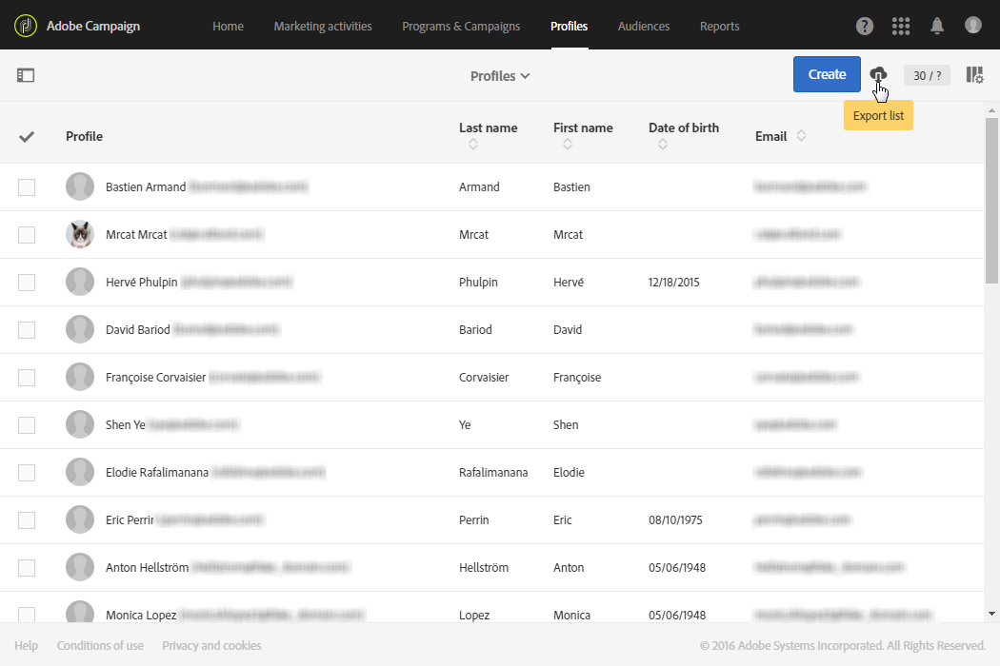

# 목록 내보내기{#exporting-lists}

Adobe Campaign을 사용하면 나중에 사용할 수 있도록 목록을 파일로 바로 내보낼 수 있습니다. 파일의 목록을 내보내면 **[!UICONTROL Export audits]** 메뉴에서 로그 항목이 생성됩니다. 감사 내보내기에 대한 자세한 내용은 [감사 내보내기](../../administration/using/auditing-export-logs.md) 섹션을 참조하십시오.

The export list option allows you to export a maximum of 100,000 lines by default and defined by the **Nms_ExportListLimit** option. This option can be managed by the functional administrator, under the **[!UICONTROL Administration]** > **[!UICONTROL Application settings]** > **[!UICONTROL Options]** menu.

목록 **보기가 있는 사용자는** 역할 **[!UICONTROL EXPORT (export)]** 이 있는 모든 화면에서 내보내기 목록을 사용할 수 있습니다.

1. 선택한 목록 **화면으로** 이동합니다. 예를 들어 테스트 프로필 개요 화면( **[!UICONTROL Profiles & audiences]** > **[!UICONTROL Test profiles]** )을 선택합니다.
1. 화면이 목록 **모드인지** 확인합니다.

   

1. 오른쪽 상단 모서리의 단추를 사용하여 내보낼 순서대로 목록의 열을 **[!UICONTROL Configure list]** 구성합니다. 구성된 열 외에도 리소스의 기본 키도 내보내집니다.
1. 원하는 경우 필터를 적용할 수 있습니다. 이렇게 하려면 왼쪽 상단 모서리의 단추를 클릭하여 검색 창을 표시합니다.

   다른 리소스가 포함된 목록에서 내보내기를 수행하는 경우 목록에 리소스 유형만 표시되도록 필터를 적용해야 합니다.

1. 원하는 경우 선택한 열을 정렬합니다.
1. 내보내기 단추를 선택합니다 .

   팝업이 표시되어 내보내기를 확인합니다. 내보내기를 확인한 파일은 컴퓨터에 자동으로 다운로드됩니다.

이 파일은 .TXT 확장명을 가진 CSV 형식으로 생성됩니다. 내보낸 리소스 및 내보내기 날짜에 따라 이름이 지정됩니다. 예:profileBase_20150426_120253.txt라는 이름의 프로필 내보내기가 2015년 4월 26일 12:02:53에 적용됩니다. UTF-8 형식으로 인코딩됩니다.

숫자 값과 날짜는 내보내기를 수행하는 사용자의 현지 시간(로케일)을 고려합니다. 예:DD-MM-YYYY 또는 MM-DD-YYYY.

이보다 큰 내보내기를 수행하려면 전용 워크플로우를 만들어야 합니다. Extract [파일](../../automating/using/extract-file.md) 섹션을 참조하십시오.

**예제**

다음 예는 아래에 정의된 프로필 목록에서 수행된 내보내기입니다.

* 표시되는 열(순서):성, 이름, 생년월일, 이메일 주소.
* 이름은 사전순으로 정렬됩니다.



생성된 파일은 처음 10개의 레코드에 대해 다음과 같이 표시됩니다.

```
Last name;First name;Birth date;Email;Zip code
Abalo;Patrick;11/11/1941 02:00:00;patrick.a@testmail.com;29200
Abasq;Joel;21/08/1977 02:00:00;abasq.joel@testmail.com;92160
Abernot;John;12/07/1963 01:00:00;john.abernot@testmail.com;78510
Abiven;Christian;16/03/1975 01:00:00;chris.a@mailtest.com;35000
Abouvier;Peter;02/07/1975 01:00:00;pabouvier@mailtest.com;94560
Accardi;Mike;22/06/1948 01:00:00;mike.accardi@mail.com;76400
Accremont;Frank;27/04/1947 01:00:00;accr.frank@mailtest.com;13500
Adam;Daniel;17/09/1953 01:00:00;danieladam@mail.com;17000
Adama;Pascal;22/01/1990 01:00:00;adapascal@mailtest.com;75012
Adama;Henry;22/09/1992 02:00:00;henry.adama@mail.com;64120
```

**관련 항목:**

* [역할](../../administration/using/list-of-roles.md)
* [목록 사용자 지정](../../start/using/customizing-lists.md)
* [목록 비디오 구성](https://docs.adobe.com/content/help/en/campaign-learn/campaign-standard-tutorials/getting-started/configure-a-list.html)
