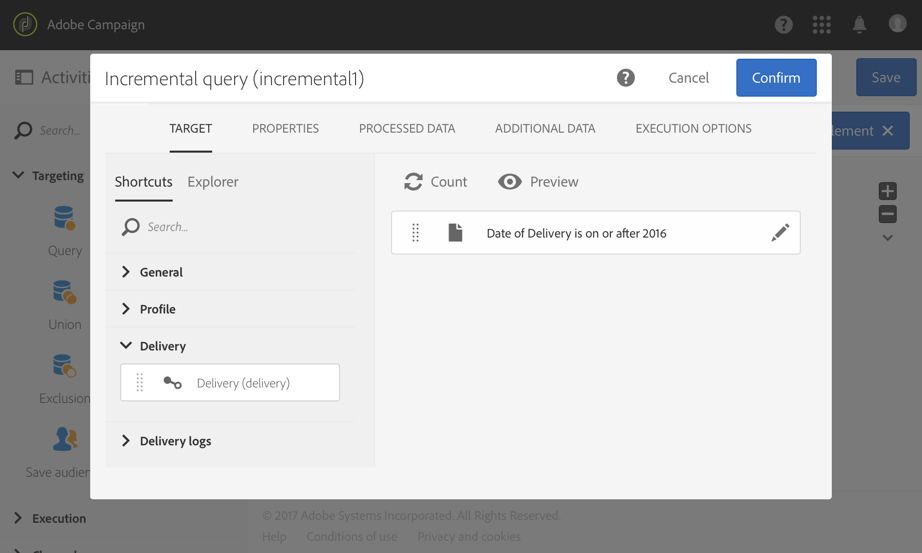
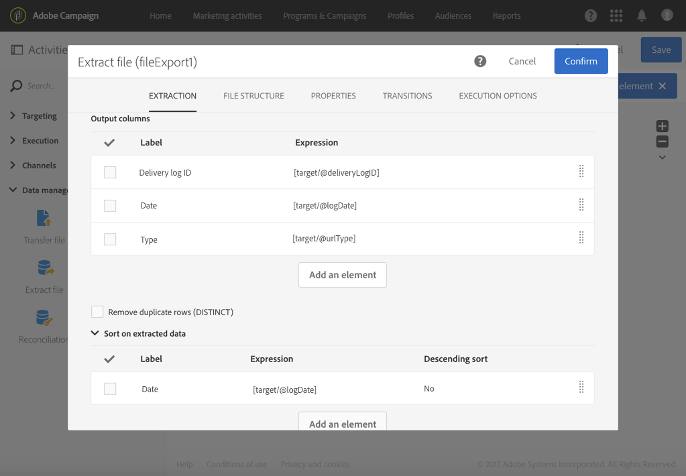

# 로그 내보내기{#exporting-logs}

게재 또는 구독과 관련된 로그 데이터는 간단한 워크플로우를 통해 내보낼 수 있습니다. 이를 통해 자체 보고 또는 BI 도구에서 캠페인 결과를 분석할 수 있습니다.

>[!CAUTION]
>
>기능만 [관리자](../../administration/using/users-management.md#functional-administrators), 포함 **[!UICONTROL Administration]** 역할 및 액세스 권한 **모두** 장치는 전송 로그, 메시지 로그, 추적 로그, 제외 또는 구독 로그에 액세스할 수 있습니다. 관리자가 아닌 사용자는 이러한 로그를 타깃팅할 수 있지만 연결된 테이블(프로필, 게재)에서 시작합니다.

를 사용하여 **[!UICONTROL Incremental query]** 즉, 워크플로우를 실행할 때마다 새 로그만 검색하고 **[!UICONTROL Extract file]** 활동은 출력 열을 정의하기 위해 형식이 포함된 파일과 필요한 모든 데이터를 가져올 수 있습니다. 그런 다음 를 사용합니다. **[!UICONTROL Transfer file]** 활동을 통해 최종 파일을 검색합니다. 각 워크플로우 실행은 다음에 의해 계획됩니다. **[!UICONTROL Scheduler]**.

표준 사용자는 로그 내보내기 작업을 수행할 수 있습니다. broadlogs, 추적 로그, 제외 로그 구독 로그 및 구독 기록 로그와 같은 비공개 리소스 **프로필** 기능 관리자만 관리할 수 있습니다.

1. 다음에 자세히 설명된 대로 새 워크플로우 만들기 [이 섹션](../../automating/using/building-a-workflow.md#creating-a-workflow).
1. 추가 **[!UICONTROL Scheduler]** 활동을 수행하고 필요에 따라 설정합니다. 다음은 월별 실행의 예입니다.

   

1. 추가 **[!UICONTROL Incremental query]** 활동을 수행하고 필요한 로그를 선택하도록 구성합니다. 예를 들어 모든 새 브로드로그 또는 업데이트된 브로드로그(프로필 게재 로그)를 선택하려면 다음을 수행하십시오.

   * 다음에서 **[!UICONTROL Properties]** 탭, 대상 리소스를 다음으로 변경 **게재 로그** (broadLogRcp).

      

   * 다음에서 **[!UICONTROL Target]** 탭에서 2016년 또는 그 이후에 전송된 게재에 해당하는 모든 게재 로그를 검색하는 조건을 설정합니다. 자세한 내용은 [쿼리 편집](../../automating/using/editing-queries.md#creating-queries) 섹션.

      

   * 다음에서 **[!UICONTROL Processed data]** 탭, 선택 **[!UICONTROL Use a date field]** 및 선택 **마지막 수정일** 필드. 워크플로우의 다음 실행에서는 마지막 실행 후에 수정되거나 만들어지는 로그만 검색됩니다.

      

      워크플로우가 처음 실행된 후 다음 실행에 사용될 마지막 실행 날짜를 이 탭에서 확인할 수 있습니다. 워크플로우가 실행될 때마다 자동으로 업데이트됩니다. 필요에 맞게 새 값을 수동으로 입력하여 이 값을 재정의할 수 있습니다.

1. 추가 **[!UICONTROL Extract file]** 파일에서 쿼리된 데이터를 내보내는 활동:

   * 다음에서 **[!UICONTROL Extraction]** 탭에서 파일 이름을 지정합니다.

      을(를) 선택하는 경우 **[!UICONTROL Add date and time to the file name]** 이 옵션을 선택하면 추출된 모든 파일이 고유하도록 내보내기 날짜에 이 이름이 자동으로 완료됩니다. 파일에서 내보낼 열을 선택합니다. 게재 또는 프로필 정보와 같은 관련 리소스에서 가져온 데이터를 여기에서 선택할 수 있습니다.

      >[!NOTE]
      >
      >각 로그에 대한 고유 식별자를 내보내려면 **[!UICONTROL Delivery log ID]** 요소를 생성하지 않습니다.

      최종 파일을 구성하려면 정렬을 적용할 수 있습니다. 예를 들어 아래 예와 같이 로그 날짜에서 를 볼 수 있습니다.

      

   * 다음에서 **[!UICONTROL File structure]** 탭에서 필요에 맞게 출력 파일의 형식을 정의합니다.

      열거형 값을 내보낼 경우 **[!UICONTROL Export labels instead of internal values of enumerations]** 옵션을 선택합니다. 이 옵션을 사용하면 ID 대신 이해하기 쉬운 짧은 레이블을 검색할 수 있습니다.

1. 추가 **[!UICONTROL Transfer file]** 활동을 수행하고 새로 만든 파일을 Adobe Campaign 서버에서 액세스할 수 있는 다른 위치(예: SFTP 서버)로 전송하도록 구성합니다.

   * 다음에서 **[!UICONTROL General]** 탭, 선택 **[!UICONTROL File upload]** 목적은 Adobe Campaign에서 다른 서버로 파일을 보내는 것입니다.
   * 다음에서 **[!UICONTROL Protocol]** 탭에서 전송 매개 변수를 지정하고 [외부 계정](../../administration/using/external-accounts.md#creating-an-external-account) 사용할 수 있습니다.

1. 추가 **[!UICONTROL End]** 활동을 사용하여 워크플로우가 제대로 종료되고 저장되는지 확인합니다.

   

이제 워크플로우를 실행하고 외부 서버에서 출력 파일을 검색할 수 있습니다.

**관련 항목:**

[워크플로](../../automating/using/get-started-workflows.md)
