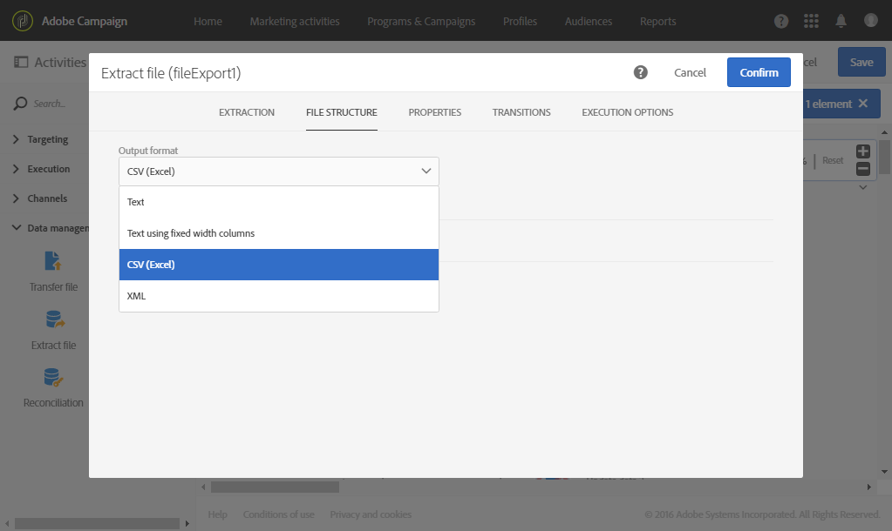

# 외부 파일에서 프로필 내보내기 {#exporting-profiles-external-file}

다음 예제에서는 **[!UICONTROL Query]** 활동 뒤에 **[!UICONTROL Extract file]** 활동을 구성하는 방법을 보여줍니다.

이 워크플로우의 목적은 프로필 목록을 외부 파일 형태로 내보내 Adobe Campaign 외부에서 데이터를 사용할 수 있도록 하는 것입니다.

1. [Extract 파일](../../automating/using/extract-file.md) 활동을 워크플로우로 드래그하여 놓은 다음 [쿼리](../../automating/using/query.md) 활동 뒤에 놓습니다.

   이 예제에서 쿼리는 18~30세의 모든 프로필에 대해 수행됩니다.

1. 편집하려면 **[!UICONTROL Extract file]** 활동을 엽니다.
1. 출력 파일의 이름을 지정합니다.
1. 출력 열을 추가합니다.

   이 예제에서는 프로필의 이메일, 나이, 생년월일, 이름 및 성을 출력 열로 추가합니다.

   

1. **[!UICONTROL File structure]** 탭을 클릭하여 다음을 정의합니다.

   * CSV 출력 포맷

      

   * 날짜 포맷

      

1. 활동을 확인합니다.
1. **[!UICONTROL Extract file]** 활동 뒤에 [전송 파일](../../automating/using/transfer-file.md) 활동을 드래그하여 놓아 외부 계정에서 추출 파일을 복구합니다.
1. 활동을 열고 **[!UICONTROL File upload]** 작업을 선택합니다.

   

1. 외부 계정을 선택하고 서버의 폴더 경로를 입력합니다.

   

1. 활동을 확인하고 워크플로우를 저장합니다.
1. 워크플로우를 시작합니다.

   워크플로우가 올바르게 실행되면 추출한 파일을 외부 계정에서 사용할 수 있습니다.
