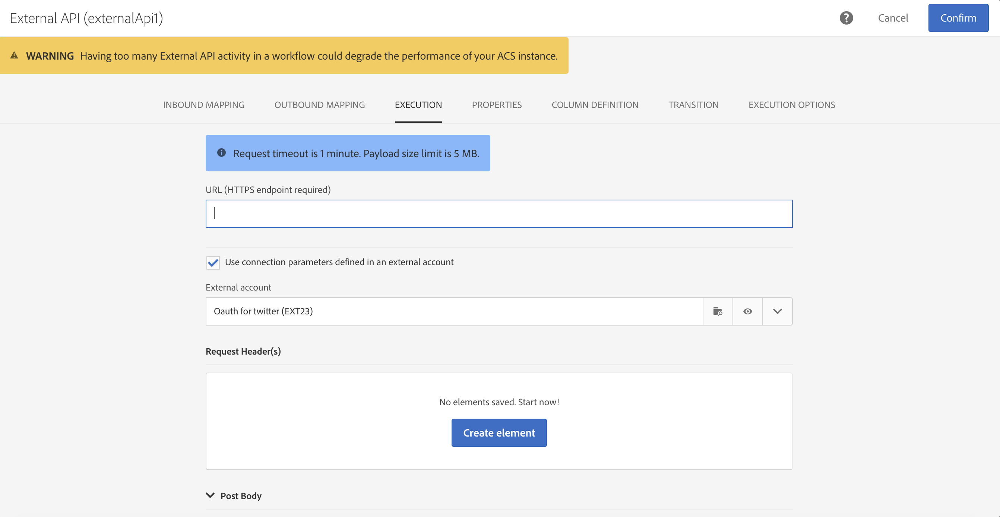

# 외부 API {#external-api}

## 설명 {#description}

이 **[!UICONTROL External API]**활동은 REST API 호출을 통해**&#x200B;외부 시스템에서&#x200B;**워크플로우로 데이터를**&#x200B;가져옵니다&#x200B;**.

REST 끝점은 고객 관리 시스템, Adobe I/O [런타임](https://www.adobe.io/apis/experienceplatform/runtime.html) 인스턴스 또는 Experience Cloud REST 끝점(데이터 플랫폼, Target, Analytics, Campaign 등)이 될 수 있습니다.

>[!NOTE]
>
>보안상의 이유로 JSSP의 사용은 캠페인 표준에서 지원되지 않습니다. 코드를 실행해야 하는 경우 외부 API 활동을 통해 Adobe I/O 런타임 인스턴스를 호출할 수 있습니다.

>[!IMPORTANT]
>
>이 기능은 현재 베타 버전입니다. 외부 API 활동 사용을 시작하기 전에 사용 계약에 동의해야 합니다. 이 베타 기능은 아직 Adobe에서 시판되지 않았기 때문에 Adobe Client Care에서 지원하지 않을 수 있으며 오류가 포함되어 있을 수 있으며 다른 릴리스된 기능뿐만 아니라 작동하지 않을 수 있습니다.

이 활동의 주요 특징은 다음과 같습니다.

* JSON 형식의 데이터를 타사 REST API 끝점에 전달
* JSON 응답을 다시 수신하여 출력 표에 매핑하고 다운스트림을 다른 워크플로우 활동에 전달할 수 있는 기능
* 아웃바운드 특정 전환을 통한 오류 관리

이 활동에는 다음과 같은 가드레일이 이미 준비되어 있습니다.

* 5MB http 응답 데이터 크기 제한
* 요청 제한 시간은 60초입니다.
* HTTP 리디렉션이 허용되지 않음
* HTTPS가 아닌 URL이 거부됨
* &quot;수락:application/json&quot; 요청 헤더와 &quot;Content-Type:application/json&quot; 응답 헤더가 허용됩니다.

>[!CAUTION]
>
>활동은 캠페인 전체 데이터(최신 오퍼 집합, 최신 점수 등)를 가져오기 위한 것입니다. 많은 양의 데이터가 전송될 수 있으므로 각 프로필에 대한 특정 정보를 검색하는 것이 아닙니다. 사용 사례에 필요한 경우 파일 전송 [활동을 사용하는 것이 좋습니다](../../automating/using/transfer-file.md) .

## 구성 {#configuration}

작업을 워크플로우로 드래그하여 놓고 활동을 열어 구성을 시작합니다. **[!UICONTROL External API]**

### 인바운드 매핑

인바운드 매핑은 UI에서 JSON으로 표시되고 전송될 이전 인바운드 활동으로 생성된 임시 테이블입니다.
사용자는 이 임시 테이블을 기반으로 인바운드 데이터를 수정할 수 있습니다.

인바운드 **리소스** 드롭다운을 사용하여 임시 테이블을 만들 쿼리 활동을 선택할 수 있습니다.

카운트 **매개 변수** 추가 확인란은 임시 테이블에서 나오는 각 행에 대한 카운트 값이 됩니다. 이 확인란은 인바운드 활동이 임시 테이블을 생성하는 경우에만 사용할 수 있습니다.

인바운드 **열** 섹션에서는 인바운드 전환 테이블에서 필드를 추가할 수 있습니다. 선택한 열이 데이터 개체의 키가 됩니다. JSON의 데이터 개체는 인바운드 전환 테이블의 각 행에서 선택한 열에 대한 데이터가 포함된 배열 목록이 됩니다.

매개 변수 **사용자 지정** 텍스트 상자를 사용하면 외부 API에 필요한 추가 데이터가 포함된 유효한 JSON을 추가할 수 있습니다. 이 추가 데이터는 생성된 JSON의 params 개체에 추가됩니다.

### 아웃바운드 매핑

이 탭에서는 API 호출에서 **반환되는 샘플 JSON 구조를** 정의할 수 있습니다.

JSON 구조 패턴은 다음과 같습니다. `{“data”:[{“key”:“value”}, {“key”:“value”},...]}`

샘플 JSON 정의에는 **다음 특성이**&#x200B;있어야 합니다.

* **data** is a mandatory property name in the JSON, the content of &quot;data&quot; is a JSON array.
* **배열 요소에는** 첫 번째 수준 속성이 포함되어야 합니다(더 깊은 수준은 지원되지 않음).
   **속성 이름은** 출력 임시 테이블의 출력 스키마에 대한 열 이름이 됩니다.
* **열 이름** 정의는 &quot;data&quot; 배열의 첫 번째 요소를 기반으로 합니다.
열 정의(추가/제거) 및 속성 유형 값을 열 정의 **탭에서 편집할 수** 있습니다.

구문 **분석이 유효하다면** 메시지가 나타나고 &quot;열 정의&quot; 탭에서 데이터 매핑을 사용자 정의할 수 있도록 초대합니다. 다른 경우 오류 메시지가 표시됩니다.

### 실행

이 탭에서는 ACS로 데이터를 **전송할** HTTPS 끝점을 정의할 수 있습니다. 필요한 경우 아래 필드에 인증 정보를 입력할 수 있습니다.

### 속성

이 탭에서는 UI에 표시된 레이블과 같은 외부 API 활동에 대한 **일반 속성을** 제어할 수 있습니다. 내부 ID를 사용자 정의할 수 없습니다.

### 열 정의

>[!NOTE]
>
>이 탭은 [아웃바운드 매핑] 탭에서 **응답 데이터 형식을** 완료하고 유효성을 검사할 때 나타납니다.

열 **정의** 탭을 사용하면 오류가 없는 데이터를 가져오고 향후 작업을 위해 Adobe Campaign 데이터베이스에 이미 있는 유형과 일치하도록 각 열의 데이터 구조를 정확하게 지정할 수 있습니다.

예를 들어 열의 레이블을 변경하고 해당 유형(문자열, 정수, 날짜 등)을 선택할 수 있습니다. 오류 처리를 지정할 수도 있습니다.

자세한 내용은 파일 [로드 섹션을 참조하십시오](../../automating/using/load-file.md) .

### 전환

이 탭에서는 **아웃바운드 전환** 및 해당 레이블을 활성화할 수 있습니다. 이 특정 전환은 **시간** 초과나 페이로드가 **데이터 크기 제한을**&#x200B;초과하는 경우 유용합니다.

### 실행 옵션

이 탭은 대부분의 워크플로우 활동에서 사용할 수 있습니다. 자세한 내용은 활동 [속성](../../automating/using/executing-a-workflow.md#activity-properties) 섹션을 참조하십시오.

## 문제 해결

이 새로운 워크플로우 활동에 추가된 로그 메시지 유형은 다음과 같습니다.정보 및 오류. 잠재적인 문제를 해결하는 데 도움이 될 수 있습니다.

### 정보

이러한 로그 메시지는 워크플로우 활동을 실행하는 동안 유용한 체크포인트에 대한 정보를 기록하는 데 사용됩니다. 특히, 다음 로그 메시지는 API에 액세스하기 위한 첫 번째 시도와 첫 번째 시도가 실패한 원인 등의 이유로 기록되는 데 사용됩니다.

<table> 
 <thead> 
  <tr> 
   <th> 메시지 형식  </th> 
   <th> 예  </th> 
  </tr> 
 </thead> 
 <tbody> 
  <tr> 
   <td> API URL '%s'을(를) 호출하는 중입니다.</td> 
   <td> 
API URL 'https://example.com/api/v1/web-coupon?count=2'을 호출합니다.
</td> 
  </tr> 
  <tr> 
   <td> API URL '%s'을(를) 다시 시도하고 있습니다. 이전 시도가 실패했습니다('%s').</td> 
   <td> 
API URL을 다시 시도하는 중 'https://example.com/api/v1/web-coupon?count=2', 이전 시도가 실패했습니다('HTTP - 401').
</td>
  </tr> 
  <tr> 
   <td> '%s'(%s / %s)에서 컨텐츠를 전송하는 중입니다.</td> 
   <td> 
'https://example.com/api/v1/web-coupon?count=2'(1234 / 1234)에서 내용 전송.
</td> 
  </tr>
 </tbody> 
</table>

### 오류

이러한 로그 메시지는 예기치 않은 오류 상태에 대한 정보를 기록하는 데 사용되며, 이로 인해 워크플로우 활동이 실패할 수 있습니다.

<table> 
 <thead> 
  <tr> 
   <th> 코드 - 메시지 형식  </th> 
   <th> 예  </th> 
  </tr> 
 </thead> 
 <tbody> 
  <tr> 
   <td> WKF-560250 - API 요청 본문이 한도 초과(제한:'%d').</td> 
   <td> 
API 요청 본문이 한도를 초과했습니다(제한:'5242880').
</td> 
  </tr> 
  <tr> 
   <td> WKF-560239 - API 응답 초과 제한(제한:'%d').</td> 
   <td> 
API 응답이 제한(제한:5242880').
</td> 
  </tr> 
  <tr> 
   <td> WKF-560245 - API URL을 구문 분석할 수 없습니다(오류:'%d').</td> 
   <td> 
API URL을 구문 분석할 수 없습니다(오류:'-2010').

   
 참고:이 오류는 API URL이 유효성 검사 규칙에 실패할 때 기록됩니다.
</td>
  </tr> 
  <tr>
   <td> WKF-560244 - API URL 호스트는 'localhost' 또는 IP 주소 리터럴(URL 호스트:'%s').</td> 
   <td> 
API URL 호스트는 'localhost' 또는 IP 주소 리터럴(URL 호스트:'localhost').

    
API URL 호스트는 'localhost' 또는 IP 주소 리터럴(URL 호스트:'192.168.0.5').

    
API URL 호스트는 'localhost' 또는 IP 주소 리터럴(URL 호스트:'[2001]').
</td>
  </tr> 
  <tr> 
   <td> WKF-560238 - API URL은 보안 URL(https)(요청된 URL:'%s').</td> 
   <td> 
API URL은 보안 URL(https)(요청된 URL:'https://example.com/api/v1/web-coupon?count=2').
</td> 
  </tr> 
  <tr> 
   <td> WKF-560249 - 요청 본문 JSON을 만들지 못했습니다. '%s'을(를) 추가하는 동안 오류가 발생했습니다.</td> 
   <td> 
요청 본문 JSON을 만들지 못했습니다. 'params'를 추가하는 동안 오류가 발생했습니다.

    
요청 본문 JSON을 만들지 못했습니다. 'data'를 추가하는 동안 오류가 발생했습니다.
</td>
  </tr> 
  <tr> 
   <td> WKF-560246 - HTTP 헤더 키가 잘못되었습니다(헤더 키:'%s').</td> 
   <td> 
HTTP 헤더 키가 잘못되었습니다(헤더 키:'%s').

   
 참고:이 오류는 사용자 지정 헤더 키가 RFC에 따라 유효성 검사에 실패할 때 <a href="https://tools.ietf.org/html/rfc7230#section-3.2.html">기록됩니다</a>
</td> 
  </tr>
 <tr> 
   <td> WKF-560248 - HTTP 헤더 키가 허용되지 않음(헤더 키:'%s').</td> 
   <td> 
HTTP 헤더 키가 허용되지 않음(헤더 키:수락).
</td> 
  </tr> 
  <tr> 
   <td> WKF-560247 - AHTTP 헤더 값이 잘못되었습니다(헤더 값:'%s').</td> 
   <td> 
HTTP 헤더 값이 잘못되었습니다(헤더 값:'%s'). 

    
참고:이 오류는 사용자 지정 헤더 값이 RFC에 따라 유효성 검사에 실패할 때 <a href="https://tools.ietf.org/html/rfc7230#section-3.2.html">기록됩니다</a>
</td> 
  </tr> 
  <tr> 
   <td> WKF-560240 - JSON 페이로드에 잘못된 속성 '%s'이(가) 있습니다.</td> 
   <td> 
JSON 페이로드에 잘못된 속성 'blah'가 있습니다.
</td>
  </tr> 
  <tr>
   <td> WKF-560241 - 잘못된 형식의 JSON 또는 허용되지 않는 형식</td> 
   <td> 
형식이 잘못된 JSON 또는 허용되지 않는 형식입니다.

   
참고:이 메시지는 외부 API의 응답 본문을 구문 분석하는 경우에만 적용되며, 응답 본문이 이 활동에서 지정한 JSON 형식을 준수하는지 확인하려고 할 때 기록됩니다.
</td>
  </tr>
  <tr> 
   <td> WKF-560246 - 활동이 실패했습니다(원인:'%s').</td> 
   <td> 
HTTP 401 오류 응답으로 인해 활동이 실패하는 경우 - 활동이 실패했습니다(원인:'HTTP - 401')

        
내부 호출 실패로 인해 활동이 실패하는 경우 - 활동이 실패했습니다(이유:'Rc - -Nn').

        
잘못된 콘텐츠 형식 헤더로 인해 활동이 실패하는 경우. - 활동 실패(이유:'Content-Type - application/html').
</td> 
  </tr>
 </tbody> 
</table>

<!--
## Example: Managing coupons with External API Activity

This example illustrates how to **add coupon value** retrieving by a REST call to profiles and then sending an email containing these coupon values.

The workflow is presented as follows:

1. Drag and drop an **External API** activity
    1. Parse the JSON sample responsa as {"data":[{"code":"value"}]}.
    1. Add the **Rest endpoint URL** and define authentication setting if needed
    
    1. In the **column definition** tab, add a new column called **code** that will store the code value.
        
    1. Enabled an **outbound transition** to manage request failures.
1. Drag and drop a **Query** activity
    1. Configure the **Target** tab to query all the **@adobe.com** email. For different Query samples, refer to the [Query](../../automating/using/query.md) section.
    1. In the **additional data** tab, add a new column based on **rowId()** function. This additional column allows you to reconciliate coupon code with the profile ID..
        

        >[!NOTE]
        >
        >This reconciliation approach means that the profile query number is equal to the number of coupon values returned by the REST call.
1. Once this two activities are configured, drag and drop an **Enrichment** activity to associate coupon values with profiles.
    1. Select the previous Query activity in the **primarySet** field.
        
    1. Create a new relation in the **Advanced relations** tab, and add the following reconciliation criteria:
    1. **@expr1** coming grom the Query activity in the source expression field.
    1. **@lineNum** as an expression that returns the line number for each coupon value in the destination field.
        
        More information on the enrichment activity are available [here](../../automating/using/enrichment.md)

    1. The transition **Data Structure** will contain:
        
1. Finally drag and drop a **Send via Email** activity.
    You can modify your email template by adding the **code** personnalized field.

-->
