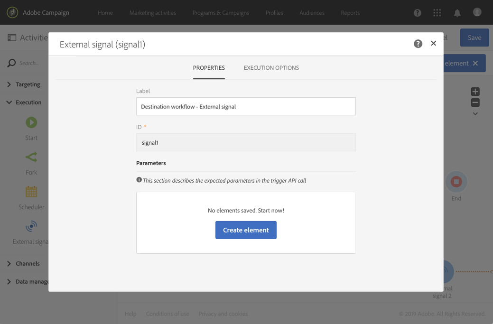

# 외부 신호{#external-signal}

## 설명 {#description}

**[!UICONTROL External signal]** 활동은 다른 워크플로우 또는 REST API 호출에서 일부 조건이 성공적으로 충족되면 워크플로우를 트리거합니다.

## 사용의 컨텍스트 {#context-of-use}

**[!UICONTROL External signal]** 활동은 동일한 고객 여정의 일부인 다른 프로세스를 다른 워크플로우로 구성하고 오케스트레이션하는 데 사용됩니다. 한 워크플로우를 다른 워크플로우에서 시작할 수 있게 하여 더 복잡한 고객 여정을 지원하는 동시에 문제가 발생하는 경우 보다 효과적으로 모니터링하고 대응할 수 있습니다.

**[!UICONTROL External signal]** 활동은 워크플로우의 첫 번째 활동으로 배치되도록 디자인됩니다. 다른 워크플로우의 **[!UICONTROL End]** 활동이나 REST API 호출에서 트리거될 수 있습니다(자세한 내용은 [API 설명서](../../api/using/triggering-a-signal-activity.md) 참조).

트리거되면 외부 매개 변수를 정의할 수 있으며 워크플로우 이벤트 변수에서 사용할 수 있습니다. [이 섹션](../../automating/using/calling-a-workflow-with-external-parameters.md)에 외부 매개 변수를 사용하는 워크플로우를 호출하는 프로세스가 자세히 설명되어 있습니다.

>[!NOTE]
>
>활동은 매 10분보다 더 자주 트리거될 수 없습니다.

**[!UICONTROL External signal]** 활동은 여러 다른 이벤트에서 트리거될 수 있습니다. 이 경우 소스 워크플로우 또는 API 호출 중 하나가 실행되는 즉시 **[!UICONTROL External signal]**&#x200B;이(가) 트리거됩니다. 모든 소스 워크플로우가 완료되지 않아도 됩니다.

**관련 항목**

* [사용 사례:외부 신호 활동 및 데이터 가져오기](../../automating/using/external-signal-data-import.md).
* [사용 사례:외부 매개 변수를 사용하여 파일에서 대상을 만들기 위한 워크플로우 호출](../../automating/using/use-case-calling-workflow.md)

## 구성 {#configuration}

외부 신호를 구성할 때는 먼저 대상 워크플로우에서 **[!UICONTROL External signal]** 활동을 구성해야 합니다. 이 구성이 완료되면 이 워크플로우의 **[!UICONTROL External signal]** 활동을 사용하여 소스 워크플로우의 **[!UICONTROL End]** 활동을 구성할 수 있습니다.

1. **[!UICONTROL External signal]** 활동을 대상 워크플로우로 끌어서 놓습니다.
1. 활동을 선택한 다음 나타나는 빠른 작업에서  버튼을 사용하여 활동을 엽니다.
1. 활동의 레이블을 편집합니다. 이 레이블은 **[!UICONTROL External signal]**&#x200B;을(를) 트리거하는 소스 워크플로우를 구성할 때 필요합니다.

   매개 변수를 사용하여 워크플로우를 호출하려면 **[!UICONTROL Parameters]** 영역을 사용하여 선언합니다. 자세한 정보는 이 [페이지](../../automating/using/declaring-parameters-external-signal.md)를 참조하십시오.

   

1. 활동 구성을 확인하고 필요한 다른 활동을 추가한 후 워크플로우를 저장합니다.

   >[!NOTE]
   >
   >다른 워크플로우에서 대상 워크플로우를 트리거하려면 다음 단계를 계속 진행합니다. REST API 호출에서 대상 워크플로우를 트리거하려면 [API 설명서](../../api/using/triggering-a-signal-activity.md)를 참조하여 자세한 내용을 확인합니다.

1. 소스 워크플로우를 열고 **[!UICONTROL End]** 활동을 선택합니다. 사용 가능한 **[!UICONTROL End]** 활동이 없는 경우, 워크플로우 분기의 마지막 활동 다음에 활동을 추가합니다.

   기본적으로 아웃바운드 전환이 없는 활동도 있습니다. 이러한 활동의 **[!UICONTROL Properties]** 탭에서 아웃바운드 전환을 추가할 수 있습니다.

   예를 들어 **[!UICONTROL Update data]** 활동에서 **[!UICONTROL Transitions]** 탭으로 이동하여 **[!UICONTROL Add an outbound transition without the population]** 옵션을 선택합니다. 이 옵션을 사용하면 데이터가 포함되지 않고 시스템에서 불필요한 공간을 사용하지 않는 전환을 추가할 수 있습니다. 대상 워크플로우를 트리거하는 추가 **[!UICONTROL End]** 활동을 연결하는 데 사용됩니다.

   

1. **[!UICONTROL End]** 활동의 **[!UICONTROL External signal]** 탭에서 대상 워크플로우뿐만 아니라 해당 워크플로우 내에서 트리거할 **[!UICONTROL External signal]** 활동을 선택합니다.

   다른 워크플로우를 트리거하는 **[!UICONTROL End]** 활동을 설정하면 해당 아이콘이 추가 신호 심벌로 업데이트됩니다.

   매개 변수를 사용하여 워크플로우를 호출하려면 **[!UICONTROL Parameters and values]** 영역을 사용합니다. 자세한 정보는 이 [페이지](../../automating/using/defining-parameters-calling-workflow.md)를 참조하십시오.

   

1. 소스 워크플로우를 저장합니다.

소스 워크플로우 또는 REST API 호출의 **[!UICONTROL End]** 활동이 실행되면 대상 워크플로우는 **[!UICONTROL External signal]** 활동에서 자동으로 트리거됩니다.

>[!NOTE]
>
>대상 워크플로우를 트리거하려면 먼저 수동으로 시작해야 합니다. 시작되면 **[!UICONTROL External activity]**&#x200B;가 활성화되고 소스 워크플로우의 신호를 기다립니다.
