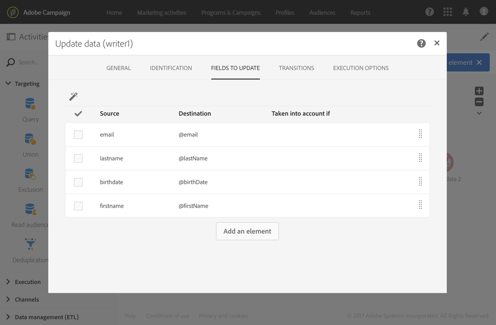

# 데이터 가져오기{#importing-data}

## 데이터 수집 {#collecting-data}

파일에서 데이터를 수집하여 처리하고 Adobe Campaign 데이터베이스에서 가져올 수 있습니다.

* 이 **[!UICONTROL Load file]**활동을 사용하면 Adobe Campaign에서 이 데이터를 사용하기 위해 구조화된 하나의 양식으로 데이터를 가져올 수 있습니다. 데이터를 일시적으로 가져오며 Adobe Campaign 데이터베이스에 통합하려면 다른 활동이 필요합니다.
* 이 **[!UICONTROL Transfer file]**활동을 통해 파일을 수신하거나 보내고, 파일이 있는지 테스트하거나, Adobe Campaign에 파일을 나열할 수 있습니다.

   외부 소스에서 파일을 검색해야 하는 **[!UICONTROL Load file]**경우에 대비해 이 활동을 먼저 사용할 수 있습니다.

## 가져오기 모범 사례 {#import-best-practices}

아래 설명된 몇 가지 간단한 규칙을 주의하여 따르면 데이터베이스 내에서 데이터 일관성을 유지하고 데이터베이스 업데이트나 데이터 내보내기 중 일반적인 오류를 방지하는 데 많은 도움이 됩니다.

### 가져오기 템플릿 사용 {#using-import-templates}

대부분의 가져오기 작업 과정에는 다음 활동이 포함되어야 합니다. **[!UICONTROL Load file]****[!UICONTROL Reconciliation]**, **[!UICONTROL Segmentation]****[!UICONTROL Deduplication]**, **[!UICONTROL Update data]**네.

가져오기 템플릿을 사용하면 유사한 가져오기를 손쉽게 준비하고 데이터베이스 내에서 데이터를 일관되게 유지할 수 있습니다.

많은 프로젝트에서 가져오기는 프로젝트에 사용된 파일에 중복이 없으므로 **[!UICONTROL Deduplication]**작업 없이 빌드됩니다. 서로 다른 파일을 가져올 때 중복이 표시되는 경우가 있습니다. 데이터 중복 제거는 매우 어렵습니다. 따라서 데이터 중복 제거 단계는 모든 가져오기 워크플로우에서 적절한 예방책입니다.

수신 데이터가 일관되고 올바르거나 IT 부서 또는 Adobe Campaign 감독자가 처리할 것이라고 가정할 때는 걱정하지 마십시오. 프로젝트 중에 데이터 정리를 염두에 두십시오. 데이터를 가져올 때 중복 제거, 조정 및 일관성을 유지할 수 있습니다.

데이터를 가져오기 위해 설계된 일반 워크플로우 템플릿의 예는 다음 [예제에서 사용할 수 있습니다.워크플로우 템플릿](#example--import-workflow-template) 섹션 가져오기

>[!NOTE]
>
>또한 [가져오기 템플릿을](../../automating/using/importing-data-with-import-templates.md)사용할 수도 있습니다. 관리자가 정의한 워크플로우 템플릿으로서, 활성화되면 가져올 데이터가 들어 있는 파일만 지정할 수 있습니다.

### 플랫 파일 포맷 사용 {#using-flat-file-formats}

가장 효율적인 가져오기 형식은 플랫 파일입니다. 플랫 파일은 데이터베이스 수준에서 일괄 모드로 가져올 수 있습니다.

예:

* 구분 문자:탭 또는 세미콜론
* 헤더가 있는 첫 번째 행
* 문자열 구분 기호 없음
* 날짜 형식:YYYY/MM/DD HH:mm:SS

가져올 파일의 예:

```
lastname;firstname;birthdate;email;crmID
Smith;Hayden;23/05/1989;hayden.smith@example.com;124365
Mars;Daniel;17/11/1987;dannymars@example.com;123545
Smith;Clara;08/02/1989;hayden.smith@example.com;124567
Durance;Allison;15/12/1978;allison.durance@example.com;120987
```

### 압축 사용 {#using-compression}

압축을 푼 파일을 가져와 내보낼 수 있습니다. GZIP은 기본적으로 지원됩니다. 파일을 가져올 때 또는 데이터를 추출할 때 **[!UICONTROL Load file]**및**[!UICONTROL Extract file]** 워크플로우 활동에서 각각 사전 처리를 추가할 수 있습니다.

### 델타 모드에서 가져오기 {#importing-in-delta-mode}

일반 가져오기는 델타 모드에서 수행해야 합니다. 즉, 수정되거나 새 데이터만 매번 전체 테이블이 아닌 Adobe Campaign으로 전송됩니다.

전체 가져오기는 초기 로드에만 사용해야 합니다.

### 일관성 유지 {#maintaining-consistency}

Adobe Campaign 데이터베이스에서 데이터 일관성을 유지하려면 아래 원칙을 따르십시오.

* 가져온 데이터가 Adobe Campaign의 참조 테이블과 일치하는 경우 워크플로우의 해당 테이블과 조정되어야 합니다. 일치하지 않는 레코드는 거부해야 합니다.
* 가져온 데이터가 항상 **&quot;표준화됨&quot;** (이메일, 전화 번호, DM 주소)이고 이 표준화가 안정적이며 수년 동안 변경되지 않아야 합니다. 이 경우 데이터베이스에 일부 중복 항목이 나타날 수 있으며 Adobe Campaign에서 &quot;퍼지&quot; 일치를 수행하는 도구를 제공하지 않으므로 이러한 중복 항목을 관리하고 제거하는 것은 매우 어렵습니다.
* 트랜잭션 데이터에는 조정 키가 있어야 하며 중복을 만들지 않도록 기존 데이터와 조정해야 합니다.
* **관련 파일을 순서대로**&#x200B;가져올 수 있습니다. 가져오기가 서로 의존하는 여러 파일로 구성된 경우 작업 과정에서는 파일을 올바른 순서로 가져왔는지 확인해야 합니다. 파일이 실패하면 다른 파일은 가져오지 않습니다.
* **데이터를 가져올 때 중복 제거**, 조정 및 일관성을 유지할 수 있습니다.

## 암호화된 데이터 관리 {#managing-encrypted-data}

경우에 따라 캠페인 서버를 가져오려는 데이터를 암호화해야 할 수 있습니다. 예를 들어 PII 데이터가 포함되어 있을 수 있습니다.

암호화된 파일을 가져오거나 내보내려면 Adobe 고객 지원 센터에 연락하여 필요한 암호화/암호 해독 명령을 인스턴스에 제공해야 합니다.

이렇게 하려면 다음을 나타내는 요청을 제출합니다.

* 명령을 사용하기 위해 캠페인 인터페이스에 표시되는 **레이블입니다** . 예: &quot;파일 암호화&quot;
* 인스턴스에 설치하는 **명령입니다** .
예를 들어 PGP를 사용하여 파일을 해독하려면 다음 명령을 사용합니다.

   ```
   <path-to_pgp_if-not_global_or_server/>pgp.exe --decrypt --input nl6/var/vp/import/filename.pgp --passphrase "your password" --recipient recipient @email.com --verbose --output nl6/var/vp/import/filename
   ```

요청이 처리되면 암호화/암호 해독 명령을 **!UICONTROL Pre-processing stage]** 필드 **[!UICONTROL Data loading (file)]**및**[!UICONTROL Extracting data (file)]** 활동의 필드에서 사용할 수 있습니다. 이러한 암호를 사용하여 가져오거나 내보낼 파일의 암호를 해독하거나 암호화할 수 있습니다.


## 예:워크플로우 템플릿 가져오기 {#example--import-workflow-template}

가져오기 템플릿을 사용하는 것은 구조가 동일한 파일을 정기적으로 가져와야 하는 경우에 가장 좋은 방법입니다.

이 예에서는 Adobe Campaign 데이터베이스의 CRM에서 가져오는 데 다시 사용할 수 있는 워크플로우를 사전 설정하는 방법을 보여줍니다.

1. 에서 새 워크플로우 템플릿을 **[!UICONTROL Resources > Templates > Workflow templates]**만듭니다.
1. 다음 활동을 추가합니다.

   * **[!UICONTROL Load file]**:가져올 데이터가 포함된 파일의 예상 구조를 정의합니다.

      >[!NOTE]
      >
      >단일 파일에서만 데이터를 가져올 수 있습니다. 워크플로우에 여러 **[!UICONTROL Load file]**활동이 있는 경우 매번 동일한 파일이 사용됩니다.

   * **[!UICONTROL Reconciliation]**:가져온 데이터를 데이터베이스 데이터와 조정합니다.
   * **[!UICONTROL Segmentation]**:조정 가능 여부에 따라 필터를 만들어 레코드를 다르게 처리합니다.
   * **[!UICONTROL Deduplication]**:데이터베이스에 삽입하기 전에 들어오는 파일에서 데이터를 중복 제거합니다.
   * **[!UICONTROL Update data]**:가져온 프로필로 데이터베이스를 업데이트합니다.
   

1. 활동을 **[!UICONTROL Load file]**구성합니다.

   * 샘플 파일을 업로드하여 예상 구조를 정의합니다. 샘플 파일에는 몇 줄만 포함하되 가져오는 데 필요한 모든 열이 포함되어야 합니다. 파일 형식을 확인하고 편집하여 각 열의 유형이 올바르게 설정되어 있는지 확인합니다.텍스트, 날짜, 정수 등 예:

      ```
      lastname;firstname;birthdate;email;crmID
      Smith;Hayden;23/05/1989;hayden.smith@mailtest.com;123456
      ```

   * 섹션에서 **[!UICONTROL File to load]**필드를**[!UICONTROL Upload a new file from the local machine]** 선택하고 비워 둡니다. 이 템플릿에서 새 워크플로우를 만들 때마다 정의된 구조에 해당하는 한 원하는 파일을 여기에서 지정할 수 있습니다.

      옵션을 사용할 수 있지만 그에 따라 템플릿을 수정해야 합니다. 예를 들어, 선택한 경우 FTP/SFTP **[!UICONTROL Use the file specified in the inbound transition]**서버에서 가져올 파일을 검색하기 전에**[!UICONTROL Transfer file]** 활동을 추가할 수 있습니다.

      사용자가 가져오는 동안 발생한 오류가 포함된 파일을 다운로드할 수 있도록 하려면 **[!UICONTROL Keep the rejects in a file]**옵션을 선택하고**[!UICONTROL File name]**&#x200B;을 지정합니다.

      

1. 활동을 **[!UICONTROL Reconciliation]**구성합니다. 이 컨텍스트에서 이 활동의 목적은 들어오는 데이터를 식별하는 것입니다.

   * 탭에서 가져온 데이터와 수신자 타깃팅 차원 사이의 링크를 **[!UICONTROL Relations]**선택하고 정의합니다(차원 및 리소스**[!UICONTROL Create element]** 타깃팅 참조 [](../../automating/using/query.md#targeting-dimensions-and-resources)). 이 예에서는 CRM **ID** 사용자 정의 필드를 사용하여 조인 조건을 만듭니다. 고유한 레코드를 식별할 수 있는 한 필요한 필드나 필드 조합을 사용합니다.
   * 탭에서 **[!UICONTROL Identification]****[!UICONTROL Identify the document from the working data]** 옵션을 선택 해제한 상태로 둡니다.
   

1. 한 전환에서 조정된 받는 사람과 조정할 수 없지만 두 번째 전환에서는 충분한 데이터가 있는 받는 사람을 검색할 **[!UICONTROL Segmentation]**활동을 구성합니다.

   조정된 받는 사람과의 전환을 사용하여 데이터베이스를 업데이트할 수 있습니다. 그러면 파일에서 최소 정보 세트를 사용할 수 있는 경우 알 수 없는 수신자가 있는 전환을 사용하여 데이터베이스에 새 수신자 항목을 만들 수 있습니다.

   조정할 수 없고 데이터가 충분하지 않은 수신자는 보정할 아웃바운드 전환에서 선택되며 별도의 파일로 내보내거나 무시하면 됩니다.

   * 활동의 **[!UICONTROL General]**탭에서 을**[!UICONTROL Resource type]** 다음으로 **[!UICONTROL Temporary resource]**설정하고 타깃팅된**[!UICONTROL Reconciliation]** 세트로 선택합니다.
   * 탭에서 데이터베이스에 레코드를 삽입할 수 없는 **[!UICONTROL Advanced options]****[!UICONTROL Generate complement]** 옵션을 확인합니다. 필요한 경우 추가 처리를 보완 데이터에 적용할 수 있습니다.파일 내보내기, 목록 업데이트 등
   * 탭의 첫 번째 세그먼트에서 인바운드 모집단에서 필터링 조건을 추가하여 프로필의 CRM ID가 0이 아닌 레코드만 선택합니다. **[!UICONTROL Segments]**이렇게 하면 데이터베이스의 프로파일과 조정된 파일의 데이터가 해당 하위 세트에서 선택됩니다.

      

   * 데이터베이스에 삽입할 충분한 데이터가 있는 미조정 레코드를 선택하는 두 번째 세그먼트를 추가합니다. 예:이메일 주소, 이름 및 성 조정되지 않은 레코드에는 프로필의 CRM ID 값이 0입니다.

      

   * 처음 두 개의 하위 세트에서 선택되지 않은 모든 레코드는 **[!UICONTROL Complement]**에서 선택됩니다.

1. 이전에 구성된 활동의 첫 번째 아웃바운드 전환 다음에 있는 **[!UICONTROL Update data]**활동을**[!UICONTROL Segmentation]** 구성합니다.

   * 인바운드 전환에는 데이터베이스에 이미 있는 수신자만 포함되므로 **[!UICONTROL Update]**으로**[!UICONTROL Operation type]** 선택합니다.
   * 이 **[!UICONTROL Identification]**탭에서 - 이 경우 프로필과**[!UICONTROL Using reconciliation criteria]** 활동에서 만든 링크 사이의 키를 **[!UICONTROL Dimension to update]****[!UICONTROL Reconciliation]** 선택하고 정의합니다. 이 예에서는 CRM **ID** 사용자 정의 필드가 사용됩니다.

      

   * 탭에서 **[!UICONTROL Fields to update]**프로파일 차원의 필드를 파일에서 해당 열의 값으로 업데이트할지 지정합니다. 파일 열 이름이 받는 사람 차원 필드의 이름과 동일하거나 거의 동일한 경우 자동 선택 단추를 사용하여 다른 필드를 자동으로 일치시킬 수 있습니다.

      

      >[!NOTE]
      >
      >이러한 프로필로 직접 메일을 보낼 계획이라면 이 정보가 다이렉트 메일 제공업체에 필수이므로 우편 주소를 포함해야 합니다. 또한 프로필 정보에 있는 **[!UICONTROL Address specified]**상자가 선택되어 있는지 확인합니다. 워크플로우에서 이 옵션을 업데이트하려면 업데이트할 필드에 요소를 추가한 다음** 1 **을**[!UICONTROL Source]** 지정하고 **`postalAddress/@addrDefined`**필드를**[!UICONTROL Destination]**&#x200B;로 선택하면 됩니다. DM 및 옵션 사용에 대한 자세한 내용은 **[!UICONTROL Address specified]**이 문서를[](../../channels/using/about-direct-mail.md#recommendations)참조하십시오.

1. 조정되지 않은 프로필이 포함된 전환 뒤에 있는 **[!UICONTROL Deduplication]**활동을 구성합니다.

   * 탭에서 을 워크플로우의 **[!UICONTROL Properties]**활동에서 생성된 임시**[!UICONTROL Resource type]** **[!UICONTROL Reconciliation]**리소스로 설정합니다.

      

   * 이 예에서는 이메일 필드를 사용하여 고유한 프로파일을 찾습니다. 반드시 채워야 하는 필드와 고유한 조합의 일부를 사용할 수 있습니다.
   * 원하는 **[!UICONTROL Deduplication method]**항목을 선택합니다. 이 경우, 애플리케이션에서 중복될 경우에 보관할 레코드를 자동으로 결정합니다.
   

1. 이전에 구성된 활동 다음에 있는 **[!UICONTROL Update data]**활동을**[!UICONTROL Deduplication]** 구성합니다.

   * 인바운드 변환에는 데이터베이스에 없는 프로파일만 포함되므로 **[!UICONTROL Insert only]**으로**[!UICONTROL Operation type]** 선택합니다.
   * 이 **[!UICONTROL Identification]**탭에서 - 이 경우 프로필과**[!UICONTROL Using reconciliation criteria]** 활동에서 만든 링크 사이의 키를 **[!UICONTROL Dimension to update]****[!UICONTROL Reconciliation]** 선택하고 정의합니다. 이 예에서는 CRM **ID** 사용자 정의 필드가 사용됩니다.

      

   * 탭에서 **[!UICONTROL Fields to update]**프로파일 차원의 필드를 파일에서 해당 열의 값으로 업데이트할지 지정합니다. 파일 열 이름이 받는 사람 차원 필드의 이름과 동일하거나 거의 동일한 경우 자동 선택 단추를 사용하여 다른 필드를 자동으로 일치시킬 수 있습니다.

      

      >[!NOTE]
      >
      >이러한 프로필로 직접 메일을 보낼 계획이라면 이 정보가 다이렉트 메일 제공업체에 필수이므로 우편 주소를 포함해야 합니다. 또한 프로필 정보에 있는 **[!UICONTROL Address specified]**상자가 선택되어 있는지 확인합니다. 워크플로우에서 이 옵션을 업데이트하려면 업데이트할 필드에 요소를 추가하고** 1 **을**[!UICONTROL Source]** 지정하고 **[postalAddress/@addrDefined]**필드를**[!UICONTROL Destination]**&#x200B;선택합니다. DM 및 옵션 사용에 대한 자세한 내용은 **[!UICONTROL Address specified]**이 문서를[](../../channels/using/about-direct-mail.md#recommendations)참조하십시오.

1. 활동에 대한 세 번째 전환 후 데이터베이스에 삽입되지 않은 데이터를 추적하려는 경우 **[!UICONTROL Segmentation]**활동 및**[!UICONTROL Extract file]** **[!UICONTROL Transfer file]**활동을 추가합니다. 필요한 열을 내보내고 검색할 수 있는 FTP 또는 SFTP 서버에서 파일을 전송하도록 해당 활동을 구성합니다.
1. 활동을 **[!UICONTROL End]**추가하고 워크플로우 템플릿을 저장합니다.

이제 템플릿을 사용할 수 있으며 모든 새로운 워크플로우에 사용할 수 있습니다. 그런 다음 **[!UICONTROL Load file]**활동에 가져올 데이터가 포함된 파일을 지정해야 합니다.


