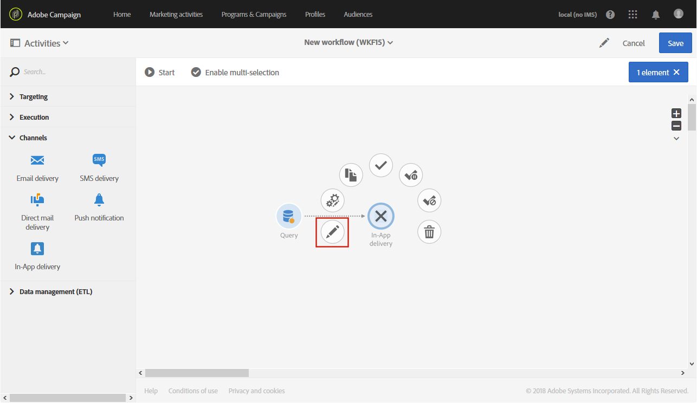

# 인앱 게재{#in-app-delivery}

## 설명 {#description}

다음 **인앱 게재** 활동을 사용하면 워크플로우 내에서 인앱 메시지 전송을 구성할 수 있습니다. 인앱 메시징을 사용하면 사용자가 애플리케이션 내에서 활성 상태일 때 메시지를 표시할 수 있습니다. 인앱 게재에 대한 자세한 내용은 다음을 참조하십시오 [섹션](../../channels/using/about-in-app-messaging.md).

## 사용 컨텍스트 {#context-of-use}

다음 **[!UICONTROL In-App delivery]** 활동은 일반적으로 동일한 워크플로우에서 계산된 타겟 대상자에게 인앱 메시지 전송을 자동화하는 데 사용됩니다.

수신자는 쿼리, 교집합 등과 같은 타겟팅 활동을 통해 동일한 워크플로우에서 활동의 업스트림으로 정의됩니다.

메시지 준비는 워크플로우 실행 매개 변수에 따라 트리거됩니다. 메시지 대시보드에서 메시지를 보낼 수동 확인을 요청할지 여부를 선택할 수 있습니다(기본적으로 필요). 워크플로우를 수동으로 시작하거나 워크플로우에 스케줄러 활동을 배치하여 실행을 자동화할 수 있습니다.

## 구성 {#configuration}

1. 드래그 앤 드롭 **[!UICONTROL Query]** 활동을 워크플로우에 추가합니다. 다음 사항에 유의하십시오. **[!UICONTROL Query]** 의 활동 타깃팅 차원 **[!UICONTROL Properties]** 4단계에서 선택한 템플릿에 따라 탭을 업데이트해야 합니다.

   * 타겟팅 차원은 다음으로 설정해야 합니다. **[!UICONTROL mobileApp (mobileAppV5)]** 대상: **[!UICONTROL Target all users of a Mobile app (inAppBroadcast)]** 템플릿.
   * 타겟팅 차원은 다음으로 설정해야 합니다. **[!UICONTROL profile (profile)]** 대상: **[!UICONTROL Target users based on their Campaign profile (inAppProfile)]** 템플릿.
   * 타겟팅 차원은 다음으로 설정해야 합니다. **[!UICONTROL subscriptions to an application (nms:appSubscriptionRcp:appSubscriptionRcpDetail)]** 대상: **[!UICONTROL Target users based on their Mobile profile (inApp)]** 템플릿.

1. **[!UICONTROL In-App delivery]** 활동을 워크플로우로 끌어서 놓습니다.
1. 활동을 선택한 다음 나타나는 빠른 작업에서  버튼을 사용하여 활동을 엽니다.

   >[!NOTE]
   >
   >를 통해 활동의 일반 속성 및 고급 옵션(게재 자체가 아님)에 액세스할 수 있습니다.  활동의 빠른 작업에서 단추를 클릭합니다.

   

1. 인앱 메시지 유형을 선택합니다. 이는 의 타겟팅된 데이터에 따라 다릅니다. **[!UICONTROL Query]** 활동.

   * **[!UICONTROL Target users based on their Campaign profile (inAppProfile)]**: 이 메시지 유형을 사용하면 모바일 애플리케이션을 구독한 Adobe Campaign 프로필을 타겟팅하고 Campaign에서 사용할 수 있는 프로필 속성을 사용하여 인앱 메시지를 개인화할 수 있습니다.
   * **[!UICONTROL Target all users of a Mobile app (inAppBroadcast)]**: 이 메시지 유형을 사용하면 Campaign에 기존 프로필이 없더라도 모바일 애플리케이션의 모든 사용자에게 메시지를 보낼 수 있습니다.
   * **[!UICONTROL Target users based on their Mobile profile (inApp)]**: 이 메시지 유형을 사용하면 모바일 프로필이 Campaign에 있는 모든 모바일 앱 사용자를 알 수 있는지 여부에 관계없이 타겟팅하고, 모바일 디바이스에서 얻은 프로필 속성을 사용하여 인앱 메시지를 개인화할 수 있습니다.

   

1. 인앱 메시지 속성을 입력하고 **[!UICONTROL Associate a Mobile App to a delivery]** 필드.
1. **[!UICONTROL Triggers]** 탭에서 메시지를 트리거할 이벤트를 끌어서 놓습니다. 다음 세 가지 범주의 이벤트를 사용할 수 있습니다.
1. 인앱 콘텐츠를 정의합니다. 다음에 대한 섹션을 참조하십시오. [인앱 사용자 지정](../../channels/using/customizing-an-in-app-message.md).
1. 기본적으로 **[!UICONTROL In-App delivery]** 활동에는 아웃바운드 전환이 포함되지 않습니다. **[!UICONTROL In-App delivery]** 활동에 아웃바운드 전환을 추가하려면 고급 활동 옵션의  탭(활동의 빠른 작업에 있는 **[!UICONTROL General]** 버튼)으로 이동한 다음 옵션 중 하나를 선택합니다.

   * **[!UICONTROL Add outbound transition without the population]**: 인바운드 전환과 정확히 동일한 모집단을 포함하는 아웃바운드 전환을 생성할 수 있습니다.
   * **[!UICONTROL Add outbound transition with the population]**: 메시지를 전송한 모집단을 포함하는 아웃바운드 전환을 생성할 수 있습니다. 게재를 준비하는 동안 제외된 타겟 멤버는 이 전환에서 제외됩니다.

   

1. 활동 구성을 확인하고 워크플로우를 저장합니다.

활동을 다시 열면 인앱 대시보드로 바로 이동합니다. 콘텐츠만 편집할 수 있습니다.

기본적으로 게재 워크플로우를 시작하면 메시지 준비만 트리거됩니다. 워크플로우가 시작된 후에도 워크플로우에서 만든 메시지 전송을 확인해야 합니다. 하지만 메시지가 워크플로우에서 생성된 경우에만 메시지 대시보드에서 **[!UICONTROL Request confirmation before sending messages]** 옵션을 비활성화할 수 있습니다. 이 옵션을 선택 해제하면 준비가 완료된 후 추가 통보 없이 메시지가 전송됩니다.

## 비고 {#remarks}

워크플로우 내에서 생성된 게재는 애플리케이션의 마케팅 활동 목록에서 액세스할 수 있습니다. 대시보드를 사용하여 워크플로우의 실행 상태를 볼 수 있습니다. 푸시 알림 요약 창의 링크를 사용하면 연결된 요소(워크플로우, 캠페인 등)에 직접 액세스할 수 있습니다.

마케팅 활동 목록에서 액세스할 수 있는 상위 게재에서 (다음의 경우에 지정된 집계 기간에 따라) 처리된 총 전송 수를 볼 수 있습니다. **[!UICONTROL In-App delivery]** 활동이 구성되었습니다). 이렇게 하려면 을(를) 선택하여 상위 게재 **[!UICONTROL Deployment]** 블록의 세부 사항 보기를 엽니다.
